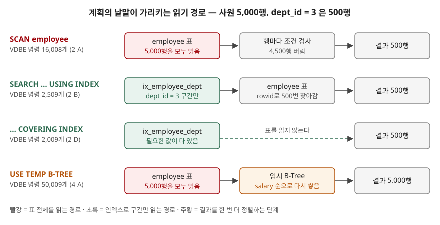

<!-- related:start -->
> **같은 기능을 다른 환경에서 다룬 글** (`explain-plan`)
> - [실행계획의 비용(cost)은 무엇을 세는 숫자인가](../../2026-09-30-optimizer-cost-stale-statistics/index.md) — SQLite 3.49.1, Python 3.13.5, Windows 11
> - [Tibero 7 실행계획 보기 — EXPLAIN PLAN과 DBMS_XPLAN](../../tibero/2026-09-30-tibero7-explain-plan-dbms-xplan/index.md) — Tibero 7
<!-- related:end -->

## 들어가며

혼자 만든 가계부 앱이든 회사의 사내 도구든, 처음에는 순식간에 뜨던 화면이 데이터가 쌓이자 몇 초씩 걸리기 시작한다.
검색해 보면 "실행계획을 보라"는 답이 나오고, 시키는 대로 `EXPLAIN QUERY PLAN`을 붙여 돌리면 `SCAN`이니
`USE TEMP B-TREE`니 하는 줄이 몇 개 나온다. 뜻을 모르니 대부분은 인덱스를 이것저것 만들어 보고 다시 시간을
재는 쪽을 택한다. 컬럼이 다섯 개면 만들어 볼 단일 인덱스만 다섯 개, 복합 인덱스까지 치면 스무 개가 넘고,
그때마다 시간을 재도 캐시 때문에 숫자가 흔들린다. 계획의 낱말 몇 개만 읽을 줄 알면 이 시행착오의 대부분을
건너뛸 수 있다.

## 개념

**실행계획**(query plan)은 데이터베이스가 질의를 **어떤 순서로, 어떤 인덱스를 써서** 처리할지 정한 결과다.
SQL은 "무엇을" 원하는지만 적는 언어라서, "어떻게" 찾을지는 데이터베이스 안의 **질의 계획기**(query planner)가
고른다. 같은 SQL이라도 인덱스가 생기거나 데이터 분포가 바뀌면 계획이 달라진다.

SQLite에서는 질의 앞에 `EXPLAIN QUERY PLAN`을 붙이면 질의를 실행하지 않고 계획만 돌려준다.

```sql
EXPLAIN QUERY PLAN SELECT name FROM employee WHERE dept_id = 3;
```

문서는 이 출력이 **대화형 디버깅용**이고 릴리스마다 형식이 바뀔 수 있으니 프로그램이 그 형식에 기대지 말라고
적는다. 3.24.0에서 크게, 3.36.0에서 조금 바뀌었다. 이 글의 출력은 3.49.1 기준이다.

## 구조



> **출처**: [SQLite — EXPLAIN QUERY PLAN §1.1 Table and Index Scans](https://www.sqlite.org/eqp.html#table_and_index_scans)(SCAN·SEARCH·COVERING INDEX의 뜻),
> [§1.2 Temporary Sorting B-Trees](https://www.sqlite.org/eqp.html#temporary_sorting_b_trees)(USE TEMP B-TREE).
> 행 수와 VDBE 명령 수는 아래 실습의 실행 결과다.

## 동작 원리

계획의 줄은 크게 두 종류다. **표를 어떻게 읽는가**와 **읽은 뒤에 무엇을 더 하는가**.

- **`SCAN 표`**: 표의 행을 처음부터 끝까지 전부 읽는다. 문서는 **인덱스 순서로 전부 읽는 경우도 SCAN**이라고
  적는다. 그래서 `SCAN employee USING INDEX ...`처럼 인덱스 이름이 붙은 SCAN도 있다.
- **`SEARCH 표 USING INDEX 이름 (조건)`**: 인덱스로 조건에 맞는 **일부 행만** 찾아간다. 괄호 안은 인덱스로
  좁힌 조건이다. `(dept_id=?)`는 값 하나, `(dept_id>? AND dept_id<?)`는 범위다.
- **`USING COVERING INDEX`**: 질의에 필요한 컬럼이 인덱스에 다 있어서 **표 본체를 읽지 않는다.**
- **`USING INTEGER PRIMARY KEY (rowid=?)`**: 기본 키 값으로 행 하나를 바로 찾는다. 가장 싼 경로다.
- **`USE TEMP B-TREE FOR ORDER BY`**(또는 `GROUP BY`·`DISTINCT`): 읽은 행을 임시 B-Tree에 **다시 쌓아 정렬**한다.
  인덱스가 이미 원하는 순서를 갖고 있으면 이 줄이 사라진다.

줄이 여러 개면 **위에 있는 줄이 바깥 반복**이다. 조인은 위의 표에서 한 행을 읽을 때마다 아래 표를 찾아간다.
들여쓰기는 부모·자식 관계다. 날것의 출력은 `(id, parent, notused, detail)` 네 컬럼짜리 표이고, `sqlite3`
CLI가 `parent`를 따라 트리로 그려 준다. 파이썬 `sqlite3` 모듈은 표 그대로 돌려주므로 예제에서 같은 모양으로 그렸다.

## 실습 예제

전체 소스: [`code/explain_query_plan.py`](code/explain_query_plan.py), 실행 기록: [`code/output.txt`](code/output.txt).
사원 5,000행(`dept_id`는 1~10에 500행씩)과 부서 10행이다. 질의마다 끝까지 실행해 **VDBE 명령 수**를 같이 셌다.
VDBE는 SQLite가 SQL을 번역해 돌리는 가상 기계이고, 명령 수는 시간과 달리 다시 돌려도 같은 값이 나온다.

```text
  employee_id | name     | dept_id | salary | hired_at
  ------------+----------+---------+--------+-----------
            1 | 사원0001 |       2 |   3037 | 2011-02-02
            2 | 사원0002 |       3 |   3074 | 2012-03-03
  … 4988행 더 있음
```

### 날것의 출력은 네 컬럼짜리 표다

```text
   (id, parent, notused, detail)
   (3, 0, 216, 'SCAN employee')
   (12, 0, 0, 'USE TEMP B-TREE FOR ORDER BY')
   같은 행을 parent 로 이어 그리면:
   QUERY PLAN
   |--SCAN employee
   `--USE TEMP B-TREE FOR ORDER BY
```

문서는 세 번째 컬럼을 "지금은 쓰지 않는 정수"라고 적는데, **216이 찍혔다.** 문서가 뜻을 정하지 않은 값이므로
읽을 때는 무시한다. `id`도 1부터 차례로 붙는 번호가 아니다. 이어 읽는 데 쓰는 것은 `parent`뿐이다.

### SCAN이 SEARCH로 바뀌면

| 실습 | 질의 조건 | 계획 (`detail` 원문) | 결과 | VDBE 명령 |
|---|---|---|---|---|
| 2-A | `dept_id = 3`, 인덱스 없음 | `SCAN employee` | 500행 | 16,008 |
| 2-B | `dept_id = 3`, 인덱스 있음 | `SEARCH employee USING INDEX ix_employee_dept (dept_id=?)` | 500행 | 2,509 |
| 2-D | 인덱스 컬럼만 고름 | `SEARCH employee USING COVERING INDEX ix_employee_dept (dept_id=?)` | 500행 | 2,009 |
| 2-C | `employee_id = 3` | `SEARCH employee USING INTEGER PRIMARY KEY (rowid=?)` | 1행 | 9 |

결과는 같은 500행인데 SEARCH는 SCAN의 6분의 1만 일했다. 버릴 4,500행을 읽지 않았기 때문이다.
표를 아예 안 읽는 COVERING INDEX는 거기서 500개가 더 줄었다.

### 인덱스가 있는데도 SCAN이 나오는 경우

```text
-- 3-A. 컬럼에 연산을 씌운다
   SELECT name FROM employee WHERE dept_id + 0 = 3
   `--SCAN employee
-- 3-B. 인덱스 없는 컬럼과 OR
   SELECT name FROM employee WHERE dept_id = 3 OR salary = 4000
   `--SCAN employee
```

`dept_id`에 인덱스가 있어도 `dept_id + 0`은 인덱스에 저장된 값이 아니므로 쓸 수 없다. OR는 한쪽이라도
인덱스가 없으면 결국 전체를 읽어야 하므로 SCAN이 된다. `salary`에도 인덱스를 만들자 계획이
`MULTI-INDEX OR` 아래 두 갈래의 SEARCH로 바뀌었고 명령 수는 25,013개에서 4,528개로 줄었다(3-C).

### 예상과 달랐던 것 — 인덱스를 썼는데 SCAN이다

```text
-- 2-E. 조건 없이 인덱스 순서로 다 읽는다
   SELECT dept_id, COUNT(*) FROM employee GROUP BY dept_id
   `--SCAN employee USING COVERING INDEX ix_employee_dept
```

인덱스 이름이 보이니 빠른 경로라고 읽기 쉽다. 하지만 낱말은 **SCAN**이고, 인덱스의 5,000개 항목을 처음부터
끝까지 읽는다. 대신 인덱스가 이미 `dept_id` 순서라서 `GROUP BY`용 임시 B-Tree가 없다. 인덱스 이름은
"무엇으로 읽는가"이고, 몇 행을 읽는지는 **SCAN과 SEARCH가 말한다.**

### USE TEMP B-TREE — 정렬을 따로 한다

```text
-- 4-B. 조건은 인덱스, 정렬은 다른 컬럼
   |--SEARCH employee USING INDEX ix_employee_dept (dept_id=?)
   `--USE TEMP B-TREE FOR ORDER BY
   => 결과 500행, VDBE 명령 6,012개
-- 4-C. (dept_id, salary) 복합 인덱스를 만든 뒤
   `--SEARCH employee USING INDEX ix_employee_dept_salary (dept_id=?)
   => 결과 500행, VDBE 명령 3,011개
```

`dept_id = 3`인 행을 인덱스로 찾았지만 `salary` 순서는 인덱스에 없어서 다시 정렬했다. `(dept_id, salary)`
인덱스 안에서 `dept_id = 3` 구간은 이미 `salary` 순이므로, 그 인덱스를 만들자 정렬 줄이 사라지고 명령 수가
절반이 됐다. **TEMP B-TREE가 보이면 "조건 컬럼 뒤에 정렬 컬럼을 붙인 복합 인덱스"가 첫 번째 처방이다.**

문서는 `xxx` 자리에 `ORDER BY`·`GROUP BY`·`DISTINCT` 셋만 든다. 그런데 `ORDER BY dept_id, hired_at`에서는
`USE TEMP B-TREE FOR LAST TERM OF ORDER BY`가 나왔다(4-D). 앞 컬럼 `dept_id`는 인덱스 순서를 쓰고 마지막
`hired_at`만 따로 정렬한다는 뜻이다. 질의 최적화 문서가 설명하는 **블록 정렬**(block sorting)이 이것이다.

`ORDER BY hired_at LIMIT 5`도 계획은 4-A와 똑같이 `USE TEMP B-TREE FOR ORDER BY`였지만 명령 수는 30,130개로
4-A(50,009개)보다 적었다(4-G). 계획은 같아도 실행 중 하는 일이 다를 수 있다. 계획은 경로를 보여 줄 뿐
양까지 보여 주지는 않는다.

### 조인은 적은 순서대로 돌지 않는다

```text
-- 5-B. FROM employee e JOIN evaluation v ... WHERE e.dept_id = 3
   |--SCAN v
   `--SEARCH e USING INTEGER PRIMARY KEY (rowid=?)
-- 5-C. 양쪽 다 조인 컬럼에 인덱스가 없다
   |--SCAN v
   |--BLOOM FILTER ON b (employee_id=?)
   `--SEARCH b USING AUTOMATIC COVERING INDEX (employee_id=?)
```

5-B는 `employee`를 먼저 적었지만 계획은 평가 표 `v`(715행)를 바깥에 두고, 행마다 `employee`를 기본 키로
찾았다. 문서는 내부 조인의 순서를 계획기가 바꿀 수 있다고 적는다. 5-C처럼 쓸 인덱스가 아예 없으면
**질의를 도는 동안만 쓰는 인덱스**(`AUTOMATIC`)를 만든다. `BLOOM FILTER`는 3.38.0에서 들어온 것으로,
찾아갈 필요가 없는 행을 미리 걸러 낸다. `AUTOMATIC`이 자주 보이는 질의는 그 컬럼에 진짜 인덱스를 만들 후보다.

### 서브쿼리

```text
-- 6-A. 바깥 행마다 다시 도는 서브쿼리
   |--SEARCH e USING INDEX ix_employee_dept_salary (dept_id=?)
   `--CORRELATED SCALAR SUBQUERY 1
      `--SEARCH d USING INTEGER PRIMARY KEY (rowid=?)
-- 6-B. 한 번만 도는 서브쿼리
   |--SCAN employee
   `--SCALAR SUBQUERY 1
```

`CORRELATED`가 붙으면 바깥 행마다 서브쿼리를 다시 돈다. 여기서는 500번이다. 붙지 않은 6-B는 평균을 한 번만
계산해 재사용한다. FROM 절의 서브쿼리는 `CO-ROUTINE`으로 표시됐다(6-C). 바깥 질의가 행이 필요할 때마다
서브쿼리에서 한 행씩 받아 온다는 뜻이다.

## 다른 환경에서는

같은 `explain-plan` 키로 [Tibero 7 실행계획 글](../../tibero/2026-09-30-tibero7-explain-plan-dbms-xplan/index.md)이 있다.
그 글은 Tibero 7.2.6 매뉴얼 근거로 쓴 것이다.

| | SQLite 3.49.1 | Tibero 7.2.6 (매뉴얼) |
|---|---|---|
| 계획을 보는 방법 | 질의 앞에 `EXPLAIN QUERY PLAN` | `EXPLAIN PLAN FOR` + `DBMS_XPLAN.DISPLAY`, 수행 후 `DISPLAY_CURSOR`, tbSQL `AUTOTRACE` |
| 계획을 어디에 두는가 | 결과 행으로 바로 돌려주고 저장하지 않는다 | `PLAN_TABLE` 같은 표에 저장한다 |
| 비용·예상 행 수 | 찍지 않는다 | 형식 문자열로 항목을 고른다 |
| 실제 수행 통계 | 없다 (이 글은 VDBE 명령 수를 따로 셌다) | `DISPLAY_CURSOR`·`AUTOTRACE`가 보여 준다 |

SQLite는 질의 하나를 디버깅할 때 쓰는 가벼운 표시를 택했고, Tibero는 계획을 저장하고 실제 수행 정보와
나란히 놓는 쪽을 택했다. 계획만으로 일의 양을 알 수 없다는 4-G의 결과가 그 차이를 보여 준다.

## 실무에서 주의할 점

- **인덱스 이름이 보인다고 빠른 것이 아니다.** `SCAN ... USING INDEX`는 인덱스를 처음부터 끝까지 읽는다(2-E).
  읽는 양은 SCAN과 SEARCH가 정한다.
- **조건 컬럼에 연산이나 함수를 씌우지 않는다.** `dept_id + 0 = 3`만으로 SEARCH가 SCAN이 됐다(3-A).
  `lower(email) = ?`처럼 꼭 필요하면 그 식으로 식 인덱스를 만든다.
- **OR는 양쪽 다 인덱스가 있어야 한다.** 한쪽만 있으면 전체 스캔이다(3-B, 3-C).
- **TEMP B-TREE는 복합 인덱스의 컬럼 순서로 없앤다.** 등호 조건 컬럼을 앞에, 정렬 컬럼을 뒤에 둔다(4-C).
- **파이썬에서 인덱스를 지웠다 만들며 계획을 볼 때는 문장 캐시를 끈다.** 같은 문장 텍스트를 재사용하면
  지운 인덱스를 쓰는 계획이 나온다. 예제는 `sqlite3.connect(..., cached_statements=0)`으로 열었다.
- **출력 형식에 기대는 코드를 짜지 않는다.** 문서가 릴리스마다 바뀔 수 있다고 경고하고, 실제로 문서에 없는
  `LAST TERM OF ORDER BY`가 나왔다(4-D). 계획 검사를 테스트에 넣는다면 `SEARCH`·`SCAN` 같은 낱말만 본다.

## 정리

- `EXPLAIN QUERY PLAN`은 질의를 실행하지 않고 계획만 보여 준다. 위 줄이 바깥 반복, 들여쓰기가 부모·자식이다.
- `SCAN`은 전부 읽고 `SEARCH`는 일부만 읽는다. 같은 500행 결과에서 명령 수가 16,008개에서 2,509개로 줄었다.
- `COVERING INDEX`는 표 본체를 건너뛰고, `USE TEMP B-TREE`는 정렬을 따로 한다는 뜻이다.
- 인덱스가 있어도 컬럼에 연산을 씌우거나, 인덱스 없는 컬럼과 OR로 묶으면 SCAN이 된다.

## 참고 자료

- [SQLite — EXPLAIN QUERY PLAN](https://www.sqlite.org/eqp.html) — [§1.1 Table and Index Scans](https://www.sqlite.org/eqp.html#table_and_index_scans), [§1.2 Temporary Sorting B-Trees](https://www.sqlite.org/eqp.html#temporary_sorting_b_trees), [§1.3 Subqueries](https://www.sqlite.org/eqp.html#subqueries), 형식이 바뀔 수 있다는 경고
- [SQLite — The SQLite Query Optimizer Overview](https://www.sqlite.org/optoverview.html) — 7절 조인 순서, 10절 ORDER BY 최적화(블록 정렬), 14절 자동 인덱스
- [SQLite Release 3.38.0](https://www.sqlite.org/releaselog/3_38_0.html) — 블룸 필터 도입
- [Python 3.13 — sqlite3.connect](https://docs.python.org/3.13/library/sqlite3.html#sqlite3.connect) — `cached_statements`
