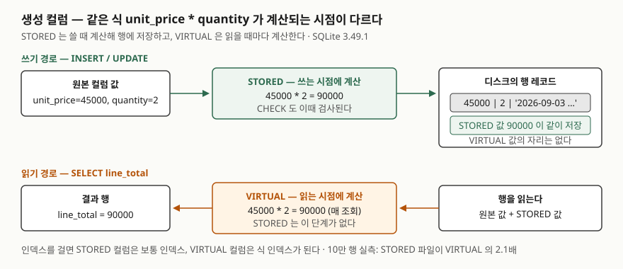

## 들어가며

쇼핑몰 주문 항목 표에 단가와 수량을 넣어 두고, 금액은 "어차피 곱하면 되니까" 컬럼으로 만들지 않는다.
처음에는 화면 한 곳에서만 곱했는데, 몇 달 뒤에는 금액 합계를 내는 집계, 5만 원 이상 주문을 고르는 조건,
금액순 정렬, 월별 리포트의 `substr(ordered_at, 1, 7)`까지 같은 식이 질의 열네 군데에 흩어져 있다.
그러다 금액에 할인을 반영하라는 요청이 오면 열네 군데를 전부 찾아 고쳐야 하고, 하나를 빼먹으면 화면과
리포트의 합계가 다른 채로 운영된다. 월별 리포트는 `WHERE substr(ordered_at, 1, 7) = '2026-09'`가
인덱스를 타지 못해 주문이 쌓일수록 느려진다. 식을 표에 한 번만 적어 두는 방법이 있다.

## 개념

**생성 컬럼**(generated column)은 값을 직접 넣지 않고, **같은 행의 다른 컬럼에서 계산되는** 컬럼이다.
SQLite 3.31.0(2020-01-22)부터 쓸 수 있다.

```sql
CREATE TABLE order_item (
    order_item_id INTEGER PRIMARY KEY,
    unit_price    INTEGER NOT NULL,
    quantity      INTEGER NOT NULL,
    ordered_at    TEXT    NOT NULL,
    line_total    INTEGER GENERATED ALWAYS AS (unit_price * quantity) VIRTUAL,
    order_month   TEXT    GENERATED ALWAYS AS (substr(ordered_at, 1, 7)) STORED
);
```

`GENERATED ALWAYS`는 생략해도 되고 `AS (식)`만 있으면 된다. 끝에 붙는 **`VIRTUAL`과 `STORED`가 이 글의
주제**다. 문서는 VIRTUAL 컬럼의 값은 **읽을 때** 계산되고 STORED 컬럼의 값은 **행을 쓸 때** 계산된다고
적는다. 아무것도 적지 않으면 VIRTUAL이다.

## 구조



> **출처**: [SQLite — Generated Columns §2.1 VIRTUAL versus STORED columns](https://www.sqlite.org/gencol.html#virtual_versus_stored_columns)(계산 시점),
> [§2.2 Capabilities](https://www.sqlite.org/gencol.html#capabilities)(STORED 는 보통 인덱스, VIRTUAL 은 식 인덱스).
> 파일 크기 비율은 아래 실습 11번의 실행 결과다.

## 동작 원리

두 종류의 차이는 **계산 결과를 어디에 두느냐**다.

- **STORED**는 `INSERT`·`UPDATE`가 행을 쓰는 순간 식을 계산해 결과를 **행 레코드 안에 같이 저장**한다.
  읽을 때는 보통 컬럼과 똑같이 저장된 값을 꺼낸다. 디스크를 더 쓰고, 쓰기마다 계산 비용이 든다.
- **VIRTUAL**은 행에 자리가 없다. `SELECT`가 그 컬럼을 요구할 때마다 원본 컬럼 값으로 **식을 다시 계산**한다.
  디스크는 안 쓰지만 읽을 때마다 CPU를 쓴다.

어느 쪽이든 식에는 제한이 있다. 같은 행의 컬럼, 상수, **결정적인**(deterministic) 스칼라 함수만 쓸 수 있다.
서브쿼리·집계 함수·윈도 함수는 안 되고, `random()`이나 `datetime('now')`처럼 부를 때마다 값이 달라지는
함수도 안 된다. 그래야 "같은 행이면 같은 값"이 보장되고, 그 보장이 있어야 인덱스를 걸 수 있다.

인덱스를 걸면 STORED 컬럼은 **보통 인덱스**가 되고 VIRTUAL 컬럼은 **식 인덱스**(index on expression)가
된다. 식 인덱스는 인덱스 항목에 식의 결과를 저장하므로, VIRTUAL 컬럼이라도 조건 검색에서는 계산을
다시 하지 않는다.

## 실습 예제

전체 소스: [`code/generated_columns.py`](code/generated_columns.py), 실행 기록: [`code/output.txt`](code/output.txt).
주문 항목 5행이다. `line_total`은 VIRTUAL, `order_month`는 STORED다.

```text
  order_item_id | product | unit_price | quantity | ordered_at
  --------------+---------+------------+----------+--------------------
              1 | 키보드  |      45000 |        2 | 2026-09-03 10:20:00
              2 | 마우스  |      25000 |        1 | 2026-09-03 10:20:00
              3 | 모니터  |     320000 |        1 | 2026-09-18 15:02:00
              4 | 케이블  |       8000 |        5 | 2026-10-01 09:11:00
              5 | 허브    |      39000 |        3 | 2026-10-02 18:40:00
```

### 보통 컬럼처럼 읽히고, 원본을 고치면 따라 바뀐다

실습 2번의 `SELECT *`에 두 생성 컬럼이 맨 뒤에 붙어 나왔다. 실습 3번에서 1번 행의 수량을 4로,
주문 시각을 11월로 고치자 `line_total`은 180000, `order_month`는 `2026-11`이 됐다. 식을 어디서도
다시 쓰지 않았다.

```text
-- 3-A. 고친 뒤
   => order_item_id | quantity | line_total | ordered_at | order_month
      1 | 4 | 180000 | 2026-11-05 11:00:00 | 2026-11
```

### 직접 넣을 수 없고, ALTER TABLE은 VIRTUAL만 받는다

```text
-- 4-A. 생성 컬럼에 값을 직접 넣으면
   에러: cannot INSERT into generated column "line_total"
-- 4-B. UPDATE 로 바꾸려 해도
   에러: cannot UPDATE generated column "line_total"
-- 5-B. STORED 는 더할 수 없다
   에러: cannot add a STORED column
```

컬럼 목록을 생략한 `INSERT INTO order_item VALUES (...)`는 값을 **5개**만 받는다(4-C). 생성 컬럼은
자리를 세지 않는다. `ALTER TABLE ... ADD COLUMN`은 VIRTUAL 생성 컬럼만 받는다(5-A). STORED를 더하려면
기존 행마다 값을 계산해 다시 써야 하는데 SQLite의 `ADD COLUMN`은 기존 행을 건드리지 않기 때문이다.

### 어디에 보이는가 — table_info와 table_xinfo

`PRAGMA table_info`에는 생성 컬럼이 **나오지 않는다**(6-A). `PRAGMA table_xinfo`에 `hidden` 값과 함께
나온다. 2가 VIRTUAL, 3이 STORED다(6-B). 표 구조를 읽는 도구가 `table_info`를 쓰면 생성 컬럼을 못 본다.
이 글의 `dbshow.py`도 그래서 생성 컬럼을 따로 찍었다.

### 쓸 수 없는 식

```text
-- 7-B. 순환 참조
   에러: generated column loop on "b"
-- 8-A. DEFAULT        에러: cannot use DEFAULT on a generated column
-- 8-B. PRIMARY KEY    에러: generated columns cannot be part of the PRIMARY KEY
-- 8-C. random()       에러: non-deterministic functions prohibited in generated columns
-- 8-D. 서브쿼리        에러: subqueries prohibited in generated columns
-- 8-E. 생성 컬럼만     에러: must have at least one non-generated column
```

생성 컬럼이 다른 생성 컬럼을 참조하는 것은 된다(7-A, `tax AS (line_total / 10)`). `CHECK`와 `NOT NULL`도
붙일 수 있고, 그 검사는 원본 컬럼을 넣는 순간 일어난다. 수량에 -1을 넣자 `line_total >= 0`에 걸렸다(8-G).

### 인덱스 — 예상과 달랐던 것

STORED인 `order_month`와 VIRTUAL인 `line_total`에 각각 인덱스를 만들었다(9번). 컬럼 이름으로 조건을
쓰면 둘 다 인덱스를 탄다.

```text
-- 10-A. STORED 컬럼 조건
   `--SEARCH order_item USING INDEX ix_order_item_order_month (order_month=?)
-- 10-B. VIRTUAL 컬럼 조건
   `--SEARCH order_item USING INDEX ix_order_item_line_total (line_total>?)
-- 10-C. 컬럼 이름 대신 같은 식을 직접 쓰면
   SELECT product FROM order_item WHERE unit_price * quantity >= 50000
   `--SCAN order_item
```

VIRTUAL 컬럼의 인덱스는 식 인덱스라고 했으니 `unit_price * quantity >= 50000`도 그 인덱스를 탈 것이라고
예상했다. 그런데 **전체 스캔**이었다(10-C). 피연산자 순서를 바꿔도 같다(10-D). SQLite 문서는 식 인덱스를
쓰려면 질의의 식이 `CREATE INDEX`에 적힌 식과 **글자 그대로 같아야** 하고, 계획기는 대수 변형을 하지
않는다고 적는다. 여기서 인덱스에 적힌 것은 식이 아니라 컬럼 이름 `line_total`이다. 그래서 생성 컬럼을
만들었으면 **조건에서도 그 이름을 써야** 한다. 식을 다시 풀어 쓰면 생성 컬럼을 만든 이유가 사라진다.

### 저장 공간과 조회 시간 — 10만 행

같은 10만 행에 생성 컬럼 셋(곱셈, `substr`, `printf`)을 VIRTUAL로 둔 파일과 STORED로 둔 파일을 만들어
비교했다(11번). 시간은 5회 중 가장 짧은 값이고 절대값은 환경마다 다르므로 비율만 본다.

| | 파일 크기 | `SUM(line_total)` | `WHERE sold_month = …` | `WHERE label LIKE …` |
|---|---|---|---|---|
| VIRTUAL | 2,340 KB | 4.7 ms | 7.7 ms | 12.7 ms |
| STORED | 5,012 KB | 5.2 ms | 5.9 ms | 7.2 ms |

STORED 파일이 **2.1배** 크다. 생성 컬럼 셋의 결과가 행마다 저장됐기 때문이다. 조회는 식에 따라 갈렸다.
`substr`과 `printf`는 STORED가 빨랐지만, 곱셈 하나인 `line_total`의 합계는 **VIRTUAL이 더 빨랐다.**
곱셈 10만 번보다 두 배 커진 파일을 읽는 비용이 더 컸다. "STORED가 읽기에 빠르다"는 식이 비쌀 때의
이야기다.

## 실무에서 주의할 점

- **식을 바꾸려면 표를 다시 만들어야 한다.** `ALTER TABLE`에 생성 컬럼의 식을 고치는 문법이 없다. VIRTUAL은
  `DROP COLUMN` 뒤 `ADD COLUMN`으로 되지만(12-A), STORED는 더할 수 없으므로 새 표를 만들어 옮긴다.
  인덱스가 걸린 생성 컬럼은 지울 수도 없다(12-C).
- **조건과 정렬에서 생성 컬럼의 이름을 쓴다.** 같은 식을 풀어 쓰면 인덱스를 못 탄다(10-C). 응용 코드에
  식이 남아 있으면 찾아서 컬럼 이름으로 바꾼다.
- **"지금"에 기대는 값은 만들 수 없다.** 나이·경과일처럼 `datetime('now')`가 들어가는 식은 비결정적이라
  거부된다(8-C). 이런 값은 뷰나 질의에서 계산한다.
- **STORED는 쓰기 비용과 공간을 산다.** 쓰기가 잦고 식이 싼 표에서는 VIRTUAL이 낫고(11번), 식이 비싸고
  읽기가 많으면 STORED가 낫다. 인덱스가 필요하면 둘 다 되므로 그것은 기준이 아니다.
- **표 구조를 읽는 도구가 생성 컬럼을 못 볼 수 있다.** `PRAGMA table_info`에 안 나온다(6-A). 마이그레이션
  도구나 ORM이 컬럼 목록을 그것으로 만들면 빠진다. `table_xinfo`를 쓰는지 확인한다.
- **3.31.0보다 오래된 SQLite는 이 파일을 손상으로 본다.** 문서는 구버전이 생성 컬럼이 든 스키마를 읽으면
  데이터베이스가 손상됐다고 보고한다고 적는다. 파일을 넘겨 줄 상대의 버전을 확인한다.

## 정리

- 생성 컬럼은 같은 행의 다른 컬럼에서 계산되는 컬럼이다. SQLite 3.31.0부터, 기본은 VIRTUAL이다.
- STORED는 쓸 때 계산해 행에 저장하고, VIRTUAL은 읽을 때마다 계산한다. 10만 행에서 STORED 파일이 2.1배였고,
  곱셈 하나짜리 식은 VIRTUAL이 오히려 빨랐다.
- 직접 넣거나 고칠 수 없고, `ALTER TABLE`로는 VIRTUAL만 더할 수 있다. 식에는 결정적 함수와 같은 행의 컬럼만 쓴다.
- 인덱스는 둘 다 되지만, 조건에 컬럼 이름 대신 같은 식을 풀어 쓰면 타지 않는다.

## 참고 자료

- [SQLite — Generated Columns](https://www.sqlite.org/gencol.html) — [§2.1 VIRTUAL versus STORED columns](https://www.sqlite.org/gencol.html#virtual_versus_stored_columns), [§2.2 Capabilities](https://www.sqlite.org/gencol.html#capabilities), [§2.3 Limitations](https://www.sqlite.org/gencol.html#limitations), [§3 Compatibility](https://www.sqlite.org/gencol.html#compatibility)
- [SQLite — Indexes On Expressions](https://www.sqlite.org/expridx.html) — [§1 How To Use Indexes On Expressions](https://www.sqlite.org/expridx.html#how_to_use_indexes_on_expressions): 식이 글자 그대로 같아야 한다
- [SQLite — ALTER TABLE](https://www.sqlite.org/lang_altertable.html) — [ADD COLUMN](https://www.sqlite.org/lang_altertable.html#alter_table_add_column): STORED 불가, [DROP COLUMN](https://www.sqlite.org/lang_altertable.html#alter_table_drop_column): 인덱스·생성 컬럼 식에 쓰인 컬럼 불가
- [SQLite — PRAGMA table_xinfo](https://www.sqlite.org/pragma.html#pragma_table_xinfo) — `hidden` 2·3의 뜻
- [SQLite Release 3.31.0 (2020-01-22)](https://www.sqlite.org/releaselog/3_31_0.html) — 생성 컬럼 추가
