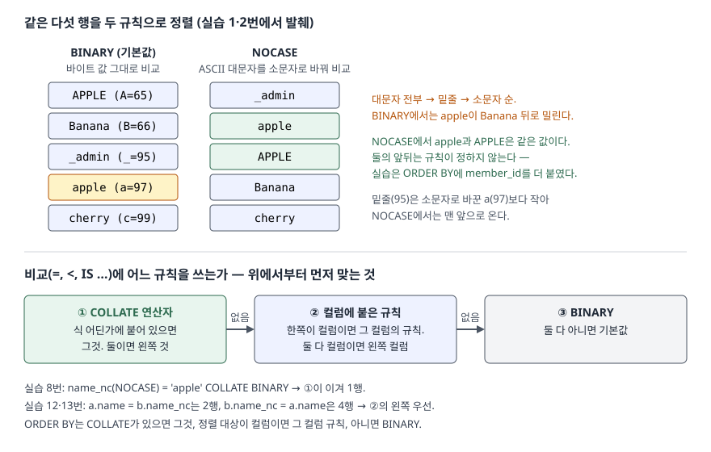

## 들어가며

회원 목록 화면에 "이름순 정렬" 버튼을 붙이고 `ORDER BY name`을 걸었다. 그런데 `apple`로 가입한 사람이 `Banana`보다 뒤에,
`_admin`이 대문자 이름들과 소문자 이름들 사이에 끼어 나온다. 대개는 `ORDER BY lower(name)`으로 바꾸거나,
아예 가입할 때 이름을 소문자로 바꿔 저장하는 쪽으로 해결한다. 앞의 방법은 질의마다 `lower()`를 붙여야 하고 인덱스를 못 쓰게 되며,
뒤의 방법은 사용자가 입력한 원래 표기를 잃는다. 문자열을 "어떤 순서로, 무엇을 같다고 볼지"는 따로 정하는 설정이 있다. 그것이 정렬 규칙이다.

## 개념

**정렬 규칙**(collation, 콜레이션)은 문자열 두 개를 비교해서 어느 쪽이 크고 작은지, 또는 같은지를 정하는 규칙이다.
SQL에서 문자열을 비교하는 곳 — `ORDER BY`, `=`·`<` 같은 비교, `GROUP BY`, `DISTINCT`, `UNIQUE` 제약 — 은 전부 이 규칙을 따른다.

SQLite에는 내장 규칙이 셋 있다.

| 규칙 | 비교 방법 | `'apple'`과 `'APPLE'` | `'kim'`과 `'kim '` |
|---|---|---|---|
| `BINARY` (기본값) | 바이트 값을 그대로 비교한다 | 다르다 | 다르다 |
| `NOCASE` | ASCII 대문자 26개를 소문자로 바꾼 뒤 비교한다 | 같다 | 다르다 |
| `RTRIM` | BINARY와 같되 뒤 공백을 무시한다 | 다르다 | 같다 |

규칙을 붙이는 자리는 두 곳이다. 표를 만들 때 **컬럼에** 붙이면(`name TEXT COLLATE NOCASE`) 그 컬럼을 쓰는 비교·정렬의 기본값이 된다.
질의 안의 **식 뒤에** 붙이면(`name = 'apple' COLLATE NOCASE`) 그 비교에서만 쓰인다. 숫자와 BLOB은 정렬 규칙과 상관없이 비교된다.

## 구조



> **출처**: [SQLite — Datatypes In SQLite §7 Collating Sequences](https://www.sqlite.org/datatype3.html#collating_sequences)(내장 규칙 세 가지),
> [§7.1 Assigning Collating Sequences from SQL](https://www.sqlite.org/datatype3.html#assigning_collating_sequences_from_sql)(비교·ORDER BY에 쓸 규칙을 정하는 순서).
> 정렬 결과는 실습 1·2번, 우선순위 예는 실습 8·12·13번의 실행 결과다.

## 동작 원리

**BINARY는 글자를 UTF-8 바이트로 놓고 앞에서부터 비교한다.** 실습 4번에서 첫 글자의 코드 값을 찍어 보면
`B`가 66, `_`가 95, `a`가 97, `É`가 201, `가`가 44032다. ASCII에서 대문자(65~90)가 소문자(97~122)보다 작으므로
대문자로 시작하는 이름이 전부 앞에 온다. 한글 완성형은 유니코드에서 가나다 순서로 놓여 있어서 BINARY만으로도 `가람`이 `나래` 앞에 왔다.

**NOCASE는 비교 직전에 ASCII 대문자를 소문자로 바꾼다.** 저장된 값은 바뀌지 않는다. 바꾼 뒤에 비교하므로 `_`(95)가 `a`(97)보다 작아
`_admin`이 맨 앞으로 왔다. `apple`과 `APPLE`은 같은 값이 되므로 둘의 앞뒤는 규칙이 정하지 않는다. 순서가 늘 같아야 하면
`ORDER BY name COLLATE NOCASE, member_id`처럼 다른 컬럼을 덧붙인다.

**비교에 어느 규칙을 쓸지는 정해진 순서로 고른다.** SQLite 문서는 세 단계를 적는다. 식 어딘가에 `COLLATE` 연산자가 있으면 그것을 쓰고(둘이면 왼쪽),
없으면 컬럼의 규칙을 쓰며(둘 다 컬럼이면 왼쪽 컬럼), 그것도 아니면 BINARY다. `IN (…)` 목록은 왼쪽 값의 규칙을 쓴다.
`ORDER BY`는 `COLLATE`가 붙었으면 그것, 정렬 대상이 컬럼이면 그 컬럼의 규칙, 아니면 BINARY다.

## 실습 예제

전체 소스: [`code/collate_basics.py`](code/collate_basics.py), 실행 기록: [`code/output.txt`](code/output.txt).
`member` 표에 같은 이름을 두 컬럼에 넣었다. `name`은 규칙을 붙이지 않았고(BINARY), `name_nc`는 `COLLATE NOCASE`를 붙였다.
행은 `apple`·`APPLE`처럼 대소문자만 다른 이름, `kim`·`kim `처럼 뒤 공백만 다른 이름, `_admin`, 한글, `Éclair`, `file2`·`file10`을 섞어 12행이다.

### 같은 데이터, 다른 순서

```text
-- 1. BINARY (기본값) — 바이트 값 순서
      'APPLE', 'Banana', '_admin', 'apple', 'cherry', 'file10', 'file2', 'kim', 'kim ', 'Éclair', '가람', '나래'
-- 2. COLLATE NOCASE — ASCII 대소문자 무시
      '_admin', 'apple', 'APPLE', 'Banana', 'cherry', 'file10', 'file2', 'kim', 'kim ', 'Éclair', '가람', '나래'
-- 3. 컬럼에 NOCASE 를 붙인 name_nc — COLLATE 없이 정렬
      '_admin', 'apple', 'APPLE', 'Banana', 'cherry', 'file10', 'file2', 'kim', 'kim ', 'Éclair', '가람', '나래'
```

3번은 `COLLATE`를 쓰지 않았는데도 2번과 순서가 같다. 컬럼에 붙인 규칙이 정렬의 기본값이 되었기 때문이다.

### 비교와 우선순위

```text
-- 8. name_nc = 'apple' COLLATE BINARY (식이 컬럼을 이긴다)
   SELECT member_id, name_nc FROM member WHERE name_nc = 'apple' COLLATE BINARY
      1 | 'apple'
   (1행)

-- 9. 'kim' 을 RTRIM 으로 — 뒤 공백 무시
   SELECT member_id, name FROM member WHERE name = 'kim' COLLATE RTRIM
      6 | 'kim '
      7 | 'kim'
   (2행)

-- 10. NOCASE 는 ASCII 만 — 'éclair' 로 Éclair 를 찾으면
   SELECT member_id, name FROM member WHERE name = 'éclair' COLLATE NOCASE
   (0행)
```

6번(`name_nc = 'apple'`)은 컬럼 규칙 NOCASE를 따라 `apple`·`APPLE` 2행이었다. 8번은 같은 컬럼에 `COLLATE BINARY`를 붙여 1행으로 줄었다 —
식에 붙인 규칙이 컬럼 규칙을 이긴다.

```text
-- 12. 컬럼끼리 비교: name = name_nc (왼쪽 컬럼 BINARY)
   SELECT a.member_id, b.member_id FROM member a JOIN member b ON a.name = b.name_nc WHERE a.member_id IN (1, 3)
      1 | 1
      3 | 3
   (2행)

-- 13. 순서만 바꿔서: name_nc = name (왼쪽 컬럼 NOCASE)
   SELECT a.member_id, b.member_id FROM member a JOIN member b ON b.name_nc = a.name WHERE a.member_id IN (1, 3)
      1 | 1
      1 | 3
      3 | 1
      3 | 3
   (4행)
```

10번이 0행인 것은 NOCASE가 ASCII 밖의 `É`를 바꾸지 않기 때문이다. 11번에서 `lower('Éclair')`도 그대로 `Éclair`였다.
12번과 13번은 `ON` 절의 왼쪽과 오른쪽을 바꿨을 뿐인데 결과 행 수가 다르다. 두 쪽이 모두 컬럼이라 왼쪽 컬럼의 규칙을 썼고,
12번은 BINARY라 `apple`이 자기 자신과만, 13번은 NOCASE라 `apple`과 `APPLE`이 서로 맞았다.

### GROUP BY, DISTINCT, UNIQUE

```text
-- 15. GROUP BY 도 규칙을 따른다
   SELECT name_nc, COUNT(*) FROM member GROUP BY name_nc HAVING COUNT(*) > 1
      'apple' | 2
-- 16. DISTINCT 도 — name 과 name_nc 의 개수
   SELECT (SELECT COUNT(DISTINCT name) FROM member), (SELECT COUNT(DISTINCT name_nc) FROM member)
      12 | 11
-- 21. NOCASE + UNIQUE 컬럼에 'ADMIN' 을 넣으면
   INSERT INTO login_id VALUES ('ADMIN') RETURNING user_id
   에러: UNIQUE constraint failed: login_id.user_id
-- 22. BINARY + UNIQUE 컬럼에 'ADMIN' 을 넣으면
   INSERT INTO login_id_bin VALUES ('ADMIN') RETURNING user_id
      'ADMIN'
```

21·22번은 두 표 모두 `'Admin'`을 먼저 넣어 둔 상태에서 돌렸다. 아이디의 대소문자만 다른 중복 가입을 막고 싶으면 컬럼에 `COLLATE NOCASE`를 붙이고 `UNIQUE`를 건다. 사용자가 입력한 표기는 그대로 저장된다.

### 인덱스도 규칙이 맞아야 쓰인다

```text
-- 17. BINARY 인덱스, BINARY 비교
   QUERY PLAN
   `--SEARCH member USING COVERING INDEX ix_member_name (name=?)
-- 18. BINARY 인덱스, NOCASE 비교
   QUERY PLAN
   `--SCAN member USING COVERING INDEX ix_member_name
-- 19. NOCASE 인덱스를 하나 더 만든 뒤 같은 질의
   QUERY PLAN
   `--SEARCH member USING COVERING INDEX ix_member_name_nc (name=?)
```

인덱스는 만들 때의 규칙으로 값을 정렬해 둔다. BINARY 순서로 놓인 인덱스에서는 `apple`과 `APPLE`이 떨어져 있으므로,
NOCASE 비교(18번)는 원하는 값이 있는 구간을 정하지 못하고 인덱스 전체를 훑었다(`SCAN`). `CREATE INDEX … (name COLLATE NOCASE)`로
같은 규칙의 인덱스를 만들자 19번은 다시 `SEARCH`가 되었다.

### 직접 만든 규칙

```text
-- 23. file2 와 file10 — BINARY
      'file10', 'file2'
-- 24. 규칙 이름을 natural 로 지으면
   에러: near "natural": syntax error
-- 24-2. 키워드가 아닌 이름 natsort 로 등록
      'file2', 'file10'
-- 26. 규칙을 등록하지 않은 새 연결에서 같은 질의
   에러: no such collation sequence: natsort
```

BINARY는 글자를 하나씩 비교하므로 `file10`의 `1`이 `file2`의 `2`보다 작아 앞에 온다. 파이썬 `create_collation()`으로 숫자 덩어리를 정수로 비교하는
규칙을 등록하자 `file2`가 앞으로 왔다. 처음 지은 이름 `natural`은 `NATURAL JOIN`의 키워드라 문법 오류가 났다(큰따옴표로 감싸면 된다, 24-1번).
26번이 더 중요하다. 등록한 규칙은 **그 연결에만** 있다. 표 정의에 그 규칙을 박아 둔 파일을 다른 연결로 열면 정렬 질의가 실패한다.
정렬 없이 읽는 27번은 성공했다.

## 실무에서 주의할 점

- **NOCASE는 ASCII 대소문자만 접는다.** `É`·`Ä` 같은 라틴 확장 글자나 그리스·키릴 문자는 대소문자를 가리지 못한다(실습 10번).
  다국어 이름을 대소문자 무시로 비교해야 하면 ICU 확장처럼 유니코드 규칙을 아는 정렬을 따로 검토한다.
- **식에 `COLLATE`를 붙이면 컬럼 인덱스를 못 쓸 수 있다.** 인덱스와 비교의 규칙이 다르면 `SCAN`이 된다(실습 18번).
  늘 대소문자를 무시해서 찾는 컬럼이면 컬럼 자체에 `COLLATE NOCASE`를 붙이거나 같은 규칙의 인덱스를 만든다.
- **컬럼끼리 비교할 때는 왼쪽 컬럼의 규칙을 쓴다.** 규칙이 다른 두 컬럼을 조인하면 `ON` 절의 순서만으로 결과가 바뀐다(실습 12·13번).
  의도한 규칙이 있으면 `COLLATE`를 명시해 순서에 기대지 않는다.
- **파이썬에서 등록한 규칙을 표 정의에 쓰지 않는다.** 그 파일을 sqlite3 CLI나 다른 프로그램으로 열면 정렬이 들어간 질의가 전부 실패한다(실습 26번).
  자연 정렬처럼 응용 쪽 규칙은 `ORDER BY … COLLATE`로 질의에서만 쓴다.
- **NOCASE에서 같은 값의 순서는 정해지지 않는다.** 화면에 늘 같은 순서로 보여야 하면 키 컬럼을 정렬 조건에 더한다.

## 정리

- 정렬 규칙은 문자열의 크기와 같음을 정한다. ORDER BY뿐 아니라 `=`, GROUP BY, DISTINCT, UNIQUE가 모두 따른다.
- SQLite 내장 규칙은 BINARY(기본값)·NOCASE(ASCII 대소문자 무시)·RTRIM(뒤 공백 무시) 셋이다.
- 비교에 쓸 규칙은 `COLLATE` 연산자 → 컬럼의 규칙(왼쪽 우선) → BINARY 순으로 정해진다.
- 인덱스는 같은 규칙으로 비교할 때만 구간 탐색에 쓰인다.

## 참고 자료

- [SQLite — Datatypes In SQLite §7 Collating Sequences](https://www.sqlite.org/datatype3.html#collating_sequences) — BINARY·NOCASE·RTRIM의 정의, NOCASE가 ASCII만 접는다는 설명
- [SQLite — Datatypes In SQLite §7.1 Assigning Collating Sequences from SQL](https://www.sqlite.org/datatype3.html#assigning_collating_sequences_from_sql) — 비교·IN·BETWEEN·ORDER BY에 쓸 규칙을 정하는 순서
- [SQLite — SQL Language Expressions: The COLLATE Operator](https://www.sqlite.org/lang_expr.html#collateop) — 식 뒤에 붙이는 COLLATE 연산자
- [SQLite — Define New Collating Sequences](https://www.sqlite.org/c3ref/create_collation.html) — 응용 프로그램이 규칙을 등록하는 C 인터페이스
- [Python — sqlite3.Connection.create_collation](https://docs.python.org/3/library/sqlite3.html#sqlite3.Connection.create_collation) — 파이썬에서 규칙을 등록하는 메서드
