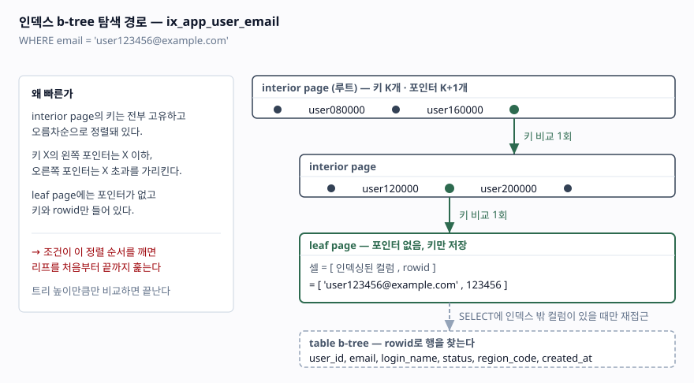
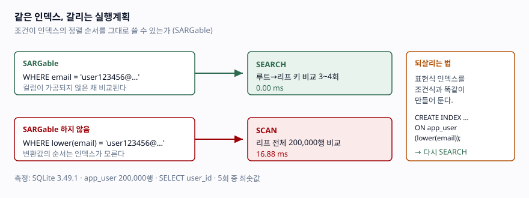

## 들어가며

업무로든 개인 프로젝트로든 테이블에 데이터가 쌓이다 보면, 어느 순간 목록 조회가 눈에 띄게 느려진다. 실행계획을 뽑아 보고 조건에 쓰는 컬럼에 인덱스를 하나 걸어 배포한다. 그런데 응답 시간이 그대로다. 다시 열어 보면 `SEARCH`가 아니라 `SCAN`이 찍혀 있고, 그 컬럼에는 분명 인덱스가 걸려 있다.

이때 대부분은 인덱스를 하나 더 만들거나 힌트를 붙이는 쪽으로 간다. 그런데 원인은 대개 인덱스가 없어서가 아니라 **WHERE 절을 쓴 방식이 인덱스를 못 쓰게 만들어서**다. 인덱스를 아무리 더 만들어도 같은 방식으로 조건을 쓰면 결과는 같다.

이 글은 그 조건들을 나열하는 대신, SQLite에 20만 행을 넣고 WHERE 절 표현만 바꿔가며 실행계획과 실행 시간을 나란히 측정한다. 예상과 다른 결과가 세 군데 나온다.

## 개념

B-Tree 인덱스는 **키 값이 정렬된 상태로** 저장된 트리다. 탐색이 빠른 이유는 단 하나, 정렬돼 있어서 비교 한 번에 후보의 절반 이상을 버릴 수 있기 때문이다.

여기서 인덱스가 무력화되는 조건이 곧바로 따라 나온다. **인덱스에 저장된 순서와, 조건이 요구하는 순서가 어긋나는 순간** 트리는 쓸모가 없어진다. `email`로 정렬된 인덱스에서 `lower(email)`의 순서는 보장되지 않고, 문자열 끝 3글자의 순서도 보장되지 않는다. 그러면 옵티마이저는 전부 읽어 하나씩 확인하는 수밖에 없다.

이 조건을 만족하는 표현을 **SARGable**(Search ARGument able) 하다고 부른다. 인덱스 문제의 대부분은 "조건이 SARGable한가"로 환원된다.

## 구조



> **구조 근거**: [SQLite Database File Format §1.6 B-tree Pages](https://www.sqlite.org/fileformat2.html#b_tree_pages)
> — interior page가 키 K개와 포인터 K+1개를 번갈아 담고 키가 고유·오름차순이라는 점, leaf page에는
> 포인터가 없다는 점, index b-tree의 셀이 인덱싱된 컬럼 뒤에 해당 행의 rowid를 붙여 저장한다는 점을
> 이 문서에 근거해 그렸다.

조건이 SARGable하면 루트에서 리프까지 **트리 높이만큼만** 비교하고 끝난다(SEARCH). SARGable하지 않으면 리프를 처음부터 끝까지 훑는다(SCAN).

한 가지 더 봐야 할 것이 위 그림의 점선이다. 인덱스 셀에는 키와 rowid만 있으므로, SELECT 목록에 인덱스에 없는 컬럼이 있으면 **행마다 테이블로 되돌아가야 한다**. 이 재접근 비용이 뒤에서 결과를 뒤집는다.



> **판정 기준 근거**: [SQLite — Query Planning](https://www.sqlite.org/queryplanner.html),
> [SQLite — Indexes On Expressions](https://www.sqlite.org/expridx.html).
> 그림 안의 수치(0.00ms / 16.88ms)는 이 글에서 직접 측정한 값이다.

## 동작 원리

측정 대상은 `app_user` 테이블 20만 행이고, 인덱스는 세 개다.

```sql
CREATE INDEX ix_app_user_email             ON app_user(email);
CREATE INDEX ix_app_user_status_created_at ON app_user(status, created_at);
CREATE INDEX ix_app_user_region_code       ON app_user(region_code);
```

`status`는 `active` 70%, `dormant` 25%, `locked` 5%로 일부러 치우치게 넣었다. 선택도가 인덱스 사용 여부를 가르는 걸 보기 위해서다. 통계가 없으면 옵티마이저가 선택도를 추정할 수 없으므로 `ANALYZE`를 먼저 돌린다.

같은 WHERE 절을 두 가지 SELECT 목록으로 각각 측정한다.

- **[A] `SELECT user_id`** — 인덱스 안에 답이 다 있는 커버링 상황
- **[B] `SELECT login_name`** — 인덱스에 없는 컬럼이라 테이블 재접근이 필요한 상황

## 실습 예제

전체 소스: [`code/index_probe.py`](code/index_probe.py) (표준 라이브러리만 사용, `python index_probe.py`)

핵심 측정 루프는 이렇게 생겼다.

```python
def run_case(
    conn: sqlite3.Connection, case: ProbeCase, select_list: str = "user_id"
) -> ProbeResult:
    """select_list에 따라 커버링 인덱스 여부가 달라지므로 투영 목록도 인자로 받는다."""
    for pragma in case.pragmas:
        conn.execute(pragma)

    sql = f"SELECT {select_list} FROM app_user WHERE {case.where_clause}"
    plan = explain(conn, sql, case.params)

    best_ms = float("inf")
    matched_rows = 0
    for _ in range(REPEAT_COUNT):
        started = time.perf_counter()
        matched_rows = len(conn.execute(sql, case.params).fetchall())
        best_ms = min(best_ms, (time.perf_counter() - started) * 1000)

    return ProbeResult(case.label, case.where_clause, plan, matched_rows, best_ms)
```

### 결과 [A] `SELECT user_id` — 커버링

| 케이스 | 인덱스 | 결과행 | ms | 실행계획 |
|---|---|---:|---:|---|
| ① 단일 컬럼 등치 | 사용 | 1 | 0.00 | `SEARCH ... USING COVERING INDEX ix_app_user_email (email=?)` |
| ② 컬럼에 함수 적용 | **미사용** | 1 | 16.88 | `SCAN ... USING COVERING INDEX ix_app_user_email` |
| ③ 컬럼에 연산 적용 | **미사용** | 35,744 | 13.39 | `SCAN ... USING COVERING INDEX ix_app_user_status_created_at` |
| ④ 접두 LIKE (기본) | **미사용** | 10 | 6.43 | `SCAN ... USING COVERING INDEX ix_app_user_email` |
| ⑤ 접두 LIKE (`case_sensitive_like=ON`) | 사용 | 10 | 0.00 | `SEARCH ... (email>? AND email<?)` |
| ⑥ 선행 와일드카드 LIKE | **미사용** | 2 | 9.20 | `SCAN ... USING COVERING INDEX ix_app_user_email` |
| ⑦ 복합 인덱스 선행 컬럼 사용 | 사용 | 1,711 | 0.38 | `SEARCH ... (status=? AND created_at>?)` |
| ⑧ 복합 인덱스 선행 컬럼 생략 | 사용 | 35,744 | 8.61 | `SEARCH ... (ANY(status) AND created_at>?)` |
| ⑨ 선택도가 낮은 등치 | 사용 | 139,855 | 37.26 | `SEARCH ... (status=?)` |
| ⑩ 부정 조건 | **미사용** | 199,999 | 56.73 | `SCAN ... USING COVERING INDEX ix_app_user_email` |
| ⑪ OR 로 묶인 서로 다른 인덱스 | 사용 | 39,580 | 10.36 | `MULTI-INDEX OR` |

### 결과 [B] `SELECT login_name` — 테이블 재접근 필요

| 케이스 | 인덱스 | 결과행 | ms | 실행계획 |
|---|---|---:|---:|---|
| ① 단일 컬럼 등치 | 사용 | 1 | 0.00 | `SEARCH ... USING INDEX ix_app_user_email (email=?)` |
| ② 컬럼에 함수 적용 | **미사용** | 1 | 17.95 | `SCAN app_user` |
| ⑦ 복합 인덱스 선행 컬럼 사용 | 사용 | 1,711 | 0.85 | `SEARCH ... (status=? AND created_at>?)` |
| ⑧ 복합 인덱스 선행 컬럼 생략 | 사용 | 35,744 | 20.73 | `SEARCH ... (ANY(status) AND created_at>?)` |
| ⑨ 선택도가 낮은 등치 | 사용 | **139,855** | **89.32** | `SEARCH ... (status=?)` |
| ⑩ 부정 조건 | 미사용 | **199,999** | **62.10** | `SCAN app_user` |

(전체 11개 케이스는 스크립트를 직접 돌리면 나온다. 측정 환경은 SQLite 3.49.1, 각 케이스 5회 중 최솟값.)

### 예상과 달랐던 세 가지

**1. 접두 LIKE가 인덱스를 못 탔다 (④ vs ⑤).**

`LIKE 'user12345%'`는 앞이 고정이라 당연히 인덱스를 탈 것 같지만 `SCAN`이 찍혔다. SQLite의 `LIKE`는 기본적으로 ASCII 대소문자를 구분하지 않는데, 인덱스는 `BINARY` 콜레이션으로 정렬돼 있어서 둘의 순서가 일치하지 않는다. `PRAGMA case_sensitive_like = ON`을 주자 옵티마이저가 `LIKE`를 범위 조건 `email > ? AND email < ?`로 바꿔 인덱스를 탔다. 6.43ms → 0.00ms.

**콜레이션이 다르면 인덱스는 없는 것과 같다.** 이건 SQLite만의 이야기가 아니다. 컬럼과 인덱스, 비교 대상의 콜레이션이 어긋나면 어느 DB에서나 같은 일이 생긴다.

**2. 선행 컬럼을 생략했는데도 인덱스를 탔다 (⑧).**

`WHERE created_at >= ?`처럼 복합 인덱스의 선행 컬럼 `status`를 빼면 인덱스를 못 탄다고 알려져 있지만, 실행계획에는 `ANY(status) AND created_at>?`가 찍혔다. **스킵 스캔**이다. `status`의 서로 다른 값이 3개뿐이라, 옵티마이저가 세 값을 각각 대입해 범위 탐색 3번으로 처리했다.

다만 "탔다"가 "빠르다"는 아니다. ⑦(0.38ms)과 ⑧(8.61ms)은 22배 차이고, [B]에서는 0.85ms 대 20.73ms로 24배다. 스킵 스캔은 선행 컬럼의 카디널리티가 낮을 때만 성립하고, 제대로 된 순서의 인덱스를 대신하지 못한다.

그리고 이 계획은 **통계에 전적으로 의존한다.** 같은 쿼리를 `ANALYZE` 유무만 바꿔 돌리면 이렇게 갈린다.

```text
ANALYZE=True  -> SEARCH app_user USING COVERING INDEX ix_app_user_status_created_at (ANY(status) AND created_at>?)
ANALYZE=False -> SCAN  app_user USING COVERING INDEX ix_app_user_status_created_at
```

옵티마이저는 `status`에 값이 3개뿐이라는 걸 통계로만 알 수 있다. 통계가 없으면 스킵 스캔을 시도조차 하지 않는다. 운영 중 통계 수집이 멈춘 DB에서 어느 날 갑자기 계획이 바뀌는 사고는 대개 이 지점에서 난다.

**3. 인덱스를 타고도 풀스캔보다 느렸다 (⑨ vs ⑩, [B]).**

[B]에서 ⑨는 139,855행을 인덱스로 찾아 89.32ms, ⑩은 199,999행을 풀스캔해 62.10ms다. **더 적은 행을 읽는데 더 느리다.** 인덱스로 찾은 행마다 rowid로 테이블에 되돌아가는 랜덤 접근이, 테이블을 순차로 훑는 것보다 비쌌기 때문이다.

같은 조건이 [A]에서는 37.26ms로 [B]의 절반 이하다. 차이는 오직 SELECT 목록 하나다. 컬럼 하나를 더 넣고 빼는 것이 계획의 유불리를 뒤집는다.

### 함수 조건을 되살리는 법

②의 `lower(email)`은 표현식 인덱스를 만들면 해결된다.

```sql
CREATE INDEX ix_app_user_email_lower ON app_user(lower(email));
```

재측정하면 `SEARCH app_user USING COVERING INDEX ix_app_user_email_lower (<expr>=?)`로 바뀌고 16.88ms → 0.00ms가 된다. 조건식과 인덱스 정의가 **문자 그대로 일치**해야 한다는 점만 주의하면 된다.

## 실무에서 주의할 점

- **왼쪽에 함수를 씌우지 않는다.** `WHERE DATE(created_at) = '2026-09-18'` 대신 `WHERE created_at >= ... AND created_at < ...`로 범위를 쓴다. 암묵적 형변환도 마찬가지다. 문자열 컬럼에 숫자 리터럴을 비교하면 DB가 컬럼 쪽을 변환하면서 인덱스가 죽는 경우가 있다.
- **인덱스를 탔다는 사실만으로 안심하지 않는다.** 실행계획에서 확인할 것은 `SEARCH`/`SCAN` 여부가 아니라 **실제로 읽은 행 수**다. ⑧과 ⑨는 둘 다 `SEARCH`지만 느리다.
- **SELECT 목록을 계획의 일부로 본다.** 필요 없는 컬럼을 빼는 것만으로 커버링 인덱스가 성립해 2배 이상 빨라질 수 있다. 반대로 `SELECT *`는 커버링을 거의 확실히 깨뜨린다.
- **콜레이션을 확인한다.** 대소문자 무시 비교가 필요하면 인덱스도 같은 콜레이션으로 만든다.
- **통계 없이 판단하지 않는다.** 이 실험은 전부 `ANALYZE` 이후 결과다. 통계가 없거나 낡으면 옵티마이저는 선택도를 기본값으로 추정하고 엉뚱한 계획을 고른다.
- **다른 DB로 옮길 때 그대로 믿지 않는다.** 함수 적용·선행 와일드카드·콜레이션 불일치는 대체로 공통이지만, 스킵 스캔 지원 여부나 OR 처리 방식은 엔진과 버전마다 다르다. 쓰는 DB에서 같은 실험을 한 번 돌려보는 편이 빠르다.

## 정리

- 인덱스는 **정렬 순서**를 파는 자료구조다. 조건이 그 순서를 깨면 인덱스는 무력해진다.
- `SEARCH`가 찍혔다고 끝이 아니다. 스킵 스캔은 22배 느렸고, 선택도 70% 조건은 풀스캔보다 느렸다.
- SELECT 목록이 계획을 바꾼다. 커버링이 되느냐 마느냐로 같은 쿼리가 2배 이상 갈린다.
- 판단은 문서가 아니라 자기 데이터로 뽑은 실행계획으로 한다. 스크립트 하나면 20만 행 실험은 몇 초다.

## 참고 자료

- [SQLite — Query Planning](https://www.sqlite.org/queryplanner.html)
- [SQLite — The LIKE Optimization](https://www.sqlite.org/optoverview.html#the_like_optimization)
- [SQLite — Skip-Scan](https://www.sqlite.org/optoverview.html#skipscan)
- [SQLite — Indexes On Expressions](https://www.sqlite.org/expridx.html)
- [SQLite — EXPLAIN QUERY PLAN](https://www.sqlite.org/eqp.html)
