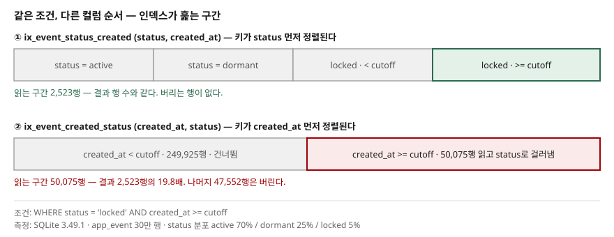

## 들어가며

목록 조회가 느려져 실행계획을 뽑아 보면 조건에 쓰는 컬럼이 두 개일 때가 많다.
상태값 하나와 날짜 하나, 혹은 테넌트 하나와 유형 하나. 그래서 두 컬럼을 묶어
복합 인덱스를 하나 만든다. 여기서 늘 막히는 질문이 나온다. 어느 컬럼을 앞에 둘까.

대개는 "카디널리티가 높은 컬럼을 앞에"라는 규칙을 떠올려 그대로 적용하고 배포한다.
그리고 절반 정도는 효과가 없다. 실행계획에는 여전히 `SEARCH`가 찍혀 있고 인덱스도
타고 있는데 시간이 그대로다. 그러면 인덱스를 하나 더 만들어 붙이고, 인덱스 개수만
늘어난다.

이 글은 규칙을 하나 더 외우는 대신, 같은 두 컬럼으로 순서만 바꾼 인덱스 두 개를
30만 행에 걸고 `INDEXED BY`로 사용할 인덱스를 고정해 직접 비교한다. 순서가 20배를
바꾸는 경우, 500배를 바꾸는 경우, 그리고 **아무 영향도 주지 않는 경우**가 각각 나온다.

## 개념

복합 인덱스 `(a, b)` 의 키는 `a` 로 먼저 정렬되고, `a` 가 같은 것들 안에서 `b` 로
정렬된다. 사전에서 단어를 찾는 것과 같다. 첫 글자로 자리를 잡고, 첫 글자가 같은
것들 안에서 두 번째 글자를 본다.

여기서 인덱스를 쓰는 규칙이 그대로 따라 나온다. 인덱스는 **선행 컬럼부터 끊기지 않고
이어지는 등치 조건**으로만 탐색 위치를 좁힐 수 있다. 중간에 범위 조건이 한 번 나오면
그 뒤 컬럼으로는 더 좁힐 수 없다. 첫 글자가 `ㄱ~ㄷ` 사이인 단어를 모두 찾아야 한다면,
두 번째 글자는 사전 순서상 아무 도움이 안 되는 것과 같다.

그래서 문제는 "어느 컬럼이 선택도가 높은가"가 아니라 **"어떤 조건으로 들어오는가"**다.
같은 두 컬럼이라도 등치 두 개로 들어오는지, 등치 하나와 범위 하나로 들어오는지에 따라
답이 달라진다.

## 구조



> **출처**: [SQLite — Query Planning §1.6 Multi-Column Indices](https://www.sqlite.org/queryplanner.html#_multi_column_indices)
> — 복합 인덱스의 키가 선행 컬럼부터 차례로 정렬되고, 등치 조건이 이어지는 동안만
> 탐색 구간을 좁힐 수 있으며 범위 조건 이후의 컬럼은 구간을 좁히지 못한다는 점을
> 이 문서에 근거해 그렸다. 그림의 행 수(2,523 / 50,075 / 249,925)와 19.8배는
> 이 글에서 직접 측정한 값이다.

`status = 'locked' AND created_at >= cutoff` 를 두 인덱스로 각각 처리하면 이렇게 갈린다.

- `(status, created_at)`: `status = 'locked'` 로 자리를 잡고 그 안에서 `created_at >= cutoff`
  지점으로 바로 내려간다. 읽는 구간이 곧 결과다.
- `(created_at, status)`: `created_at >= cutoff` 로만 자리를 잡는다. 그 구간에는 모든
  status가 섞여 있으므로 전부 읽고 `status` 를 하나씩 확인해 버린다.

## 동작 원리

읽는 구간의 폭은 계산해 볼 수 있다. 실행계획이 탐색 조건으로 쓴 술어만 남겨
`COUNT(*)` 를 세면 된다. 아래 숫자는 엔진 내부 카운터가 아니라 그렇게 센 값이다.

```text
### 등치 + 범위 — WHERE status = 'locked' AND created_at >= cutoff
  [ix_event_status_created]     0.59ms  결과 2,523행
      SEARCH app_event USING COVERING INDEX ix_event_status_created (status=? AND created_at>?)
  [ix_event_created_status]     1.94ms  결과 2,523행
      SEARCH app_event USING COVERING INDEX ix_event_created_status (created_at>?)
  훑는 범위: (status, created_at) = 2,523행  /  (created_at, status) = 50,075행  → 19.8배
```

실행계획의 괄호를 보면 차이가 그대로 드러난다. 앞은 `(status=? AND created_at>?)`
두 조건 모두 탐색에 썼고, 뒤는 `(created_at>?)` 하나만 썼다. 둘 다 `SEARCH`고 둘 다
커버링 인덱스인데, 읽는 양이 19.8배다. 시간은 3.3배 차이로 그보다 완만하다.
메모리 DB에서 커버링 인덱스만 순차로 읽는 조건이라 읽기 자체가 싸기 때문이다.
디스크와 테이블 재접근이 끼면 이 간격은 벌어진다.

## 실습 예제

전체 소스: [`code/order_probe.py`](code/order_probe.py) (표준 라이브러리만 사용,
`python order_probe.py`)

### 순서가 아무 영향을 주지 않는 경우

```text
### 등치 + 등치 — WHERE 절에 쓴 순서를 바꿔도 같은가
  [channel = ? AND status = ?]     0.28ms  결과 1,226행
      SEARCH app_event USING COVERING INDEX ix_event_channel_status (channel=? AND status=?)
  [status = ? AND channel = ?]     0.29ms  결과 1,226행
      SEARCH app_event USING COVERING INDEX ix_event_channel_status (channel=? AND status=?)
  훑는 범위: 두 컬럼 모두 seek = 1,226행  /  선행 컬럼만 seek = 25,181행
```

양쪽이 모두 등치면 **WHERE 절에 어느 쪽을 먼저 쓰든 계획이 완전히 같다.** 실행계획
문자열까지 동일하다. 옵티마이저가 WHERE 절의 텍스트 순서를 보지 않기 때문이다.
"선택도 높은 컬럼을 WHERE 앞에 쓰라"는 조언은 이 경우 아무 근거가 없다.

인덱스 정의의 순서도 이 경우에는 중요하지 않다. 두 컬럼 모두 탐색에 쓰이므로 어느
쪽을 앞에 둬도 1,226행으로 좁혀진다. 선택도가 의미를 갖는 것은 **한쪽 컬럼만 조건에
들어오는 질의가 섞여 있을 때**다. 위 출력의 마지막 줄이 그 경우로, 선행 컬럼만
쓰면 25,181행까지만 좁혀진다.

### 선행 컬럼을 생략했을 때

```text
### 선행 컬럼을 생략했을 때 — ix_event_channel_status(channel, status)
  [후행 컬럼만 (status)]     3.68ms  결과 14,950행
      SEARCH app_event USING COVERING INDEX ix_event_channel_status (ANY(channel) AND status=?)
  [선행 컬럼만 (channel)]     6.38ms  결과 25,181행
      SEARCH app_event USING COVERING INDEX ix_event_channel_status (channel=?)
```

"선행 컬럼이 조건에 없으면 인덱스를 못 탄다"는 설명과 다르다. `ANY(channel)` 은
**스킵 스캔**이다. `channel` 의 서로 다른 값이 12개뿐이라, 옵티마이저가 12개 값을
각각 대입해 범위 탐색을 반복했다.

다만 이건 통계에 달려 있다. `ANALYZE` 를 빼고 같은 질의를 돌리면 이렇게 바뀐다.

```text
### 같은 질의, ANALYZE 유무만 다를 때
  ANALYZE=True  -> SEARCH app_event USING COVERING INDEX ix_event_channel_status (ANY(channel) AND status=?)
  ANALYZE=False -> SCAN app_event USING COVERING INDEX ix_event_channel_status
```

선행 컬럼의 값이 12개뿐이라는 사실은 통계로만 알 수 있다. 통계가 없으면 시도조차
하지 않는다. 스킵 스캔을 설계의 전제로 삼을 수 없는 이유다.

### 가장 큰 차이는 정렬에서 났다

```text
### WHERE status = 'locked' ORDER BY created_at LIMIT 20 — 정렬이 남는가
  [ix_event_status_created]     0.01ms  결과 20행
      SEARCH app_event USING COVERING INDEX ix_event_status_created (status=?)
  [ix_event_status_amount]     4.89ms  결과 20행
      SEARCH app_event USING INDEX ix_event_status_amount (status=?) / USE TEMP B-TREE FOR ORDER BY
```

두 인덱스는 선행 컬럼이 같고 두 번째 컬럼만 다르다. `(status, created_at)` 은
`status` 안에서 이미 `created_at` 순으로 정렬돼 있으므로 앞에서 20행만 읽고 끝난다.
`(status, amount)` 는 14,950행을 모두 읽어 임시 B-Tree로 정렬한 뒤 20행을 잘라낸다.
0.01ms 대 4.89ms다. 앞의 값은 타이머 분해능에 가까워 배수를 그대로 받아들일 것은
아니지만, **자릿수가 두 개 이상 다르다.** 이 글에서 측정한 차이 중 가장 크다.

두 번째 컬럼을 정할 때 WHERE 절만 보면 이 이득을 놓친다. `ORDER BY ... LIMIT` 이
붙는 질의에서는 정렬 제거가 탐색 구간 축소보다 큰 값을 낸다.

## 실무에서 주의할 점

- **등치 조건을 앞에, 범위 조건을 맨 뒤에 둔다.** 이것이 컬럼 순서 결정의 첫 번째
  기준이다. 범위 조건 뒤의 컬럼은 탐색 구간을 좁히지 못한다.
- **모든 조건이 등치면 순서 고민은 무의미하다.** 대신 "한쪽만 들어오는 질의가 있는가"를
  본다. 있으면 그 컬럼을 선행에 둬야 인덱스가 재사용된다.
- **`ORDER BY` 를 컬럼 순서 결정에 포함한다.** 정렬 제거 효과가 가장 컸다.
  `WHERE`에 등치로 쓰는 컬럼 뒤에 `ORDER BY` 컬럼을 두면 정렬 단계가 사라진다.
- **`SEARCH`가 찍혔다고 끝이 아니다.** 실행계획 괄호 안에 조건이 **몇 개** 들어갔는지를
  본다. `(a=? AND b>?)` 와 `(b>?)` 는 같은 `SEARCH`지만 읽는 양이 20배 다르다.
- **스킵 스캔을 전제로 설계하지 않는다.** 선행 컬럼의 값 종류가 적을 때만 성립하고,
  통계가 없으면 나타나지 않는다.
- **인덱스를 추가하기 전에 순서를 먼저 고친다.** 컬럼이 같은 인덱스를 순서만 바꿔
  두 개 두면 쓰기 비용과 저장 공간이 두 배가 된다. 위 실험처럼 둘 다 만들어 비교하는
  것은 측정을 위한 방법이고, 운영에 둘 다 남길 이유는 대개 없다.

## 정리

- 복합 인덱스의 컬럼 순서는 선택도가 아니라 **질의가 들어오는 조건의 형태**로 정한다.
- 등치 + 범위에서 순서를 잘못 두면 읽는 구간이 19.8배로 늘었다. 결과 행 수는 같다.
- 모든 조건이 등치면 순서도 WHERE 절 작성 순서도 계획을 바꾸지 않았다.
- 가장 큰 차이는 정렬에서 났다. 두 번째 컬럼을 `ORDER BY` 컬럼으로 두자 4.89ms가 0.01ms가 됐다.
- 확인은 실행계획 괄호 안의 조건 개수로 한다. 스크립트 하나면 30만 행 실험은 몇 초다.

## 참고 자료

- [SQLite — Query Planning §1.6 Multi-Column Indices](https://www.sqlite.org/queryplanner.html#_multi_column_indices)
- [SQLite — Query Planning §2.5 Searching and Sorting With A Multi-Column Index](https://www.sqlite.org/queryplanner.html#_searching_and_sorting_with_a_multi_column_index)
- [SQLite — The Skip-Scan Optimization](https://www.sqlite.org/optoverview.html#skipscan)
- [SQLite — ORDER BY Optimizations](https://www.sqlite.org/optoverview.html#order_by)
- [SQLite — INDEXED BY](https://www.sqlite.org/lang_indexedby.html)
- [SQLite — EXPLAIN QUERY PLAN](https://www.sqlite.org/eqp.html)
