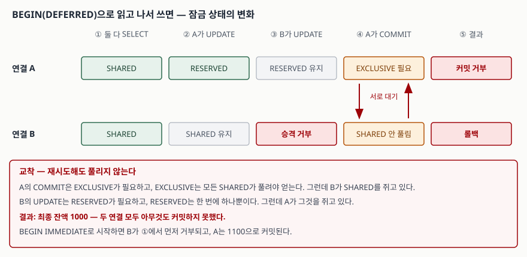

## 들어가며

정산 화면을 만들다 보면 같은 페이지 안에서 숫자가 안 맞는 일이 생긴다. 위쪽 합계는
1,000만 원인데 아래 목록을 더하면 1,002만 원이다. 새로고침하면 맞을 때도 있고 안 맞을 때도 있다.

이쯤 되면 대부분 캐시를 의심한다. 캐시를 끄고, 그래도 안 맞으면 쿼리에 `ORDER BY`를
넣어 보고, 로그를 찍어 두 숫자를 비교한다. 재현이 안 되니 며칠을 붙잡고도 원인이 안 나온다.

원인은 대개 코드에 없다. 합계 쿼리와 목록 쿼리 **사이에** 다른 요청이 커밋한 것이고,
두 쿼리가 각각 다른 트랜잭션에서 돌았기 때문이다. 격리 수준을 고르는 설정을 찾기 전에,
지금 내 코드의 트랜잭션 경계가 어디인지부터 봐야 한다.

## 개념

표준 SQL은 격리 수준을 네 단계로 정의하고, 각 단계에서 어떤 **이상 현상**이 허용되는지로
구분한다. 이상 현상은 세 가지다.

- **더티 리드**(dirty read) — 커밋되지 않은 값을 읽는다
- **반복 불가능한 읽기**(non-repeatable read) — 같은 행을 두 번 읽었는데 값이 다르다
- **팬텀 읽기**(phantom read) — 같은 조건으로 두 번 세었는데 행 수가 다르다

SQLite에는 이 네 단계를 고르는 설정이 없다. 문서가 밝히는 기본값은 하나, **직렬화
가능**(serializable)이다. 그래서 이 글의 질문은 "레벨을 어떻게 바꾸나"가 아니라
**"이상 현상이 안 보이게 만드는 대가로 무엇을 내는가"**가 된다.

그 대가는 잠금이다. SQLite는 데이터베이스 파일 하나에 대해 다섯 가지 잠금 상태를 두고,
그중 `RESERVED`는 **한 번에 하나만** 존재할 수 있다.

## 구조



> **출처**: [SQLite — File Locking And Concurrency §3.0 Locking](https://www.sqlite.org/lockingv3.html#locking).
> `SHARED`는 여러 개가 공존할 수 있고, `RESERVED`는 한 번에 하나만 활성화되며,
> `EXCLUSIVE`는 다른 어떤 잠금과도 공존하지 못한다는 점이 그림의 근거다.
> 잔액 1000 / 1100 값은 이 글에서 직접 측정한 결과다.

두 연결이 `BEGIN`으로 시작해 각자 읽으면 둘 다 `SHARED`를 쥔다. A가 먼저 쓰면 A는
`RESERVED`로 올라간다. 이제 B도 쓰려 하지만 `RESERVED`는 하나뿐이라 거부된다.
이어서 A가 커밋하려면 `EXCLUSIVE`가 필요한데, 그건 모든 `SHARED`가 풀려야 얻는다.
B가 아직 `SHARED`를 쥐고 있으니 A의 커밋도 거부된다.

서로를 기다리는 상태다. SQLite는 교착을 감지해 한쪽을 죽이지 않고 그냥 `SQLITE_BUSY`를
돌려주므로, **재시도 로직을 아무리 돌려도 풀리지 않는다.**

## 동작 원리

읽기를 두 번 하는 사이에 다른 연결이 커밋하도록 순서를 고정해 놓고, 트랜잭션 경계만
바꿔 가며 재 봤다.

```text
journal_mode = delete
  [트랜잭션 안] 쓰기 거부(database is locked)   1회차 1000 → 2회차 1000 → 끝난 뒤 1000
  [autocommit ] 쓰기 성공                       1회차 1000 → 2회차 2000 → 끝난 뒤 2000
  [트랜잭션 안] 삽입 거부(database is locked)   COUNT 5 → 5 → 끝난 뒤 5
  [autocommit ] 삽입 성공                       COUNT 5 → 6 → 끝난 뒤 6

journal_mode = wal
  [트랜잭션 안] 쓰기 성공                       1회차 1000 → 2회차 1000 → 끝난 뒤 2000
  [autocommit ] 쓰기 성공                       1회차 1000 → 2회차 2000 → 끝난 뒤 2000
  [트랜잭션 안] 삽입 성공                       COUNT 5 → 5 → 끝난 뒤 6
  [autocommit ] 삽입 성공                       COUNT 5 → 6 → 끝난 뒤 6
```

읽는 쪽이 `BEGIN` 안에 있으면 두 모드 모두 1회차와 2회차가 같았다. 반복 불가능한 읽기도
팬텀도 나오지 않는다. 읽는 쪽이 `autocommit`이면 두 모드 모두 값이 바뀌고 행이 늘었다.

**같은 DB, 같은 쿼리인데 결과가 갈린 것은 트랜잭션 경계 하나 때문이다.** 격리 수준을
고르는 설정을 찾아 헤맬 일이 아니라, 두 쿼리를 하나의 `BEGIN` 안에 넣었는지를 볼 일이다.

두 모드가 같은 결과를 낸 방식은 서로 다르다. 표에서 `쓰기` 칸을 보면 드러난다.
`delete` 모드는 쓰는 쪽을 **거부**해서 막았고, `wal` 모드는 쓰기를 **허용**하고도
읽는 쪽에 원래 스냅숏을 계속 보여줬다. 읽는 쪽이 커밋한 뒤에야 새 값이 보인다.

결과는 같지만 대가가 다르다. `delete`는 읽는 트랜잭션이 길어질수록 쓰기가 막히고,
`wal`은 쓰기가 막히지 않는 대신 읽는 쪽이 오래된 스냅숏을 붙들고 있게 된다.

## 실습 예제

전체 소스: [`code/isolation_anomalies.py`](code/isolation_anomalies.py) (표준 라이브러리만
사용, `python isolation_anomalies.py`)

더티 리드는 기본 설정으로는 아예 재현되지 않았다. 재현하려면 두 연결이 캐시를 공유하게
하고 `read_uncommitted`를 직접 켜야 한다.

```text
기본(캐시 비공유)                커밋 전 읽기 = 1000
공유 캐시 + read_uncommitted=1   커밋 전 읽기 = 9999
그 트랜잭션이 롤백된 뒤          다시 읽기 = 1000
```

읽어 간 9999는 **어느 시점에도 커밋된 적이 없는 값**이다. 더티 리드가 위험한 이유가
여기에 있다. 틀린 값을 읽는 것을 넘어, 존재한 적 없는 값을 근거로 다음 결정을 내린다.

예상과 가장 달랐던 건 갱신 분실 실험이다. 두 연결이 같은 잔액을 읽고 각자 100을 더해
쓰게 했다.

```text
BEGIN           / delete  B의 BEGIN 성공  B의 UPDATE 거부  A의 COMMIT 거부  최종 잔액 1000
BEGIN           / wal     B의 BEGIN 성공  B의 UPDATE 거부  A의 COMMIT 성공  최종 잔액 1100
BEGIN IMMEDIATE / delete  B의 BEGIN 거부  B의 UPDATE -     A의 COMMIT 성공  최종 잔액 1100
BEGIN IMMEDIATE / wal     B의 BEGIN 거부  B의 UPDATE -     A의 COMMIT 성공  최종 잔액 1100
```

네 경우 모두 갱신 분실은 일어나지 않았다. 1200이 된 경우가 없다. 하지만 첫 줄은
**최종 잔액이 1000**이다. A는 `UPDATE`까지 성공해 놓고 커밋에서 거부됐다.
두 연결이 일을 하고도 아무것도 남기지 못한 것이다.

차이는 `BEGIN`과 `BEGIN IMMEDIATE` 하나다. `BEGIN IMMEDIATE`는 시작하는 순간 쓰기 의사를
밝혀 `RESERVED`를 먼저 잡는다. 그래서 B가 **일을 시작하기도 전에** 거부되고, A는 끝까지
간다. 거부되는 쪽이 있는 건 같은데, 거부되는 **시점**이 진행 여부를 갈랐다.

## 실무에서 주의할 점

- **읽기 여러 개가 서로 일관돼야 하면 하나의 트랜잭션에 넣는다.** 합계와 목록을 따로
  조회하면서 격리 수준 설정을 찾는 것은 방향이 틀렸다. 경계가 문제다.
- **읽고 나서 쓸 트랜잭션은 `BEGIN IMMEDIATE`로 연다.** `BEGIN`으로 열면 승격 시점에
  충돌하고, 그때는 이미 양쪽이 잠금을 나눠 쥔 뒤라 재시도가 듣지 않는다.
- **`SQLITE_BUSY` 재시도 로직을 만능으로 믿지 않는다.** `busy_timeout`은 상대가 언젠가
  놓아줄 때만 듣는다. 서로 기다리는 상황에서는 타임아웃만 길어진다.
- **동시 접근이 있으면 WAL을 검토한다.** 쓰기가 읽기에 막히지 않는다. 대신 읽는
  트랜잭션을 오래 열어 두면 WAL 파일이 줄지 않으므로 경계를 짧게 유지해야 한다.
- **ORM의 기본 동작을 확인한다.** 어떤 드라이버는 `SELECT` 앞에 `BEGIN`을 넣지 않는다.
  이 글의 예제도 `isolation_level=None`으로 드라이버의 개입을 끄고, 경계를 직접 그었다.
- **더티 리드는 스스로 켜야 생긴다.** `read_uncommitted`는 공유 캐시에서만 의미가 있고
  기본은 꺼져 있다. 성능을 이유로 켜자는 제안이 나오면 이 실험의 9999를 근거로 든다.

## 정리

- SQLite에는 격리 수준 다이얼이 없다. 기본이 직렬화 가능이고, 대가는 잠금 충돌이다.
- 반복 불가능한 읽기와 팬텀이 보이느냐는 트랜잭션 경계가 결정했다. `autocommit`이면 보였고
  `BEGIN` 안이면 안 보였다. `delete`와 `wal` 모두 같았다.
- 두 모드는 막는 방식이 다르다. `delete`는 쓰기를 거부했고, `wal`은 쓰기를 허용하되
  읽는 쪽에 스냅숏을 유지했다.
- 읽고 나서 쓰는 트랜잭션을 `BEGIN`으로 열면 교착이 나고 최종 잔액이 1000에 머물렀다.
  `BEGIN IMMEDIATE`로 바꾸면 한쪽이 일찍 거부되고 다른 쪽은 1100으로 끝난다.
- 더티 리드는 기본 설정에서 재현되지 않는다. 공유 캐시와 `read_uncommitted`를 켜야 나온다.

## 참고 자료

- [SQLite — Isolation In SQLite](https://www.sqlite.org/isolation.html)
- [SQLite — File Locking And Concurrency §3.0 Locking](https://www.sqlite.org/lockingv3.html#locking)
- [SQLite — Write-Ahead Logging](https://www.sqlite.org/wal.html)
- [SQLite — BEGIN TRANSACTION](https://www.sqlite.org/lang_transaction.html)
- [SQLite — PRAGMA read_uncommitted](https://www.sqlite.org/pragma.html#pragma_read_uncommitted)
- [Berenson et al., A Critique of ANSI SQL Isolation Levels (SIGMOD 1995)](https://www.microsoft.com/en-us/research/publication/a-critique-of-ansi-sql-isolation-levels/)
