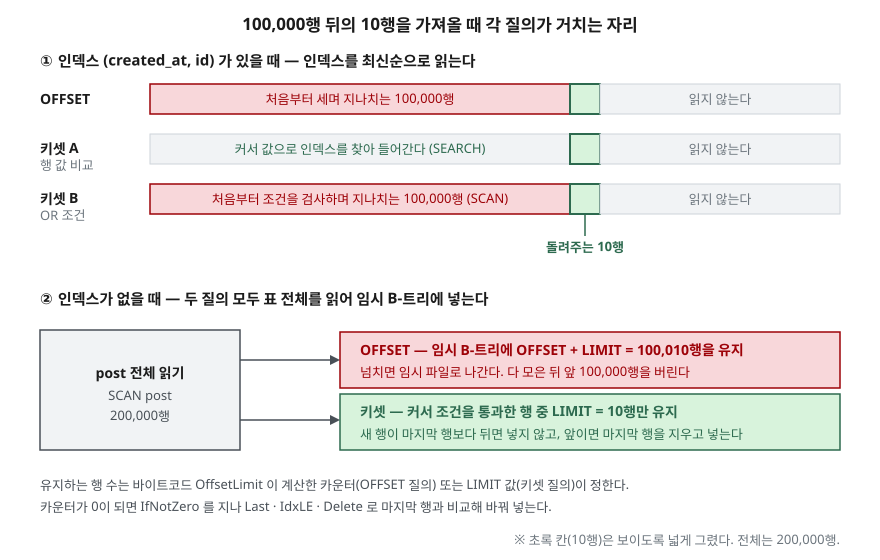

<!-- related:start -->
> **같은 기능을 다른 환경에서 다룬 글** (`row-limiting`)
> - [LIMIT과 OFFSET — 결과를 잘라내는 문법](../../sql-basics/2026-09-22-limit-offset-pagination/index.md) — SQLite 3.49.1, Python 3.13.5
<!-- related:end -->

## 들어가며

피드 화면의 "더 보기"를 OFFSET으로 만들었다가 느리다는 말을 듣고 커서 방식으로 바꾸는 일은 흔하다.
정렬 키가 `created_at` 하나면 `WHERE created_at < ?`로 끝나지만, 같은 초에 글이 여러 개 들어오면
글이 빠진다. 그래서 동점을 가르는 `id`를 붙여 `created_at < ? OR (created_at = ? AND id < ?)`로
고친다. 뜻은 맞다. 그런데 이 조건으로 10만 행 뒤의 페이지를 읽으면 OFFSET보다 명령을 두 배 더 쓴다.
커서로 바꿨다는 사실만으로는 빨라지지 않는다. 이 글은 20만 행에서 페이지 깊이를 바꿔 가며
OFFSET과 커서 세 가지를 재고, 인덱스가 있을 때와 없을 때 순위가 어디서 바뀌는지 찾는다.

## 개념

**OFFSET 페이지네이션**은 "앞에서 N행을 건너뛰고 10행"을 요청한다. 건너뛴 행도 실제로 읽으므로
비용은 N에 비례한다. 이 부분은 [LIMIT과 OFFSET](../../sql-basics/2026-09-22-limit-offset-pagination/index.md)
글에서 가상 머신 명령 개수로 확인했다.

**키셋(커서) 페이지네이션**은 "직전 페이지의 마지막 행보다 뒤에 있는 10행"을 요청한다. 앞 페이지가
돌려준 마지막 행의 정렬 키 값이 커서다. 정렬 키가 `(created_at, id)`처럼 둘이면 조건을 쓰는
방법이 여럿 있다.

| 이름 | 조건 | 뜻 |
|---|---|---|
| 키셋 A | `(created_at, id) < (?, ?)` | 행 값 비교. 왼쪽 원소부터 비교한다 |
| 키셋 B | `created_at < ? OR (created_at = ? AND id < ?)` | A를 논리식으로 풀어 쓴 것 |
| 키셋 C | `created_at < ?` | 동점을 무시한 것 |

A와 B는 뜻이 같고 C는 다르다. 행 값 비교는 SQLite 3.15.0에 들어왔고, 공식 문서는 이 용도를
"scrolling window query"라는 예로 따로 든다.

## 구조



> **출처**: 행 값 비교로 커서를 거는 방식은 [SQLite — Row Values: Scrolling Window Queries](https://www.sqlite.org/rowvalue.html#scrolling_window_queries),
> OFFSET이 앞 행을 버린다는 규정은 [SQLite — SELECT: The LIMIT clause](https://www.sqlite.org/lang_select.html#the_limit_clause),
> 인덱스 없는 ORDER BY가 임시 B-트리를 쓰고 그것이 임시 파일로 나간다는 설명은 [SQLite — Temporary Files: Transient Indices](https://www.sqlite.org/tempfiles.html#transient_indices)를 따랐다.
> 임시 B-트리에 몇 행을 유지하는지는 [SQLite Opcodes — OffsetLimit](https://www.sqlite.org/opcode.html#OffsetLimit)·[IfNotZero](https://www.sqlite.org/opcode.html#IfNotZero)와 실습 4의 `EXPLAIN` 출력으로 확인했다.

## 동작 원리

인덱스 `(created_at, id)`가 있으면 최신순 정렬은 인덱스를 거꾸로 읽는 것으로 끝난다.
갈리는 것은 **어디서부터 읽기 시작하는가**다.

- OFFSET은 인덱스 맨 앞에서 시작해 N행을 세고 지나간다. 실행 계획은 `SCAN`이다.
- 키셋 A는 커서 값으로 인덱스를 찾아 들어가 그 자리부터 10행을 읽는다. 실행 계획은 `SEARCH`다.
- 키셋 B는 뜻이 같은데도 SQLite 3.49.1이 `SCAN`을 골랐다. 맨 앞에서 시작해 행마다 OR 조건을
  검사하고, 조건을 처음 통과하는 행이 나올 때까지 N행을 지나간다. 셈은 OFFSET과 같고 검사는 더 많다.

인덱스가 없으면 둘 다 표 전체를 읽는다. 차이는 정렬을 위해 **임시 B-트리에 몇 행을 붙잡아 두는가**다.
OFFSET 질의는 `LIMIT + OFFSET`행을, 키셋 질의는 `LIMIT`행만 유지한다. 유지할 행 수를 넘기면
새 행을 B-트리의 마지막 행과 비교해, 앞에 올 행이면 마지막 행을 지우고 넣는다. 임시 B-트리는
처음에는 페이지 캐시에 있다가 캐시가 차면 임시 파일로 나간다.

## 실습 예제

메모리 DB에 글 20만 행을 넣었다. 한 초에 글이 정확히 4개씩 몰리게 해 `created_at`에 동점을 만들었다.
명령 개수는 `set_progress_handler(tick, 1)`로 센 SQLite 가상 머신 명령 수이고, 시간은 5회 실행의 중앙값이다.
전체 소스: [`code/keyset_vs_offset.py`](code/keyset_vs_offset.py), 실행 기록: [`code/output.txt`](code/output.txt)

### 1. 실행 계획 — B만 SCAN이다

```text
   OFFSET
   QUERY PLAN
   `--SCAN post USING INDEX ix_post_created_at_id
   키셋 — 행 값 비교
   QUERY PLAN
   `--SEARCH post USING INDEX ix_post_created_at_id (created_at<?)
   키셋 — OR 로 풀어 쓴 조건
   QUERY PLAN
   `--SCAN post USING INDEX ix_post_created_at_id
```

### 2. 깊이별 비용 — 인덱스가 있을 때

칸마다 명령 개수, 시간(ms), OFFSET과 같은 10행을 돌려줬는지(`=`/`≠`)다.

```text
   건너뛴 행 |            OFFSET |          키셋 A   |          키셋 B   |          키셋 C
          10 |       121   0.011 |       153   0.013 = |       193   0.014 = |        85   0.011 ≠
         100 |       391   0.012 |       165   0.013 = |       719   0.017 = |        83   0.011 =
      10,000 |    30,091   0.165 |       165   0.013 = |    60,119   0.320 = |        83   0.011 =
     100,000 |   300,091   1.581 |       165   0.013 = |   600,119   3.390 = |        83   0.012 =
     199,990 |   600,061   3.282 |       151   0.014 = | 1,200,063   6.205 = |        70   0.011 ≠
```

1,000행 줄은 뺐다. 세 가지가 보인다.

**A는 깊이와 무관하게 165개 안팎이다.** 건너뛴 행이 10일 때만 OFFSET(121)이 A(153)보다 적었다.
커서를 찾아 들어가는 비용이 10행을 세고 지나가는 비용보다 크다. 100행부터는 A가 앞선다.

**B는 OFFSET보다 비싸다.** 행 하나를 지날 때 OFFSET은 명령 3개, B는 6개를 썼다
(100,000과 10,000의 차를 90,000으로 나눈 값). 커서로 바꿨는데 OFFSET보다 두 배 느려진 것이다.
결과는 A와 똑같이 맞으니 결과만 보는 테스트로는 이것을 못 잡는다.

**C는 가장 싸지만 틀린다.** 깊이 10과 199,990에서 OFFSET과 다른 행을 돌려줬다. 커서가 동점 4개
묶음 한가운데에 떨어지면 묶음의 남은 행을 건너뛴다. 첫 페이지부터 끝까지 넘기면 이렇게 된다.

```text
   행 값 비교           페이지 20,000개  받은 행 200,000  빠진 행      0
   created_at 만 비교  페이지 16,667개  받은 행 166,668  빠진 행 33,332
```

### 3. 인덱스가 없을 때 — 순위가 1,000행 근처에서 바뀐다

```text
   건너뛴 행      10 | OFFSET 1,400,886   7.620 | 키셋 2,200,450   9.831 =
   건너뛴 행   1,000 | OFFSET 1,424,512  10.456 | 키셋 2,197,504   9.744 =
   건너뛴 행  10,000 | OFFSET 1,550,028  26.168 | 키셋 2,170,500   9.665 =
   건너뛴 행 100,000 | OFFSET 1,977,352 534.658 | 키셋 1,900,452   7.610 =
   QUERY PLAN
   |--SCAN post
   `--USE TEMP B-TREE FOR ORDER BY
```

100행과 199,990행 줄은 뺐다. 예상과 달랐던 것이 두 가지다. 첫째, **얕은 페이지에서는 OFFSET이 빨랐다.** 키셋 A는 20만 행 전부에
행 값 비교를 한 번씩 더 하므로 명령이 80만 개 많았다. 시간으로는 1,000행 근처에서 순위가 바뀐다.

둘째, **명령 개수로는 10만 행에서도 두 쪽이 비슷한데 시간은 70배 벌어졌다.** 명령 하나의 값이 다르다.
바이트코드를 보면 이유가 나온다.

```text
   OFFSET 질의의 바이트코드 (EXPLAIN) — 임시 B-트리 크기를 정하는 줄만
   addr  opcode         p1    p2    p3    p4
   2     Integer        10    1     0
   5     OffsetLimit    1     3     2
   11    IfNotZero      3     15    0
   키셋 A 질의의 바이트코드 (EXPLAIN) — 임시 B-트리 크기를 정하는 줄만
   2     Integer        10    1     0
   18    IfNotZero      1     22    0
```

임시 B-트리를 여는 줄과 비교·삭제·삽입 줄은 두 질의가 같아 뺐다. OFFSET 질의는 `OffsetLimit`이 LIMIT(레지스터 1)과 OFFSET(레지스터 2)을 더해 레지스터 3에 넣고,
`IfNotZero`가 그 값을 깎는다. 10만 행 페이지면 임시 B-트리가 100,010행까지 커진다.
키셋 질의의 `IfNotZero`는 LIMIT 10이 든 레지스터 1을 깎는다. 같은 `IdxInsert` 한 번이라도
10행짜리 트리와 10만 행짜리 트리에서 하는 일이 다르다.

1만에서 10만 사이의 급증(26 ms → 535 ms)은 임시 B-트리가 임시 파일로 나간 탓인지 가려 봤다.

```text
   temp_store=DEFAULT 건너뛴 행 100,000 | 1,977,352  525.139
   temp_store=MEMORY  건너뛴 행 100,000 | 1,977,352   90.942
```

명령 수는 같고 시간은 약 6분의 1로 줄었다. 급증의 대부분은 디스크로 나간 비용이었다.

### 4. 페이지 사이에 새 글이 들어오면

```text
   1페이지 마지막 행  id=40889 created_at=1700049997
   2페이지 OFFSET 10 첫 행 id=40889  1페이지와 겹친 id [40889]
   2페이지 키셋        첫 행 id=23210  1페이지와 겹친 id []
```

최신 글 하나가 끼어들자 OFFSET의 2페이지 첫 행이 1페이지 마지막 행과 같았다. 키셋은 커서 뒤만 보므로 겹치지 않는다.

## 다른 환경에서는

| 항목 | SQLite 3.49.1 (이 글) | PostgreSQL 16 | MySQL 8.0 |
|---|---|---|---|
| 행 값 `<` 비교 | 지원 (3.15.0부터) | 지원. 왼쪽 원소부터 비교해 처음 다른 쌍이 결과를 정한다 | 지원 |
| 매뉴얼이 권하는 쪽 | 행 값 비교를 커서 예로 든다 | — | 앞 컬럼 등치와 행 값 비교를 섞은 경우 AND/OR로 풀어 쓰라고 권한다 |
| 확인 방식 | 실행 (위 출력) | 매뉴얼만, 실행 검증 없음 | 매뉴얼만, 실행 검증 없음 |

같은 뜻의 두 조건 중 어느 쪽이 인덱스를 제대로 타는지는 엔진마다 다르다. SQLite에서는 행 값 비교가
`SEARCH`였고 OR 형태가 `SCAN`이었다. MySQL 8.0 매뉴얼은 `c1 = 1 AND (c2, c3) > (1, 1)` 같은 경우를 들어
반대 방향으로 고치라고 한다. 커서 조건은 쓰는 엔진에서 실행 계획을 뽑아 보고 고른다.

## 실무에서 주의할 점

- **커서 조건을 바꾸면 실행 계획부터 본다.** B는 결과가 맞아서 테스트를 통과하지만 OFFSET보다 두 배
  비쌌다. 결과 비교와 함께 `EXPLAIN QUERY PLAN`에 `SEARCH`가 나오는지 확인한다.
- **동점을 가르는 키를 커서에 넣는다.** `created_at`만 커서로 쓴 C는 20만 행 중 33,332행을 빠뜨렸다.
  한 페이지만 보면 대개 맞게 나와서 늦게 발견된다.
- **정렬을 받치는 인덱스가 없으면 커서로 바꿔도 전체 스캔은 남는다.** 얕은 페이지는 오히려 OFFSET이
  빨랐다. 커서의 이득은 인덱스가 있을 때 "찾아 들어가는" 것이고, 인덱스가 없으면 임시 B-트리 크기를
  줄이는 것뿐이다.
- **인덱스 없는 깊은 OFFSET은 임시 파일로 나간다.** 1만에서 10만 행 사이에서 시간이 20배로 뛰었다.
  `temp_store`를 바꾸면 줄지만, 근본 해결은 정렬 인덱스다.
- **키셋은 페이지 번호로 건너뛸 수 없다.** "37페이지로 가기"가 필요한 화면은 OFFSET을 남기되,
  얕은 페이지 범위로 막는 편이 낫다.

## 정리

- 인덱스가 있으면 행 값 비교 커서는 깊이와 무관하게 명령 165개 안팎이었고, 건너뛴 행 100부터 OFFSET보다 쌌다.
- 같은 뜻의 OR 조건은 SQLite 3.49.1에서 `SCAN`이 되어 행당 명령 6개, OFFSET의 두 배를 썼다.
- 동점을 무시한 커서는 20만 행 중 33,332행을 빠뜨렸다.
- 인덱스가 없으면 얕은 페이지는 OFFSET이 빨랐고, 1,000행 근처에서 순위가 바뀐 뒤 10만 행에서는 70배 차이가 났다.
  차이는 임시 B-트리에 유지하는 행 수(`LIMIT + OFFSET` 대 `LIMIT`)에서 나왔다.

## 참고 자료

- [SQLite — Row Values: Scrolling Window Queries](https://www.sqlite.org/rowvalue.html#scrolling_window_queries) — 행 값 비교 커서, [Row Value Comparisons](https://www.sqlite.org/rowvalue.html#row_value_comparisons)
- [SQLite — SELECT: The LIMIT clause](https://www.sqlite.org/lang_select.html#the_limit_clause)
- [SQLite — Temporary Files: Transient Indices](https://www.sqlite.org/tempfiles.html#transient_indices) — 인덱스 없는 ORDER BY의 임시 B-트리, [The SQLITE_TEMP_STORE Compile-Time Parameter and Pragma](https://www.sqlite.org/tempfiles.html#the_sqlite_temp_store_compile_time_parameter_and_pragma)
- [SQLite Opcodes — OffsetLimit](https://www.sqlite.org/opcode.html#OffsetLimit), [IfNotZero](https://www.sqlite.org/opcode.html#IfNotZero), [IdxLE](https://www.sqlite.org/opcode.html#IdxLE)
- [SQLite — PRAGMA temp_store](https://www.sqlite.org/pragma.html#pragma_temp_store)
- [SQLite C Interface — sqlite3_progress_handler](https://www.sqlite.org/c3ref/progress_handler.html)
- [PostgreSQL 16 — Row Constructor Comparison](https://www.postgresql.org/docs/16/functions-comparisons.html#ROW-WISE-COMPARISON)
- [MySQL 8.0 Reference Manual — Row Constructor Expression Optimization](https://dev.mysql.com/doc/refman/8.0/en/row-constructor-optimization.html)
