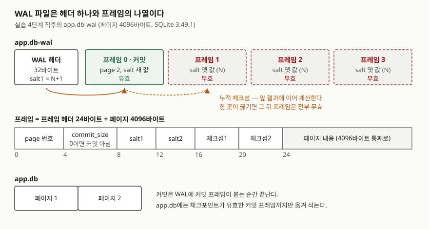

## 들어가며

데스크톱 앱이나 작은 서비스에서 SQLite를 쓰다 보면 백업을 만들 일이 생긴다. 가장 흔한 방법은 앱이
도는 중에 `app.db` 파일 하나를 다른 곳에 복사하는 것이다. 그런데 복사본을 열어 보면 방금 저장한 데이터가
없다. 옆에 있던 `app.db-wal` 파일은 임시 파일처럼 보여서 빼놓았기 때문이다. 이걸 피하려고 매번 앱을 내리고
복사하는 사람도 있는데, 그러면 백업할 때마다 서비스가 멈춘다. 둘 다 "커밋한 데이터가 어느 파일에 먼저
들어가는가"를 모르고 고른 방법이다. 이 글의 실습에서도 db 파일만 복사하자 마지막 커밋이 통째로 빠졌다.

## 개념

**WAL**(Write-Ahead Log, 선행 기록 로그)은 데이터 파일을 고치기 전에 바뀐 내용을 별도 로그 파일에 먼저
쓰는 방식이다. SQLite 문서는 원래 내용은 데이터 파일에 그대로 두고 변경분을 WAL 파일 끝에 덧붙이며,
**커밋을 뜻하는 레코드가 WAL에 붙는 순간 커밋이 끝난다**고 적는다. 데이터 파일은 커밋 시점에 손대지 않는다.

WAL의 내용을 데이터 파일로 옮겨 적는 작업은 **체크포인트**라고 부른다. SQLite는 기본적으로 WAL이
1,000페이지 이상이 되는 커밋에서, 그리고 마지막 연결이 닫힐 때 체크포인트를 돌린다.

롤백 저널 방식은 반대로 원래 내용을 저널에 복사해 두고 데이터 파일을 직접 고친다. WAL은 데이터 파일을
나중에 고치므로, 커밋된 최신 값이 한동안 **WAL에만** 존재한다. 들어가며의 백업 문제는 여기서 생긴다.

## 구조



> **출처**: 헤더·프레임 헤더 필드와 프레임 유효 조건은 [SQLite Database File Format §4.1 WAL File Format](https://www.sqlite.org/fileformat2.html#wal_file_format),
> 체크섬 계산은 [§4.2 Checksum Algorithm](https://www.sqlite.org/fileformat2.html#checksum_algorithm),
> salt가 바뀌어 옛 프레임이 무효가 되는 규칙은 [§4.4 WAL Reset](https://www.sqlite.org/fileformat2.html#wal_reset)을 따랐다.
> 프레임 4개의 상태는 이 글의 실습 4단계 실행 결과다.

## 동작 원리

WAL 파일은 32바이트 헤더 뒤에 **프레임**이 이어 붙은 구조다. 프레임 하나는 24바이트 프레임 헤더와
페이지 한 장(이 실습에서는 4,096바이트)으로 이뤄진다. 행 하나를 바꿔도 그 행이 든 **페이지 전체**가
프레임으로 붙는다.

프레임 헤더의 두 번째 칸(`commit_size`)이 0이 아니면 **커밋 프레임**이다. 트랜잭션이 페이지 세 장을
고쳤다면 프레임 세 개가 붙고, 마지막 하나만 커밋 프레임이 된다. 명세는 프레임이 유효하려면 두 조건을
모두 만족해야 한다고 적는다.

1. 프레임의 salt1·salt2가 WAL 헤더의 값과 같다
2. 프레임의 체크섬이 WAL 헤더 앞 24바이트부터 이 프레임까지 **이어서** 계산한 값과 같다

체크섬은 앞 결과를 시작값으로 삼아 누적하므로 중간 프레임 하나가 깨지면 그 뒤는 전부 무효가 된다.
연결이 WAL을 읽을 때 마지막 유효 커밋 프레임까지만 인정하므로, 쓰다 만 트랜잭션이나 일부만 디스크에
닿은 트랜잭션은 통째로 없던 일이 된다. 이것이 WAL이 먼저 쓰이는 이유다. 데이터 파일을 직접 고치다
중간에 끊기면 페이지가 반쯤 바뀐 채 남지만, WAL에 덧붙이다 끊기면 체크섬이 맞지 않는 꼬리만 남고
데이터 파일은 멀쩡하다.

체크포인트가 끝까지 돌고 나면 다음 쓰기는 WAL을 **처음부터 덮어쓴다.** 이때 salt1은 1 늘고 salt2는 새
난수가 된다. 파일 뒤쪽에 남은 옛 프레임은 salt가 달라 무효로 처리되고 다시 옮겨지지 않는다.

## 실습 예제

임시 폴더에 WAL 모드 DB를 만들고 자동 체크포인트를 끈 뒤, 커밋마다 두 파일을 열어 표식 문자열
(`MARK-A`·`MARK-B`·`MARK-C`)이 어느 쪽에 있는지 찾았다. WAL은 명세대로 직접 해석하고 체크섬도 직접 계산했다.
전체 소스: [`code/wal_frames.py`](code/wal_frames.py), 실행 기록: [`code/output.txt`](code/output.txt)

```python
def wal_checksum(data: bytes, s0: int, s1: int, endian: str) -> tuple[int, int]:
    # 명세의 checksum 알고리즘: 32비트 정수 두 개씩 묶어 누적한다
    words = struct.unpack(f"{endian}{len(data) // 4}I", data)
    for i in range(0, len(words), 2):
        s0 = (s0 + words[i] + s1) & 0xFFFFFFFF
        s1 = (s1 + words[i + 1] + s0) & 0xFFFFFFFF
    return s0, s1
```

### 1. 커밋한 값은 WAL에만 있다

```text
journal_mode = wal
synchronous  = 2

[1 CREATE·INSERT 커밋 직후]
  db  파일   4096 바이트   wal 파일  12392 바이트
  MARK-A  db에 없음   wal에 있음

[1 WAL 프레임]
  헤더: magic=0x377f0682 version=3007000 page_size=4096 ckpt_seq=0 salt1=1046811536 헤더체크섬=일치
  frame | page | commit_size | salt | 유효 | 들어 있는 표식
      0 |    1 |           0 | 같음 | 예    | -
      1 |    2 |           2 | 같음 | 예    | -
      2 |    2 |           2 | 같음 | 예    | MARK-A
```

`INSERT`가 커밋됐는데 `MARK-A`는 db 파일에 없다. db 파일은 페이지 1장(4,096바이트)뿐이다.
`CREATE TABLE`이 프레임 0·1(스키마가 든 페이지 1과 새 테이블 페이지 2)을, `INSERT`가 프레임 2를 붙였다.
WAL 크기 12,392바이트는 헤더 32 + 프레임 3 × 4,120과 정확히 맞는다. 직접 계산한 체크섬도 세 프레임
모두 SQLite가 적은 값과 일치했다. magic이 `0x377f0682`이므로 명세대로 리틀 엔디언으로 계산했다.

### 2. 같은 페이지를 고치면 프레임이 하나 더 붙는다

```text
      2 |    2 |           2 | 같음 | 예    | MARK-A
      3 |    2 |           2 | 같음 | 예    | MARK-B
```

`MARK-A`를 `MARK-B`로 바꾸자 페이지 2가 프레임 3으로 **한 번 더** 붙었다. 프레임 2를 고치지 않는다.
WAL은 덧붙이기만 한다. 6바이트짜리 값 하나를 바꿨는데 WAL은 4,120바이트 늘었다.

### 3·4. 체크포인트와 WAL 리셋

```text
[3 체크포인트] busy=0 log=4 checkpointed=4
[3 체크포인트 직후]
  db  파일   8192 바이트   wal 파일  16512 바이트
  MARK-B  db에 있음   wal에 있음

[4 WAL 프레임]
  헤더: magic=0x377f0682 version=3007000 page_size=4096 ckpt_seq=1 salt1=1046811537 헤더체크섬=일치
  frame | page | commit_size | salt | 유효 | 들어 있는 표식
      0 |    2 |           2 | 같음 | 예    | MARK-B,MARK-C
      1 |    2 |           2 | 다름 | 아니오  | -
      2 |    2 |           2 | 다름 | 아니오  | MARK-A
      3 |    2 |           2 | 다름 | 아니오  | MARK-B
```

체크포인트는 프레임 4개를 옮겼고 db 파일이 8,192바이트로 늘었다. WAL 파일은 **줄지 않았다.**
다음 `INSERT`는 프레임 0 자리에 새로 쓰였고, 헤더의 `ckpt_seq`가 0→1, `salt1`이 1 늘었다.
프레임 1~3은 바이트로는 그대로 남아 있지만 salt가 달라 무효다.

### 5. 예상과 달랐던 결과 — 비정상 종료를 흉내 냈을 때

연결을 닫지 않은 채 파일을 복사해 "체크포인트 없이 프로세스가 사라진 상태"를 만들고 복사본을 열었다.

```text
마지막 유효 커밋 프레임 = 0, 뒤집을 바이트 오프셋 = 132

[5-A db 파일만 복사해 열면]
  [(1, 'MARK-B')]
[5-B db + wal 을 복사해 열면]
  [(1, 'MARK-B'), (2, 'MARK-C')]
[5-C 마지막 커밋 프레임의 1바이트를 뒤집으면]
  [(1, 'MARK-B')]
```

5-A가 들어가며의 백업 사고다. `MARK-C`는 WAL에만 있었으므로 db 파일만 복사하면 사라진다.
5-B처럼 WAL을 함께 두면, 복사본을 처음 연 연결이 WAL을 읽어 커밋을 되살린다(`-shm` 파일은 복사하지 않았다).
예상보다 깔끔했던 것은 5-C다. 페이지 내용 중 1바이트만 바꿨는데 에러 없이 `MARK-C` 행이 통째로 사라졌고,
그 앞 커밋인 `MARK-B`는 남았다. 체크섬이 맞지 않는 커밋 프레임은 "디스크에 다 닿지 못한 커밋"과
구별되지 않으므로 그 트랜잭션 전체를 버린 것이다.

```text
[6 TRUNCATE 체크포인트 후]
  db  파일   8192 바이트   wal 파일      0 바이트
```

## 실무에서 주의할 점

- **도는 중인 DB를 파일 복사로 백업하지 않는다.** db 파일만 복사하면 체크포인트 전 커밋이 빠지고(5-A),
  두 파일을 따로 복사하면 그 사이에 쓰기가 끼어 짝이 어긋날 수 있다. SQLite의 온라인 백업 API(파이썬은
  `Connection.backup()`)나 `VACUUM INTO`를 쓴다.
- **`-wal` 파일을 지우지 않는다.** 임시 파일처럼 보여도 커밋된 데이터를 담고 있다. 문서는 WAL을 안전하게
  없애는 방법이 DB를 열었다가 곧바로 닫는 것뿐이라고 적는다. 마지막 연결이 닫힐 때 체크포인트를 돌린 뒤
  지우기 때문이다.
- **`synchronous` 값에 따라 지속성이 달라진다.** 문서에 따르면 WAL 모드의 `FULL`(2)은 커밋마다 WAL을
  디스크에 동기화하고, `NORMAL`(1)은 이 동기화를 생략해 정전 뒤 마지막 커밋이 롤백될 수 있다. 일관성은 두 값 모두
  유지된다. 이 실습은 따로 설정하지 않았고 `PRAGMA synchronous`가 2를 돌려줬다.
- **WAL 파일 크기는 체크포인트 뒤에도 줄지 않는다.** 실습 3에서 16,512바이트가 그대로였다. 명세는
  파일을 늘리는 것보다 덮어쓰는 편이 대개 빠르다고 설명한다. 디스크 사용량을 줄여야 하면
  `wal_checkpoint(TRUNCATE)`를 쓴다(실습 6).
- **작은 수정도 페이지 단위로 쌓인다.** 6바이트짜리 값 수정이 4,120바이트 프레임이 됐다. 같은 행을 자주 고치는
  작업은 체크포인트 전까지 같은 페이지의 사본을 계속 붙인다. 읽기 트랜잭션이 체크포인트를 막아 WAL이
  커지는 경우는 [MVCC는 왜 읽기 잠금을 없앴고 무엇을 대가로 치르는가](../../2026-09-28-mvcc-wal-long-reader-cost/index.md)에서 측정했다.

## 정리

- WAL 모드의 커밋은 커밋 프레임이 WAL에 붙는 순간 끝나고, 데이터 파일은 체크포인트 때 고쳐진다.
- 프레임은 페이지 한 장 통째이고, 누적 체크섬과 salt가 맞는 커밋 프레임까지만 유효하다.
- 그래서 쓰다 끊긴 트랜잭션은 통째로 버려지고 데이터 파일은 반쯤 바뀐 채 남지 않는다.
- 커밋된 최신 값이 WAL에만 있을 수 있으므로 db 파일만 복사하는 백업은 커밋을 잃는다.

## 참고 자료

- [SQLite Database File Format §4.1 WAL File Format](https://www.sqlite.org/fileformat2.html#wal_file_format) — 헤더·프레임 헤더 필드, 유효 프레임 조건, 커밋 프레임
- [SQLite Database File Format §4.2 Checksum Algorithm](https://www.sqlite.org/fileformat2.html#checksum_algorithm)
- [SQLite Database File Format §4.3 Checkpoint Algorithm](https://www.sqlite.org/fileformat2.html#checkpoint_algorithm)
- [SQLite Database File Format §4.4 WAL Reset](https://www.sqlite.org/fileformat2.html#wal_reset) — salt 변경, WAL을 줄이지 않는 이유
- [SQLite — Write-Ahead Logging: How WAL Works](https://www.sqlite.org/wal.html#how_wal_works)
- [SQLite — Write-Ahead Logging: Automatic Checkpoint](https://www.sqlite.org/wal.html#automatic_checkpoint) — 기본 1,000페이지
- [SQLite — Write-Ahead Logging: The WAL File](https://www.sqlite.org/wal.html#the_wal_file) — 마지막 연결이 닫힐 때의 정리, WAL을 안전하게 없애는 법
- [SQLite — PRAGMA synchronous](https://www.sqlite.org/pragma.html#pragma_synchronous), [PRAGMA wal_checkpoint](https://www.sqlite.org/pragma.html#pragma_wal_checkpoint)
- [SQLite — Online Backup API](https://www.sqlite.org/backup.html), [VACUUM INTO](https://www.sqlite.org/lang_vacuum.html#vacuuminto)
