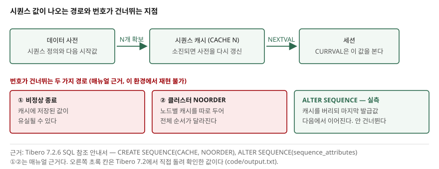

> **실행 검증 없음.** 이 글은 Tibero 7.2.6 공개 매뉴얼을 근거로 문법과 동작을 정리한
> 것이다. 작성 환경에 `tbsql`이 없어 예제를 실행하지 않았으므로 **출력이나 측정값은
> 싣지 않는다.** 근거를 찾지 못한 동작은 쓰지 않고, 매뉴얼이 명시하지 않은 항목은
> 그렇다고 밝혔다.

## 들어가며

주문 번호나 전표 번호에 쓸 순번이 필요해 시퀀스를 하나 만든다. 잘 돌아간다. 그러다
어느 날 운영에서 문의가 온다. 전표 번호가 1041에서 1140으로 건너뛰었다는 것이다.
누락된 99개가 어디로 갔는지 확인해 달라는 요청이 붙는다.

이때 대개 로그를 뒤지고 애플리케이션 코드에서 번호를 버리는 지점을 찾기 시작한다.
그런데 시퀀스는 **번호가 비는 것을 막아 주는 객체가 아니다.** 유일한 값을 빠르게
발급하는 것이 목적이고, 연속성은 애초에 보장 대상이 아니다. 어디서 비는지는 코드가
아니라 시퀀스 속성과 인스턴스 상태에 적혀 있다.

이 글은 Tibero 7의 시퀀스 속성을 기본값까지 정리하고, 번호가 건너뛰는 경로를
매뉴얼에 적힌 것만 골라 세 가지로 묶는다.

## 개념

시퀀스는 유일한 연속 값을 만드는 스키마 객체다. 주로 기본 키나 유일 키를 채울 때 쓴다.
값은 두 의사 컬럼으로 꺼낸다.

| 의사 컬럼 | 동작 |
|---|---|
| `NEXTVAL` | 시퀀스 값을 증가시키고 증가된 값을 반환 |
| `CURRVAL` | 현재 세션에서 마지막으로 조회한 `NEXTVAL` 값을 반환 |

`CURRVAL`을 쓰려면 같은 세션에서 `NEXTVAL`을 최소 한 번 호출해야 한다. 이름은 최대
30자이고, **테이블과 같은 네임스페이스를 쓴다.** 같은 스키마의 테이블·동의어·PSM 객체와
이름이 겹치면 생성되지 않는다.

주의할 점이 하나 더 있다. 의사 컬럼을 쓸 수 있는 자리가 정해져 있다.

- 쓸 수 있는 곳: `SELECT` 리스트, `INSERT`의 `VALUES` 절, `INSERT`의 부질의 `SELECT`
  리스트, `UPDATE`의 `SET` 절
- 쓸 수 없는 곳: 부질의 내부, 뷰 내부, `DISTINCT`가 있는 `SELECT`, `GROUP BY`나
  `ORDER BY`가 있는 `SELECT`, 집합 연산자로 연결된 `SELECT`, `WHERE` 절,
  `CREATE TABLE`/`ALTER TABLE`의 `DEFAULT` 값, `CHECK` 제약 조건

마지막 항목이 실무에서 자주 걸린다. **컬럼 기본값으로 시퀀스를 걸 수 없다.** 순번을
자동으로 채우려면 `INSERT` 문이나 트리거에서 `NEXTVAL`을 직접 써야 한다.

## 구조



> **구조 근거**: [Tibero 7.2.6 SQL 참조 안내서 — CREATE SEQUENCE](https://docs.tibero.com/tibero-manuals/7.2.6.manuals/sql-reference-guide/data-definition-language/create-sequence.md)
> (`CACHE`는 지정한 개수만큼 값을 캐시에 저장하고 모두 사용하면 그 수만큼 다시 가져오며
> 그때마다 데이터 사전을 갱신한다는 점, 비정상 종료 시 캐시에 저장된 값이 유실될 수 있다는 점,
> `NOORDER`가 노드별 캐시를 유지한다는 점),
> [ALTER SEQUENCE](https://docs.tibero.com/tibero-manuals/7.2.6.manuals/sql-reference-guide/data-definition-language/alter-sequence.md)
> (`ALTER SEQUENCE`가 캐시에 존재하던 값을 무효화해 일부 값이 누락될 수 있다는 점).
> 캐시의 내부 자료구조나 갱신 시점의 락 동작은 매뉴얼에 근거가 없어 그리지 않았다.

`CACHE N`을 주면 데이터 사전에서 N개를 미리 확보해 두고, 그 안에서 `NEXTVAL`을 처리한다.
N개를 다 쓰면 다시 N개를 가져오며 그때 데이터 사전을 갱신한다. 그래서 `NOCACHE`보다
데이터 사전 갱신 횟수가 줄어 성능에 유리하다. `NOCACHE`는 값을 요청할 때마다 갱신한다.

성능과 연속성이 여기서 맞바꿔진다. 캐시에 확보해 둔 N개는 **아직 아무도 쓰지 않았지만
이미 데이터 사전상으로는 발급된 값**이다. 그 상태에서 인스턴스가 비정상 종료하면
남아 있던 값은 유실될 수 있다. `CACHE 100`이면 최대 99개가 빈다.

## 동작 원리

속성과 기본값을 정리하면 이렇다. 생략했을 때 무엇이 되는지가 실무에서 더 중요하다.

| 속성 | 생략했을 때 |
|---|---|
| `INCREMENT BY` | `1`. 양수면 증가, 음수면 감소 |
| `START WITH` | 증가 값이 양수면 `MINVALUE`, 음수면 `MAXVALUE` |
| `MAXVALUE` | `NOMAXVALUE`와 같다. 증가 값이 양수면 `INT64_MAX`, 음수면 `-1` |
| `MINVALUE` | `NOMINVALUE`와 같다. 증가 값이 양수면 `1`, 음수면 `INT64_MIN` |
| `CYCLE` / `NOCYCLE` | `NOCYCLE`. 한계에 닿으면 더 이상 값을 만들지 않는다 |
| `ORDER` / `NOORDER` | `NOORDER`. `ORDER`는 클러스터 환경에서만 지정할 수 있다 |
| `CACHE` / `NOCACHE` | **매뉴얼에 기본 개수가 명시되어 있지 않다** |

마지막 줄을 그대로 적은 이유가 있다. `CACHE`를 생략했을 때 몇 개가 잡히는지는
Tibero 7.2.6 SQL 참조 안내서의 `CREATE SEQUENCE` 항목에 나오지 않는다. 다른 DB의
기본값을 가져와 추정하지 말고, 쓰는 인스턴스에서 `user_sequences`를 조회해 확인하는 편이 맞다.
시퀀스 정의는 `USER_SEQUENCES`, `ALL_SEQUENCES`, `DBA_SEQUENCES` 세 정적 뷰로 볼 수 있다.

`INCREMENT BY`에는 제약이 하나 붙는다. `MAXVALUE - MINVALUE`보다 클 수 없다.

값이 증가하는 단위도 행이다. 매뉴얼은 시퀀스 값을 증가시키는 행을 다섯 가지로 든다.
최상위 `SELECT`가 반환하는 행, `INSERT ... SELECT`에서 선택된 행,
`CREATE TABLE ... AS SELECT`에서 선택된 행, `UPDATE`가 갱신하는 각 행,
`VALUES` 절을 포함한 `INSERT`가 삽입하는 행이다. 한 행에서 `NEXTVAL`이 여러 번 나와도
**증가는 한 번**이고, `NEXTVAL`과 `CURRVAL`이 함께 나오면 같은 값을 공유한다.

### 번호가 건너뛰는 세 가지 경로

1. **비정상 종료.** 캐시에 저장된 값이 유실될 수 있다. `CACHE N`이면 최대 N-1개가 빈다.
2. **`ALTER SEQUENCE`.** 변경 사항은 앞으로 생성될 번호에만 적용되고, 캐시를 쓰는
   경우 **캐시에 존재하던 값을 무효화하기 때문에** 일부 값이 누락될 수 있다.
   증가값을 바꾸려고 `ALTER SEQUENCE` 한 번 돌린 것이 번호 구멍의 원인일 수 있다.
3. **클러스터 환경의 `NOORDER`.** 노드별로 시퀀스 캐시를 유지하므로 각 노드 안에서는
   순서가 지켜지지만 **전체 노드 기준 순서는 달라진다.** 순서를 맞춰야 하면 `ORDER`를
   지정한다. 다만 `ORDER`는 노드 간 발급 순서를 유지하는 옵션이므로 캐시로 얻던 이점을
   포기하는 선택이 된다.

## 실습 예제

전체 스크립트: [`code/sequence_examples.sql`](code/sequence_examples.sql)
(`tbsql <사용자>/<비밀번호> @sequence_examples.sql`)

속성을 모두 지정한 형태는 이렇게 쓴다.

```sql
CREATE SEQUENCE invoice_seq
    START WITH 1000
    INCREMENT BY 1
    MINVALUE 1000
    MAXVALUE 9999999999
    NOCYCLE
    CACHE 100
    NOORDER;
```

감소 시퀀스는 `START WITH`를 생략하면 `MAXVALUE`에서 시작한다는 점만 기억하면 된다.

```sql
CREATE SEQUENCE countdown_seq INCREMENT BY -1 MAXVALUE 1000 MINVALUE 1 NOCYCLE;
```

시작값으로 되돌릴 때는 시퀀스를 지우고 다시 만들 필요가 없다. `RESTART`가 있다.

```sql
ALTER SEQUENCE invoice_seq RESTART;
ALTER SEQUENCE invoice_seq RESTART START WITH 5000;
```

`START WITH` 자체는 `ALTER SEQUENCE`로 바꿀 수 없다. 시작값을 특정 값으로 옮기려면
위처럼 `RESTART START WITH`를 쓴다.

**이 절의 예제에는 출력이 없다.** 실행 검증을 하지 않았으므로 결과를 싣지 않는다.
직접 돌려 확인할 것.

## 실무에서 주의할 점

- **연속성이 필요하면 시퀀스를 쓰지 않는다.** 세금계산서 번호처럼 빈 번호가 문제가 되는
  요건이라면 시퀀스가 맞는 도구가 아니다. 위 세 경로 중 하나라도 발생하면 구멍이 생긴다.
- **`CACHE` 개수는 발급 속도와 최대 누락 개수를 동시에 정하는 값이다.** 크게 잡으면
  데이터 사전 갱신이 줄지만 비정상 종료 시 잃는 번호도 그만큼 늘어난다.
- **운영 중 `ALTER SEQUENCE`는 번호 구멍을 만든다.** 캐시를 쓰는 시퀀스라면 변경 자체가
  캐시를 무효화한다. 점검 시간에 하고, 변경 전후 값을 기록해 둔다.
- **컬럼 `DEFAULT`에 `NEXTVAL`을 쓸 수 없다.** 이식할 때 여기서 막힌다. `INSERT` 문이나
  트리거에서 명시적으로 호출하는 구조로 짠다.
- **`CURRVAL`은 세션에 묶인다.** 커넥션 풀을 쓰는 애플리케이션에서 `NEXTVAL`과 `CURRVAL`을
  다른 요청에 나눠 호출하면 같은 세션이라는 보장이 없다.
- **`NOCYCLE` 시퀀스는 한계에 닿으면 멈춘다.** `MAXVALUE`를 생략해 `INT64_MAX`로 두면
  현실적으로 문제가 없지만, 좁게 잡은 시퀀스는 소진 시점을 감시해야 한다.

## 정리

- 시퀀스는 유일한 값을 빠르게 주는 객체다. **번호의 연속성은 보장 대상이 아니다.**
- 매뉴얼 기준 생략 기본값은 `INCREMENT BY 1`, `NOCYCLE`, `NOORDER`다. 캐시 기본 개수는
  명시되어 있지 않으므로 인스턴스에서 직접 확인한다.
- 번호가 건너뛰는 경로는 매뉴얼 근거로 세 가지다. 비정상 종료, `ALTER SEQUENCE`,
  클러스터의 `NOORDER`.
- `NEXTVAL`은 쓸 수 있는 자리가 정해져 있다. 컬럼 `DEFAULT`와 `WHERE` 절에는 쓸 수 없다.
- `CACHE` 값을 정하는 것은 성능과 최대 누락 개수 사이의 선택이다. 요건부터 확인한다.

## 참고 자료

- [Tibero 7.2.6 SQL 참조 안내서 — CREATE SEQUENCE](https://docs.tibero.com/tibero-manuals/7.2.6.manuals/sql-reference-guide/data-definition-language/create-sequence.md)
- [Tibero 7.2.6 SQL 참조 안내서 — ALTER SEQUENCE](https://docs.tibero.com/tibero-manuals/7.2.6.manuals/sql-reference-guide/data-definition-language/alter-sequence.md)
- [Tibero 7.2.6 SQL 참조 안내서 — DROP SEQUENCE](https://docs.tibero.com/tibero-manuals/7.2.6.manuals/sql-reference-guide/data-definition-language/drop-sequence.md)
- [Tibero 7.2.6 SQL 참조 안내서 — 스키마 객체 (시퀀스)](https://docs.tibero.com/tibero-manuals/7.2.6.manuals/sql-reference-guide/sql-elements/schema-objects.md)
- [Tibero 7.2.6 참조 안내서 — 정적 뷰](https://docs.tibero.com/tibero-manuals/7.2.6.manuals/reference-guide/static-views.md)
