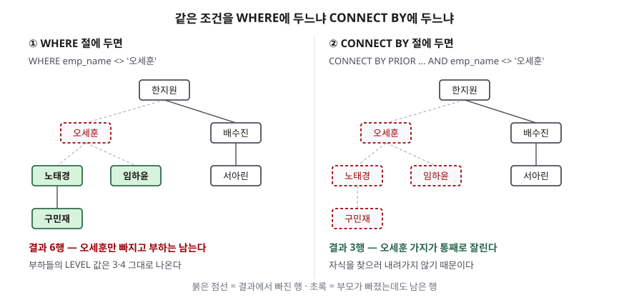

> **실행 검증 완료.** 이 글의 출력은 **Tibero 7.2** 인스턴스에서 실제로 돌려 받은 것이다.
> 버전은 `SELECT * FROM v$version`으로 확인했고 `PRODUCT_MAJOR 7`, `PRODUCT_MINOR 2`다.
> 인용한 매뉴얼은 **7.2.6판**으로 인스턴스 버전과 다르니 섞어 읽지 않도록 주의한다.
>
> 검증은 빈 스키마에 예제 객체 두 개만 만들어 돌리고 끝나면 전부 지우는 방식으로 했다.
> 그 과정에서 매뉴얼에 적힌 제약 하나가 **실제 동작과 달랐다.** 본문에 표시해 뒀다.

## 들어가며

조직도를 화면에 그려야 한다. 테이블에는 `emp_id`와 `mgr_id` 두 컬럼뿐이고, 누가
누구 밑인지는 이 두 값이 서로를 가리키는 방식으로만 적혀 있다.

이때 흔히 택하는 방법은 애플리케이션에서 도는 것이다. 먼저 최상위를 한 번 조회하고,
그 결과의 `emp_id`를 모아 다시 조회하고, 또 그 결과로 다시 조회한다. 깊이가 4단계면
왕복이 4번, 6단계면 6번이다. 깊이를 미리 알 수 없으니 "더 이상 안 나올 때까지"
돌아야 하고, 그 사이 누가 부서를 옮기면 절반쯤 어긋난 트리가 그려진다.

계층 질의는 이 왕복을 **한 문장으로 줄인다.** 다만 조건을 어디에 적느냐에 따라
결과가 조용히 달라지는 자리가 있다.

## 개념

계층 질의는 행 사이의 상하 관계를 따라가며 검색하는 SELECT다. 두 절로 이뤄진다.

| 절 | 역할 |
|---|---|
| `START WITH` | 어느 행에서 출발할지(루트). 생략하면 **모든 행이 루트가 된다** |
| `CONNECT BY` | 부모와 자식을 잇는 조건. `PRIOR` 연산자가 여기에만 쓰인다 |

`PRIOR`는 **붙은 쪽이 부모**라는 표시다. `PRIOR emp_id = mgr_id`는 "앞 단계 행의
`emp_id`와 같은 `mgr_id`를 가진 행이 자식"이라는 뜻이라 위에서 아래로 내려간다.
반대로 `PRIOR mgr_id = emp_id`로 적으면 같은 테이블을 잎에서 뿌리로 거슬러 올라간다.

값을 꺼내는 의사 컬럼은 네 가지다.

| 의사 컬럼 | 돌려주는 값 |
|---|---|
| `LEVEL` | 깊이. 루트가 1이고 내려갈수록 1씩 는다 |
| `CONNECT_BY_ROOT` | 그 행이 속한 트리의 루트 행 값 |
| `CONNECT_BY_ISLEAF` | 자식이 없으면 1, 있으면 0 |
| `SYS_CONNECT_BY_PATH` | 루트부터 그 행까지의 경로를 구분자로 이어 붙인 문자열 |

## 구조



> **출처**: [Tibero 7.2.6 SQL 참조 안내서 — 계층 질의](https://docs.tibero.com/tibero-manuals/7.2.6.manuals/sql-reference-guide/sql-queries/hierarchical-queries.md)의
> "계층 질의의 조건식 > CONNECT BY 절과 WHERE 절의 혼합"이 근거다. `WHERE` 절의 조건은
> `CONNECT BY`가 상하 관계를 정한 **뒤에** 적용되므로, 어떤 행이 `WHERE`로 제거되어도
> 그 하부 행은 결과에 남을 수 있다고 적는다. 도식의 6행·3행은 아래 실습의 실제 출력이다.

## 동작 원리

매뉴얼은 계층 질의를 재귀적으로, **깊이 우선(Depth-First)** 순서로 실행한다고 적는다.
루트 하나를 잡고 그 자식을 찾고, 그 자식의 자식을 다시 찾는 식으로 더 나올 것이 없을 때까지
내려간 뒤 형제로 넘어간다. 실행 순서가 이렇다는 점이 조건절의 차이를 만든다.

- `CONNECT BY`의 조건은 **내려갈지 말지를 결정하는 자리**에서 평가된다.
  거짓이면 그 행을 자식으로 삼지 않으므로 그 아래로 아예 내려가지 않는다.
- `WHERE`의 조건은 **다 내려간 뒤** 결과 행을 걸러 내는 자리에서 평가된다.
  부모가 걸러져도 자식은 이미 트리에 편입된 뒤라 그대로 남는다.

그래서 같은 조건을 어디에 쓰느냐가 "그 사람만 빼기"와 "그 조직 통째로 빼기"를 가른다.

## 실습 예제

7명짜리 조직도와, 셋이 고리를 이루는 표를 만들어 돌렸다.
전체 소스: [`code/connect_by_examples.sql`](code/connect_by_examples.sql)

```sql
SELECT LEVEL, emp_name, CONNECT_BY_ROOT emp_name AS root_name,
       CONNECT_BY_ISLEAF AS is_leaf,
       SYS_CONNECT_BY_PATH(emp_name, '/') AS path
  FROM emp_org
 START WITH mgr_id IS NULL
 CONNECT BY PRIOR emp_id = mgr_id
 ORDER SIBLINGS BY emp_id;
```

```text
     LEVEL EMP_NAME   ROOT_NAME     IS_LEAF PATH
---------- ---------- ---------- ---------- ----------------------------------
         1 한지원     한지원              0 /한지원
         2 오세훈     한지원              0 /한지원/오세훈
         3 노태경     한지원              0 /한지원/오세훈/노태경
         4 구민재     한지원              1 /한지원/오세훈/노태경/구민재
         3 임하윤     한지원              1 /한지원/오세훈/임하윤
         2 배수진     한지원              0 /한지원/배수진
         3 서아린     한지원              1 /한지원/배수진/서아린
```

`ORDER SIBLINGS BY`를 쓴 자리에 그냥 `ORDER BY emp_name`을 넣으면 `LEVEL`이
`4, 3, 2, 3, 2, 3, 1` 순으로 흩어진다. 계층 순서를 무시하고 전체를 다시 줄 세우기 때문이다.

### 조건을 어디에 두느냐

`WHERE`에 두면 오세훈만 빠지고 그 아래 셋은 남는다. **남은 행의 `LEVEL`이 3과 4 그대로**인
것이 눈에 띈다. 부모가 사라졌는데도 깊이는 재계산되지 않는다.

```text
     LEVEL EMP_NAME              LEVEL EMP_NAME
---------- ----------       ---------- ----------
         1 한지원                    1 한지원
         3 노태경                    2 배수진
         4 구민재                    3 서아린
         3 임하윤
         2 배수진           CONNECT BY 에 둔 경우 — 3행
         3 서아린
WHERE 에 둔 경우 — 6행
```

### 순환 참조 — LEVEL 조건의 자리가 결과를 가른다

세 행이 고리를 이루는 표에서 그냥 내려가면 순회가 멈추지 않는다.

```text
TBR-10064: Loop detected during CONNECT BY operation.
```

`NOCYCLE`을 붙이면 고리를 닫는 지점에서 멈추고, `CONNECT_BY_ISCYCLE`이 그 행을 가리킨다.
`NOCYCLE` 없이 `CONNECT_BY_ISCYCLE`만 쓰면 `TBR-8099`로 막힌다.

```text
     LEVEL     EMP_ID EMP_NAME     IS_CYCLE
---------- ---------- ---------- ----------
         1         10 문가영              0
         2         11 표진우              0
         3         12 연수아              1
```

여기서 앞 절의 이야기가 측정으로 확인된다. 같은 순환 표에 깊이 제한을 걸어 봤다.

| 조건을 둔 자리 | 결과 |
|---|---|
| `CONNECT BY PRIOR emp_id = mgr_id AND LEVEL <= 3` | 3행이 정상 반환 |
| `WHERE LEVEL <= 3` | `TBR-10064` |

**같은 `LEVEL <= 3`인데 한쪽은 답이 나오고 한쪽은 에러다.** `CONNECT BY`에 둔 조건은
내려가는 것을 멈추므로 고리를 돌기 전에 끝나고, `WHERE`에 둔 조건은 다 내려간 다음에야
적용되는데 그 "다 내려가는" 일이 끝나지 않기 때문이다. 앞의 6행/3행 차이가
성능 문제가 아니라 **작업 자체가 다른 것**임을 보여주는 사례다.

### 매뉴얼과 달랐던 것 — PRIOR 개수

7.2.6 매뉴얼은 `CONNECT BY` 조건식에 `PRIOR`를 포함한 단순 조건식이 반드시 하나만
있어야 하며 0개이거나 2개 이상이면 에러를 반환한다고 적는다. 7.2 인스턴스에서는
**두 경우 모두 에러가 나지 않았다.**

- `PRIOR`가 0개(`CONNECT BY emp_id = mgr_id`)면 에러 대신 **루트 1행만** 돌아온다.
  자식을 잇는 조건이 없으니 한 단계도 내려가지 않은 결과다.
- `PRIOR`가 2개(`PRIOR emp_id = mgr_id AND PRIOR dept_name = dept_name`)면
  두 조건이 모두 적용된 4행이 돌아왔다. 부서가 같은 자식만 따라 내려간 결과다.

에러로 막히지 않는다는 점이 오히려 위험하다. `PRIOR`를 빠뜨린 질의는 구문 오류 없이
조용히 1행을 돌려주므로, "데이터가 없나 보다"로 넘어가기 쉽다.

> 이 절의 출력은 [`code/output.txt`](code/output.txt)에 수행 기록으로 남아 있다.

## 실무에서 주의할 점

- **조건의 자리를 먼저 정한다.** "이 사람만 목록에서 빼기"는 `WHERE`, "이 조직 아래를
  통째로 빼기"는 `CONNECT BY`다. 잘못 두면 에러 없이 결과만 달라진다.
- **`WHERE`로 거른 결과의 `LEVEL`을 화면 들여쓰기에 그대로 쓰지 않는다.**
  부모가 빠진 행도 원래 깊이를 유지하므로 들여쓰기가 뜬다.
- **깊이 제한은 `CONNECT BY`에 건다.** `WHERE LEVEL <= n`은 전부 순회한 뒤에 걸러서
  순환이 있으면 `TBR-10064`까지 간다.
- **`START WITH`를 빠뜨리면 조용히 결과가 부풀어 오른다.** 7행짜리 표에서 18행이 나왔다.
  큰 테이블에서는 사고가 된다.
- **순환 가능성이 있으면 `NOCYCLE`을 기본으로 둔다.** 조직도는 보통 순환이 없다고
  가정하지만, 대리 결재나 임시 조직처럼 서로를 가리키는 데이터가 한 건만 들어가도 멈춘다.
- **`ORDER BY`와 `ORDER SIBLINGS BY`를 구별한다.** 계층 질의에서 일반 `ORDER BY`는
  상하 관계를 무시하고 정렬하므로 트리 출력이 무너진다.

## 정리

- 계층 질의는 `START WITH`(출발점)와 `CONNECT BY`(잇는 조건) 두 절로 이뤄지고,
  `PRIOR`가 붙은 쪽이 부모다.
- 의사 컬럼은 `LEVEL`, `CONNECT_BY_ROOT`, `CONNECT_BY_ISLEAF`, `SYS_CONNECT_BY_PATH` 네 가지다.
- 같은 조건도 `WHERE`에 두면 그 행만, `CONNECT BY`에 두면 그 아래 가지 전체가 빠진다.
  `CONNECT BY`가 먼저 상하 관계를 정하고 `WHERE`가 나중에 거르기 때문이다.
- 순환 표에서 `LEVEL <= 3`을 `CONNECT BY`에 두면 3행이 나오고 `WHERE`에 두면 `TBR-10064`다.
- 매뉴얼이 에러라고 적은 `PRIOR` 0개·2개는 7.2 인스턴스에서 에러 없이 각각 1행·4행을 돌려줬다.

## 참고 자료

- [Tibero 7.2.6 SQL 참조 안내서 — 계층 질의](https://docs.tibero.com/tibero-manuals/7.2.6.manuals/sql-reference-guide/sql-queries/hierarchical-queries.md)
- [Tibero 7.2.6 SQL 참조 안내서 — SELECT](https://docs.tibero.com/tibero-manuals/7.2.6.manuals/sql-reference-guide/sql-queries/select.md)
- [Tibero 7.2.6 에러 참조 안내서 — chapter 8000.dml.error (8099)](https://docs.tibero.com/tibero-manuals/7.2.6.manuals/error-reference-guide/chapter-8000.dml.error.md)
- [Tibero 7.2.6 에러 참조 안내서 — chapter 10000.exec.error (10064)](https://docs.tibero.com/tibero-manuals/7.2.6.manuals/error-reference-guide/chapter-10000.exec.error.md)
