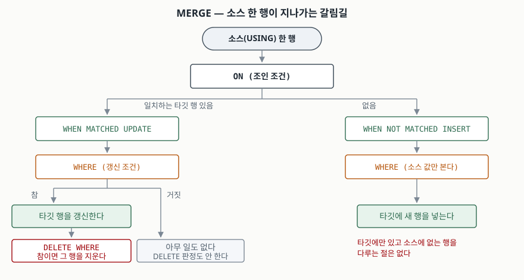

> **실행 검증 완료.** 이 글의 출력은 **Tibero 7.2** 인스턴스에서 실제로 돌려 받은 것이다.
> 버전은 `SELECT * FROM v$version`으로 확인했고 `PRODUCT_MAJOR 7`, `PRODUCT_MINOR 2`다.
> 인용한 매뉴얼은 **7.2.6판**이라 인스턴스 버전과 다르니 섞어 읽지 않도록 주의한다.
>
> 검증은 빈 스키마에 예제 테이블 두 개만 만들고 끝나면 전부 지우는 방식으로 했다.
> 마지막 `user_objects` 카운트가 0인 것까지 확인했다.

## 들어가며

외부 시스템에서 상품 피드가 하루 한 번 들어오는 배치를 맡는다. 들어온 상품이 이미 있으면
가격과 재고를 갱신하고, 없으면 새로 넣어야 한다. 처음 짤 때는 대개 이렇게 한다.
피드를 한 행씩 돌면서 `SELECT`로 있는지 보고, 있으면 `UPDATE`, 없으면 `INSERT`.

상품이 200개일 때는 아무 문제가 없다. 그런데 20만 개가 되면 **왕복이 60만 번**이다.
게다가 `SELECT`와 `UPDATE` 사이에 다른 세션이 같은 행을 넣으면 유니크 제약에 걸려
배치가 통째로 죽는다. 이 왕복과 틈을 한 문장으로 없애는 것이 `MERGE`다.

## 개념

`MERGE`는 **소스 집합을 타깃 테이블에 맞춰 넣고 고치는** 한 문장짜리 DML이다.
매뉴얼의 문법은 이렇다.

```sql
MERGE INTO [스키마.]테이블 [별칭]
USING {테이블 | 뷰 | 서브질의}
   ON (조인 조건)
 WHEN MATCHED THEN
      UPDATE SET 컬럼 = {식 | DEFAULT}
      [WHERE 조건]
      [DELETE WHERE 조건]
 WHEN NOT MATCHED THEN
      INSERT [(컬럼)] VALUES (식 | DEFAULT)
      [WHERE 조건]
```

`WHEN MATCHED`와 `WHEN NOT MATCHED`는 **둘 다 선택이다.** 하나만 써도 된다.
갱신만 하려면 `WHEN MATCHED`만, 없는 것만 넣으려면 `WHEN NOT MATCHED`만 쓴다.

`SELECT` 후 분기하는 방식과 다른 점은 **판정과 변경이 한 문장 안에서 끝난다**는 것이다.
그 사이에 끼어들 틈이 없으므로, 앞서 말한 유니크 제약 충돌이 구조적으로 사라진다.

## 구조



> **출처**: 절의 이름과 중첩 순서(`UPDATE SET ... WHERE ... DELETE WHERE`,
> `INSERT ... VALUES ... WHERE`)는
> [Tibero 7.2.6 SQL 참조 안내서 — MERGE](https://docs.tibero.com/tibero-manuals/7.2.6.manuals/sql-reference-guide/data-manipulation-language/merge.md)
> 의 구문 정의를 그대로 옮겼다. 같은 문서가 `DELETE WHERE`를 "갱신된 행 중 조건을 만족하는
> 행을 삭제"로, `INSERT`의 `WHERE`를 "소스 데이터의 값만 참조할 수 있다"로 적는다.
> 오른쪽 아래의 "타깃에만 있는 행을 다루는 절은 없다"는 아래 실습 마지막 예제에서
> `WHEN NOT MATCHED BY SOURCE`가 `TBR-8004`로 거부되는 것을 확인한 결과다.

## 동작 원리

타깃은 상품 마스터 4행, 소스는 피드 4행으로 잡았다.

| | 1 기계식 키보드 | 2 무선 마우스 | 3 모니터 암 | 4 노트북 거치대 | 5 USB-C 케이블 |
|---|---|---|---|---|---|
| **마스터** | 89000 / 12 | 32000 / 7 | 54000 / 0 | 21000 / 0 | — |
| **피드** | 95000 / 0 | 32000 / 7 | 49000 / 30 | — | 9000 / 100 |

가격과 재고를 함께 보낸 표다. 4번은 피드에 없고, 5번은 마스터에 없다.
전체 소스: [`code/merge_examples.sql`](code/merge_examples.sql)

### 기본형

```sql
MERGE INTO product_master t
USING product_feed s
   ON (t.product_id = s.product_id)
 WHEN MATCHED THEN
      UPDATE SET t.price = s.price, t.stock_qty = s.stock_qty
 WHEN NOT MATCHED THEN
      INSERT (product_id, product_name, price, stock_qty)
      VALUES (s.product_id, s.product_name, s.price, s.stock_qty);
```

```
4 rows merged.

PRODUCT_ID PRODUCT_NAME                                  PRICE  STOCK_QTY
---------- ---------------------------------------- ---------- ----------
         1 기계식 키보드                                 95000          0
         2 무선 마우스                                   32000          7
         3 모니터 암                                     49000         30
         4 노트북 거치대                                 21000          0
         5 USB-C 케이블                                   9000        100
```

갱신 3 + 삽입 1을 합쳐 `4 rows merged`다. **삽입과 갱신을 나눠 세지 않는다.**
배치 로그에 "몇 건 신규"를 남겨야 한다면 이 숫자로는 안 되고 따로 세야 한다.
4번은 피드에 없으므로 그대로 남는다.

### 한쪽 절만 쓰기

`WHEN MATCHED`만 남기면 `3 rows merged`로 5번이 들어오지 않고,
`WHEN NOT MATCHED`만 남기면 `1 row merged`로 5번만 들어오고 나머지는 원래 값 그대로다.

### UPDATE 에 WHERE 달기

`WHERE t.price <> s.price`를 붙이면 값이 실제로 바뀐 행만 건드린다.

```
2 rows merged.
```

2번은 가격이 같아 제외됐다. 안 바뀐 행까지 갱신하면 그만큼 리두가 쌓이고, 갱신 시각
컬럼이 있으면 바뀌지도 않은 행의 수정일이 매일 갱신된다. 이 한 줄이 그것을 막는다.

## 실습 예제 — DELETE WHERE 가 보는 값

여기가 이 글의 핵심이다. `DELETE WHERE t.stock_qty = 0`을 붙였다.

```sql
 WHEN MATCHED THEN
      UPDATE SET t.price = s.price, t.stock_qty = s.stock_qty
      DELETE WHERE t.stock_qty = 0
```

```
4 rows merged.

PRODUCT_ID PRODUCT_NAME                                  PRICE  STOCK_QTY
---------- ---------------------------------------- ---------- ----------
         2 무선 마우스                                   32000          7
         3 모니터 암                                     49000         30
         4 노트북 거치대                                 21000          0
         5 USB-C 케이블                                   9000        100
```

세 가지를 한 번에 보여 준다.

- **1번이 사라졌다.** 마스터의 재고는 12였는데 피드가 0을 보냈다.
  `DELETE WHERE`는 **갱신되고 난 뒤의 값**을 본다. 갱신 전 값이었다면 남았어야 한다.
- **3번은 남았다.** 마스터 재고가 0이었지만 피드가 30으로 올렸다. 역시 갱신 후 값 기준이다.
- **4번은 재고가 0인데도 남았다.** 피드에 없어 `WHEN MATCHED`에 걸리지 않았기 때문이다.
  `DELETE WHERE`는 **이번 MERGE가 갱신한 행에만** 걸린다.

`4 rows merged`에는 지워진 1번도 들어 있다. 갱신 뒤 삭제된 행이라 삭제 건수로 따로 세지 않는다.

### UPDATE 의 WHERE 에 걸러지면 DELETE 판정도 안 한다

앞의 두 조건절을 같이 쓰면 함정이 하나 더 생긴다. 피드에 4번을 **가격은 그대로, 재고 0**으로
추가한 뒤 돌렸다.

```sql
      UPDATE SET t.price = s.price, t.stock_qty = s.stock_qty
      WHERE t.price <> s.price
      DELETE WHERE t.stock_qty = 0
```

```
2 rows merged.

PRODUCT_ID PRODUCT_NAME                                  PRICE  STOCK_QTY
---------- ---------------------------------------- ---------- ----------
         2 무선 마우스                                   32000          7
         3 모니터 암                                     49000         30
         4 노트북 거치대                                 21000          0
```

4번은 이제 피드에도 있고 재고도 0인데 **지워지지 않았다.** 가격이 같아
`WHERE t.price <> s.price`에 걸러졌고, 갱신되지 않은 행은 `DELETE WHERE` 판정 자체를
받지 않기 때문이다. "재고 0이면 정리한다"는 의도로 짜면 **가격이 안 바뀐 품절 상품만
계속 남는다.** 두 조건절을 같이 쓸 때 가장 틀리기 쉬운 자리다.

### 막히는 두 가지

`ON` 절에 쓴 컬럼을 갱신하려 하면 파싱 단계에서 거부된다.

```
TBR-8101: Column used in the ON clause cannot be updated.
```

소스에 같은 키가 두 번 있으면 실행 중에 막힌다. 피드에 `product_id = 2`를 하나 더 넣고 돌렸다.

```
TBR-10021: Inconsistent set of rows in source tables.
```

타깃 한 행을 두 번 갱신할 수 없다는 제약에 걸린 것이다. 어느 값이 최종으로 남을지
정해지지 않으므로 DB가 임의로 고르는 대신 멈춘다. **소스를 집계로 묶어 키를 유일하게
만들면** 통과한다.

```sql
USING (SELECT product_id, MAX(price) AS price, MAX(stock_qty) AS stock_qty
         FROM product_feed GROUP BY product_id) s
```

`MAX`를 쓸지 최신 타임스탬프 행을 고를지는 업무 규칙이다. 다만 **중복을 어떻게 접을지는
반드시 명시해야 한다.** 명시하지 않으면 배치는 TBR-10021로 멈춘다.

### 타깃에만 있는 행은 다루지 못한다

"피드에 없어진 상품은 지운다"를 MERGE 안에서 해결하려 해 봤다.

```
TBR-8004: Syntax error.
at line 4, column 19 of null:
 WHEN NOT MATCHED BY SOURCE THEN
```

Tibero 7.2는 이 절을 지원하지 않는다. 타깃에만 있는 행을 정리하려면 별도 `DELETE` 문을
쓰거나, 피드에 삭제 표시 컬럼을 넣어 `DELETE WHERE`로 처리해야 한다.

> 이 절의 출력은 [`code/output.txt`](code/output.txt)에 수행 기록으로 남아 있다.

## 실무에서 주의할 점

- **`DELETE WHERE`의 조건은 갱신 후 값으로 읽힌다.** "원래 재고가 0이던 것을 지운다"를
  의도했다면 이 절로는 안 되고, 갱신 전에 따로 지워야 한다.
- **`UPDATE`의 `WHERE`와 `DELETE WHERE`를 같이 쓰면 사각지대가 생긴다.** 위에서 본
  4번처럼 "갱신 대상이 아니면서 삭제 조건은 만족하는" 행이 계속 남는다.
- **소스 중복은 설계 단계에서 접는다.** TBR-10021은 데이터가 늘어난 뒤 운영에서 처음
  터지는 경우가 많다. 피드 원본을 믿지 말고 `GROUP BY`나 윈도우 함수로 키를 유일하게 만든다.
- **`ON` 절 컬럼은 갱신 대상에서 뺀다.** 키를 바꿔야 하는 요구라면 MERGE가 아니라
  삭제 후 삽입이 맞는 작업이다.
- **병합 건수로 신규/갱신을 구분할 수 없다.** `rows merged`는 삽입·갱신·삭제된 행을
  합친 수다. 배치 리포트가 필요하면 별도 카운트 질의를 둔다.
- **타깃에만 있는 행 정리는 MERGE 밖의 일이다.** `WHEN NOT MATCHED BY SOURCE`가 없으므로
  전체 동기화를 한 문장으로 끝내려는 설계는 성립하지 않는다.

## 정리

- `MERGE`는 판정과 변경을 한 문장으로 끝내 왕복과 경합 구간을 함께 없앤다.
- `WHEN MATCHED`와 `WHEN NOT MATCHED`는 둘 다 선택이고, 하나만 써도 된다.
- `DELETE WHERE`는 **갱신된 행**에 대해 **갱신 후 값**으로 판정한다. 두 조건이 다 걸린다.
- `UPDATE`의 `WHERE`에 걸러진 행은 삭제 판정을 받지 않는다. 품절 정리 로직이 조용히 새는 자리다.
- 소스 키 중복은 `TBR-10021`, `ON` 절 컬럼 갱신은 `TBR-8101`로 막힌다.
- Tibero 7.2에는 `WHEN NOT MATCHED BY SOURCE`가 없다. 타깃 정리는 별도 문장으로 한다.

## 참고 자료

- [Tibero 7.2.6 SQL 참조 안내서 — MERGE](https://docs.tibero.com/tibero-manuals/7.2.6.manuals/sql-reference-guide/data-manipulation-language/merge.md)
- [Tibero 7.2.6 에러 참조 안내서 — chapter 8000.dml.error (8004, 8101)](https://docs.tibero.com/tibero-manuals/7.2.6.manuals/error-reference-guide/chapter-8000.dml.error.md)
- [Tibero 7.2.6 에러 참조 안내서 — chapter 10000.exec.error (10021)](https://docs.tibero.com/tibero-manuals/7.2.6.manuals/error-reference-guide/chapter-10000.exec.error.md)
