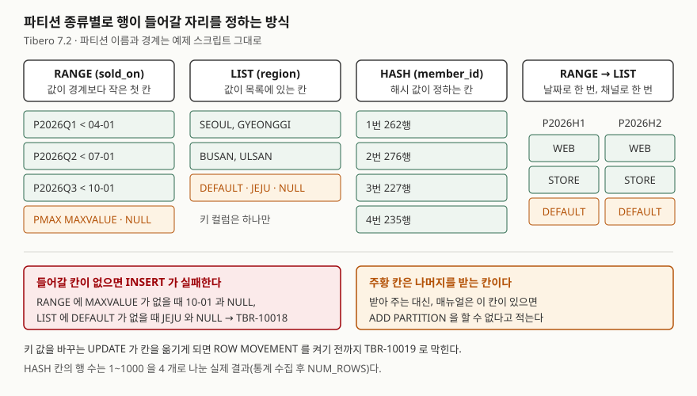
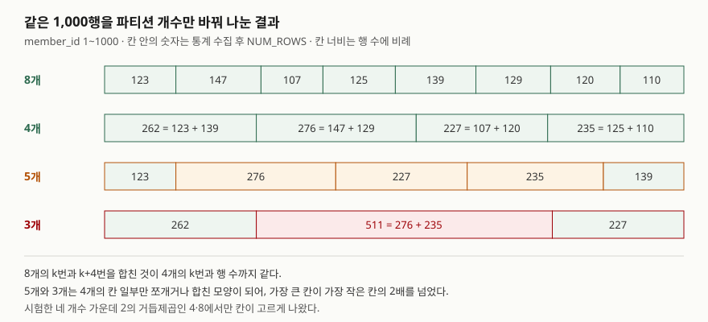

> **실행 검증 완료.** 이 글의 출력은 **Tibero 7.2** 인스턴스에서 실제로 돌려 받은 것이다.
> 버전은 `v$version`으로 확인했고 `PRODUCT_MAJOR 7`, `PRODUCT_MINOR 2`다.
> 인용한 매뉴얼은 **7.2.6판**이라 인스턴스 버전과 다르니 섞어 읽지 않도록 주의한다.
> 매뉴얼에만 근거하고 직접 돌리지 않은 문장은 그 자리에 "(매뉴얼 근거, 실행하지 않음)"을 붙였다.
>
> 검증은 빈 스키마에 예제 테이블만 만들고 끝나면 지우는 방식으로 했다.
> 시작과 끝의 `user_objects` 카운트가 둘 다 0인 것까지 확인했다.

## 들어가며

주문 테이블이 3억 행을 넘기자 "1년 지난 주문은 지워 달라"는 요청이 온다. 보통은
`DELETE ... WHERE ordered_on < ...`를 밤마다 쪼개 돌리는데, 몇천만 행을 지우는 동안 리두와
언두가 쌓이고, 지운 자리는 비어 있을 뿐 테이블 크기는 줄지 않는다. 이 테이블이 분기별
파티션이었다면 같은 일이 `ALTER TABLE ... DROP PARTITION` 한 문장으로 끝난다.
문제는 파티션을 **어떤 기준으로** 나누느냐다. 기준을 잘못 고르면 지울 때도, 조회할 때도
파티션이 아무 도움이 안 된다.

## 개념

Tibero 관리자 안내서는 파티션을 하나의 논리적 테이블을 여러 물리적 공간으로 나누는 기능으로
정의한다. 질의는 테이블 하나를 보지만 저장은 파티션마다 따로 된다. 그래서 파티션 하나를
지우거나 파티션 하나만 읽는 일이 가능해진다.

나누는 기준은 세 가지이고, 둘을 겹친 복합 파티션이 있다.

| 종류 | 행이 가는 곳 | 맞는 데이터 | 대표 작업 |
|---|---|---|---|
| **RANGE** | 값이 `VALUES LESS THAN` 경계보다 작은 첫 파티션 | 날짜·일련번호처럼 순서가 있고 계속 늘어나는 값 | 오래된 구간 삭제, 기간 조회 |
| **INTERVAL** | RANGE와 같다. 경계 밖 값이 오면 파티션을 자동으로 만든다 | RANGE와 같다. 새 구간을 미리 만들어 두기 번거로울 때 | 월별·일별 적재 |
| **LIST** | 값이 목록에 있는 파티션 | 지역·채널·상태처럼 값의 종류가 정해진 컬럼 | 값 단위 분리·삭제 |
| **HASH** | 해시 결과가 가리키는 파티션 | 회원번호처럼 순서에 의미가 없고 고르게 흩어야 하는 값 | 경합 분산 |
| **복합** | 한 기준으로 나눈 뒤 각 파티션을 다른 기준으로 다시 나눈다 | 두 컬럼 조건이 함께 자주 붙는 대용량 테이블 | 기간 × 채널 |

`CREATE TABLE` 참조에 따르면 복합 파티션은 RANGE·LIST·HASH 어느 쪽 아래에도 RANGE·LIST·HASH를
둘 수 있다. 관리자 안내서는 파티션을 최대 10,000개까지 만들 수 있다고 적는다.

## 구조



> **출처**: 종류별 정의와 복합 파티션의 조합은
> [Tibero 7.2.6 SQL 참조 안내서 — CREATE TABLE](https://docs.tibero.com/tibero-manuals/7.2.6.manuals/sql-reference-guide/data-definition-language/create-table.md)
> 의 파티션 절, `MAXVALUE` 파티션에 NULL이 들어간다는 것과 LIST의 `DEFAULT`는 같은 페이지를,
> `MAXVALUE`·`DEFAULT` 파티션이 있으면 `ADD PARTITION`을 할 수 없다는 것은
> [Tibero 7.2.6 SQL 참조 안내서 — ALTER TABLE](https://docs.tibero.com/tibero-manuals/7.2.6.manuals/sql-reference-guide/data-definition-language/alter-table.md)
> 을 따랐다. 파티션 이름·경계·행 수는 아래 실습의 실제 출력이다.

## 동작 원리

행을 넣을 때 엔진은 파티션 키 값으로 **들어갈 파티션을 먼저 정하고** 그 파티션에만 쓴다.
RANGE는 경계를 차례로 비교해 처음으로 "보다 작은" 곳, LIST는 값이 목록에 있는 곳이다.
**맞는 곳이 없으면 행을 버리지도, 아무 데나 넣지도 않고 실패시킨다.** 나머지를 받는
칸(`MAXVALUE`·`DEFAULT`)을 두느냐가 설계의 첫 결정이다.

조회할 때는 반대 방향으로 쓴다. `WHERE`에 파티션 키 조건이 있으면 조건에 맞을 수 없는
파티션을 읽지 않는다. 이것을 **파티션 프루닝**이라 부른다. 키에 함수를 씌우면 엔진이 경계와
비교할 수 없어 프루닝이 사라진다(실습 1-E).

HASH는 값이 아니라 해시 결과로 칸을 정하므로 어느 행이 어디 갈지 사람이 정할 수 없다.
대신 값이 몰려도 칸이 고르게 채워지기를 기대하는데, 이 기대는 **파티션 개수에 따라** 맞기도
하고 틀리기도 했다(실습 4).

## 실습 예제

전체 소스: [`code/partition_types.sql`](code/partition_types.sql),
실행 기록: [`code/output.txt`](code/output.txt).
아래 출력은 실행 기록에서 결과 부분만 옮겼다.

### 1. RANGE — 들어갈 칸이 없으면

분기 경계를 세 개(`04-01`, `07-01`, `10-01`) 두고 여섯 행을 넣었다.

```text
SQL> INSERT INTO sale_range VALUES (5, DATE '2026-10-01', 500);
TBR-10018: Partition key does not map to a partition.

SQL> INSERT INTO sale_range VALUES (6, NULL, 600);
TBR-10018: Partition key does not map to a partition.
```

`10-01`은 마지막 경계와 **같은** 값이다. 경계는 "보다 작은"이라 `10-01`은 3분기에 못 들어간다.
`03-31`은 1분기, `04-01`은 2분기로 갔다(1-B). NULL도 같은 에러다. `MAXVALUE` 파티션을 더하자
두 행이 모두 들어갔다.

```text
SQL> SELECT sale_id, TO_CHAR(sold_on, 'YYYY-MM-DD') AS sold_on FROM sale_range PARTITION (pmax) ORDER BY sale_id;

   SALE_ID SOLD_ON
---------- ----------
         5 2026-10-01
         6
```

`MAXVALUE` 파티션이 NULL까지 받는다는 매뉴얼 설명대로다. 다만 이 칸을 두면 그 뒤에
`ADD PARTITION`으로 새 분기를 붙일 수 없고, `MAXVALUE` 파티션을 쪼개는 `SPLIT PARTITION`을
써야 한다(매뉴얼 근거, 실행하지 않음).

파티션 키를 바꾸는 `UPDATE`는 행이 다른 파티션으로 옮겨 가야 하므로 막혔다.

```text
SQL> UPDATE sale_range SET sold_on = DATE '2026-05-10' WHERE sale_id = 1;
TBR-10019: Updating partition key column would cause a partition change.
```

`ALTER TABLE ... ENABLE ROW MOVEMENT` 뒤에는 같은 문장이 성공했고 1번 행이 2분기
파티션에서 조회됐다. 마지막으로 `DROP PARTITION p2026q1`을 돌리자 1분기 두 행이 문장 하나로
사라졌다.

### 1-E. 프루닝은 키에 함수를 씌우면 사라진다

같은 뜻의 조건을 두 가지로 써서 계획을 봤다. SQL ID 등 머리말 세 줄과 `Note`는 뺐다.

```text
SQL> SELECT sale_id, amount FROM sale_range WHERE sold_on >= DATE '2026-07-01';

Execution Plan
--------------------------------------------------------------------------------------------------------------------------------------------
   1  PARTITION RANGE (SUBSET PART) (Cost:13, %%CPU:0, Rows:2) (PS:3, PE:4)
   2    TABLE ACCESS (FULL): SALE_RANGE (Cost:13, %%CPU:0, Rows:2)


Predicate Information
--------------------------------------------------------------------------------------------------------------------------------------------
   2 - filter: ("SALE_RANGE"."SOLD_ON" IS NOT NULL) (0.500)
```

```text
SQL> SELECT sale_id, amount FROM sale_range WHERE TO_CHAR(sold_on, 'YYYYMM') >= '202607';

Execution Plan
--------------------------------------------------------------------------------------------------------------------------------------------
   1  PARTITION RANGE (ALL PART) (Cost:29, %%CPU:6, Rows:791) (PS:1, PE:4)
   2    TABLE ACCESS (FULL): SALE_RANGE (Cost:29, %%CPU:6, Rows:791)


Predicate Information
--------------------------------------------------------------------------------------------------------------------------------------------
   2 - filter: (TO_CHAR("SALE_RANGE"."SOLD_ON",'YYYYMM') >= '202607') (0.100)
```

(`Execution Plan`과 `Predicate Information`은 실행 기록 그대로다.)

첫 질의는 `SUBSET PART`, `PS:3, PE:4`로 3·4번째 파티션(3분기와 `PMAX`)만 읽는다. 두 번째는
`ALL PART`, `PS:1, PE:4`로 전부 읽는다.

예상하지 못한 부분은 첫 질의의 `filter`다. 원래 조건 `sold_on >= 07-01`이 사라지고
`SOLD_ON IS NOT NULL`만 남았다. 3분기와 `PMAX`에 든 행은 NULL만 빼면 전부 `07-01` 이상이므로,
파티션을 고른 것만으로 조건의 나머지가 이미 만족된 것이다. 남은 NULL 검사는 `PMAX`가 NULL을
받는 칸이라서 붙었다.

### 2. INTERVAL — 필요한 달만 생긴다

9월 파티션 하나만 선언하고 `NUMTOYMINTERVAL(1, 'MONTH')`를 걸었다. 10월과 이듬해 1월 행을
넣은 뒤의 파티션 목록이다.

```text
PARTITION_NO PARTITION_NAME   BOUND
------------ ---------------- ----------------------------------------
           1 P202609          TO_DATE('2026/10/01 00:00:00', 'SYYYY/MM
                              /DD HH24:MI:SS', 'NLS_CALENDAR=GREGORIAN

           2 _TIBERO_P429600  TO_DATE('2026/11/01 00:00:00', 'SYYYY/MM
                              /DD HH24:MI:SS', 'NLS_CALENDAR=GREGORIAN

           3 _TIBERO_P429700  TO_DATE('2027/02/01 00:00:00', 'SYYYY/MM
                              /DD HH24:MI:SS', 'NLS_CALENDAR=GREGORIAN
```

생긴 것은 행이 들어온 10월과 1월 두 개다. **11월·12월 파티션은 만들어지지 않았다.**
이름은 엔진이 붙이므로(`_TIBERO_P...`) 파티션 이름을 운영 스크립트에 박아 두면 안 된다.

### 3. LIST — NULL은 DEFAULT로 간다

`SEOUL·GYEONGGI`와 `BUSAN·ULSAN` 두 목록만 두면 `JEJU`와 NULL이 `TBR-10018`로 막혔다.
`DEFAULT` 파티션을 더한 뒤의 배치다.

```text
PART        STORE_ID REGION
--------- ---------- ----------
P_CAPITAL          1 SEOUL
P_SOUTH            2 BUSAN
P_ETC              3 JEJU
P_ETC              4
```

NULL도 `DEFAULT`로 갔다. 키 컬럼을 두 개 주자 바로 거부됐다.

```text
TBR-7230: List partitioning allows only a single partitioning key column.
```

### 4. HASH — 개수에 따라 고르게 안 나뉜다

`member_id` 1~1000을 넣고 통계를 모은 뒤 파티션별 `NUM_ROWS`를 봤다. 파티션 수만 바꿔
네 번 만들었다.



> **출처**: 칸 안의 숫자는 아래 실습 4·4-B·4-C의 실제 출력(`USER_TAB_PARTITIONS.NUM_ROWS`)이다.
> [Tibero 7.2.6 관리자 안내서 — 스키마 객체 관리](https://docs.tibero.com/tibero-manuals/7.2.6.manuals/administrator-guide/schema-object-management.md)
> 의 파티션 절은 HASH를 해시 함수로 파티션을 정한다고만 적으며, 분배 규칙은 이 글이 확인한
> 매뉴얼 페이지에 없다. 도식의 합 관계는 출력의 숫자를 더해 검산한 것이다.

```text
SQL> SELECT partition_no, partition_name, num_rows
   2   FROM user_tab_partitions
   3  WHERE table_name = 'MEMBER_HASH3'
   4  ORDER BY partition_no;

PARTITION_NO PARTITION_NAME     NUM_ROWS
------------ ---------------- ----------
           1 _TIBERO_P430900         262
           2 _TIBERO_P431000         511
           3 _TIBERO_P431100         227
```

4개·5개·8개의 표는 실행 기록에 있고, 숫자는 위 도식에 그대로 옮겼다.

**예상과 크게 달랐던 결과다.** 3개로 나누면 칸마다 333행 안팎을 기대하지만, 가운데 칸이
511행을 받았다. 511은 4개일 때 2번과 4번 칸(276 + 235)의 합이다. 5개도 마찬가지로 4개일 때의
1번 칸(262)만 123과 139로 쪼개졌고 나머지 세 칸은 그대로였다. 123과 139는 8개일 때의
1번·5번 칸과 정확히 같다. 8개의 k번과 k+4번을 더하면 4개의 k번이 된다.

즉 이 인스턴스에서는 **2의 거듭제곱 개수일 때만 칸이 고르게 나뉘었다.** 그 사이 개수는
작은 쪽 거듭제곱의 칸 일부만 쪼갠 모양이 되어, 5개에서 가장 큰 칸(276)이 가장 작은 칸(123)의
2배를 넘었다. 매뉴얼에서 이 규칙을 찾지 못했으므로 "왜"가 아니라 "이렇게 나왔다"까지만 쓴다.

### 5. 복합 — RANGE 아래 LIST

반기(RANGE) 두 개 아래에 채널(LIST) 세 개를 `SUBPARTITION TEMPLATE`으로 붙였다.
서브파티션 이름은 `파티션명_템플릿명`으로 여섯 개가 생겼고(`P2026H1_S_WEB` …
`P2026H2_S_ETC`), 목록에 없는 8월 `PHONE` 주문을 `SUBPARTITION (p2026h2_s_etc)`로 조회하자 그 행이 나왔다.
날짜로 하반기, 채널로 나머지 칸이 차례로 정해진 것이다.

## 실무에서 주의할 점

- **나머지를 받는 칸을 둘지 먼저 정한다.** 없으면 예상 못 한 값 하나에 적재 배치 전체가
  `TBR-10018`로 멈춘다. 두면 적재는 안전하지만 그 뒤로 `ADD PARTITION` 대신 `SPLIT`을 써야
  한다(매뉴얼 근거). 날짜 테이블이면 INTERVAL이 두 문제를 함께 피한다.
- **NULL이 어디로 가는지 확인한다.** RANGE는 `MAXVALUE` 칸, LIST는 `DEFAULT` 칸으로 갔고,
  둘 다 없으면 에러였다. 키 컬럼을 `NOT NULL`로 둘 수 있으면 그게 가장 단순하다.
- **파티션 키에 함수를 씌우지 않는다.** `TO_CHAR(sold_on, ...)` 하나로 `SUBSET PART`가
  `ALL PART`가 됐다. 날짜 키는 날짜 리터럴 범위로 비교한다.
- **HASH 파티션 수는 2의 거듭제곱으로 잡는다.** 이 글에서 3개·5개는 칸이 2배 넘게 벌어졌다.
  고르게 흩으려고 HASH를 골랐다면 개수 하나가 그 목적을 없앤다.
- **키를 바꾸는 `UPDATE`가 있으면 `ROW MOVEMENT`를 정하고 간다.** 켜지 않으면 `TBR-10019`로
  막힌다. 테이블 단위 설정이므로 필요한 테이블에만 켠다.
- **`DROP PARTITION`은 글로벌 인덱스에 영향을 준다.** ALTER TABLE 참조는 파티션 구조를 바꿀 때
  unusable이 되는 글로벌 인덱스를 다시 만드는 `UPDATE GLOBAL INDEXES` 절을 따로 둔다
  (매뉴얼 근거, 실행하지 않음). 이 글의 예제에는 인덱스가 없다.
- **INTERVAL 파티션 이름을 코드에 박지 않는다.** 엔진이 `_TIBERO_P...`로 붙인다. 특정 달의
  파티션은 `USER_TAB_PARTITIONS`의 `BOUND`로 찾는다.

## 정리

- 파티션은 논리 테이블 하나를 물리 공간 여럿으로 나눈다. 기준은 RANGE·LIST·HASH와 그 조합이다.
- 값이 들어갈 칸이 없으면 `TBR-10018`로 실패한다. NULL은 `MAXVALUE`·`DEFAULT` 칸으로 갔다.
- 파티션 키 조건은 읽을 파티션을 줄이지만, 키에 함수를 씌우면 전부 읽는다.
- INTERVAL은 행이 들어온 구간의 파티션만 만든다. 사이의 빈 달은 생기지 않았다.
- HASH는 4개·8개에서 고르게, 3개·5개에서는 한 칸이 다른 칸의 2배를 넘게 나뉘었다.

## 참고 자료

- [Tibero 7.2.6 SQL 참조 안내서 — CREATE TABLE](https://docs.tibero.com/tibero-manuals/7.2.6.manuals/sql-reference-guide/data-definition-language/create-table.md) — RANGE·LIST·HASH·복합 파티션 문법, `MAXVALUE`가 NULL을 받는다는 설명, LIST의 `DEFAULT`·`AUTOMATIC`, `INTERVAL`
- [Tibero 7.2.6 SQL 참조 안내서 — ALTER TABLE](https://docs.tibero.com/tibero-manuals/7.2.6.manuals/sql-reference-guide/data-definition-language/alter-table.md) — `ADD`·`DROP`·`SPLIT PARTITION`, `MAXVALUE`·`DEFAULT` 파티션이 있을 때 `ADD PARTITION` 제한, `ENABLE ROW MOVEMENT`, `UPDATE GLOBAL INDEXES`
- [Tibero 7.2.6 관리자 안내서 — 스키마 객체 관리](https://docs.tibero.com/tibero-manuals/7.2.6.manuals/administrator-guide/schema-object-management.md) — 파티션의 정의, 복합 파티션, 로컬·글로벌 파티션 인덱스, 최대 파티션 개수
- [Tibero 7.2.6 에러 참조 안내서 — chapter 10000.exec.error](https://docs.tibero.com/tibero-manuals/7.2.6.manuals/error-reference-guide/chapter-10000.exec.error.md) — `TBR-10018`, `TBR-10019`
- [Tibero 7.2.6 에러 참조 안내서 — chapter 7000.ddl.error](https://docs.tibero.com/tibero-manuals/7.2.6.manuals/error-reference-guide/chapter-7000.ddl.error.md) — `TBR-7230`
