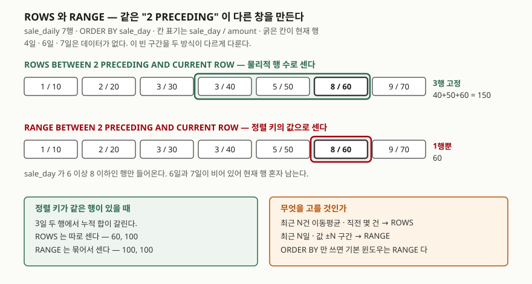

> **실행 검증 완료.** 이 글의 출력은 **Tibero 7.2** 인스턴스에서 실제로 돌려 받은 것이다.
> 버전은 `SELECT * FROM v$version`으로 확인했고 `PRODUCT_MAJOR 7`, `PRODUCT_MINOR 2`다.
> 인용한 매뉴얼은 **7.2.6판**이라 인스턴스 버전과 다르니 섞어 읽지 않도록 주의한다.
>
> 검증은 빈 스키마에 예제 테이블 하나만 만들고 끝나면 지우는 방식으로 했다.
> 마지막 `user_objects` 카운트가 0인 것까지 확인했다.

## 들어가며

일별 매출 표에서 "최근 3일 이동평균"을 뽑아 달라는 요청을 받는다. 분석 함수를 쓰면
한 문장이라는 건 알고 있어서 `AVG(amount) OVER (ORDER BY sale_day ROWS BETWEEN 2 PRECEDING
AND CURRENT ROW)`라고 쓴다. 숫자가 나오고, 검수도 통과한다.

문제는 나중에 터진다. **매출이 0인 날은 애초에 행이 없다.** 휴일이 끼면 5일에서 8일로
건너뛰는데, `ROWS`는 행을 세므로 8일의 "최근 3일"에 5일과 3일이 들어간다. 사흘 평균이
아니라 **엿새치 평균**이 나온 것이다. 화면 숫자만 봐서는 알 수 없고, 값이 이상하다는
제보가 몇 달 뒤에 올라온다.

`ROWS`와 `RANGE`는 문법이 거의 같아서 아무거나 써도 되는 것처럼 보인다. 그런데 이 둘은
**창의 크기를 무엇으로 재느냐**가 다르고, 데이터에 중복이나 구멍이 있는 순간 결과가 갈린다.

## 개념

분석 함수의 `OVER` 절은 세 부분으로 나뉜다.

```sql
함수(인자) OVER ( [PARTITION BY ...] [ORDER BY ...] [윈도우 절] )
```

- `PARTITION BY` — 집합을 그룹으로 나눈다. 창은 그룹을 넘지 않는다
- `ORDER BY` — 그룹 안에서 행의 순서를 정한다
- **윈도우 절** — 현재 행을 기준으로 **어디부터 어디까지**를 계산에 넣을지 정한다

윈도우 절은 `ROWS`와 `RANGE` 두 가지로 시작한다. 매뉴얼은 `ROWS`를 "현재 로우를 기준으로
물리적인 로우 단위의 윈도우 계산", `RANGE`를 "현재 로우를 기준으로 논리적 오프셋에 따라
윈도우 정의"로 구분한다.

풀어 쓰면 이렇다. `ROWS 2 PRECEDING`은 **앞의 두 행**이고, `RANGE 2 PRECEDING`은
**정렬 키의 값이 현재 값보다 2만큼 작은 지점부터**다. 정렬 키의 값이 촘촘하고 중복이
없으면 두 결과가 같아서, 이 차이를 모르고 지나가기 쉽다.

## 구조



> **출처**: `ROWS`와 `RANGE`의 구분, 그리고 `ORDER BY`만 쓸 때의 기본 윈도우가
> `RANGE BETWEEN UNBOUNDED PRECEDING AND CURRENT ROW`라는 것은
> [Tibero 7.2.6 SQL 참조 안내서 — 분석 함수](https://docs.tibero.com/tibero-manuals/7.2.6.manuals/sql-reference-guide/functions/analytic-functions.md)
> 를 따랐다. 같은 절이 `RANGE`에 오프셋을 쓸 때 `order_by_clause`에 정렬 키를 하나만
> 명시할 수 있고 오프셋은 0 또는 양수여야 한다고 적는다.
> 그림의 값(150, 60, 그리고 3일 두 행의 60·100과 100·100)은 아래 예제의 실제 출력이다.

## 동작 원리

예제 데이터는 7행이다. `sale_day`가 1, 2, 3, 3, 5, 8, 9이고 금액은 10부터 70까지다.
**3일이 두 행**이고 **4·6·7일은 행이 없다.** 이 둘이 `ROWS`와 `RANGE`를 갈라놓는 조건이다.

전체 소스: [`code/window_clause.sql`](code/window_clause.sql),
실행 기록: [`code/output.txt`](code/output.txt)

### 윈도우 절을 안 쓰면 무엇이 되는가

```text
  SALE_DAY     AMOUNT DEFAULT_WIN  RANGE_WIN   ROWS_WIN
---------- ---------- ----------- ---------- ----------
         1         10          10         10         10
         2         20          30         30         30
         3         30         100        100         60
         3         40         100        100        100
         5         50         150        150        150
         8         60         210        210        210
         9         70         280        280        280
```

`DEFAULT_WIN`은 `SUM(amount) OVER (ORDER BY sale_day)`다. 값이 `RANGE_WIN`과 한 칸도
틀리지 않는다. **`ORDER BY`만 쓰면 기본 윈도우는 `RANGE BETWEEN UNBOUNDED PRECEDING AND
CURRENT ROW`다.**

3일 두 행에서 차이가 드러난다. `RANGE`는 정렬 키 값이 같은 행을 **한 덩어리로** 보므로
둘 다 100이다. `ROWS`는 행을 하나씩 세므로 60과 100으로 갈린다. **누적 합을 뽑는 질의에서
같은 날짜가 두 건 들어오면, 윈도우 절을 안 쓴 쪽은 두 행이 같은 값을 갖는다.**
행마다 다른 누적값을 기대했다면 `ROWS`를 명시해야 한다.

`ORDER BY`를 아예 빼면 창은 집합 전체다. `SUM(amount) OVER ()`가 모든 행에서 280을
돌려줬다. 이것도 매뉴얼에 적힌 동작이다.

### 구멍이 있으면 같은 2 PRECEDING이 갈린다

```text
  SALE_DAY     AMOUNT    ROWS_2P   ROWS_CNT   RANGE_2P  RANGE_CNT
---------- ---------- ---------- ---------- ---------- ----------
         1         10         10          1         10          1
         2         20         30          2         30          2
         3         30         60          3        100          4
         3         40         90          3        100          4
         5         50        120          3        120          3
         8         60        150          3         60          1
         9         70        180          3        130          2
```

`ROWS_CNT`를 보면 3행째부터 계속 3이다. 앞에 행이 있는 한 무조건 3행이다.
`RANGE_CNT`는 1, 2, 4, 4, 3, 1, 2로 흔들린다.

8일 행이 이 글의 요점이다. `ROWS`는 150(=40+50+60), `RANGE`는 60이다. `RANGE`에서
8일이 보는 구간은 `sale_day`가 6 이상 8 이하인데 **6일과 7일에 행이 없어서 자기 자신만
남는다.** 들어가며에서 말한 "사흘 평균인 줄 알았는데 엿새치"가 반대로 뒤집힌 모습이다.

**날짜나 금액처럼 값에 의미가 있는 기준으로 "최근 N일"을 세려면 `RANGE`가 맞고,
"직전 N건"을 세려면 `ROWS`가 맞다.** 둘을 바꿔 쓰면 에러 없이 다른 숫자가 나온다.

### LAST_VALUE가 마지막 값을 안 주는 이유

```text
  SALE_DAY     AMOUNT FIRST_DEFAULT LAST_DEFAULT  LAST_FULL
---------- ---------- ------------- ------------ ----------
         1         10            10           10         70
         2         20            10           20         70
         3         30            10           40         70
         3         40            10           40         70
         9         70            10           70         70
```

(가운데 두 행은 생략했다. 전체는 실행 기록에 있다.)

`FIRST_VALUE`는 어느 행에서나 10을 준다. 기대한 대로다. 그런데 `LAST_VALUE`는 행마다
값이 다르다. 기본 윈도우가 **현재 행까지**라서, 매번 "지금까지 중 마지막"을 돌려준 것이다.
마지막 행에서만 우연히 70이 맞는다.

집합 전체의 마지막 값을 원하면 창의 끝을 직접 열어야 한다. `ROWS BETWEEN UNBOUNDED
PRECEDING AND UNBOUNDED FOLLOWING`을 붙인 `LAST_FULL`은 모든 행에서 70이다.
**`LAST_VALUE`를 윈도우 절 없이 쓰는 코드는 거의 항상 버그다.**

3일 두 행이 둘 다 40인 것도 같은 이유다. 기본 윈도우가 `RANGE`라 3일 두 행이 한 덩어리로
묶이고, 그 덩어리의 마지막이 40이다.

## 어디서 막히는가

윈도우 절은 아무 데나 붙지 않는다. 다섯 가지를 일부러 틀리게 써서 확인했다.

| 쓴 것 | 결과 |
|---|---|
| `ORDER BY sale_day, amount` + `RANGE 2 PRECEDING` | `TBR-8067: Invalid window value used in analytic clause.` |
| `ORDER BY sale_day, amount` + `ROWS 2 PRECEDING` | 정상 동작 |
| `RANK() OVER (ORDER BY ... ROWS ...)` | `TBR-8004: Syntax error.` |
| `RANGE BETWEEN -1 PRECEDING AND CURRENT ROW` | `TBR-11005: Specified value '-1' is invalid for mathematical function argument(s).` |
| `ROWS BETWEEN CURRENT ROW AND 2 PRECEDING` | `TBR-8067: Invalid window value used in analytic clause.` |
| `SUM(...) OVER (ROWS BETWEEN 1 PRECEDING AND CURRENT ROW)` (`ORDER BY` 없음) | `TBR-8004: Syntax error.` |
| `ROW_NUMBER`·`DENSE_RANK`·`NTILE`·`LEAD`·`LAG`에 `ROWS ...` | 다섯 개 모두 `TBR-8004: Syntax error.` |

첫 두 줄을 나란히 본다. **같은 `ORDER BY sale_day, amount`인데 `RANGE`는 막히고 `ROWS`는
통과한다.** `RANGE`의 오프셋은 정렬 키의 값에 더하고 빼서 구간을 만드는 연산이라 키가
하나여야 계산이 성립한다. `ROWS`는 값을 안 보고 행만 세므로 키가 몇 개든 상관없다.
매뉴얼이 "`order_by_clause`에는 하나의 정렬 키만 명시 가능"이라고 적은 것이 이 제약이다.

`RANK`처럼 순위를 매기는 함수에 윈도우 절을 붙이면 문법 오류다. 순위는 창이 아니라
정렬 전체에서 정해지는 값이라 창을 줄 자리가 없다. `ROW_NUMBER`·`DENSE_RANK`·`NTILE`과
앞뒤 행을 가져오는 `LEAD`·`LAG`도 같은 자리에서 `TBR-8004`로 막히는 것을 확인했다.

## 실무에서 주의할 점

- **`ORDER BY`를 쓰면 윈도우 절을 함께 쓰는 것을 기본으로 한다.** 안 쓰면 `RANGE ...
  CURRENT ROW`가 조용히 붙는다. 의도한 값이면 명시해 두는 편이 리뷰에서 오해를 줄인다.
- **정렬 키에 중복이 있는지 먼저 확인한다.** 중복이 없으면 `ROWS`와 `RANGE`가 같은 값을
  주므로, 개발 데이터로 테스트하면 차이를 못 본 채 배포된다. 운영 데이터에 같은 날짜가
  두 건 들어오는 순간 값이 갈린다.
- **"최근 N일"과 "직전 N건"을 말로 구분해 둔다.** 요구사항이 "3일 이동평균"이면 날짜
  기준이므로 `RANGE`, "최근 3건"이면 건수 기준이므로 `ROWS`다. 이 한 단어가 결과를 바꾼다.
- **`LAST_VALUE`에는 반드시 창의 끝을 명시한다.** `UNBOUNDED FOLLOWING`을 빼면 현재 행이
  마지막이 된다. `FIRST_VALUE`는 기본 윈도우에서도 맞게 나와서, 둘을 같이 쓸 때
  한쪽만 틀린 것을 놓치기 쉽다.
- **`RANGE` 오프셋을 쓸 거면 정렬 키를 하나로 줄인다.** 정렬을 안정시키려고 보조 키를
  덧붙이는 습관이 있는데, 그러면 `TBR-8067`로 막힌다. 안정 정렬이 필요하면
  `ROWS`로 바꾸거나 정렬 키를 하나로 합친 표현식을 만든다.
- **구멍 난 구간을 메울지 결정한다.** `RANGE`로 "최근 3일"을 재면 행이 없는 날은 그냥
  빠진다. 평균의 분모가 날마다 달라도 되는지, 아니면 날짜 축을 따로 만들어 0을 채워야
  하는지는 업무 규칙이지 문법이 아니다.

## 정리

- `OVER` 절의 윈도우는 `ROWS`(행 수)와 `RANGE`(정렬 키의 값) 두 가지로 잰다.
- `ORDER BY`만 쓰면 기본은 `RANGE BETWEEN UNBOUNDED PRECEDING AND CURRENT ROW`다.
  `ORDER BY`도 없으면 창은 집합 전체다.
- 정렬 키가 같은 행을 `RANGE`는 한 덩어리로 묶고 `ROWS`는 따로 센다. 3일 두 행이
  100·100과 60·100으로 갈렸다.
- 값에 구멍이 있으면 같은 `2 PRECEDING`이 `ROWS` 150, `RANGE` 60으로 갈렸다.
- `LAST_VALUE`는 창의 끝을 열어 주지 않으면 현재 행을 돌려준다.
- `RANGE`에 오프셋을 쓰면 정렬 키는 하나여야 하고(`TBR-8067`), 오프셋에 음수를 쓸 수
  없으며(`TBR-11005`), 순위 함수에는 윈도우 절을 붙일 수 없다(`TBR-8004`).

## 참고 자료

- [Tibero 7.2.6 SQL 참조 안내서 — 분석 함수](https://docs.tibero.com/tibero-manuals/7.2.6.manuals/sql-reference-guide/functions/analytic-functions.md) — `OVER` 절의 구성, `ROWS`와 `RANGE`의 정의, `ORDER BY`만 있을 때의 기본 윈도우, `RANGE` 오프셋의 정렬 키·부호 제약
- [Tibero 7.2.6 에러 참조 안내서 — chapter 8000.dml.error](https://docs.tibero.com/tibero-manuals/7.2.6.manuals/error-reference-guide/chapter-8000.dml.error.md) — `TBR-8004`, `TBR-8067`
- [Tibero 7.2.6 에러 참조 안내서 — chapter 11000.func.error](https://docs.tibero.com/tibero-manuals/7.2.6.manuals/error-reference-guide/chapter-11000.func.error.md) — `TBR-11005`
