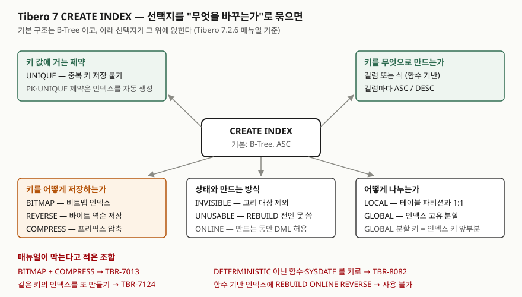

> **실행 검증 없음.** 이 글은 **Tibero 7.2.6 공개 매뉴얼**의 문법과 예제만 근거로 정리했다.
> 글을 쓴 시점에 검증용 Tibero 인스턴스에 접속할 수 없었다(`TBR-2131`).
> 본문의 에러 코드는 **매뉴얼 예제에 적힌 것**이고, 직접 돌려 받은 출력이 아니다.
> 돌려 볼 스크립트는 [`code/index_types.sql`](code/index_types.sql)에 두었다.

## 들어가며

회원 테이블에서 이메일로 찾는 화면이 느리다는 제보가 온다. 인덱스를 보면 `email`에 이미 있다.
그런데 화면 쪽 질의가 대소문자를 무시하려고 `WHERE UPPER(email) = :v`로 쓰여 있다. 보통은
여기서 인덱스를 하나 더 만들거나, 힌트를 붙이거나, 질의를 고치느라 몇 번을 오간다. 인덱스를
"컬럼에 거는 B-Tree 하나"로만 알고 있으면 선택지가 그것뿐이다. `CREATE INDEX`에는 키를 **식으로**
만들고, **저장 방식**을 바꾸고, **옵티마이저에게서 숨기는** 선택지가 따로 있다.

## 개념

Tibero 관리자 안내서는 인덱스를 두 축으로 나눈다. 컬럼 수에 따라 **단일 컬럼 인덱스**와 **복합 컬럼
인덱스**, 값의 중복 허용 여부에 따라 **유일 인덱스**와 **비유일 인덱스**다. 기본 구조는 B-Tree이고,
단일 키 검색·범위 검색·복합 키 검색을 지원한다고 적는다.

이 위에 `CREATE INDEX` 문법이 선택지를 얹는다. 이 글이 다루는 것은 다섯 가지다.

| 선택지 | 매뉴얼이 적은 동작 |
|---|---|
| `UNIQUE` | 유일 인덱스를 만든다. 중복된 키 값을 저장할 수 없다 |
| 식(`column_expr`) | 컬럼 대신 식으로 키를 만든다(함수 기반 인덱스) |
| `DESC` | 컬럼 값의 정렬 순서를 내림차순으로 지정한다 |
| `BITMAP` | 비트맵 인덱스를 만든다 |
| `REVERSE` | ROWID를 제외한 인덱스 블록의 byte 순서를 역순으로 저장한다 |

## 구조



> **출처**: 선택지와 막히는 조합·에러 코드는 [Tibero 7.2.6 SQL 참조 안내서 — CREATE INDEX](https://docs.tibero.com/tibero-manuals/7.2.6.manuals/sql-reference-guide/data-definition-language/create-index.md)의 구성요소와 예제,
> 함수 기반 인덱스의 `REBUILD ONLINE REVERSE` 제약은 [Tibero 7.2.6 SQL 참조 안내서 — ALTER INDEX](https://docs.tibero.com/tibero-manuals/7.2.6.manuals/sql-reference-guide/data-definition-language/alter-index.md),
> B-Tree 기본 구조와 제약이 인덱스를 자동 생성한다는 부분은 [Tibero 7.2.6 관리자 안내서 — 스키마 객체 관리: 인덱스](https://docs.tibero.com/tibero-manuals/7.2.6.manuals/administrator-guide/schema-object-management.md)를 따랐다.
> 다섯 갈래로 묶은 것은 글쓴이의 분류다. 매뉴얼은 구성요소를 문법 순서로 나열한다.

## 동작 원리

매뉴얼이 각 선택지에 대해 적은 것만 옮긴다. 적지 않은 것은 뒤의 "매뉴얼로 알 수 없는 것"에 따로 모았다.

**유일 인덱스.** 중복 키를 넣으면 `TBR-10007: unique constraint violated.`가 난다(매뉴얼 예제).
관리자 안내서는 기본 키(PRIMARY KEY)와 유일 키(UNIQUE KEY) 제약이 인덱스를 자동으로 만든다고 적는다.
제약을 걸었다면 같은 컬럼에 유일 인덱스를 따로 만들 필요가 없다는 뜻이다. 실제로 **같은 키를 갖는
인덱스가 이미 있으면 새로 만들 수 없고** `TBR-7124: Duplicate index exists.`가 난다.

**함수 기반 인덱스.** 키 자리에 컬럼 대신 식을 쓴다. 매뉴얼 예제가 `CREATE INDEX i2 ON t (UPPER(b))`다.
제약이 셋이다. LONG·LONG RAW·대용량 객체형은 쓸 수 없고, 사용자 정의 함수는 **반드시
`DETERMINISTIC`으로 선언**해야 하며, `SYSDATE`처럼 **결과 값이 변하는 함수는 쓸 수 없다.** 어기면
`TBR-8082`다. 매뉴얼은 여기에 한 가지를 덧붙인다. 키에 쓴 함수가 **바뀌거나 삭제되면 인덱스가
`UNUSABLE`이 된다.**

**DESC.** 매뉴얼은 두 경우를 든다. 복합 키에서 컬럼마다 정렬 방향을 다르게 해야 할 때, 그리고 키가
주로 내림차순으로 삽입될 때 내림차순으로 정렬해야 인덱스 효율이 좋아진다는 것이다.

**비트맵 인덱스.** `CREATE BITMAP INDEX`로 만든다. 매뉴얼이 적은 제약은 하나로, `COMPRESS`를 함께 쓰면
`TBR-7013`이다.

**리버스 인덱스.** ROWID를 제외한 키의 byte 순서를 뒤집어 저장한다. 매뉴얼이 적은 용도는 "비슷한 키 값이
집중된 경우 이를 분산하고 싶을 때"다. 이미 만든 인덱스는 `ALTER INDEX … REBUILD REVERSE`로 역순으로,
`REBUILD NOREVERSE`로 원래 순서로 다시 만든다. 단, 함수 기반 인덱스에는 `REBUILD ONLINE REVERSE`를 쓸 수 없다.

## 실습 예제

아래 문장은 전부 매뉴얼 예제의 형태를 예제 테이블에 옮긴 것이다. **실행하지 않았다.** 괄호의 에러는
매뉴얼 예제가 적은 결과다.

```sql
CREATE TABLE member_account (
  member_id  NUMBER       NOT NULL,
  email      VARCHAR(100) NOT NULL,
  grade      VARCHAR(10)  NOT NULL,
  joined_at  DATE         NOT NULL
);

CREATE UNIQUE INDEX ux_member_account_member_id ON member_account (member_id);
CREATE UNIQUE INDEX ux_member_account_dup ON member_account (member_id);        -- (TBR-7124)

CREATE INDEX ix_member_account_upper_email ON member_account (UPPER(email));
CREATE INDEX ix_member_account_sysdate ON member_account (SYSDATE);             -- (TBR-8082)

CREATE BITMAP INDEX ix_member_account_grade ON member_account (grade);
CREATE BITMAP INDEX ix_member_account_joined_c ON member_account (joined_at) COMPRESS;  -- (TBR-7013)

CREATE INDEX ix_member_account_joined_rev ON member_account (joined_at, member_id) REVERSE;
CREATE INDEX ix_member_account_grade_desc ON member_account (grade, joined_at DESC);
```

본문의 `-- (에러)` 표시는 읽기 편하라고 붙였다. `code/`의 스크립트에는 줄 끝 주석이 없다. tbsql 스크립트
모드에서 문장 뒤 같은 줄에 주석을 달면 다음 문장이 깨지기 때문이다.

만든 인덱스는 사전 뷰에서 확인한다. 매뉴얼이 적는 이름은 `USER_INDEXES`, `USER_IDX_COLUMNS`,
`USER_IDX_EXPRESSIONS`다. 컬럼 목록은 `_IDX_COLUMNS`, 함수 기반 인덱스의 식은 `_IDX_EXPRESSIONS`의
`COLUMN_EXPRESSION`(LONG)에 있다.

## 어느 상황에 무엇을 쓰는가

| 상황 | 쓸 것 | 매뉴얼 근거 |
|---|---|---|
| 값이 겹치면 안 되는 컬럼 | 유일 제약(인덱스 자동 생성) 또는 `UNIQUE` 인덱스 | 제약이 인덱스를 자동 생성, 같은 키 인덱스 중복 불가 |
| `WHERE UPPER(email) = …`처럼 식으로 찾는다 | 함수 기반 인덱스 | `UPPER(b)` 예제, `DETERMINISTIC` 조건 |
| 복합 키에서 한 컬럼만 역순 정렬이 필요하다 | `DESC` | 정렬 방향이 섞인 복합 키 |
| 키가 주로 내림차순으로 들어온다 | `DESC` | 내림차순 삽입 시 효율 |
| 비슷한 키 값이 몰려 들어온다 | `REVERSE` | 집중된 키 분산 |
| 인덱스를 지우기 전에 영향을 보고 싶다 | `INVISIBLE` | 옵티마이저 고려 대상에서 제외, DML 반영은 유지 |
| 만들어 두기만 하고 나중에 채운다 | `UNUSABLE` | `REBUILD`로 재생성해야 사용 가능 |

비트맵 인덱스는 이 표에 넣지 않았다. **Tibero 매뉴얼은 비트맵 인덱스를 어떤 데이터에 쓰라는 기준을
적지 않는다.** 다른 제품의 기준을 그대로 옮기면 이 글의 근거가 흐려지므로 적지 않는다.

## 매뉴얼로 알 수 없는 것

- **사전 뷰에서 비트맵·리버스 인덱스를 어떻게 구분하는가.** `ALL_INDEXES`의 `INDEX_TYPE` 설명에 적힌
  값은 `NORMAL`, `FUNCTION-BASED`, `LOB` 세 가지다. `BITMAP`이나 `REVERSE`라는 값은 목록에 없다.
- **리버스 인덱스로 범위 조건을 찾을 수 있는가.** 매뉴얼은 byte 순서를 역순으로 저장한다고만 적고,
  `BETWEEN`·부등호 조건에서 옵티마이저가 이 인덱스를 쓰는지는 적지 않는다.
- **비트맵 인덱스와 `UNIQUE`·`REVERSE`·`ONLINE`·파티션의 조합.** 매뉴얼에 명시된 금지는 `COMPRESS` 하나다.
  나머지는 된다는 뜻인지 적지 않았다는 뜻인지 매뉴얼만으로 가릴 수 없다.

세 가지 모두 `code/index_types.sql`의 7번 조회와 실행계획으로 확인할 수 있다. 확인 전에는 어느 쪽으로도
단정하지 않는다.

## 실무에서 주의할 점

- **키에 쓴 함수를 고치면 인덱스가 멈춘다.** 함수 기반 인덱스의 함수가 바뀌거나 삭제되면 인덱스가
  `UNUSABLE`이 된다. 함수를 배포할 때 그 함수를 키로 쓰는 인덱스가 있는지 `USER_IDX_EXPRESSIONS`에서
  먼저 찾는다.
- **`DETERMINISTIC`은 함수를 쓴 사람이 붙이는 선언이다.** 매뉴얼은 선언을 요구한다고 적을 뿐, 함수가 실제로
  같은 입력에 같은 값을 내는지 검사한다고는 적지 않는다. 날짜나 세션 값을 읽는 함수에는 선언을 붙이지 않는다.
- **제약과 인덱스를 따로 만들지 않는다.** 유일 제약이 이미 인덱스를 만들었으면 같은 키로 `CREATE UNIQUE INDEX`를
  또 쓰면 `TBR-7124`다. 여러 번 돌 수 있는 배포 스크립트라면 `IF NOT EXISTS`를 쓴다. 매뉴얼은 이 옵션이
  인덱스가 이미 있을 때 에러 없이 성공을 돌려준다고 적는다.
- **인덱스는 늘릴수록 DML이 비싸진다.** 관리자 안내서는 테이블당 인덱스를 과도하게 만들지 말라고 하고, 그
  이유로 저장 공간과 `INSERT`·`UPDATE`·`DELETE` 때의 유지 비용을 든다. 검색 결과가 전체의 10% 이하일 때
  인덱스를 만들라는 기준도 같은 절에 있다.
- **지우기 전에 `INVISIBLE`로 먼저 숨긴다.** 옵티마이저가 고려하지 않게 되지만 DML은 계속 반영되므로,
  문제가 생기면 다시 보이게 하는 것으로 되돌린다. 지웠다면 인덱스를 처음부터 다시 만들어야 한다.
- **Oracle 사전 뷰 이름을 그대로 쓰지 않는다.** 매뉴얼이 적는 컬럼 뷰 이름은 `_IND_`가 아니라 `_IDX_`다.

## 정리

- Tibero 7 인덱스의 기본 구조는 B-Tree이고, 관리자 안내서는 단일/복합, 유일/비유일 두 축으로 나눈다.
- `CREATE INDEX` 선택지는 키 값 제약(`UNIQUE`), 키 구성(식·`DESC`), 저장 방식(`BITMAP`·`REVERSE`·`COMPRESS`),
  분할(`LOCAL`·`GLOBAL`), 상태(`INVISIBLE`·`UNUSABLE`·`ONLINE`)로 묶인다.
- 매뉴얼이 막는 조합: `BITMAP`+`COMPRESS`(TBR-7013), 결과가 변하는 함수 키(TBR-8082), 같은 키 인덱스 중복(TBR-7124).
- 함수 기반 인덱스는 함수가 바뀌면 `UNUSABLE`이 된다.
- 비트맵의 사용 기준, 리버스 인덱스의 범위 검색, 사전에서의 구분은 매뉴얼에 없어 실행으로 확인해야 한다.

## 참고 자료

- [Tibero 7.2.6 SQL 참조 안내서 — CREATE INDEX](https://docs.tibero.com/tibero-manuals/7.2.6.manuals/sql-reference-guide/data-definition-language/create-index.md) — `UNIQUE`·`BITMAP`·`column_expr`·`DESC`·`REVERSE`·`ONLINE`·`INVISIBLE`·`UNUSABLE`·`COMPRESS`·`LOCAL`/`GLOBAL`의 정의와 예제, 에러 `TBR-10007`·`TBR-7124`·`TBR-8082`·`TBR-7013`
- [Tibero 7.2.6 SQL 참조 안내서 — ALTER INDEX](https://docs.tibero.com/tibero-manuals/7.2.6.manuals/sql-reference-guide/data-definition-language/alter-index.md) — `REBUILD REVERSE`·`NOREVERSE`·`ONLINE`, `INVISIBLE`, `MONITORING USAGE`, 함수 기반 인덱스의 `REBUILD ONLINE REVERSE` 제약
- [Tibero 7.2.6 관리자 안내서 — 스키마 객체 관리](https://docs.tibero.com/tibero-manuals/7.2.6.manuals/administrator-guide/schema-object-management.md) — 인덱스 절: 단일/복합·유일/비유일 분류, B-Tree 기본 구조, 인덱스 생성 기준, 제약이 만드는 인덱스, 인덱스 관련 뷰
- [Tibero 7.2.6 참조 안내서 — 정적 뷰](https://docs.tibero.com/tibero-manuals/7.2.6.manuals/reference-guide/static-views.md) — `ALL_INDEXES`의 `INDEX_TYPE` 값 목록, `ALL_IDX_COLUMNS`, `ALL_IDX_EXPRESSIONS`
