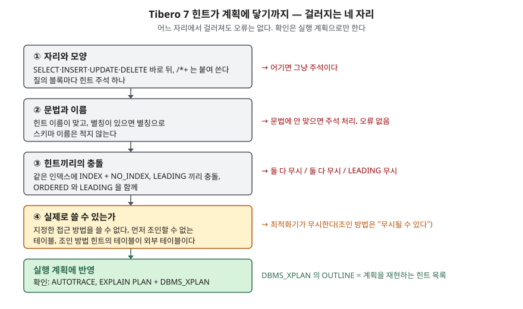

> **실행 검증 없음.** 이 글은 **Tibero 7.2.6 공개 매뉴얼**의 설명만 근거로 정리했다.
> 글을 쓴 시점에 검증용 Tibero 인스턴스에 접속할 수 없었다(`TBR-2131`).
> 실행 계획이나 출력은 싣지 않았다. 돌려 볼 스크립트는 [`code/optimizer_hints.sql`](code/optimizer_hints.sql)에 두었다.

## 들어가며

야간 배치 하나가 갑자기 느려져서 원인 쿼리를 찾고, 급한 대로 `/*+ INDEX(...) */`를 붙여 다시 배포한다.
다음 날에도 똑같이 느리다. 힌트를 두 번, 세 번 고쳐 보는데, 매번 배포하고 하룻밤을 기다려야 결과를 안다.
나중에 보니 힌트에 테이블 이름을 적었는데 쿼리에는 별칭이 있었다. Tibero는 이런 힌트에 **오류를 내지 않는다.**
그래서 "힌트를 붙였다"와 "힌트가 먹었다" 사이를 확인하는 방법을 모르면, 배포 한 번에 하루씩 쓰게 된다.

## 개념

매뉴얼은 힌트를 **질의 최적화기에 특정 실행 방향을 지시하는 주석**이라고 정의한다. 모양은 두 가지다.

```sql
SELECT /*+ hint [hint] ... */ * FROM T;
SELECT --+ hint [hint] ...
       * FROM T;
```

쓰는 규칙은 매뉴얼에 다섯 가지가 있다.

| 규칙 | 매뉴얼 내용 |
|---|---|
| 자리 | `SELECT`, `INSERT`, `UPDATE`, `DELETE` 바로 뒤에만 온다 |
| `+`의 위치 | 주석 구분자 바로 뒤에 공백 없이 붙인다. `+` 다음의 공백은 괜찮다 |
| 개수 | 질의 블록 하나에 힌트 주석 하나. 그 안에 힌트를 여럿 쓸 수 있다 |
| 테이블 이름 | SQL 문장에서 쓴 이름과 같아야 한다. **별칭을 썼으면 별칭으로** 적는다 |
| 스키마 | SQL 문장에 스키마를 적었어도 힌트에는 테이블 이름이나 별칭만 적는다 |

`MERGE` 문 매뉴얼도 `MERGE` 뒤에 힌트를 적는 자리를 보여준다. 힌트 절이 든 네 문장 외에 하나가 더 있는 셈이다.
질의 블록마다 따로 힌트를 둘 수 있다는 것은 매뉴얼의 `NO_MERGE` 예제가 보여준다. 인라인 뷰 안의 `SELECT` 뒤에 힌트를 적는다.

### 분류 — 8가지

매뉴얼은 표를 "주요 힌트의 종류"라고 소개한다. 전체 목록이라고는 적지 않았다.

| 분류 | 개수 | 힌트 |
|---|---|---|
| 질의 변형 | 8 | `NO_QUERY_TRANSFORMATION`, `NO_MERGE`, `UNNEST`, `NO_UNNEST`, `NO_JOIN_ELIMINATION`, `STAR_TRANSFORMATION`, `USE_CONCAT`, `NO_EXPAND` |
| 최적화 방법 | 2 | `ALL_ROWS`, `FIRST_ROWS` |
| 접근 방법 | 12 | `FULL`, `INDEX`, `NO_INDEX`, `INDEX_ASC`, `INDEX_DESC`, `INDEX_FFS`, `NO_INDEX_FFS`, `INDEX_RS`, `NO_INDEX_RS`, `INDEX_SS`, `NO_INDEX_SS`, `INDEX_JOIN` |
| 조인 순서 | 2 | `LEADING`, `ORDERED` |
| 조인 방법 | 15 | `USE_NL`, `NO_USE_NL`, `USE_NL_WITH_INDEX`, `USE_MERGE`, `NO_USE_MERGE`, `USE_HASH`, `NO_USE_HASH`, `HASH_SJ`, `HASH_AJ`, `MERGE_SJ`, `MERGE_AJ`, `NL_SJ`, `NL_AJ`, `SWAP_JOIN_INPUTS`, `NO_SWAP_JOIN_INPUTS` |
| 병렬 처리 | 3 | `PARALLEL`, `NO_PARALLEL`, `PQ_DISTRIBUTE` |
| 실체화 뷰 | 4 | `REWRITE`, `NO_REWRITE`, `MATERIALIZE`, `INLINE` |
| 기타 | 10 | `APPEND`, `APPEND_VALUES`, `NOAPPEND`, `IGNORE_ROW_ON_DUPKEY_INDEX`, `CARD`, `MONITOR`, `NO_MONITOR`, `RESULT_CACHE`, `NO_SUBQUERY_CACHE`, `OPT_PARAM` |

## 구조



> **출처**: 자리·모양·이름 규칙과 무시 조건은 [Tibero 7.2.6 SQL 참조 안내서 — 주석과 힌트](https://docs.tibero.com/tibero-manuals/7.2.6.manuals/sql-reference-guide/sql-elements/comments-and-hints.md)의 힌트 절과 접근 방법·조인 순서·조인 방법 항목,
> OUTLINE의 뜻은 [Tibero 7.2.6 tbPSM 참조 안내서 — DBMS_XPLAN](https://docs.tibero.com/tibero-manuals/7.2.6.manuals/tbpsm-reference-guide/dbms_xplan.md)을 따랐다.
> 네 자리로 묶은 것은 글쓴이의 분류다. 매뉴얼은 조건을 각 힌트 항목에 나눠 적는다.

## 동작 원리

매뉴얼이 적은 "힌트가 반영되지 않는 경우"를 모으면 여섯 가지다.

1. **문법에 맞지 않는 힌트는 주석으로 처리되고 오류가 나지 않는다.** 이름 오타, `/*`와 `+` 사이의 공백이 여기에 든다
2. **접근 방법 힌트는 명시한 방법을 쓸 수 없으면 무시된다.** 조건에 쓸 수 없는 인덱스를 지정한 경우다
3. **같은 인덱스에 `NO_INDEX`와 `INDEX`(또는 `INDEX_ASC`·`INDEX_DESC`)를 함께 쓰면 두 힌트 모두 무시된다**
4. **서로 충돌하는 `LEADING`이 있으면 `LEADING`과 `ORDERED`가 모두 무시되고, `ORDERED`가 있으면 `LEADING`은 모두 무시된다.**
   먼저 조인될 수 없는 테이블을 `LEADING`에 적어도 무시된다
5. **조인 방법 힌트는 명시한 테이블이 조인의 내부 테이블일 때만 참조된다.** 외부 테이블이면 무시될 수 있다
6. **`IGNORE_ROW_ON_DUPKEY_INDEX`를 쓰면 `APPEND`, `PARALLEL`이 무시된다**

5번은 "무시될 수 있다"로 적혀 있다. 반드시 무시된다는 뜻이 아니므로, 결과는 계획으로 확인해야 한다.

거꾸로 **오류가 나는 경우**로 매뉴얼이 적은 것은 하나다. `IGNORE_ROW_ON_DUPKEY_INDEX`에 인덱스를 지정하지 않거나,
여러 개를 지정하거나, 지정한 인덱스가 `UNIQUE`가 아니면 오류가 발생한다. 이 힌트는 단일 테이블 `INSERT`에서만 쓰며,
유일 키를 어기는 행만 롤백하고 다음 행을 계속 넣는다. 다른 힌트는 계획만 바꾸지만 이 힌트는 **들어가는 행이 달라진다.**
잘못 썼을 때 조용히 넘어가지 않는 유일한 힌트라는 점을 기억해 둔다.

힌트가 아닌 설정에 따라 효과가 갈리는 것도 있다. `RESULT_CACHE`는 초기 파라미터 `RESULT_CACHE_MODE`가
`MANUAL`일 때만 유효하고, `FORCE`면 힌트와 상관없이 모든 결과를 캐시에 넣는다.

## 적용 여부 확인 — 도구 3가지

힌트 절 자체에는 확인 방법이 없다. 매뉴얼의 다른 안내서에 계획을 보는 도구가 셋 있다.

| 도구 | 문법 | 매뉴얼이 적은 것 |
|---|---|---|
| tbSQL `AUTOTRACE` | `SET AUTOT[RACE] {ON\|OFF\|TRACE[ONLY]} [EXP[LAIN]] [STAT[ISTICS]] [PLANS[TAT]]` | `TRACEONLY`는 결과를 빼고 계획·통계만 보인다. `PLANSTAT`은 노드별 수행 시간·처리 로우 수·수행 횟수. DBA 권한 또는 `PLUSTRACE` 롤이 필요하다 |
| `EXPLAIN PLAN` | `EXPLAIN PLAN [SET STATEMENT_ID = 'id'] [INTO table] FOR 문장` | 기본 대상은 `PLAN_TABLE`. 대상 테이블은 미리 있어야 하고, 자동 커밋은 일어나지 않는다 |
| `DBMS_XPLAN` | `DISPLAY(format)`, `DISPLAY_CURSOR(sql_id, child_no, format)` | `DISPLAY`는 같은 세션의 `EXPLAIN PLAN` 결과를, `DISPLAY_CURSOR`는 Physical Plan Cache를 읽는다 |

힌트 확인에 가장 가까운 것은 `DBMS_XPLAN`의 **`OUTLINE`** 항목이다. 매뉴얼은 이것을 "플랜을 재현할 때 사용하는
힌트와 optimizer 파라미터 목록"이라고 적고, `ALL` 형식에 포함한다. 붙인 힌트와 OUTLINE을 나란히 놓으면 무엇이
계획에 들어갔는지 볼 수 있다. 다만 **무시된 힌트를 따로 표시해 주는지는 매뉴얼에 없다.**

## 실습 예제

아래는 확인 절차의 모양이다. **실행하지 않았다.** `FULL(e)`처럼 괄호 안에 인자를 적는 형태는 매뉴얼 본문 글에서
찾지 못해, 스크립트를 돌려 계획으로 먼저 확인할 대상이다.

```sql
SET AUTOTRACE TRACEONLY EXPLAIN
SELECT e.emp_name FROM hint_emp e WHERE e.dept_id = 7;
SELECT /*+ FULL(e) */ e.emp_name FROM hint_emp e WHERE e.dept_id = 7;
SELECT /*+ FULL(hint_emp) */ e.emp_name FROM hint_emp e WHERE e.dept_id = 7;
SELECT /* +FULL(e) */ e.emp_name FROM hint_emp e WHERE e.dept_id = 7;
SET AUTOTRACE OFF

EXPLAIN PLAN FOR SELECT /*+ FULL(e) */ e.emp_name FROM hint_emp e WHERE e.dept_id = 7;
SELECT * FROM TABLE(DBMS_XPLAN.DISPLAY('ALL'));
```

매뉴얼대로라면 둘째 줄만 계획이 바뀌고, 셋째(별칭 대신 테이블 이름)와 넷째(`/*`와 `+` 사이 공백)는 첫째와 같은
계획이 나와야 한다. 전체 스크립트는 무시 조건 여섯 가지를 한 장씩 확인하고 객체를 지운다.

## 어느 상황에 무엇을 쓰는가

| 상황 | 쓸 것 | 매뉴얼 근거 |
|---|---|---|
| 조인 순서만 고정하고 싶다 | `LEADING` | 매뉴얼은 선택 폭이 더 넓은 `LEADING`을 권한다 |
| 자동 질의 변형이 계획을 망친다고 의심된다 | `NO_QUERY_TRANSFORMATION` | 전체 질의의 변형을 막는다 |
| 특정 뷰만 병합을 막는다 | 뷰 안에 `NO_MERGE` | 인라인 뷰 예제 |
| 대량 적재 중 중복 키 행만 건너뛴다 | `IGNORE_ROW_ON_DUPKEY_INDEX` | 단일 테이블 `INSERT`, 유일 인덱스 지정 필수 |
| 세션 설정을 바꾸지 않고 한 문장만 모드를 바꾼다 | `OPT_PARAM` | `OPT_PARAM(OPTIMIZER_MODE FIRST_ROWS_1)` 예제 |
| 통계가 틀린 테이블의 건수를 알려준다 | `CARD` | 지정한 테이블의 cardinality를 주어진 값으로 계산 |

## 실무에서 주의할 점

- **별칭이 있으면 힌트도 별칭이다.** 가장 흔한 무효 원인이고 오류가 나지 않는다. 쿼리를 고칠 때 별칭을 바꾸면 힌트도
  함께 바꿔야 한다.
- **힌트를 붙인 뒤에는 반드시 계획을 본다.** 매뉴얼이 적은 무시 조건 여섯 가지 모두 오류가 없다. 배포 전에
  `AUTOTRACE TRACEONLY EXPLAIN`으로 힌트 전후 계획이 실제로 다른지 확인한다.
- **`ORDERED`와 `LEADING`을 섞지 않는다.** `ORDERED`가 있으면 `LEADING`이 전부 무시된다. 한 쿼리에 둘을 쓰면 적은 사람의
  의도와 다른 쪽이 남는다.
- **조인 방법 힌트는 내부 테이블에 붙인다.** `USE_NL(x)`의 `x`가 외부 테이블로 잡히면 무시될 수 있다. 조인 순서 힌트와
  짝지어 어느 쪽이 내부인지 먼저 정한다.
- **`EXPLAIN PLAN`과 `DISPLAY`는 같은 세션에서 돈다.** 매뉴얼이 그렇게 요구한다. 커넥션 풀을 쓰는 도구에서 두 문장이
  다른 세션으로 가면 결과를 못 본다. 이미 실행된 SQL이면 `DISPLAY_CURSOR`를 쓴다.
- **Oracle 힌트 목록을 그대로 기대하지 않는다.** 7.2.6 매뉴얼의 주요 힌트 표에는 `RULE`, `QB_NAME`, `PUSH_PRED`가 없고,
  건수 힌트 이름은 `CARD`다. 표에 없는 힌트가 동작하는지는 매뉴얼로 알 수 없다.

## 정리

- 힌트는 `SELECT`·`INSERT`·`UPDATE`·`DELETE` 바로 뒤에 `/*+ … */` 또는 `--+`로 적고, 별칭이 있으면 별칭을 쓴다.
- 7.2.6 매뉴얼의 주요 힌트는 8개 분류 56개다.
- 무시 조건 6가지: 문법 오류, 쓸 수 없는 방법, `INDEX`+`NO_INDEX`, `LEADING` 충돌·`ORDERED` 동반, 외부 테이블의 조인 방법 힌트, `IGNORE_ROW_ON_DUPKEY_INDEX`와 `APPEND`·`PARALLEL`.
- 전부 오류 없이 넘어가므로, 적용 여부는 `AUTOTRACE`·`EXPLAIN PLAN`·`DBMS_XPLAN`(OUTLINE)으로 확인한다.

## 참고 자료

- [Tibero 7.2.6 SQL 참조 안내서 — 주석과 힌트](https://docs.tibero.com/tibero-manuals/7.2.6.manuals/sql-reference-guide/sql-elements/comments-and-hints.md) — 힌트의 자리·모양·이름 규칙, 8개 분류 표, 무시 조건, `NO_MERGE`·`OPT_PARAM` 예제
- [Tibero 7.2.6 SQL 참조 안내서 — MERGE](https://docs.tibero.com/tibero-manuals/7.2.6.manuals/sql-reference-guide/data-manipulation-language/merge.md) — `MERGE` 뒤 힌트 자리
- [Tibero 7.2.6 SQL 참조 안내서 — EXPLAIN PLAN](https://docs.tibero.com/tibero-manuals/7.2.6.manuals/sql-reference-guide/data-definition-language/explain-plan.md) — 문법, `PLAN_TABLE`, 자동 커밋 없음
- [Tibero 7.2.6 tbPSM 참조 안내서 — DBMS_XPLAN](https://docs.tibero.com/tibero-manuals/7.2.6.manuals/tbpsm-reference-guide/dbms_xplan.md) — `DISPLAY`·`DISPLAY_CURSOR`, 형식 그룹, `OUTLINE`
- [Tibero 7.2.6 유틸리티 안내서 — tbSQL](https://docs.tibero.com/tibero-manuals/7.2.6.manuals/utility-guide/tbsql.md) — 시스템 변수 `AUTOTRACE`, `PLUSTRACE` 롤
