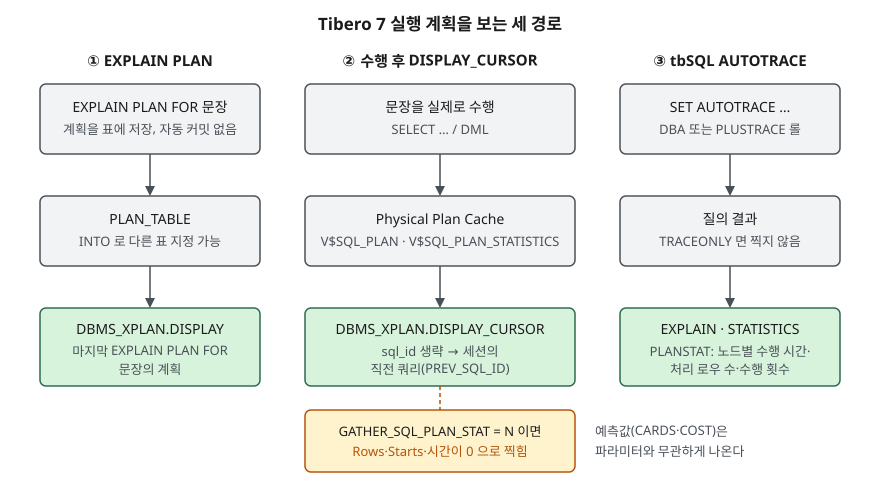

<!-- related:start -->
> **같은 기능을 다른 환경에서 다룬 글** (`explain-plan`)
> - [실행계획의 비용(cost)은 무엇을 세는 숫자인가](../../2026-09-30-optimizer-cost-stale-statistics/index.md) — SQLite 3.49.1, Python 3.13.5, Windows 11
> - [EXPLAIN QUERY PLAN 읽는 법 — SCAN, SEARCH, USE TEMP B-TREE](../../sql-basics/2026-10-08-explain-query-plan-reading/index.md) — SQLite 3.49.1, Python 3.13.5, Windows 11
<!-- related:end -->

> **실행 검증 없음.** 이 글은 **Tibero 7.2.6 공개 매뉴얼**의 설명만 근거로 정리했다.
> 글을 쓴 시점에 검증용 Tibero 인스턴스에 접속할 수 없었다(`TBR-2131`).
> 실행 계획이나 출력은 싣지 않았다. 돌려 볼 스크립트는 [`code/explain_plan.sql`](code/explain_plan.sql)에 두었다.

## 들어가며

느린 쿼리를 받아 들고 계획부터 보자며 `EXPLAIN PLAN`을 돌린다. 계획에는 인덱스 범위 스캔이 나오고 예측 건수도 작다.
그런데 실제로 돌리면 여전히 느리다. 다음으로 `DISPLAY_CURSOR`로 실제 수행 계획을 열어 보니 노드마다 Rows가 전부 0이다.
여기서 대개 "통계가 이상하다"며 통계를 다시 모으고, 같은 확인을 서너 번 되풀이한다. 원인은 통계가 아니라
**수행 정보를 모으는 파라미터가 꺼져 있던 것**일 수 있다. 세 경로가 각각 무엇을 보여주는지 모르면, 도구의 한계를
쿼리의 문제로 읽고 엉뚱한 곳을 고치게 된다.

## 개념

Tibero 7.2.6 매뉴얼에서 계획을 보는 경로는 세 갈래다.

| 경로 | 문법 | 매뉴얼이 적은 성격 |
|---|---|---|
| ① `EXPLAIN PLAN` | `EXPLAIN PLAN [SET STATEMENT_ID = 'id'] [INTO table] FOR 문장` | 계획을 지정한 표에 저장한다. 기본은 `PLAN_TABLE`. DML과 비슷하며 자동 커밋이 없다 |
| ② `DBMS_XPLAN` | `DISPLAY(format)`, `DISPLAY_CURSOR(in_sql_id, in_child_no, format)` | pipelined 함수라 `TABLE()`로 조회한다. `V$SQL_PLAN`·`V$SQL_PLAN_STATISTICS`에서 정보를 얻는다 |
| ③ tbSQL `AUTOTRACE` | `SET AUTOT[RACE] {ON\|OFF\|TRACE[ONLY]} [EXP[LAIN]] [STAT[ISTICS]] [PLANS[TAT]]` | 질의를 수행하면서 계획·통계·노드별 수행 정보를 함께 찍는다 |

`EXPLAIN PLAN`의 `FOR` 뒤에 올 수 있는 문장은 `SELECT`, `INSERT`, `UPDATE`, `DELETE`다. 실행하려면 결과를 저장할 표에
쓰기 권한이 있어야 하고, `INTO`로 지정한 표는 실행 전에 있어야 한다. `AUTOTRACE`는 DBA 권한이나 `PLUSTRACE` 롤이
있어야 쓸 수 있고, 롤을 만드는 스크립트는 `$TB_HOME/scripts/plustrace.sql`이다.

`DBMS_XPLAN`에는 함수가 넷 있다. 위 둘에 더해 TPR 저장소의 계획을 읽는 `DISPLAY_TPR`, 직접 호출할 수 없는 내부용
`DISPLAY_INTERNAL`이다.

## 구조



> **출처**: ①은 [Tibero 7.2.6 SQL 참조 안내서 — EXPLAIN PLAN](https://docs.tibero.com/tibero-manuals/7.2.6.manuals/sql-reference-guide/data-definition-language/explain-plan.md)의 목적·구성요소,
> ②와 `GATHER_SQL_PLAN_STAT` 주의는 [Tibero 7.2.6 tbPSM 참조 안내서 — DBMS_XPLAN](https://docs.tibero.com/tibero-manuals/7.2.6.manuals/tbpsm-reference-guide/dbms_xplan.md)의 개요·DISPLAY·DISPLAY_CURSOR 절,
> ③은 [Tibero 7.2.6 유틸리티 안내서 — tbSQL](https://docs.tibero.com/tibero-manuals/7.2.6.manuals/utility-guide/tbsql.md)의 시스템 변수 AUTOTRACE 항목을 따랐다.
> 세 열로 나란히 놓은 것은 글쓴이의 정리다. `DISPLAY`가 어느 저장소를 읽는지는 매뉴얼에 없어 화살표를 잇지 않았다.

## 동작 원리

### DISPLAY와 DISPLAY_CURSOR가 가리키는 문장

두 함수는 "어느 문장의 계획인가"를 정하는 방식이 다르다.

- **`DISPLAY`**: `EXPLAIN PLAN FOR`로 수행한 SQL 중 **가장 나중의 것**을 조회한다. 인자는 형식 하나뿐이다
- **`DISPLAY_CURSOR`**: Physical Plan Cache에 있는 계획을 `SQL_ID`로 찾는다. `in_sql_id`를 생략하면 `V$SESSION`의
  `PREV_SQL_ID`·`PREV_CHILD_NUMBER`, 즉 **현재 세션에서 직전에 수행한 쿼리**를 본다. `in_child_no`를 생략하면
  그 `SQL_ID`와 맞는 계획을 전부 보여준다

`DISPLAY_CURSOR`를 인자 없이 쓸 때는 대상 쿼리와 조회 사이에 다른 문장이 끼면 안 된다는 뜻이 된다.
"직전"이 무엇인지는 세션이 정하므로, 클라이언트 도구가 뒤에서 보내는 문장이 있으면 그것이 잡힐 수 있다.

### GATHER_SQL_PLAN_STAT — 수행 값이 0으로 찍히는 이유

매뉴얼은 `DBMS_XPLAN`이 수행 정보를 제대로 보이려면 `GATHER_SQL_PLAN_STAT`이 켜져 있어야 한다고 적는다.
**기본값은 `N`이고 세션 단위로 바꿀 수 있다.** 꺼진 상태에서 수행된 쿼리는 계획 구조와 옵티마이저 예측값(Cards, Cost)은
나오지만, 노드별 수행 정보(Rows, Starts, 수행 시간)는 **전부 0으로** 나온다.

"꺼진 상태에서 **수행된** 쿼리"라는 표현이 요점이다. 켠 뒤에 조회만 다시 하는 것으로는 부족하고, 쿼리를 다시 수행해야 한다.

### 형식 문자열 — 항목을 더하고 뺀다

`format` 인자는 항목 이름을 공백으로 잇는다. 규칙은 세 가지다.

1. `ITEM` 또는 `+ITEM`은 그 항목을 넣고, `-ITEM`은 뺀다
2. 묶음 항목(`BASIC`, `TYPICAL`, `ALL`)은 부호 없이 쓴다
3. 정의되지 않은 이름을 쓰면 `Error: input format '<format>' is not valid.`를 돌려준다

항목은 성격에 따라 셋으로 나뉜다.

| 성격 | 항목 | 매뉴얼 설명 |
|---|---|---|
| 예측값 | `CARDS`, `COST` | 옵티마이저가 예측한 노드의 행 수와 비용 |
| 수행값 | `ROWS`, `STARTS`, `ELAPTIME`, `BUFGETS`, `DISKREADS`, `USEDMEM`, `TEMPREAD`, `TEMPWRITE` | 노드에서 실제 처리한 행 수, 재시작 횟수, 수행 시간, 버퍼·디스크·임시 공간 I/O, 메모리 |
| 부가 정보 | `PREDICATE`, `PARTITION`, `PARALLEL`, `REMOTE`, `HEADER`, `SQL`, `OUTLINE`, `LAST`, `PRECISE` | 노드별 조건식, 재현용 힌트·파라미터(OUTLINE), 마지막 수행 값만(LAST), 끝자리를 버리지 않은 값(PRECISE) 등 |

묶음은 포함 관계다.

| 묶음 | 포함 |
|---|---|
| `BASIC` | `CARDS`, `COST`, `PARTITION`, `ELAPTIME`, `LAST` |
| `TYPICAL` | `BASIC` + `PARALLEL`, `ROWS`, `STARTS`, `PREDICATE`, `REMOTE`, `HEADER`, `PRECISE` |
| `ALL` | `TYPICAL` + `IOSTATS`(`TEMPREAD`·`TEMPWRITE`·`BUFGETS`·`DISKREADS`) + `MEMSTATS`(`USEDMEM`) + `SQL`, `OUTLINE` |

`DISPLAY`·`DISPLAY_CURSOR`의 기본값은 `'BASIC LAST SQL'`이고, `DISPLAY_TPR`만 `'TYPICAL'`이다.
**기본값에는 `ROWS`와 `PREDICATE`가 없다.** 인자 없이 부르면 실제 처리 행 수와 조건식이 빠진 계획이 나온다는 뜻이다.
`DISPLAY_TPR`은 `LAST`, `HEADER`, `SQL`, `PRECISE` 등 일부 항목을 지원하지 않는다.

## 실습 예제

아래는 확인 절차의 모양이다. **실행하지 않았다.** 결과는 매뉴얼대로라면 어떻게 나와야 하는지만 적는다.

```sql
EXPLAIN PLAN FOR SELECT emp_name FROM xp_emp WHERE dept_id = 7;
SELECT * FROM TABLE(DBMS_XPLAN.DISPLAY);
SELECT * FROM TABLE(DBMS_XPLAN.DISPLAY('ALL'));

SELECT COUNT(*) AS cnt FROM xp_emp WHERE dept_id = 7;
SELECT * FROM TABLE(DBMS_XPLAN.DISPLAY_CURSOR(NULL, NULL, 'TYPICAL'));

ALTER SESSION SET GATHER_SQL_PLAN_STAT = Y;
SELECT COUNT(*) AS cnt FROM xp_emp WHERE dept_id = 7;
SELECT * FROM TABLE(DBMS_XPLAN.DISPLAY_CURSOR(NULL, NULL, 'TYPICAL -COST +OUTLINE'));

SET AUTOTRACE TRACEONLY PLANSTAT
SELECT emp_name FROM xp_emp WHERE dept_id = 7;
SET AUTOTRACE OFF
```

매뉴얼대로라면 첫 `DISPLAY_CURSOR`는 Rows가 0이고, 파라미터를 켜고 **다시 수행한 뒤**의 조회에서 값이 채워져야 한다.
전체 스크립트는 `PLAN_TABLE`이 이미 있는지, `EXPLAIN PLAN` 뒤 `ROLLBACK`하면 `PLAN_TABLE`의 행이 사라지는지,
틀린 형식 이름의 오류 문구까지 한 장씩 확인하고 예제 객체를 지운다.

## 어느 상황에 무엇을 쓰는가

| 상황 | 쓸 것 | 이유 |
|---|---|---|
| 운영에서 돌리기 부담스러운 DML의 계획만 본다 | `EXPLAIN PLAN` + `DISPLAY` | `FOR` 뒤에 `UPDATE`·`DELETE`를 둘 수 있고 자동 커밋이 없다 |
| 예측과 실제가 얼마나 어긋났는지 본다 | `GATHER_SQL_PLAN_STAT = Y` 후 수행 + `DISPLAY_CURSOR('TYPICAL')` | 예측(`CARDS`)과 실제(`ROWS`)가 한 계획에 나란히 찍힌다 |
| 이미 캐시에 있는 다른 세션의 SQL을 본다 | `DISPLAY_CURSOR(sql_id, child_no)` | `SQL_ID`로 Physical Plan Cache를 찾는다 |
| TPR에 수집된 계획을 본다 | `DISPLAY_TPR` | TPR 저장소를 읽는다. 기본 형식이 `'TYPICAL'`이다 |
| tbSQL에서 튜닝을 반복한다 | `SET AUTOTRACE TRACEONLY ...` | 결과 행을 찍지 않고 계획·통계만 본다 |
| 같은 계획을 다시 만들 힌트가 필요하다 | 형식에 `OUTLINE` 추가 | 재현용 힌트와 옵티마이저 파라미터 목록이다 |

## 실무에서 주의할 점

- **Rows가 0이면 먼저 파라미터를 의심한다.** `GATHER_SQL_PLAN_STAT` 기본값이 `N`이고, 이때 수행값은 전부 0이다.
  켠 뒤에는 쿼리를 **다시 수행**해야 값이 생긴다.
- **인자 없는 `DISPLAY_CURSOR`는 "직전 쿼리"를 본다.** 대상 쿼리와 조회 사이에 다른 문장을 두지 않는다.
  `SQL_ID`를 알고 있으면 첫 인자로 넘겨 대상을 못 박는다.
- **기본 형식에는 `ROWS`와 `PREDICATE`가 없다.** 조건이 어느 노드에서 걸렸는지 보려면 `'TYPICAL'` 이상을 넘긴다.
- **`EXPLAIN PLAN`은 자동 커밋하지 않는다.** 매뉴얼이 DML과 비슷하다고 적은 이유다. 같은 트랜잭션에서
  `ROLLBACK`하면 저장한 계획도 함께 사라질 수 있다 — 스크립트 5장에서 확인할 대상이다.
- **`INTO`로 지정한 표는 미리 있어야 한다.** `STATEMENT_ID`를 붙여 두면 한 표에 여러 결과를 쌓아도 구별된다.
- **`AUTOTRACE`는 권한이 없으면 못 쓴다.** 개발 계정에서 쓰려면 `plustrace.sql`로 `PLUSTRACE` 롤을 만들어 받는다.

## 정리

- 계획을 보는 경로는 3가지다: `EXPLAIN PLAN` + `DISPLAY`, 수행 후 `DISPLAY_CURSOR`, tbSQL `AUTOTRACE`.
- `DISPLAY`는 마지막 `EXPLAIN PLAN FOR`의 계획을, `DISPLAY_CURSOR`는 `SQL_ID`(생략하면 세션의 직전 쿼리)의 계획을 본다.
- `GATHER_SQL_PLAN_STAT`이 기본값 `N`이면 Rows·Starts·수행 시간이 0이다. 켠 뒤 다시 수행한다.
- 형식은 `+ITEM`·`-ITEM`으로 가감하고, 기본값 `'BASIC LAST SQL'`에는 `ROWS`·`PREDICATE`가 없다.

## 참고 자료

- [Tibero 7.2.6 SQL 참조 안내서 — EXPLAIN PLAN](https://docs.tibero.com/tibero-manuals/7.2.6.manuals/sql-reference-guide/data-definition-language/explain-plan.md) — 문법 구성요소, `PLAN_TABLE`, 쓰기 권한, 자동 커밋 없음
- [Tibero 7.2.6 tbPSM 참조 안내서 — DBMS_XPLAN](https://docs.tibero.com/tibero-manuals/7.2.6.manuals/tbpsm-reference-guide/dbms_xplan.md) — 함수 4개, 형식 항목·묶음, `GATHER_SQL_PLAN_STAT`
- [Tibero 7.2.6 유틸리티 안내서 — tbSQL](https://docs.tibero.com/tibero-manuals/7.2.6.manuals/utility-guide/tbsql.md) — 시스템 변수 `AUTOTRACE`, `PLUSTRACE` 롤
