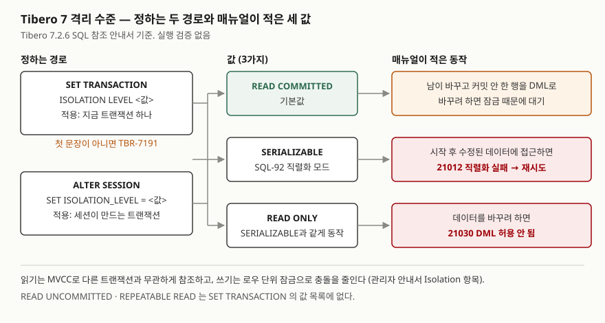

<!-- related:start -->
> **같은 기능을 다른 환경에서 다룬 글** (`transaction-isolation`)
> - [트랜잭션 격리 수준별로 실제 무슨 이상 현상이 보이는가](../../sqlite/2026-09-21-isolation-level-anomalies/index.md) — SQLite 3.49.1, Python 3.13.5
> - [트랜잭션 ACID와 격리 수준 — 이상현상으로 수준을 정의하는 방식](../../../PE/database/2026-09-23-acid-and-isolation-levels/index.md) — PostgreSQL 16 문서, Berenson et al., SIGMOD 1995
<!-- related:end -->

> **실행 검증 없음.** 이 글은 **Tibero 7.2.6 공개 매뉴얼**의 설명만 근거로 정리했다.
> 글을 쓴 시점에 검증용 Tibero 인스턴스에 접속할 수 없었다(`TBR-2131`).
> 출력·에러 화면은 싣지 않았다. 돌려 볼 스크립트는 [`code/transaction_isolation.sql`](code/transaction_isolation.sql)에 두었다.

## 들어가며

월말 정산 배치가 계좌 잔액을 두 번 읽는데, 그 사이 다른 거래가 커밋되면 두 숫자가 어긋난다.
다른 DB에서 하던 대로 `SET TRANSACTION ISOLATION LEVEL REPEATABLE READ`를 넣으려고 Tibero 매뉴얼을 펴면
그 값이 목록에 없다. 여기서 흔히 택하는 방법은 배치 앞에 `LOCK TABLE`을 걸어 버리는 것인데, 그러면
정산이 도는 동안 그 표를 바꾸려는 모든 거래가 기다린다. Tibero가 어떤 격리 수준을 어떤 문법으로 주는지부터
알아야 잠금보다 좁은 수단을 고를 수 있다.

## 개념

Tibero 7.2.6 SQL 참조 안내서의 `SET TRANSACTION` 항목은 목적을 "현재 트랜잭션의 고립성 수준이나 이름을
설정"하는 것으로 적는다. 격리 수준으로 적힌 값은 **3가지**다.

| 값 | 매뉴얼 설명 요지 |
|---|---|
| `READ COMMITTED` | **기본값.** 다른 트랜잭션이 바꾸고 아직 커밋하지 않은 로우를 DML로 바꾸려 하면 그 로우의 잠금 때문에 대기한다 |
| `SERIALIZABLE` | 세션의 트랜잭션이 SQL-92에 명시된 직렬화 모드로 동작한다 |
| `READ ONLY` | `SERIALIZABLE`과 같게 동작하지만 데이터를 바꾸려 하면 에러를 돌려준다 |

표준 SQL의 네 단계 중 `READ UNCOMMITTED`와 `REPEATABLE READ`는 이 목록에 없다. 목록에 없는 값을 넘겼을 때
어떤 에러가 나는지는 매뉴얼에 적혀 있지 않아 이 글에서 다루지 않는다(스크립트 3장에서 확인할 대상이다).

관리자 안내서의 Isolation 항목은 이 격리를 떠받치는 장치를 둘로 적는다. 데이터를 **읽을 때는 MVCC**로
다른 트랜잭션과 무관하게 참조하고, **고칠 때는 로우 단위 잠금**으로 충돌을 줄이며 같은 데이터에 접근하면
기다리게 한다. 그래서 다른 트랜잭션이 수정 중이라는 이유로 읽기가 에러를 내지는 않는다고 적는다.

## 구조



> **출처**: 경로·값·동작은 [Tibero 7.2.6 SQL 참조 안내서 — SET TRANSACTION](https://docs.tibero.com/tibero-manuals/7.2.6.manuals/sql-reference-guide/transaction-control-language/set-transaction.md)의 구성요소·예제와
> [ALTER SESSION](https://docs.tibero.com/tibero-manuals/7.2.6.manuals/sql-reference-guide/transaction-control-language/alter-session.md)의 `ISOLATION_LEVEL` 항목,
> 에러 번호는 [Tibero 7.2.6 에러 참조 안내서 — 21000 TX](https://docs.tibero.com/tibero-manuals/7.2.6.manuals/error-reference-guide/chapter-21000.tx.error.md)의 21012·21030,
> 아래 줄의 MVCC·로우 잠금은 [Tibero 7.2.6 관리자 안내서 — Tibero 소개](https://docs.tibero.com/tibero-manuals/7.2.6.manuals/administrator-guide/introduction.md)의 Isolation 항목을 따랐다.
> 세 열로 나란히 놓은 것은 글쓴이의 정리다.

## 동작 원리

### 두 경로 — 적용 범위가 다르다

| 경로 | 문법 | 적용 범위 | 제약 |
|---|---|---|---|
| 트랜잭션 단위 | `SET TRANSACTION ISOLATION LEVEL <값>` | 지금 트랜잭션 하나 | 트랜잭션의 **첫 문장**이어야 한다 |
| 세션 단위 | `ALTER SESSION SET ISOLATION_LEVEL = <값>` | 현재 세션에서 생성하는 트랜잭션 | 매뉴얼에 별도 제약이 적혀 있지 않다 |

`SET TRANSACTION`에는 `NAME '<이름>'`도 쓸 수 있고 기본값은 NULL이다. 문법 요소 이름은 `ISOLATION LEVEL`과
`ISOLATION_LEVEL` 두 표기가 함께 적혀 있다. 이 문장은 따로 필요한 권한이 없다.

### 첫 문장 제약 — TBR-7191

매뉴얼 예제는 트랜잭션이 시작된 뒤 `SET TRANSACTION`을 수행하면
`TBR-7191: Unable to execute SET TRANSACTION: transaction has already started.`가 나는 것을 보여 준다.
실무에서 이 제약이 걸리는 자리는 두 곳이다.

- **직전 트랜잭션을 닫지 않은 경우.** 앞선 DML 뒤에 `COMMIT`이나 `ROLLBACK`이 없으면 새 트랜잭션이 아니다
- **연결 풀이 넘겨준 연결.** 앞 사용자가 열어 둔 트랜잭션이 남아 있으면 같은 에러가 난다

`SELECT` 한 문장만 수행한 뒤에도 트랜잭션이 시작된 것으로 치는지는 매뉴얼에 적혀 있지 않다. 스크립트 1-C가 이것을 본다.

### SERIALIZABLE이 실패하는 순간 — 21012

`SERIALIZABLE`은 매뉴얼 설명만 보면 동작이 한 줄이다. 실제로 무슨 일이 일어나는지는 에러 참조 안내서가 더 많이 알려 준다.
에러 21012(`ERROR_TX_CANT_SERIALIZE`)는 "이 트랜잭션에 대한 액세스 직렬화 실패"이고, 원인은
**트랜잭션이 시작된 후 수정된 데이터에 액세스를 시도한 것**, 조치는 커밋이나 롤백한 뒤 **재시도**다.

즉 `SERIALIZABLE`은 충돌을 기다려서 푸는 것이 아니라 **에러로 돌려주고 애플리케이션에 재시도를 맡기는** 방식이다.
`READ COMMITTED`의 설명이 "대기"로 끝나는 것과 대비된다. `SERIALIZABLE`을 켜는 코드는 21012를 받아 트랜잭션을 처음부터
다시 도는 경로를 함께 가져야 한다.

### READ ONLY — 격리 수준 자리에 있는 접근 모드

`READ ONLY`는 `SERIALIZABLE`과 같게 동작하되 쓰기를 막는다. SQL-92의 직렬화 수준은 반복 불가능 읽기와 팬텀을 허용하지 않으므로,
매뉴얼 설명대로라면 한 트랜잭션 안에서 같은 조회를 되풀이해도 다른 트랜잭션의 커밋이 끼어들지 않아야 한다. 쓰기를 시도하면 에러 21030(`ERROR_TX_DML_NOT_ALLOWED`,
"DML 작업 허용되지 않음")이 나고, 조치는 커밋이나 롤백한 뒤 재시도다. 정산·보고서처럼 여러 번 읽는 동안 같은 시점을
봐야 하고 쓰기는 없는 작업이 이 값에 맞는다.

## 실습 예제

아래는 확인 절차의 모양이다. **실행하지 않았다.** 매뉴얼대로라면 어떻게 나와야 하는지만 적는다.

```sql
SET TRANSACTION ISOLATION LEVEL SERIALIZABLE;
SELECT balance FROM iso_account WHERE account_id = 1;
COMMIT;

UPDATE iso_account SET balance = balance WHERE account_id = 1;
SET TRANSACTION ISOLATION LEVEL SERIALIZABLE;
ROLLBACK;

SET TRANSACTION ISOLATION LEVEL READ ONLY;
UPDATE iso_account SET balance = 0 WHERE account_id = 1;
ROLLBACK;

ALTER SESSION SET ISOLATION_LEVEL = SERIALIZABLE;
```

매뉴얼대로라면 첫 묶음은 성공하고, 두 번째 묶음의 `SET TRANSACTION`에서 TBR-7191이, 세 번째의 `UPDATE`에서 21030이 나야 한다.
21012는 세션 두 개를 번갈아 돌려야 보이므로 [`code/README.md`](code/README.md)에 5단계 순서표로 따로 적었다.

## 어느 상황에 무엇을 쓰는가

| 상황 | 쓸 것 | 이유 |
|---|---|---|
| 대부분의 OLTP 거래 | 기본값 `READ COMMITTED` | 충돌은 잠금 대기로 풀리고 재시도 코드가 필요 없다 |
| 여러 번 읽는 동안 한 시점을 봐야 하는 보고서·정산 | `SET TRANSACTION ISOLATION LEVEL READ ONLY` | `SERIALIZABLE`처럼 동작하면서 실수로 쓰는 것을 막는다 |
| 읽은 값을 근거로 쓰는 거래가 동시에 돌아 서로의 전제를 깰 수 있다 | `SERIALIZABLE` + 21012 재시도 | 충돌이 에러로 드러난다 |
| 특정 로우 몇 개만 지키면 된다 | `SELECT … FOR UPDATE [NOWAIT \| WAIT n \| SKIP LOCKED]` | 조회한 로우에만 잠금을 건다. 표 전체를 막는 `LOCK TABLE`보다 좁다 |
| 한 세션의 모든 트랜잭션을 같은 수준으로 | `ALTER SESSION SET ISOLATION_LEVEL` | 트랜잭션마다 첫 문장을 신경 쓰지 않아도 된다 |

`FOR UPDATE`의 옵션 설명은 SQL 참조 안내서의 SELECT 항목을 따랐다. 잠금이 있으면 `NOWAIT`는 기다리지 않고,
`WAIT n`은 n초 동안 시도하며, `SKIP LOCKED`는 그 로우를 건너뛴다.

## 다른 환경에서는

| 항목 | Tibero 7 (7.2.6 매뉴얼) | PostgreSQL 16 (문서) | SQLite 3.49.1 (실행) |
|---|---|---|---|
| 고를 수 있는 값 | `READ COMMITTED`, `SERIALIZABLE`, `READ ONLY` | `READ UNCOMMITTED`, `READ COMMITTED`, `REPEATABLE READ`, `SERIALIZABLE` | 고르는 설정이 없다 |
| 기본값 | `READ COMMITTED` | `READ COMMITTED` | 직렬화 가능 |
| `READ ONLY`의 자리 | 격리 수준 값 중 하나 | 격리 수준과 별개인 접근 모드 | 해당 없음 |
| `READ UNCOMMITTED` | 값 목록에 없다 | 받아들이되 `READ COMMITTED`로 다룬다 | 해당 없음 |
| 바꿀 수 있는 시점 | 트랜잭션 첫 문장 (어기면 TBR-7191) | 첫 질의·데이터 변경 문장 전 | 해당 없음 |
| 세션 기본값 | `ALTER SESSION SET ISOLATION_LEVEL` | `SET SESSION CHARACTERISTICS AS TRANSACTION …` 또는 `default_transaction_isolation` | 해당 없음 |

가장 헷갈리기 쉬운 곳은 `READ ONLY`의 자리다. PostgreSQL 16은 격리 수준, 접근 모드(읽기·쓰기 또는 읽기 전용),
지연 모드를 **각각 따로** 고른다. Tibero 7.2.6 매뉴얼은 `READ ONLY`를 격리 수준 값으로 적고 동작을 `SERIALIZABLE`에
묶는다. 그래서 PostgreSQL의 `READ COMMITTED READ ONLY` 같은 조합을 Tibero의 `SET TRANSACTION` 한 줄로 옮길 방법은
매뉴얼에서 찾지 못했다. SQLite는 격리 수준을 고르지 않고 트랜잭션 경계와 잠금 상태로 같은 문제를 다룬다 — 관련 글에서 실행해 확인했다.

## 실무에서 주의할 점

- **이식할 때 `REPEATABLE READ`를 그대로 옮기지 않는다.** Tibero 7.2.6 매뉴얼의 값 목록에 없다. 읽기만 하는 작업이면
  `READ ONLY`, 쓰기가 섞이면 `SERIALIZABLE`로 바꾸고 재시도 경로를 넣는다.
- **`SERIALIZABLE`을 켜면 재시도 코드도 같이 넣는다.** 에러 21012의 조치가 "커밋이나 롤백 후 재시도"다. 켜기만 하면
  동시 거래가 몰릴 때 오류 응답이 늘어난다.
- **`SET TRANSACTION` 앞에 트랜잭션을 닫는다.** 연결 풀에서 받은 연결은 먼저 `ROLLBACK`하고 시작하면 TBR-7191을 피한다.
- **세션 단위 설정은 풀에서 연결을 돌려줄 때 되돌린다.** `ALTER SESSION`은 그 세션이 이후 만드는 트랜잭션에 적용되므로,
  되돌리지 않으면 다음 사용자가 모르는 채 `SERIALIZABLE`로 돈다.
- **표 잠금은 마지막 수단으로 둔다.** 몇 로우만 지키면 되는 경우 `FOR UPDATE`가 범위가 좁고, `NOWAIT`·`WAIT n`으로 대기 시간도 정할 수 있다.

## 정리

- Tibero 7.2.6 매뉴얼의 격리 수준 값은 3가지다: `READ COMMITTED`(기본값), `SERIALIZABLE`, `READ ONLY`.
- 정하는 경로는 2가지다: 트랜잭션 첫 문장의 `SET TRANSACTION`(어기면 TBR-7191), 세션 단위의 `ALTER SESSION SET ISOLATION_LEVEL`.
- `READ COMMITTED`는 충돌을 잠금 대기로, `SERIALIZABLE`은 에러 21012와 재시도로 푼다.
- `READ ONLY`는 `SERIALIZABLE`과 같게 동작하고 쓰기를 21030으로 막는다. PostgreSQL처럼 격리 수준과 따로 고르는 모드가 아니다.

## 참고 자료

- [Tibero 7.2.6 SQL 참조 안내서 — SET TRANSACTION](https://docs.tibero.com/tibero-manuals/7.2.6.manuals/sql-reference-guide/transaction-control-language/set-transaction.md) — 값 3가지, `NAME`, 첫 문장 제약과 TBR-7191 예제
- [Tibero 7.2.6 SQL 참조 안내서 — ALTER SESSION](https://docs.tibero.com/tibero-manuals/7.2.6.manuals/sql-reference-guide/transaction-control-language/alter-session.md) — `ISOLATION_LEVEL`
- [Tibero 7.2.6 SQL 참조 안내서 — SELECT](https://docs.tibero.com/tibero-manuals/7.2.6.manuals/sql-reference-guide/sql-queries/select.md) — `FOR UPDATE`, `NOWAIT`·`WAIT`·`SKIP LOCKED`
- [Tibero 7.2.6 에러 참조 안내서 — 21000 TX](https://docs.tibero.com/tibero-manuals/7.2.6.manuals/error-reference-guide/chapter-21000.tx.error.md) — 21012 `ERROR_TX_CANT_SERIALIZE`, 21030 `ERROR_TX_DML_NOT_ALLOWED`
- [Tibero 7.2.6 관리자 안내서 — Tibero 소개](https://docs.tibero.com/tibero-manuals/7.2.6.manuals/administrator-guide/introduction.md) — Isolation 항목의 MVCC·로우 단위 잠금
- [PostgreSQL 16 — SET TRANSACTION](https://www.postgresql.org/docs/16/sql-set-transaction.html) — 네 수준, 접근 모드와 격리 수준의 구분, 변경 가능 시점
