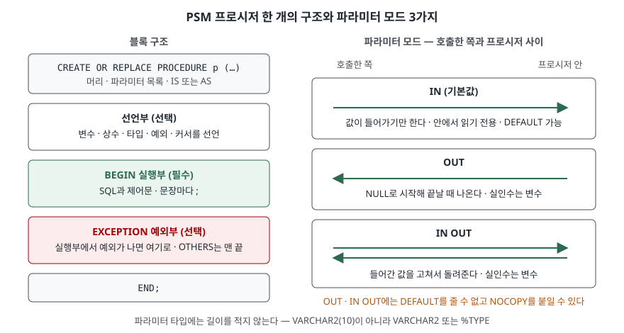

> **실행 검증 없음.** 이 글은 **Tibero 7.2.6 공개 매뉴얼**의 설명만 근거로 정리했다.
> 글을 쓴 시점에 검증용 Tibero 인스턴스에 접속할 수 없었다(`TBR-2131`).
> 출력·에러 화면은 싣지 않았다. 에러 번호는 매뉴얼에 적힌 것이다.
> 돌려 볼 스크립트는 [`code/psm_procedure.sql`](code/psm_procedure.sql)에 두었다.

## 들어가며

출금 처리를 애플리케이션에서 짜면 잔액 조회, 잔액 비교, 차감 `UPDATE`가 각각 따로 DB를 왕복한다.
같은 규칙을 배치와 관리 화면에도 넣다 보면 세 군데의 코드가 조금씩 달라진다. 그래서 이 로직을 DB 안의
프로시저 하나로 옮기기로 하는데, Oracle PL/SQL 예제를 그대로 붙여 넣었다가 `VARCHAR2(10)` 파라미터나
`OUT` 기본값 때문에 컴파일 에러를 만나는 경우가 흔하다. 문제는 에러가 나도 객체는 만들어진다는 점이다.
`Procedure created`만 보고 넘어가면 실제 호출 때가 돼서야 실패한다.

## 개념

Tibero의 절차형 언어는 **tbPSM**(Persistent Stored Module)이다. tbPSM 안내서는 프로그램 단위를 **블록**으로 적고,
블록 종류를 3가지로 나눈다.

| 종류 | 매뉴얼 설명 요지 |
|---|---|
| 이름 없는 블록 (`DECLARE … BEGIN … END;`) | 이름 없이 실행 시점에 컴파일되어 수행된다 |
| 저장 서브 프로그램 | `CREATE` 문으로 컴파일해 DB에 저장한다. 프로시저·함수·패키지·오브젝트 타입의 메소드 |
| 트리거 | 정해진 이벤트가 생기면 자동으로 수행된다 |

저장 서브 프로그램 중 **프로시저**는 값을 돌려주지 않고, **함수**는 `RETURN 타입`을 선언하고 `RETURN` 문으로 값을 돌려준다.
매뉴얼이 SQL 식 안에서 부르는 방법으로 적은 것은 함수뿐이다. 함수가 `RETURN`을 지나지 않고 끝나면 호출 시점에 TBR-15085가 난다.
이 글은 프로시저만 다룬다.

## 구조



> **출처**: 블록 구조는 [Tibero 7.2.6 tbPSM 안내서 — tbPSM 소개](https://docs.tibero.com/tibero-manuals/7.2.6.manuals/tbpsm-guide/introduction-to-tbpsm.md)의 블록 구성,
> 프로시저 머리와 파라미터 모드·기본값·NOCOPY·타입 길이 제약은 [tbPSM 안내서 — 서브 프로그램](https://docs.tibero.com/tibero-manuals/7.2.6.manuals/tbpsm-guide/subprograms.md)의
> 프러시저·파라미터 모드·기본값·NOCOPY 지정 항목을 따랐다. 두 칸으로 나란히 놓은 것은 글쓴이의 정리다.

## 동작 원리

### 프로시저 머리

tbPSM 안내서가 텍스트로 적은 문법은 다음 모양이다. SQL 참조 안내서의 `CREATE PROCEDURE` 구문 도식은 이미지라서 이쪽을 따랐다.

```sql
[CREATE [OR REPLACE]] PROCEDURE procedure_name [(parameter[, parameter])]
    [AUTHID {DEFINER | CURRENT_USER}] {AS | IS}
[PRAGMA AUTONOMOUS_TRANSACTION;]
[declaration_section]
BEGIN
  execution_section
[EXCEPTION exception_handling_section]
END;
```

- `OR REPLACE`로 다시 만들면 **이미 준 객체 권한이 유지된다.** 지우고 다시 만들면 권한을 다시 줘야 한다
- `IS`와 `AS`는 뜻이 같다. 이 단어가 이름 없는 블록의 `DECLARE` 자리를 대신한다
- `AUTHID`를 생략하면 `DEFINER`, 즉 만든 사람의 권한으로 돈다. `CURRENT_USER`면 호출한 사람의 권한이다
- 자기 스키마에 만들려면 `CREATE PROCEDURE` 권한이 필요하다. 다른 스키마에 만들면 `CREATE ANY PROCEDURE`가,
  남의 프로시저를 바꾸면 `ALTER ANY PROCEDURE`가 필요하다

### 파라미터 모드 3가지

| 모드 | 프로시저 안에서 | 실인수 | 기본값 | 어기면 |
|---|---|---|---|---|
| `IN` (생략 시 기본) | 읽기 전용 | 매뉴얼에 별도 조건 없음 | `DEFAULT` 또는 `:=` | 대입하면 TBR-15055 (컴파일) |
| `OUT` | NULL로 시작 | 대입할 수 있는 변수 | 줄 수 없다 | 기본값 TBR-15023, 리터럴 실인수 TBR-15055 |
| `IN OUT` | 들어온 값으로 시작, 고쳐서 돌려준다 | 대입할 수 있는 변수 | 줄 수 없다 | 기본값 TBR-15023 |

여기에 규칙이 세 가지 더 붙는다.

- **타입에 길이를 적지 않는다.** `p_name VARCHAR2(10)`은 TBR-15067이다. 컬럼 타입을 따라가려면 `psm_account.owner%TYPE`을 쓴다
- **`NOCOPY`는 `OUT`·`IN OUT`에만 붙인다.** 값을 복사하는 대신 포인터를 넘긴다. `IN`에 붙이면 TBR-15002다
- **이름 표기**(`p_amount => 100`)와 위치 표기를 섞을 수 있지만, 이름 표기 뒤에 위치 표기가 오면 TBR-15066이다

### 예외부

실행부에서 예외가 나면 예외부의 `WHEN 예외이름 THEN`이 그것을 받는다. 매뉴얼이 적은 시스템 정의 예외 중 자주 만나는 것은 다음과 같다.

| 예외 이름 | 에러 번호 | 언제 |
|---|---|---|
| `NO_DATA_FOUND` | TBR-15104 | `SELECT INTO` 결과가 0행 |
| `TOO_MANY_ROWS` | TBR-15114 | `SELECT INTO` 결과가 2행 이상 |
| `ZERO_DIVIDE` | TBR-5070 | 0으로 나눔 |
| `DUP_VAL_ON_INDEX` | TBR-10007 | UNIQUE 컬럼에 중복 값 |

직접 만든 예외는 선언부에 `e_name EXCEPTION;`으로 선언하고 `RAISE e_name;`으로 일으킨다.
호출한 쪽에 번호와 문구를 정해서 넘기려면 `RAISE_APPLICATION_ERROR(번호, 문구)`를 쓴다. 번호는 **-20000부터 -20999까지**이고,
벗어나면 TBR-14009다. `WHEN OTHERS`는 맨 끝에 둬야 하며, 뒤에 다른 `WHEN`이 오면 TBR-15024로 컴파일되지 않는다.
처리하지 못한 예외는 원래 에러와 함께 TBR-15163(처리되지 않은 예외와 줄 번호)으로 보고된다.

### 컴파일이 실패해도 객체는 남는다

서브 프로그램 항목은 컴파일 에러가 나도 **객체는 만들어지고 상태가 `INVALID`로 남는다**고 적는다. 실행할 수는 없다.
에러 내용은 tbSQL의 `SHOW ERRORS`나 `USER_ERRORS` 뷰로 본다. `USER_OBJECTS.STATUS`가 `VALID`인지 확인하는 습관이 여기서 나온다.

## 실습 예제

아래는 확인 절차의 모양이다. **실행하지 않았다.** 매뉴얼대로라면 어떻게 나와야 하는지만 적는다.

```sql
CREATE OR REPLACE PROCEDURE psm_withdraw (
  p_account_id  IN     NUMBER,
  p_amount      IN     NUMBER,
  p_new_balance OUT    NUMBER,
  p_call_count  IN OUT NUMBER,
  p_memo        IN     VARCHAR2 DEFAULT 'withdraw'
)
IS
  v_balance      psm_account.balance%TYPE;
  e_insufficient EXCEPTION;
BEGIN
  p_call_count := p_call_count + 1;
  SELECT balance INTO v_balance FROM psm_account WHERE account_id = p_account_id;
  IF v_balance < p_amount THEN
    RAISE e_insufficient;
  END IF;
  UPDATE psm_account SET balance = balance - p_amount WHERE account_id = p_account_id;
  p_new_balance := v_balance - p_amount;
EXCEPTION
  WHEN NO_DATA_FOUND THEN
    RAISE_APPLICATION_ERROR(-20001, 'no account ' || p_account_id);
  WHEN e_insufficient THEN
    RAISE_APPLICATION_ERROR(-20002, 'insufficient balance ' || v_balance);
END;
/
```

부르는 방법은 매뉴얼에 3가지가 있다.

```sql
BEGIN psm_withdraw(1, 300, v_new, v_cnt); END;    -- 이름 없는 블록 안에서
CALL psm_withdraw(1, 50, :v_new, :v_cnt);         -- SQL 문: OUT은 바인드 변수로 받는다
EXEC CALL psm_withdraw(1, 50, :v_new, :v_cnt);    -- tbSQL 명령: 뒤에 CALL 문이나 블록을 둔다
```

`EXEC`는 서버의 SQL 문이 아니라 **tbSQL 명령**이다. tbSQL 안내서는 `EXECUTE` 뒤에 올 수 있는 것을 `CALL` 문과 이름 없는 블록으로 적는다.
Oracle SQL*Plus처럼 `EXEC psm_withdraw(...)`로 프로시저 이름을 바로 쓰는 형태는 그 항목의 예제에 없다. 스크립트 4번이 이 형태를 함께 시험한다.
바인드 변수는 `VAR v_new NUMBER`로 선언하고 `PRINT v_new`로 본다.
애플리케이션 드라이버에서는 `CALL`이나 블록을 쓴다. `CALL`은 대상의 `EXECUTE` 권한(또는 `EXECUTE ANY PROCEDURE`)이 필요하고,
`INTO` 절은 함수를 부를 때만 쓴다.

스크립트는 이 밖에 `OUT` 자리에 리터럴 0을 넘기는 호출(매뉴얼대로면 TBR-15055), 컴파일 에러 세 가지(`IN` 대입·`OUT` 기본값·타입 길이)와
그 뒤의 `INVALID` 상태, 처리하지 않은 0 나누기(TBR-5070과 TBR-15163)를 차례로 확인하도록 짜 두었다.
5번 묶음에서 예외로 끝난 호출 뒤 `IN OUT` 변수에 증가한 값이 남는지는 매뉴얼에 적혀 있지 않아 이 글에서 다루지 않는다.

## 어느 상황에 무엇을 쓰는가

| 상황 | 쓸 것 | 이유 |
|---|---|---|
| 값을 넘겨 받기만 한다 | `IN` (모드 생략) | 안에서 바뀌지 않는다는 것이 컴파일 시점에 보장된다 |
| 결과를 여러 개 돌려줘야 한다 | `OUT` 여러 개 | 프로시저는 반환값이 없다. 하나면 함수도 후보다 |
| 호출한 쪽이 가진 값을 고쳐서 돌려준다 | `IN OUT` | 누적 카운터·상태 값처럼 들어온 값이 시작점일 때 |
| 큰 컬렉션을 `OUT`으로 넘긴다 | `OUT NOCOPY` | 복사 대신 포인터를 넘긴다 |
| 잘 쓰지 않는 옵션 인자 | `IN … DEFAULT` + 이름 표기 | 호출 쪽이 필요한 것만 이름으로 넘긴다 |
| 업무 규칙 위반을 호출한 쪽에 알린다 | `RAISE_APPLICATION_ERROR(-20xxx, …)` | 번호로 분기할 수 있다. 번호 표를 팀에서 정해 둔다 |

## 다른 환경에서는

| 항목 | Tibero 7 (7.2.6 매뉴얼) | PostgreSQL 16 (문서) |
|---|---|---|
| 모드 표기 | `IN`, `OUT`, `IN OUT` (두 단어) | `IN`, `OUT`, `INOUT` (한 단어), `VARIADIC` |
| 모드 생략 시 | `IN` | `IN` |
| 기본값 | `IN`만, `DEFAULT` 또는 `:=` | `DEFAULT` 또는 `=`. 기본값 있는 입력 파라미터 뒤의 입력 파라미터는 모두 기본값이 있어야 한다 |
| 복사 없이 넘기기 | `NOCOPY` | 해당 없음 |
| 부르는 방법 | 블록 안, `CALL`, tbSQL의 `EXEC` | `CALL` |
| 본문 언어 | tbPSM | `LANGUAGE` 절로 고른다 (SQL, PL/pgSQL 등) |

PostgreSQL 16의 `CALL`은 출력 파라미터를 결과 행 하나로 돌려주고, 일반 SQL에서는 `OUT` 자리에 `NULL`을 자리표시자로 넣는다.
Tibero는 `CALL`의 `OUT` 자리에 바인드 변수를 넣어 받는다. 이식할 때 호출 코드의 모양이 달라지는 지점이다.

## 실무에서 주의할 점

- **`Procedure created`만 보고 넘어가지 않는다.** 컴파일 에러가 있어도 객체는 `INVALID`로 생긴다. 배포 스크립트 끝에서
  `USER_OBJECTS`의 `STATUS`를 조회해 `INVALID`가 0개인지 확인한다.
- **Oracle 코드를 옮길 때 파라미터 타입의 길이를 지운다.** `VARCHAR2(10)`은 TBR-15067이다. `%TYPE`으로 바꾸면 컬럼 타입이 바뀌어도 따라간다.
- **`OUT`은 NULL로 시작한다.** 안에서 `p_out := p_out + 1`처럼 들어온 값을 쓰려 했다면 `IN OUT`이어야 한다.
- **`WHEN OTHERS THEN NULL`로 예외를 삼키지 않는다.** 호출한 쪽은 성공으로 안다. 처리할 수 없는 예외는 `RAISE;`로 다시 던진다.
- **`RAISE_APPLICATION_ERROR` 번호는 -20000~-20999 안에서 팀이 표로 관리한다.** 범위를 벗어나면 TBR-14009로 원래 의도한 에러가 가려진다.
- **프로시저를 지우면 그것을 부르는 서브 프로그램이 무효가 된다.** `DROP PROCEDURE` 항목은 참조하던 함수·프로시저가 다음 실행 때
  재컴파일을 시도하고 에러를 낸다고 적는다. 내용만 바꿀 때는 `CREATE OR REPLACE`를 쓴다 — 이미 준 객체 권한도 유지된다.

## 정리

- tbPSM 블록은 3부분이다: 선언부(선택), 실행부(필수), 예외부(선택). 프로시저는 `IS`/`AS`가 `DECLARE`를 대신한다.
- 파라미터 모드는 3가지다: `IN`(기본, 읽기 전용), `OUT`(NULL로 시작), `IN OUT`. 기본값은 `IN`만, `NOCOPY`는 `OUT`·`IN OUT`만.
- 타입에 길이를 적지 않는다(TBR-15067). 부르는 방법은 블록 안, `CALL`, tbSQL `EXEC` 3가지다.
- 예외는 `RAISE`·`RAISE_APPLICATION_ERROR`(-20000~-20999)로 던지고, `OTHERS`는 맨 끝에 둔다.
- 컴파일이 실패해도 객체는 `INVALID`로 남는다. `SHOW ERRORS`·`USER_ERRORS`·`USER_OBJECTS.STATUS`로 확인한다.

## 참고 자료

- [Tibero 7.2.6 tbPSM 안내서 — tbPSM 소개](https://docs.tibero.com/tibero-manuals/7.2.6.manuals/tbpsm-guide/introduction-to-tbpsm.md) — 블록 3부분과 블록 종류 3가지
- [Tibero 7.2.6 tbPSM 안내서 — 서브 프로그램](https://docs.tibero.com/tibero-manuals/7.2.6.manuals/tbpsm-guide/subprograms.md) — 프로시저 문법, 파라미터 모드·기본값·이름 표기·NOCOPY, 컴파일 오류 확인, 함수와의 차이
- [Tibero 7.2.6 tbPSM 안내서 — 에러 처리](https://docs.tibero.com/tibero-manuals/7.2.6.manuals/tbpsm-guide/error-handling.md) — 시스템 정의 예외와 번호, 사용자 정의 예외, `RAISE_APPLICATION_ERROR` 범위, `OTHERS` 위치, 처리되지 않은 예외
- [Tibero 7.2.6 SQL 참조 안내서 — CREATE PROCEDURE](https://docs.tibero.com/tibero-manuals/7.2.6.manuals/sql-reference-guide/data-definition-language/create-procedure.md) — `OR REPLACE`와 권한 유지, `AUTHID`, 필요한 권한
- [Tibero 7.2.6 SQL 참조 안내서 — DROP PROCEDURE](https://docs.tibero.com/tibero-manuals/7.2.6.manuals/sql-reference-guide/data-definition-language/drop-procedure.md) — `IF EXISTS`, 참조하던 서브 프로그램의 무효화
- [Tibero 7.2.6 SQL 참조 안내서 — CALL](https://docs.tibero.com/tibero-manuals/7.2.6.manuals/sql-reference-guide/data-manipulation-language/call.md) — 대상, `INTO` 절, 필요한 권한, 바인드 변수 예제
- [Tibero 7.2.6 유틸리티 안내서 — tbSQL](https://docs.tibero.com/tibero-manuals/7.2.6.manuals/utility-guide/tbsql.md) — `EXECUTE`, PSM 프로그램 입력, `SERVEROUTPUT`, `VARIABLE`·`PRINT`
- [PostgreSQL 16 — CREATE PROCEDURE](https://www.postgresql.org/docs/16/sql-createprocedure.html) — 모드 표기와 기본값 규칙
- [PostgreSQL 16 — CALL](https://www.postgresql.org/docs/16/sql-call.html) — 출력 파라미터를 결과 행으로 돌려주는 방식
