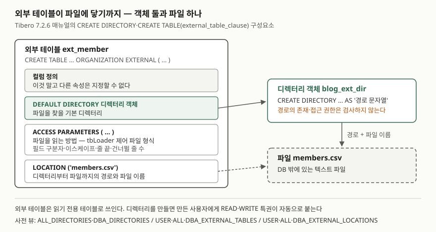

> **실행 검증 없음.** 이 글은 **Tibero 7.2.6 공개 매뉴얼**의 설명만 근거로 정리했다.
> 글을 쓴 시점에 검증용 Tibero 인스턴스에 접속할 수 없었다(`TBR-2131`).
> 출력이나 에러 메시지는 싣지 않았다. 돌려 볼 스크립트와 데이터 파일은 [`code/`](code/)에 두었다.

## 들어가며

다른 시스템이 매일 밤 CSV 파일을 떨궈 주고, 그 내용을 DB의 기준 정보와 대조해야 하는 일이 있다. 보통은
tbLoader로 임시 테이블에 적재하고, 조인해 확인하고, 임시 테이블을 비우는 세 단계를 매일 돌린다. 파일이 바뀔
때마다 적재를 다시 해야 하고, 적재가 실패하면 대조는 시작도 못 한다. 파일을 그 자리에 둔 채 `SELECT`로 바로
읽을 수 있으면 적재 단계가 통째로 빠진다. 외부 테이블이 그 방법이다.

## 개념

Tibero 7.2.6 SQL 참조 안내서는 외부 테이블을 **데이터베이스 바깥 파일의 메타데이터를 지정해 그 데이터를
읽기 전용 테이블로 쓰는 것**으로 설명한다. 테이블에 적는 것은 "어느 파일을 어떻게 읽을지"라는 정의다.

만드는 데 객체가 둘 필요하다.

| 객체 | 문장 | 하는 일 |
|---|---|---|
| 디렉터리 객체 | `CREATE DIRECTORY 이름 AS '경로'` | 파일 시스템 경로에 DB 안의 이름을 붙인다 |
| 외부 테이블 | `CREATE TABLE … ORGANIZATION EXTERNAL (…)` | 디렉터리 객체와 파일 이름, 읽는 방법을 묶는다 |

tbLoader와 비교하면 차이가 분명하다. tbLoader는 파일의 행을 테이블에 **복사해 넣는다.** 외부 테이블은 파일의
메타데이터만 지정하고 데이터는 파일에 둔 채 쓴다. 파일 형식을 적는 문법은 tbLoader의 것을 그대로 빌려 쓴다.

## 구조



> **출처**: 외부 테이블 구성요소는 [Tibero 7.2.6 SQL 참조 안내서 — CREATE TABLE](https://docs.tibero.com/tibero-manuals/7.2.6.manuals/sql-reference-guide/data-definition-language/create-table.md)의 physical_properties·external_table_clause 항목,
> 디렉터리 객체와 경로 미검사·자동 특권은 [CREATE DIRECTORY](https://docs.tibero.com/tibero-manuals/7.2.6.manuals/sql-reference-guide/data-definition-language/create-directory.md),
> READ·WRITE 특권은 [GRANT](https://docs.tibero.com/tibero-manuals/7.2.6.manuals/sql-reference-guide/data-definition-language/grant.md)의 스키마 객체 특권 표, 사전 뷰는 [참조 안내서 — 정적 뷰](https://docs.tibero.com/tibero-manuals/7.2.6.manuals/reference-guide/static-views.md) 목록을 따랐다.

## 동작 원리 — 한 줄씩

매뉴얼의 CREATE TABLE 예제를 이 글의 데이터에 맞춰 이름만 바꾼 것이다.

```sql
CREATE DIRECTORY blog_ext_dir AS '/tmp/blog_ext';

CREATE TABLE ext_member (
    member_id NUMBER,
    name      VARCHAR2(30),
    city      VARCHAR2(30) )
ORGANIZATION EXTERNAL
(
    DEFAULT DIRECTORY blog_ext_dir
    ACCESS PARAMETERS
    (
        LOAD DATA INTO TABLE ext_member FIELDS
            TERMINATED BY ','
            ESCAPED BY '\\'
            LINES TERMINATED BY '\n'
            IGNORE 1 LINES (member_id, name, city)
    )
    LOCATION('members.csv')
);
```

**`CREATE DIRECTORY … AS '경로'`** — 디렉터리 객체를 만든다. 매뉴얼은 두 가지를 덧붙인다. 지정한 경로가 있는지,
접근 권한이 있는지는 **검사하지 않는다.** 경로는 문자열 리터럴이라 **대소문자를 구분한다.** 만들려면
`CREATE ANY DIRECTORY` 시스템 특권이 필요하고, 만든 사용자에게는 그 디렉터리의 읽기·쓰기 권한이 자동으로
부여된다. `OR REPLACE`로 같은 이름을 다시 만들면 기존 권한과 참조는 유지된다.

**컬럼 정의** — 외부 테이블을 만들 때는 컬럼 정의 외의 다른 속성을 지정할 수 없다고 매뉴얼에 적혀 있다.

**`ORGANIZATION EXTERNAL`** — 외부 데이터 파일을 쓰겠다는 선언이다. external_table_clause 앞에 와야 한다.

**`DEFAULT DIRECTORY`** — 파일을 찾을 기본 디렉터리. 경로 문자열이 아니라 디렉터리 **객체 이름**을 쓴다.

**`ACCESS PARAMETERS ( … )`** — 파일에 접근하기 위한 메타데이터다. 매뉴얼은 이 안의 형식(tbloader_format_spec)을
유틸리티 안내서의 tbLoader 절로 넘긴다. 예제의 각 줄은 tbLoader 제어 파일의 절이다.

| 절 | tbLoader 안내서의 설명 |
|---|---|
| `FIELDS TERMINATED BY ','` | 필드 종료자를 지정한다 |
| `ESCAPED BY '\\'` | 이 문자열을 만나면 뒤따르는 문자의 의미를 확장한다. 역슬래시 하나를 지정하려면 두 개를 쓴다 |
| `LINES TERMINATED BY '\n'` | 이 문자열을 발견하면 레코드 하나가 완성된 것으로 본다 |
| `IGNORE 1 LINES` | 처음부터 지정한 수만큼의 줄을 대상에서 뺀다. 음수면 끝에서부터 뺀다 |
| `(member_id, name, city)` | 파일의 필드를 받을 컬럼 목록 |

**`LOCATION('members.csv')`** — 디렉터리부터 파일까지의 경로와 파일 이름. 디렉터리를 따로 지정하지 않으면
기본 디렉터리에서 찾는다. 디렉터리를 붙이는 표기는 매뉴얼에서 문법 도식(이미지)으로만 나와 이 글에서는
예제의 형태만 썼다.

## 실습 예제

[`code/external_table.sql`](code/external_table.sql)과 데이터 파일 [`code/members.csv`](code/members.csv)를 두었다.
**아직 돌리지 않았다.** 스크립트는 아래 10가지를 차례로 확인하고 만든 객체를 전부 지운다.

1. 없는 경로로 `CREATE DIRECTORY`가 성공하는지
2. 매뉴얼 예제 모양의 외부 테이블 조회
3. `IGNORE 1 LINES`를 뺐을 때 머리글 줄이 어떻게 되는지
4. `INSERT`·`UPDATE`·`DELETE`가 거부되는지 — 에러 코드를 본다
5. `CREATE INDEX`가 되는지
6. 컬럼에 `PRIMARY KEY`를 붙이면 생성이 거부되는지
7. 없는 파일·없는 경로를 가리킨 외부 테이블이 **생성 시점과 조회 시점 중 언제** 실패하는지
8. `USER_EXTERNAL_TABLES`·`USER_EXTERNAL_LOCATIONS` 조회
9. 파일 끝의 빠진 필드(4번 줄)를 어떻게 다루는지
10. 정리 뒤 `USER_OBJECTS` 0개와 디렉터리 객체 제거 확인

5·7·9번은 매뉴얼에 직접 적힌 답이 없다. 그래서 실행 결과가 나오기 전에는 이 글에 답을 쓰지 않는다.

## 실무에서 주의할 점

- **경로 오타는 `CREATE DIRECTORY`에서 걸리지 않는다.** 매뉴얼은 경로의 존재와 권한을 검사하지 않는다고 적는다.
  디렉터리 객체가 만들어졌다는 것은 그 경로를 읽을 수 있다는 뜻이 아니다. 대소문자도 구분하므로
  `/data/Ext`와 `/data/ext`는 다른 경로다.
- **외부 테이블은 읽기 전용이다.** 파일을 고치는 수단이 아니다. 대조 결과를 남기려면 일반 테이블에 `INSERT … SELECT`로
  옮긴다. 이 점이 tbLoader를 대신할 때의 경계다 — 여러 번 읽고 버릴 데이터는 외부 테이블, DB 안에서 고치고
  인덱스를 걸어 오래 쓸 데이터는 적재가 맞다.
- **파일 형식 규칙은 tbLoader 쪽 문서를 본다.** CREATE TABLE 쪽에는 예제 하나뿐이다. 이스케이프 문자를 역슬래시로
  쓸 때 두 개를 적어야 한다는 것도, 끝에서부터 줄을 빼는 음수 `IGNORE`도 tbLoader 안내서에만 있다.
- **윈도에서 만든 파일은 줄 끝이 다르다.** tbLoader 안내서는 윈도에서 작성한 데이터 파일이면 줄 종료 문자열에
  `\r\n`을 넣으라고(`'|\r\n'` 예시) 적는다. 매뉴얼 예제처럼 `'\n'`만 적은 정의에 윈도 파일을 물렸을 때
  무엇이 읽히는지는 매뉴얼에 없으므로 실행으로 확인할 항목이다.
- **필드가 빠진 줄을 미리 정한다.** tbLoader 안내서는 `TRAILING NULLCOLS`가 없으면 레코드 끝에 없는 컬럼 데이터를
  에러로 본다고 적는다. 외부 테이블에서 그 줄이 조회 전체를 실패시키는지, 그 줄만 빠지는지는 매뉴얼에 없다.
- **디렉터리 객체의 사전 뷰는 `ALL_`·`DBA_` 두 가지다.** 정적 뷰 목록에 `USER_DIRECTORIES`는 없다.
  내가 만든 것을 찾을 때도 `ALL_DIRECTORIES`를 본다. 외부 테이블 쪽은
  `USER_`·`ALL_`·`DBA_EXTERNAL_TABLES`와 `…_EXTERNAL_LOCATIONS`가 모두 있다.

## 정리

- 외부 테이블은 DB 밖 파일의 메타데이터를 지정해 그 데이터를 읽기 전용 테이블로 쓰는 정의다.
- 객체 둘: 경로에 이름을 붙이는 디렉터리 객체, 그 이름과 파일·읽는 방법을 묶는 `ORGANIZATION EXTERNAL` 테이블.
- 구성요소 넷: 컬럼 정의, `DEFAULT DIRECTORY`, `ACCESS PARAMETERS`, `LOCATION`. 컬럼 정의 외 속성은 못 붙인다.
- `ACCESS PARAMETERS` 안은 tbLoader 제어 파일 형식이다. 구분자·이스케이프·줄 끝·건너뛸 줄 수는 tbLoader 규칙을 따른다.
- 디렉터리 경로는 만들 때 검사하지 않고 대소문자를 구분한다.

## 참고 자료

- [Tibero 7.2.6 SQL 참조 안내서 — CREATE TABLE](https://docs.tibero.com/tibero-manuals/7.2.6.manuals/sql-reference-guide/data-definition-language/create-table.md) — physical_properties의 `ORGANIZATION EXTERNAL`, external_table_clause 구성요소, 컬럼 정의 외 속성 불가, 외부 테이블 예제
- [Tibero 7.2.6 SQL 참조 안내서 — CREATE DIRECTORY](https://docs.tibero.com/tibero-manuals/7.2.6.manuals/sql-reference-guide/data-definition-language/create-directory.md) — `CREATE ANY DIRECTORY`, 자동 부여 권한, 경로 미검사, 대소문자 구분
- [Tibero 7.2.6 SQL 참조 안내서 — DROP DIRECTORY](https://docs.tibero.com/tibero-manuals/7.2.6.manuals/sql-reference-guide/data-definition-language/drop-directory.md)
- [Tibero 7.2.6 SQL 참조 안내서 — GRANT](https://docs.tibero.com/tibero-manuals/7.2.6.manuals/sql-reference-guide/data-definition-language/grant.md) — 디렉터리 객체 특권 READ·WRITE, 시스템 특권 CREATE·DROP ANY DIRECTORY
- [Tibero 7.2.6 유틸리티 안내서 — tbLoader](https://docs.tibero.com/tibero-manuals/7.2.6.manuals/utility-guide/tbloader.md) — 제어 파일의 FIELDS·ESCAPED BY·LINES TERMINATED BY·IGNORE LINES·TRAILING NULLCOLS
- [Tibero 7.2.6 참조 안내서 — 정적 뷰](https://docs.tibero.com/tibero-manuals/7.2.6.manuals/reference-guide/static-views.md) — `ALL_`·`DBA_DIRECTORIES`, `*_EXTERNAL_TABLES`, `*_EXTERNAL_LOCATIONS`
