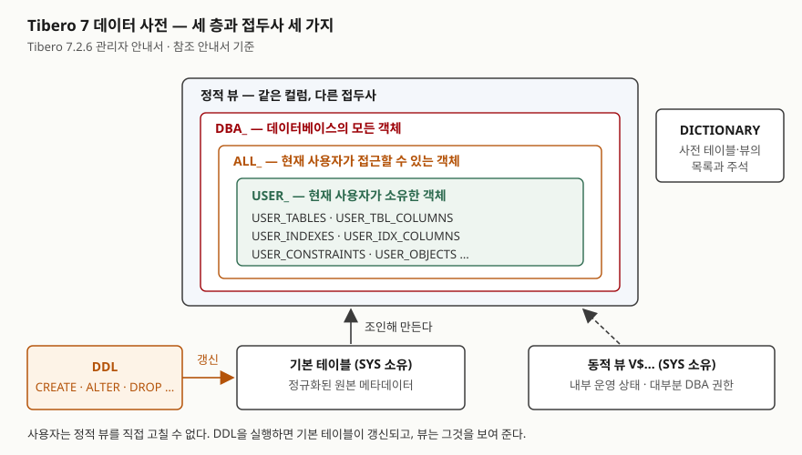

> **실행 검증 없음.** 이 글은 **Tibero 7.2.6 공개 매뉴얼**의 설명만 근거로 정리했다.
> 글을 쓴 시점에 검증용 Tibero 인스턴스에 접속할 수 없었다(`TBR-2131`).
> 출력은 싣지 않았다. 바로 돌려 볼 수 있는 스크립트를 [`code/`](code/)에 두었다.

## 들어가며

남이 만든 스키마를 넘겨받으면 첫날은 "이 테이블에 인덱스가 뭐가 걸려 있지", "이 컬럼이 NULL을 받나",
"이 프로시저는 어느 테이블을 쓰지"를 묻는 일로 지나간다. 보통은 GUI 도구를 열어 트리를 하나씩 펼치거나,
테이블마다 `DESC`를 치고, 인덱스는 또 다른 탭에서 찾는다. 테이블이 200개면 같은 클릭을 200번 하고,
"이 컬럼을 쓰는 인덱스가 어디어디 있나" 같은 질문은 트리로는 아예 답이 안 나온다.
DB는 이 정보를 전부 뷰로 갖고 있다. 어느 뷰에 무엇이 있는지만 알면 질의 한 번이면 된다.

## 개념

Tibero 7.2.6 관리자 안내서는 **데이터 사전**을 데이터베이스의 메타데이터, 즉 스키마 객체·사용자와 권한·컬럼
속성·무결성 제약·디스크 구조 같은 정보를 담는 곳으로 설명한다. 세 층으로 나뉜다.

| 층 | 무엇 | 누가 보는가 |
|---|---|---|
| 기본 테이블 | 정규화된 원본 메타데이터. SYS 사용자가 소유한다 | 일반 사용자는 직접 보지 않는다 |
| 정적 뷰 | 기본 테이블과 다른 뷰를 조인해 만든 뷰 | 일반 사용자·DBA 모두 |
| 동적 뷰 | 인스턴스의 내부 운영 상태(`V$` 접두사). SYS 스키마에 속한다 | 대부분 DBA 권한이 필요하다 |

**정적 뷰는 사용자가 직접 고칠 수 없다.** 테이블을 만들거나(`CREATE`) 지우거나(`DROP`) 권한을 주는(`GRANT`)
DDL을 실행하면 기본 테이블이 갱신되고, 정적 뷰는 그것을 보여 줄 뿐이다.

## 구조



> **출처**: 세 층과 SYS 소유, DDL로 갱신된다는 설명은 [Tibero 7.2.6 관리자 안내서 — 데이터 사전](https://docs.tibero.com/tibero-manuals/7.2.6.manuals/administrator-guide/data-dictionary.md)의 "데이터 사전의 구조"·"데이터 사전의 참조"·"데이터 사전의 갱신" 항목,
> 접두사별 범위와 DICTIONARY는 [참조 안내서 — 정적 뷰](https://docs.tibero.com/tibero-manuals/7.2.6.manuals/reference-guide/static-views.md) 개요와 목록,
> 동적 뷰의 SYS 소유·DBA 권한은 [참조 안내서 — 동적 뷰](https://docs.tibero.com/tibero-manuals/7.2.6.manuals/reference-guide/dynamic-views.md) 개요를 따랐다.

## 동작 원리 — 접두사 세 가지

정적 뷰 참조 안내서는 정적 뷰가 **접두사만 다르고 컬럼은 같은 뷰들의 묶음**이라고 적는다. 같은 "테이블 목록"이
세 이름으로 있고, 접두사가 보이는 범위를 정한다.

| 접두사 | 보이는 범위 | 예 |
|---|---|---|
| `USER_` | 현재 사용자가 **소유한** 객체 | `USER_TABLES` |
| `ALL_` | 현재 사용자가 **접근할 수 있는** 객체 | `ALL_TABLES` |
| `DBA_` | 데이터베이스의 **모든** 객체 | `DBA_TABLES` |

범위는 `USER_` ⊂ `ALL_` ⊂ `DBA_` 순으로 넓어진다. 내 스키마만 볼 때는 `USER_`, 다른 스키마의 객체 중 권한을 받은
것까지 볼 때는 `ALL_`, 운영 점검처럼 전체를 봐야 할 때는 `DBA_`를 쓴다.

어떤 뷰가 있는지 모르겠으면 `DICTIONARY` 뷰를 먼저 본다. 매뉴얼은 이 뷰를 데이터 사전에 있는 테이블과 뷰에 대한
주석으로, `DICTIONARY_COLUMNS`를 그 컬럼 설명으로 적는다.

## 무엇을 어디서 찾는가

매뉴얼 정적 뷰 목록에서 자주 찾는 것만 골랐다. 설명은 매뉴얼의 한 줄 설명을 줄인 것이다. `USER_`만 적었고,
같은 이름에 `ALL_`·`DBA_`를 붙인 뷰가 함께 있다.

| 알고 싶은 것 | 뷰 | 매뉴얼 설명 |
|---|---|---|
| 내 객체 전체와 상태 | `USER_OBJECTS` | 현재 사용자가 소유한 모든 객체 |
| 테이블 | `USER_TABLES` | 현재 사용자가 소유한 모든 테이블 |
| 컬럼·타입·NULL 허용 | `USER_TBL_COLUMNS` | 소유한 테이블과 뷰의 컬럼 |
| 인덱스 | `USER_INDEXES` | 소유한 테이블의 인덱스 |
| 인덱스가 쓰는 컬럼 | `USER_IDX_COLUMNS` | 소유한 테이블의 인덱스 컬럼 |
| 제약 / 제약 컬럼 | `USER_CONSTRAINTS` / `USER_CONS_COLUMNS` | 소유한 테이블에 정의된 제약 |
| 테이블·컬럼 주석 | `USER_TAB_COMMENTS` / `USER_COL_COMMENTS` | 소유한 테이블과 뷰의 주석 |
| 프로시저·트리거 소스 | `USER_SOURCE` | 저장 객체의 소스 텍스트 |
| 컴파일 오류 | `USER_ERRORS` | 뷰·프로시저·트리거 등의 최근 오류 |
| 객체 사이 의존 | `USER_DEPENDENCIES` | 프로시저·함수·패키지·트리거·뷰 간 의존성 |
| 받은 권한 | `USER_SYS_PRIVS` / `USER_TBL_PRIVS` / `USER_ROLE_PRIVS` | 시스템·객체 권한과 역할 |
| 시퀀스 / 뷰 / 동의어 | `USER_SEQUENCES` / `USER_VIEWS` / `USER_SYNONYMS` | |
| 파티션 | `USER_TBL_PARTITIONS` | |

동적 뷰는 지금 돌고 있는 인스턴스의 상태를 본다. `V$SESSION`(각 세션의 정보), `V$SQL`·`V$SQLAREA`,
`V$LOCK`, `V$TRANSACTION`, `V$VERSION`, `V$INSTANCE`, `V$DATABASE`가 목록에 있다.
초기화 파라미터는 `V$PARAMETERS`(세션에 적용 중인 초기화 파라미터 값)다.

## 실습 예제

전체 소스: [`code/dictionary_views.sql`](code/dictionary_views.sql). **아직 돌리지 않았다.**
빈 스키마에 표 하나와 인덱스·제약·주석을 만들고 위 표의 뷰로 하나씩 찾은 뒤, 표를 지우고 `USER_OBJECTS`가 0개인지 확인한다.

```sql
SELECT column_name, data_type, nullable
  FROM user_tbl_columns WHERE table_name = 'DV_MEMBER';

SELECT index_name, column_name
  FROM user_idx_columns WHERE table_name = 'DV_MEMBER';

SELECT constraint_name, constraint_type
  FROM user_constraints WHERE table_name = 'DV_MEMBER';
```

스크립트는 Oracle 식 이름(`USER_TAB_COLUMNS`·`USER_IND_COLUMNS`)을 받는지, 일반 사용자로 `DBA_TABLES`와
`V$SESSION`을 조회하면 어떻게 되는지도 확인하게 돼 있다. 인스턴스에 다시 접속되면 그 결과로 이 글을 갱신한다.

## 실무에서 주의할 점

- **사전 뷰에서는 이름을 대문자로 찾는다.** SQL 참조 안내서는 따옴표 없는 식별자를 대소문자 구분 없이 모두
  대문자로 처리한다고 적는다. `CREATE TABLE dv_member`로 만든 표는 `table_name = 'DV_MEMBER'`로 찾아야 한다.
  소문자로 찾으면 오류 없이 0건이 나오므로 "표가 없다"로 잘못 읽기 쉽다. 반대로 `"dv_member"`처럼 따옴표로
  만든 표는 소문자 그대로 저장된다.
- **Oracle에서 쓰던 뷰 이름이 매뉴얼과 다르다.** 매뉴얼 목록은 컬럼 뷰를 `USER_TBL_COLUMNS`, 인덱스 컬럼 뷰를
  `USER_IDX_COLUMNS`, 객체 권한을 `USER_TBL_PRIVS`처럼 `TBL`·`IDX`로 적는다. Oracle 이름도 통하는 경우가 있다 —
  이 블로그의 [파티션 글](../2026-09-23-tibero7-partition-table-types/index.md)은 Tibero 7.2에서 `USER_TAB_PARTITIONS`를
  실제로 조회했다. 다만 모든 Oracle 이름이 되는지는 확인하지 못했으므로, 스크립트를 쓸 때는 매뉴얼 이름을 쓴다.
- **사전 뷰의 컬럼은 Oracle과 같다고 가정하지 않는다.** 같은 파티션 글에서 `USER_TAB_PARTITIONS`에는 Oracle의
  `PARTITION_POSITION`·`HIGH_VALUE` 대신 `PARTITION_NO`·`BOUND`가 있었다. 뷰 이름이 같아도 쓰기 전에 `DESC`로 컬럼을 본다.
- **`ALL_`에서 안 보이는 것과 없는 것은 다르다.** `ALL_`은 접근할 수 있는 객체만 보여 준다. 다른 스키마의 표가
  `ALL_TABLES`에 없으면 표가 없을 수도, 권한이 없을 수도 있다. 구분하려면 `DBA_` 뷰를 볼 수 있는 사용자에게 확인한다.
- **동적 뷰는 DBA 권한을 전제로 한다.** 매뉴얼은 대부분의 동적 뷰를 조회할 때 DBA 권한이 필요하다고 적는다.
  애플리케이션 계정으로 세션을 모니터링하는 스크립트를 짜면 운영에서 권한 오류를 만난다.

## 정리

- 데이터 사전은 기본 테이블(SYS 소유)·정적 뷰·동적 뷰 세 층이다. 정적 뷰는 DDL로만 바뀐다.
- 정적 뷰는 접두사 세 가지 — `USER_`(소유) ⊂ `ALL_`(접근 가능) ⊂ `DBA_`(전체) — 로 범위를 나누고 컬럼은 같다.
- 어떤 뷰가 있는지는 `DICTIONARY`로 찾는다.
- 매뉴얼 이름은 `USER_TBL_COLUMNS`·`USER_IDX_COLUMNS`다. 이름은 대문자로 찾는다.

## 참고 자료

- [Tibero 7.2.6 관리자 안내서 — 데이터 사전](https://docs.tibero.com/tibero-manuals/7.2.6.manuals/administrator-guide/data-dictionary.md) — 세 층, SYS, 접두사, DDL에 의한 갱신
- [Tibero 7.2.6 참조 안내서 — 정적 뷰](https://docs.tibero.com/tibero-manuals/7.2.6.manuals/reference-guide/static-views.md) — 개요, DICTIONARY, 뷰 목록과 한 줄 설명
- [Tibero 7.2.6 참조 안내서 — 동적 뷰](https://docs.tibero.com/tibero-manuals/7.2.6.manuals/reference-guide/dynamic-views.md) — SYS 소유, DBA 권한, V$ 목록
- [Tibero 7.2.6 SQL 참조 안내서 — 스키마 객체](https://docs.tibero.com/tibero-manuals/7.2.6.manuals/sql-reference-guide/sql-elements/schema-objects.md) — 따옴표 없는 식별자의 대문자 처리
