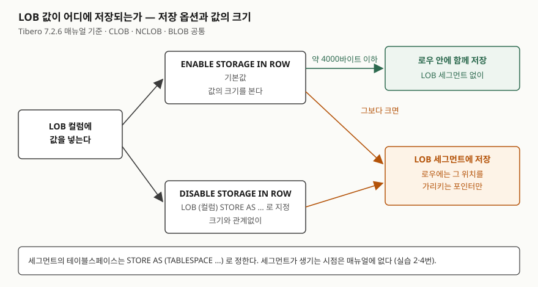

> **실행 검증 없음.** 이 글은 **Tibero 7.2.6 공개 매뉴얼**의 설명만 근거로 정리했다.
> 글을 쓴 시점에 검증용 Tibero 인스턴스에 접속할 수 없었다(`TBR-2131`).
> 출력이나 에러 메시지는 싣지 않았다. 돌려 볼 스크립트는 [`code/`](code/)에 두었다.

## 들어가며

게시판의 본문 컬럼을 `VARCHAR2(4000)`으로 잡아 두었는데 긴 공지 하나가 들어가지 않는다는 문의가 온다.
급한 대로 본문을 4000자 단위로 잘라 `post_body_part` 표에 순번과 함께 나눠 넣고, 읽을 때 순번대로 이어
붙이는 코드를 짠다. 글 하나를 보여 주려면 조각 수만큼 행을 읽어야 하고, 본문 중간을 고치면 그 뒤 조각을
전부 다시 써야 한다. 첨부 이미지는 또 파일 서버에 따로 둔다. 큰 값을 컬럼 하나에 그대로 담는 타입이 LOB이다.

## 개념

LOB(Large Object)은 일반 문자열·바이너리 타입의 한계를 넘는 큰 값을 담는 타입이다. Tibero 7.2.6 매뉴얼은
세 가지를 든다.

| 타입 | 담는 것 | 최대 크기 |
|---|---|---|
| `CLOB` | 데이터베이스 문자 집합의 문자열 | 8KB 블록 기준 32TB |
| `NCLOB` | 국가 문자 집합(National Character Set)의 문자열 | 8KB 블록 기준 32TB |
| `BLOB` | 바이너리 | 8KB 블록 기준 32TB |

같은 일을 하던 옛 타입이 `LONG`(문자)과 `LONG RAW`(바이너리)다. 개발 안내서는 새 응용에서는 `LONG` 대신
`CLOB`, `LONG RAW` 대신 `BLOB`을 쓰라고 권한다. 매뉴얼이 드는 차이는 이렇다.

| | `CLOB`·`NCLOB`·`BLOB` | `LONG`·`LONG RAW` |
|---|---|---|
| 최대 크기 | 32TB (8KB 블록 기준) | 2GB |
| 한 테이블에 | 여러 컬럼에 선언할 수 있다 | 한 컬럼에만 |
| 접근 | 임의의 위치에서 | 항상 순차적으로만 |
| 저장 위치 | 로우에는 포인터만, 값은 별도 블록 | 다른 컬럼과 같은 블록 |
| 인덱스 | 매뉴얼에 언급 없음 | 만들 수 없다 |

## 구조



> **출처**: [Tibero 7.2.6 SQL 참조 안내서 — CREATE TABLE](https://docs.tibero.com/tibero-manuals/7.2.6.manuals/sql-reference-guide/data-definition-language/create-table.md)의 colprop·lob_param 항목(`ENABLE`/`DISABLE STORAGE IN ROW`, 기본값, 약 4000바이트, `TABLESPACE`),
> [SQL 참조 안내서 — 데이터 타입](https://docs.tibero.com/tibero-manuals/7.2.6.manuals/sql-reference-guide/sql-elements/data-types.md)의 대용량 객체형 항목(로우에는 별도 블록을 가리키는 포인터만 저장).

## 동작 원리 — 값이 어디에 놓이는가

**두 매뉴얼 절의 설명이 다르다.** 이 글에서 가장 먼저 짚을 점이다.

- 데이터 타입 절은 `CLOB`·`NCLOB`·`BLOB`에 대해 **디스크 블록의 로우는 별도 블록에 저장된 값의 포인터만
  저장한다**고 쓴다. 이것만 읽으면 LOB 값은 언제나 로우 밖에 있다.
- CREATE TABLE 절의 `ENABLE STORAGE IN ROW` 설명은 **약 4000바이트 이하의 작은 값은 LOB 세그먼트를
  만들지 않고 일반 컬럼처럼 로우 데이터 안에 함께 저장**한다고 쓰고, 이것이 **기본값**이라고 적는다.

둘을 함께 읽으면 기본 설정에서 작은 값은 로우 안에, 큰 값은 LOB 세그먼트에 놓인다. 데이터 타입 절의
설명은 큰 값에 대한 것으로 읽어야 앞뒤가 맞는다. 저장 옵션은 컬럼마다 `LOB (컬럼) STORE AS 이름 (…)`으로 준다.

```sql
CREATE TABLE lb_doc (
    doc_id    NUMBER PRIMARY KEY,
    body_in   CLOB,
    body_out  CLOB,
    image     BLOB
)
LOB (body_out) STORE AS lb_doc_body_out (DISABLE STORAGE IN ROW);
```

| `lob_param` | 매뉴얼의 설명 |
|---|---|
| `TABLESPACE` | LOB 데이터가 저장되는 세그먼트의 테이블스페이스 |
| `ENABLE STORAGE IN ROW` | 약 4000바이트 이하의 작은 값은 LOB 세그먼트 없이 로우 안에 저장. 기본값 |
| `DISABLE STORAGE IN ROW` | 값의 크기와 관계없이 LOB 세그먼트에 저장 |
| `ENCRYPT` / `DECRYPT` | 값을 암호화해 저장 / 암호화하지 않고 저장 |

같은 절에 압축(`NOCOMPRESS` 기본, `COMPRESS LOW`·`MEDIUM`·`HIGH`)과 중복 제거(`KEEP_DUPLICATES`·`DEDUPLICATE`)
옵션도 있다. 매뉴얼은 압축된 LOB에는 덮어쓰기 연산을 쓸 수 없다고 적는다.

매뉴얼이 단위를 "약 4000바이트"로만 적었다는 점도 눈여겨본다. `CLOB`은 문자 단위로 다루는 타입이라 한글처럼
한 글자가 여러 바이트인 문자열이면 몇 글자에서 로우 밖으로 나가는지가 문자 집합에 따라 달라진다. 정확한 경계와
LOB 세그먼트가 **표를 만들 때 생기는지, 큰 값이 처음 들어올 때 생기는지**는 매뉴얼에 없다. 스크립트 2·4번이
`USER_LOBS`와 `USER_SEGMENTS`로 이것을 본다.

## 실습 예제 — 읽고 쓰기

SQL 함수와 `DBMS_LOB` 패키지 두 갈래로 다룬다. 아래 내용은 매뉴얼에 적힌 규칙이다.

**초기화.** `EMPTY_CLOB()`·`EMPTY_BLOB()`은 컬럼을 초기화하기 위해 **비어 있는 LOB 로케이터**를 돌려준다.
로케이터는 LOB 값이 있는 위치를 가리키는 값이다. 빈 LOB과 `NULL`이 어떻게 다른지는 매뉴얼에 없어
스크립트 7번이 `IS NULL`과 길이로 확인한다.

**단위와 위치.** `DBMS_LOB`의 오프셋·길이·크기는 대상이 `BLOB`이면 **바이트**, `CLOB`이면 **문자** 단위이고,
**항상 1 이상**이어야 한다. `READ`·`WRITE`·`WRITEAPPEND`의 amount는 **1 이상 65532 이하**이고, 벗어나면
`INVALID_ARGVAL(TBR-14052)` 예외가 난다.

**인자 순서.** 여기서 가장 틀리기 쉽다.

```sql
SUBSTR(body_in, 4001, 3)             -- SQL 함수: (값, 시작 위치, 길이)
DBMS_LOB.SUBSTR(body_in, 3, 4001)    -- 패키지:  (로케이터, 크기 amount, 위치 offset)
```

`DBMS_LOB.SUBSTR`의 선언은 `(lob_loc, amount DEFAULT 32767, offset DEFAULT 1)`이다. 크기가 위치보다 **앞에**
온다. SQL `SUBSTR`처럼 위치를 먼저 쓰면 4001자를 3번째 문자부터 읽으라는 호출이 된다. 매뉴얼 예제는
`amount => 6, offset => 6`처럼 이름을 붙여 부른다. 스크립트 6번이 순서를 바꿨을 때 결과를 찍는다.

**갱신과 잠금.** 매뉴얼은 LOB을 갱신하려면 **그 로우에 먼저 잠금을 걸어야 하고**, 패키지의 프러시저와 함수는
**잠금을 자동으로 걸어 주지 않는다**고 적는다. 그래서 쓰기 전에 `SELECT … FOR UPDATE`로 로케이터를 받는다.

```sql
SELECT body_in INTO v_body FROM lb_doc WHERE doc_id = 1 FOR UPDATE;
DBMS_LOB.WRITEAPPEND(v_body, 3, 'xyz');
```

`FOR UPDATE` 없이 받은 로케이터에 쓰면 무슨 일이 나는지는 매뉴얼에 없다. 스크립트 10번이 확인할 항목이다.

**사전 뷰.** 정적 뷰 목록에 `USER_LOBS`(현재 사용자가 소유한 테이블에 속한 LOB)와 `ALL_`·`DBA_LOBS`가 있고,
파티션용으로 `*_LOB_PARTITIONS`·`*_LOB_SUBPARTITIONS`·`*_PART_LOBS`가 있다. `USER_LOBS`의 컬럼 설명은
찾지 못해 스크립트 2번이 `DESC`로 본다.

[`code/lob_storage.sql`](code/lob_storage.sql)은 위 항목을 12단계로 확인하고 만든 표를 지운다. **아직 돌리지 않았다.**

## 실무에서 주의할 점

- **"LOB은 항상 로우 밖"이라고 가정하지 않는다.** 기본값 `ENABLE STORAGE IN ROW`에서 작은 값은 로우 안에 있다.
  작은 값도 전부 로우 밖으로 빼서 지정한 테이블스페이스에 모으려면 `DISABLE STORAGE IN ROW`와
  `TABLESPACE`를 함께 준다.
- **`DBMS_LOB.SUBSTR`은 이름 붙인 인자로 부른다.** 크기와 위치 순서가 SQL `SUBSTR`과 반대다. 바꿔 쓴 두 값이
  모두 허용 범위(1 이상, 크기 65532 이하) 안이면 선언상 다른 범위를 읽는 호출이 된다.
- **한 번에 다루는 양은 65532 이하다.** `READ`·`WRITE`·`WRITEAPPEND`의 amount를 넘기면 `TBR-14052`다. 큰 값은
  반복문으로 잘라 읽고 쓴다.
- **쓰기 전에 `FOR UPDATE`로 로우를 잡는다.** 패키지는 잠금을 대신 걸지 않는다.
- **압축을 켜면 덮어쓰기를 못 한다.** `COMPRESS`를 준 LOB에 `WRITE`로 중간을 고치는 코드가 있으면 그 경로가 막힌다.
  자주 고치는 본문이면 압축 여부를 먼저 정한다.
- **새 컬럼에 `LONG`을 쓰지 않는다.** 한 테이블에 한 컬럼만 되고, 순차 접근만 되며, 인덱스도 못 만든다.

## 정리

- LOB 타입은 3가지: `CLOB`·`NCLOB`(문자), `BLOB`(바이너리). 8KB 블록 기준 32TB까지 담는다.
- 기본값 `ENABLE STORAGE IN ROW`에서 약 4000바이트 이하는 로우 안, 그보다 크면 LOB 세그먼트에 놓인다.
  `DISABLE STORAGE IN ROW`면 크기와 관계없이 LOB 세그먼트다.
- `DBMS_LOB` 단위는 `BLOB` 바이트, `CLOB` 문자. 값은 1 이상, amount는 65532 이하.
- `DBMS_LOB.SUBSTR(로케이터, 크기, 위치)` — SQL `SUBSTR`과 순서가 반대다.
- 갱신 전에 로우를 잠근다. 패키지는 잠그지 않는다.

## 참고 자료

- [Tibero 7.2.6 SQL 참조 안내서 — 데이터 타입](https://docs.tibero.com/tibero-manuals/7.2.6.manuals/sql-reference-guide/sql-elements/data-types.md) — 대용량 객체형: 최대 크기, 포인터 저장, 여러 컬럼 선언, LONG과의 차이
- [Tibero 7.2.6 SQL 참조 안내서 — CREATE TABLE](https://docs.tibero.com/tibero-manuals/7.2.6.manuals/sql-reference-guide/data-definition-language/create-table.md) — colprop, lob_param(`ENABLE`/`DISABLE STORAGE IN ROW`, `TABLESPACE`, `ENCRYPT`), 압축·중복 제거와 제약
- [Tibero 7.2.6 개발 안내서 — 데이터 타입 사용](https://docs.tibero.com/tibero-manuals/7.2.6.manuals/development-guide/using-data-types.md) — LONG 대신 CLOB, LONG RAW 대신 BLOB 권고
- [Tibero 7.2.6 tbPSM 참조 안내서 — DBMS_LOB](https://docs.tibero.com/tibero-manuals/7.2.6.manuals/tbpsm-reference-guide/dbms_lob.md) — 단위, 1 이상, amount 65532·TBR-14052, 잠금, SUBSTR·WRITEAPPEND 선언
- [Tibero 7.2.6 SQL 참조 안내서 — EMPTY_CLOB](https://docs.tibero.com/tibero-manuals/7.2.6.manuals/sql-reference-guide/functions/empty_clob.md)
- [Tibero 7.2.6 참조 안내서 — 정적 뷰](https://docs.tibero.com/tibero-manuals/7.2.6.manuals/reference-guide/static-views.md) — `USER_`·`ALL_`·`DBA_LOBS`, LOB 파티션 뷰
