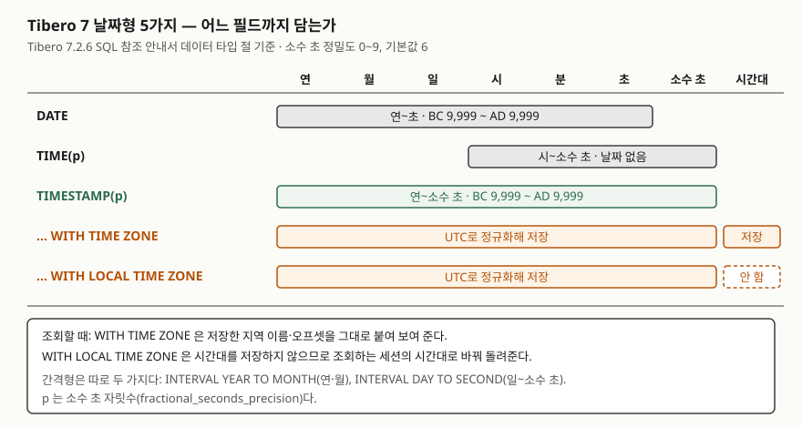

<!-- related:start -->
> **같은 기능을 다른 환경에서 다룬 글** (`datetime-types`)
> - [날짜와 시간 다루기 — 저장과 연산](../../sql-basics/2026-10-01-sql-date-time-storage-arithmetic/index.md) — SQLite 3.49.1, Python 3.13.5, Windows 11
<!-- related:end -->

> **실행 검증 없음.** 이 글은 **Tibero 7.2.6 공개 매뉴얼**의 설명만 근거로 정리했다.
> 글을 쓴 시점에 검증용 Tibero 인스턴스에 접속할 수 없었다(`TBR-2131`).
> 출력이나 에러 메시지는 싣지 않았다. 돌려 볼 스크립트는 [`code/`](code/)에 두었다.

## 들어가며

결제 기록 표에 결제 시각 컬럼을 만들 때 익숙한 대로 `DATE`를 고른다. 몇 달 뒤 같은 초에 들어온 결제 두 건의
선후를 가려 달라는 문의가 오는데, `DATE`에는 초 아래가 없어 두 행의 시각이 똑같다. 해외 지점이 붙자 이번엔
"이 시각이 서울 기준인지 현지 기준인지" 묻는 문의가 온다. 그때마다 응용 코드에 시간대 컬럼을 따로 두고 변환
함수를 덧대면, 조회하는 화면마다 변환을 빠뜨리는 곳이 생긴다. Tibero는 이 차이를 타입으로 나눠 두었다.

## 개념

Tibero 7.2.6 SQL 참조 안내서는 날짜·시간 값을 **날짜형**과 **간격형** 두 묶음으로 나눈다. 날짜형은 달력 위의 한
순간이고, 간격형은 두 순간 사이의 길이다. 날짜형 5가지, 간격형 2가지로 모두 7가지다.

| 묶음 | 타입 | 담는 것 | 선언 |
|---|---|---|---|
| 날짜형 | `DATE` | 연·월·일·시·분·초 | `DATE` |
| 날짜형 | `TIME` | 시·분·초·소수 초 (날짜 없음) | `TIME [(p)]` |
| 날짜형 | `TIMESTAMP` | 연·월·일·시·분·초·소수 초 | `TIMESTAMP [(p)]` |
| 날짜형 | `TIMESTAMP WITH TIME ZONE` | `TIMESTAMP` + 시간대 | `TIMESTAMP [(p)] WITH TIME ZONE` |
| 날짜형 | `TIMESTAMP WITH LOCAL TIME ZONE` | `TIMESTAMP`, 세션 시간대로 보여 줌 | `TIMESTAMP [(p)] WITH LOCAL TIME ZONE` |
| 간격형 | `INTERVAL YEAR TO MONTH` | 연·월 단위 길이 | `INTERVAL YEAR [(yp)] TO MONTH` |
| 간격형 | `INTERVAL DAY TO SECOND` | 일·시·분·초 단위 길이 | `INTERVAL DAY [(dp)] TO SECOND [(p)]` |

`p`는 소수 초 자릿수로 **0~9, 기본값 6**이다. `yp`(연 자릿수)와 `dp`(일 자릿수)는 **1~9, 기본값 2**다.
`DATE`와 `TIMESTAMP`는 둘 다 **BC 9,999년부터 AD 9,999년**까지 표현한다. 개발 안내서는 날짜형과 간격형이
**고정 길이로 저장**된다고 적는다. 바이트 수는 매뉴얼에 없다.

`DATE`와 `TIMESTAMP`의 차이는 **소수 초 하나**다. 개발 안내서도 소수점 이하 초까지 저장해야 하면
`TIMESTAMP`를 쓰라고 안내한다. 날짜 없이 시각만 필요하면 `TIME`이다.

## 구조



> **출처**: [Tibero 7.2.6 SQL 참조 안내서 — 데이터 타입](https://docs.tibero.com/tibero-manuals/7.2.6.manuals/sql-reference-guide/sql-elements/data-types.md)의 날짜형·간격형 항목(담는 필드, 표현 범위, 정밀도 범위와 기본값, UTC 정규화, 시간대 저장 여부).

## 동작 원리 — 시간대를 다루는 두 타입

두 시간대 타입은 매뉴얼 설명이 비슷해 보여서 가장 헷갈린다. 차이는 **시간대를 저장하느냐** 하나다.

- `TIMESTAMP WITH TIME ZONE`은 각 시간 요소를 **UTC로 정규화해 저장**하고, 지역 이름(`Asia/Seoul`)이나
  오프셋(`+09:00`)으로 적힌 **시간대도 함께 저장**한다. 그래서 값을 넣은 쪽의 시간대가 남는다.
- `TIMESTAMP WITH LOCAL TIME ZONE`도 UTC로 정규화해 저장하지만 **지역 이름이나 오프셋은 저장하지 않는다.**
  조회할 때 **세션의 시간대로 자동 변환**해 돌려준다. 같은 행을 서울 세션과 UTC 세션이 읽으면 다르게 보인다.

시간대 정보가 든 값을 UTC로 바꾸는 함수가 `SYS_EXTRACT_UTC`이고, 시간대 없는 `TIMESTAMP`에 시간대를 붙이는
함수가 `FROM_TZ`다. 매뉴얼 예제는 `FROM_TZ(TIMESTAMP '2002-01-24 08:48:53', '+08:00')`이
`2002-01-24 08:48:53.000000 +08:00`이 되고, `SYS_EXTRACT_UTC(TIMESTAMP '1994/07/23 21:13:08 -8:00')`이
`1994/07/24 05:13:08.000000`이 되는 것을 보여 준다. 두 번째는 −8시간 오프셋을 UTC로 옮기며 날짜가 하루 넘어갔다.

### 리터럴과 기본 형식

| 타입 | ANSI 리터럴 | 기본 형식 파라미터 | 기본 형식 |
|---|---|---|---|
| `DATE` | `DATE '2005-01-01'` | `NLS_DATE_FORMAT` | `'YYYY/MM/DD'` |
| `TIME` | `TIME '10:23:10.123456789'` | `NLS_TIME_FORMAT` | `'HH24:MI:SS.FF9'` |
| `TIMESTAMP` | `TIMESTAMP '2005-01-31 08:13:50.112'` | `NLS_TIMESTAMP_FORMAT` | `'YYYY-MM-DD HH24:MI:SS.FF'` |
| `… WITH TIME ZONE` | `TIMESTAMP '1993-12-11 13:37:43.27 Asia/Seoul'` | `NLS_TIMESTAMP_TZ_FORMAT` | `'YYYY-MM-DD HH24:MI:SS.FF TZR'` |

`DATE` 리터럴에 시각이 없으면 **자정(00:00:00)**이 기본값이다. 간격형 리터럴은 `INTERVAL '12-3' YEAR TO MONTH`,
`INTERVAL '1 02:03:04.567' DAY TO SECOND(3)`처럼 단위를 뒤에 적는다.

### 현재 시각 함수 다섯 개

| 함수 | 반환 타입 | 매뉴얼 설명 |
|---|---|---|
| `SYSDATE` | `DATE` | 현재 날짜와 시간. 괄호 없이 쓴다 |
| `SYSTIMESTAMP` | `TIMESTAMP WITH TIME ZONE` | 현재 날짜·시간·시간대 |
| `CURRENT_TIMESTAMP` | `TIMESTAMP WITH TIME ZONE` | 세션 시간대 기준 현재 날짜·시간 |
| `LOCALTIMESTAMP` | `TIMESTAMP` | 현재 날짜와 시간 |
| `SESSIONTIMEZONE` | 시간대 | 현재 세션의 시간대 |

`SYSDATE`는 `DATE`라 소수 초가 없다. 같은 초 안의 선후를 가려야 하는 기록에 `DEFAULT SYSDATE`를 걸면
들어가며의 문제가 그대로 생긴다.

## 실습 예제

[`code/datetime_types.sql`](code/datetime_types.sql)은 표 하나에 7가지 타입 컬럼을 두고 같은 값을 넣어 12단계로
확인한 뒤 표를 지운다. **아직 돌리지 않았다.** 매뉴얼에서 근거를 찾지 못해 이 글이 단정하지 않은 항목이 스크립트의
확인 대상이다.

```sql
CREATE TABLE dt_sample (
    id        NUMBER PRIMARY KEY,
    c_date    DATE,
    c_ts0     TIMESTAMP(0),
    c_ts      TIMESTAMP,
    c_ts9     TIMESTAMP(9),
    c_tstz    TIMESTAMP WITH TIME ZONE,
    c_tsltz   TIMESTAMP WITH LOCAL TIME ZONE,
    c_ym      INTERVAL YEAR TO MONTH,
    c_ds      INTERVAL DAY TO SECOND
);
```

- **소수 초를 버리는가, 반올림하는가** (2·3번). 매뉴얼은 정밀도 범위만 적고, 더 긴 소수 초를 넣을 때의 처리는
  적지 않는다. `23:59:59.5`를 `DATE`와 `TIMESTAMP(0)`에 넣어 다음 날로 넘어가는지 본다.
- **세션 시간대를 바꾸면 무엇이 바뀌는가** (4·5번). 매뉴얼 설명대로라면 `WITH LOCAL TIME ZONE` 컬럼만 바뀌어야 한다.
- **날짜 연산의 결과 타입** (7·8번). `DATE + 1`, `DATE - DATE`, `TIMESTAMP - TIMESTAMP`의 결과가 무엇인지는
  공개 매뉴얼의 연산자 절과 데이터 타입 절에서 찾지 못했다. 다른 DBMS의 관례로 짐작해 쓰지 않았다.
- **월말에 한 달 더하기** (10번). `ADD_MONTHS`는 `date`에 `integer`개월을 더한 `DATE`를 돌려준다고만 적혀 있다.
  1월 31일에 1을 더한 값과 `+ INTERVAL '1' MONTH`를 나란히 찍는다.

## 실무에서 주의할 점

- **같은 초 안의 순서가 필요하면 `DATE`를 쓰지 않는다.** `DATE`와 `SYSDATE`에는 소수 초가 없다. 결제·로그처럼
  순서가 의미 있는 기록은 `TIMESTAMP`와 `SYSTIMESTAMP`·`LOCALTIMESTAMP`를 쓴다.
- **여러 시간대에서 쓰는 값이면 시간대형을 고른다.** 넣은 쪽의 시간대를 남겨야 하면(현지 기준 영업 시각)
  `WITH TIME ZONE`, 보는 사람의 시간대로 보여 주기만 하면 되면 `WITH LOCAL TIME ZONE`이다. 후자는 같은 행이
  세션마다 다르게 보이므로, 화면 캡처나 로그로 남긴 값을 비교할 때 세션 시간대를 함께 적는다.
- **`DATE` 조건에 날짜만 쓰지 않는다.** `DATE` 리터럴은 자정이 기본이라 `c_date = DATE '2026-10-07'`은 그날 18시
  행을 잡지 못한다. 하루를 고르려면 `>= DATE '2026-10-07' AND < DATE '2026-10-08'`처럼 반열린 구간을 쓴다.
  스크립트 12번이 두 조건의 건수를 비교한다.
- **간격형 일·연 자릿수 기본값은 2다.** `INTERVAL DAY TO SECOND` 컬럼은 기본 `DAY(2)`이므로 100일 이상 길이를
  담으려면 선언에서 `DAY(3)` 이상을 준다.
- **암시적 변환에 기대지 않는다.** 개발 안내서는 응용에서 변환 함수로 명시적으로 변환하고 바인드 변수의
  타입을 컬럼 타입과 맞추라고 권한다. 문자열을 날짜로 읽는 기본 형식은 `NLS_DATE_FORMAT`(기본 `'YYYY/MM/DD'`)이 정하므로,
  형식을 문장 안에 드러내는 `DATE '…'` 리터럴이나 `TO_DATE(문자열, 형식)`을 쓴다.

## 다른 환경에서는

같은 `datetime-types` 키로 쓴 [SQLite 날짜와 시간 글](../../sql-basics/2026-10-01-sql-date-time-storage-arithmetic/index.md)과
견주면 출발점부터 다르다. SQLite는 날짜 전용 타입을 두지 않고 문자열·실수·정수 중 하나로 저장한 뒤 날짜 함수가
해석한다. Tibero는 날짜와 간격을 7가지 타입으로 나눠 정밀도와 시간대를 선언에서 정한다.

| 항목 | SQLite 3.49.1 (실행 확인) | Tibero 7.2.6 (매뉴얼 기준) |
|---|---|---|
| 날짜 전용 타입 | 없음 — `TEXT`·`REAL`·`INTEGER` | 날짜형 5가지 + 간격형 2가지 |
| 소수 초 | 문자열에 적은 만큼 | `TIMESTAMP(p)`, p는 0~9, 기본 6 |
| 시간대 저장 | 타입으로는 없음 | `WITH TIME ZONE`은 저장, `WITH LOCAL TIME ZONE`은 저장하지 않음 |
| 1월 31일 + 1개월 | 3월 3일 (그 글 실습) | 매뉴얼에 규칙 없음 — 스크립트 10번 |

SQLite는 형식이 틀린 문자열을 `NULL`로 받아 조용히 조건에서 빠뜨리는 것이 주된 함정이고, Tibero는 타입이 값을
검사하는 대신 `DATE`와 `TIMESTAMP` 중 무엇을 골랐느냐가 소수 초와 시간대의 유무를 정한다.

## 정리

- 7가지: 날짜형 5(`DATE`·`TIME`·`TIMESTAMP`·`WITH TIME ZONE`·`WITH LOCAL TIME ZONE`) + 간격형 2(`YEAR TO MONTH`·`DAY TO SECOND`).
- `DATE`는 초까지, `TIMESTAMP`는 소수 초까지. 소수 초 자릿수 0~9, 기본 6.
- `WITH TIME ZONE`은 UTC로 저장하고 시간대도 저장한다. `WITH LOCAL TIME ZONE`은 시간대를 저장하지 않고 세션 시간대로 보여 준다.
- `SYSDATE`는 `DATE`, `SYSTIMESTAMP`·`CURRENT_TIMESTAMP`는 `WITH TIME ZONE`, `LOCALTIMESTAMP`는 `TIMESTAMP`를 돌려준다.

## 참고 자료

- [Tibero 7.2.6 SQL 참조 안내서 — 데이터 타입](https://docs.tibero.com/tibero-manuals/7.2.6.manuals/sql-reference-guide/sql-elements/data-types.md) — 날짜형·간격형: 담는 필드, 표현 범위, 정밀도, UTC 정규화, 시간대 저장 여부
- [Tibero 7.2.6 SQL 참조 안내서 — 리터럴](https://docs.tibero.com/tibero-manuals/7.2.6.manuals/sql-reference-guide/sql-elements/literals.md) — 날짜형·간격형 리터럴, `NLS_*_FORMAT` 기본 형식, 자정 기본값
- [Tibero 7.2.6 개발 안내서 — 데이터 타입 사용](https://docs.tibero.com/tibero-manuals/7.2.6.manuals/development-guide/using-data-types.md) — 고정 길이 저장, `DATE`·`TIMESTAMP`·`TIME` 선택, 명시적 변환 권고
- Tibero 7.2.6 SQL 참조 안내서 함수 절 — [SYSDATE](https://docs.tibero.com/tibero-manuals/7.2.6.manuals/sql-reference-guide/functions/sysdate.md), [SYSTIMESTAMP](https://docs.tibero.com/tibero-manuals/7.2.6.manuals/sql-reference-guide/functions/systimestamp.md), [CURRENT_TIMESTAMP](https://docs.tibero.com/tibero-manuals/7.2.6.manuals/sql-reference-guide/functions/current_timestamp.md), [LOCALTIMESTAMP](https://docs.tibero.com/tibero-manuals/7.2.6.manuals/sql-reference-guide/functions/localtimestamp.md), [SESSIONTIMEZONE](https://docs.tibero.com/tibero-manuals/7.2.6.manuals/sql-reference-guide/functions/sessiontimezone.md), [FROM_TZ](https://docs.tibero.com/tibero-manuals/7.2.6.manuals/sql-reference-guide/functions/from_tz.md), [SYS_EXTRACT_UTC](https://docs.tibero.com/tibero-manuals/7.2.6.manuals/sql-reference-guide/functions/sys_extract_utc.md), [ADD_MONTHS](https://docs.tibero.com/tibero-manuals/7.2.6.manuals/sql-reference-guide/functions/add_months.md), [NUMTODSINTERVAL](https://docs.tibero.com/tibero-manuals/7.2.6.manuals/sql-reference-guide/functions/numtodsinterval.md)
