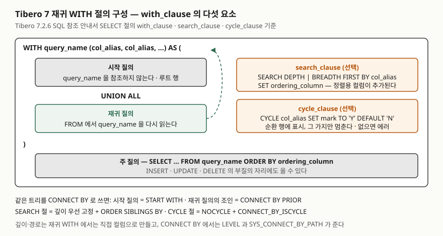

<!-- related:start -->
> **같은 기능을 다른 환경에서 다룬 글** (`cte`)
> - [CTE — WITH 절로 질의에 이름 붙이기](../../sql-basics/2026-10-07-cte-with-clause/index.md) — SQLite 3.49.1, Python 3.13.5, Windows 11
<!-- related:end -->

> **실행 검증 없음.** 이 글은 **Tibero 7.2.6 공개 매뉴얼**의 설명과 매뉴얼에 실린 예제만 근거로 정리했다.
> 글을 쓴 시점에 검증용 Tibero 인스턴스에 접속할 수 없었다(`TBR-2131`).
> 출력이나 에러 메시지는 싣지 않았다. 돌려 볼 스크립트는 [`code/`](code/)에 두었다.

## 들어가며

조직별 매출 보고서를 만들다 보면 "부서 합계가 전체 평균보다 큰 부서"처럼 같은 집계를 두 번 적는 질의가
나온다. `FROM` 괄호 안에 한 번, `WHERE`의 스칼라 부질의 안에 한 번이다. 거기에 "하위 부서 매출까지 합쳐서"라는
요구가 붙으면, 조직 트리를 응용 코드에서 한 단계씩 조회해 돌면서 더하는 함수를 짜게 된다. 조직이 4단계면
질의가 4번 나가고, 개편으로 5단계가 되면 코드를 고친다. Tibero의 `WITH` 절은 첫 번째 문제를 **부질의에 이름을
붙여서**, 두 번째 문제를 **그 이름을 자기 정의 안에서 다시 읽어서** 푼다. 이 글은 두 번째 쪽에 비중을 둔다.

## 개념

Tibero 7.2.6 SQL 참조 안내서는 `SELECT` 문의 구성 요소로 `with_clause`, `subquery`, `for_update_clause` 셋을
들고, `with_clause`를 "부질의를 정의하고 이름을 만듦"으로 설명한다. 다른 제품에서 CTE(Common Table Expression)
또는 서브쿼리 팩토링이라 부르는 것이다. `with_clause` 자체의 구성 요소는 **5가지**다.

| 구성요소 | 매뉴얼의 설명 |
|---|---|
| `query_name` | 부질의의 이름. 주 질의와 **그 다음에 정의되는 부질의**에서 쓴다 |
| `col_alias` | 부질의의 컬럼명을 다시 정한다 |
| `subquery` | 질의 본문 |
| `search_clause` | 행의 정렬 방식을 지정한다 |
| `cycle_clause` | 순환에 대한 처리 방식을 지정한다 |

재귀는 별도 키워드가 아니라 **제약 조건의 한 줄**로 적혀 있다. "query_name으로 정의한 부질의 안에서 query_name을
참조하여 재귀 활용이 가능합니다." 구성 요소 표에 `RECURSIVE` 같은 키워드는 없다. 매뉴얼의 재귀 예제는
`WITH RECURSIVE (RECURSIVE_LEVEL, ID, …) AS (…)`로 시작하는데, 뒤에서 `FROM EMP E, RECURSIVE R`과
`FROM RECURSIVE`로 읽는 것을 보면 여기서 `RECURSIVE`는 **예제가 고른 query_name**이다. SQLite·PostgreSQL의
`WITH RECURSIVE name`과 같은 자리의 키워드가 아니다. 문법 도식은 이미지라 글로 확인하지는 못했다.

## 구조



> **출처**: [Tibero 7.2.6 SQL 참조 안내서 — SELECT](https://docs.tibero.com/tibero-manuals/7.2.6.manuals/sql-reference-guide/sql-queries/select.md)의
> `with_clause`·`search_clause`·`cycle_clause` 구성 요소 표와 제약 조건,
> [같은 안내서 — SELECT 예제](https://docs.tibero.com/tibero-manuals/7.2.6.manuals/sql-reference-guide/sql-queries/select/select.md)의 재귀 WITH 예제 2개,
> [같은 안내서 — 계층 질의](https://docs.tibero.com/tibero-manuals/7.2.6.manuals/sql-reference-guide/sql-queries/hierarchical-queries.md)의 START WITH·CONNECT BY·ORDER SIBLINGS BY 설명.

## 동작 원리 — 매뉴얼이 적은 규칙

### with_clause의 제약 3가지

1. `query_name`을 그 부질의 안에서 참조하면 **재귀**다.
2. 집합 연산자가 있는 복합 쿼리에서는 **구성 요소 쿼리의 `FROM` 절 안에서만** `query_name`을 쓸 수 있다.
3. `col_alias`에 `query_name`과 **같은 이름**을 쓸 수 없다.

매뉴얼의 재귀 예제는 둘 다 `col_alias` 목록을 적고, 시작 질의와 재귀 질의를 `UNION ALL`로 잇는다. 시작 질의는
`WHERE EMPNO = 1`로 루트 한 행을 고르고, 재귀 질의는 `FROM EMP E, RECURSIVE R WHERE E.MGRNAME = R.NAME`으로
직전 결과의 부하를 찾는다. 깊이는 `R.RECURSIVE_LEVEL + 1`, 경로는 `R.NAME_TREE || '/' || E.ENAME`처럼
**직접 컬럼으로 만든다.** `CONNECT BY`의 `LEVEL`·`SYS_CONNECT_BY_PATH` 같은 의사 컬럼은 여기에 없다.

### search_clause — 어느 순서로 내놓는가

| 구성요소 | 뜻 |
|---|---|
| `DEPTH FIRST BY` | 형제 행보다 **자식 행이 먼저** |
| `BREADTH FIRST BY` | 자식 행보다 **형제 행이 먼저** |
| `col_alias` | 정렬 기준 컬럼. `query_name`의 `col_alias` 목록에 있는 컬럼이어야 한다 |
| `ASC` / `DESC` | 오름차순(기본) / 내림차순 |
| `NULLS FIRST` / `NULLS LAST` | NULL 위치. 내림차순 기본은 FIRST, 오름차순 기본은 LAST |
| `SET ordering_column` | 순서 번호가 들어갈 컬럼. **`col_alias` 목록에 자동으로 추가**된다 |

제약은 하나다. 이미 `col_alias` 목록에 있는 이름을 `ordering_column`으로 쓸 수 없다. 매뉴얼 예제는
`SEARCH DEPTH FIRST BY NAME SET IDX`를 두고 주 질의에서 `IDX`를 선택한다. 예제 출력에서 `IDX`는 1부터
5까지 깊이 우선 순서로 매겨져 있고, 들여쓰기(`LPAD(' ', 2 * (RECURSIVE_LEVEL - 1))`)와 함께 트리 모양이 된다.
매뉴얼은 **주 질의의 `ORDER BY`에 `ordering_column`을 써서** 그 순서로 정렬하라고 적는다. `SEARCH` 절 자체가
출력 순서를 보장한다고는 적지 않았으므로, 순서가 필요하면 `ORDER BY IDX`를 붙이는 쪽이 매뉴얼에 맞는 쓰임이다.

### cycle_clause — 고리를 만나면

| 구성요소 | 뜻 |
|---|---|
| `col_alias` | 순환 여부를 판별할 컬럼 |
| `SET cycle_mark_col_alias` | 순환 여부 값을 담을 컬럼. **`col_alias` 목록에 자동 추가**된다 |
| `TO cycle_value` | 순환이 검출된 행에 넣는 값. **그 행의 재귀는 멈추고, 다른 비순환 행은 계속** 진행한다 |
| `DEFAULT no_cycle_value` | 순환이 아닌 행에 넣는 값 |

제약은 3가지다. **`CYCLE` 절을 생략했는데 순환이 검출되면 재귀 WITH 절은 에러를 낸다.** `SEARCH` 절과 같이 쓸 때
`cycle_mark_col_alias`는 `ordering_column`과 다른 이름이어야 하고, 이미 `col_alias` 목록에 있는 이름도 쓸 수 없다.

매뉴얼의 두 번째 예제는 일부러 고리를 만든다. `FORD`의 상사를 `ALLEN`으로, `ALLEN`의 상사를 `SCOTT`으로 두는 행을
넣고 `CYCLE P_NAME SET ISCYCLE TO 'Y' DEFAULT 'N'`을 붙였다. 예제 출력은 12행이고, 그중 2행이 `ISCYCLE = 'Y'`다.
`KING/CLARK/ALLEN/FORD/SCOTT/ALLEN/FORD` 경로의 마지막 `FORD`(깊이 7)와 `KING/FORD/SCOTT/ALLEN/FORD/SCOTT`의
마지막 `SCOTT`(깊이 6)이다. 두 가지가 읽힌다. **순환이 검출된 행도 결과에 들어가며** 표시만 `Y`로 달리고,
그 아래로는 더 내려가지 않는다. 그리고 판별 컬럼은 `P_NAME`(상사 이름)이었는데, 같은 `P_NAME` 값이 그 경로의
조상에 이미 있었던 자리에서 `Y`가 찍혔다. 어느 컬럼을 `CYCLE`에 두느냐가 어디서 멈추는지를 정한다.

## 실습 예제

전체 스크립트: [`code/with_clause.sql`](code/with_clause.sql). 돌리지 않았으므로 출력은 없다. 조직 표
`dept_unit`(6행, 3단계)과 매출 표 `unit_sales`(4행)만 만들고 끝에 지운다.

```sql
WITH org (unit_id, unit_name, parent_id, depth) AS (
    SELECT unit_id, unit_name, parent_id, 1
    FROM dept_unit WHERE parent_id IS NULL
    UNION ALL
    SELECT c.unit_id, c.unit_name, c.parent_id, o.depth + 1
    FROM dept_unit c JOIN org o ON c.parent_id = o.unit_id
)
SEARCH DEPTH FIRST BY unit_name SET seq
CYCLE unit_id SET is_cycle TO 'Y' DEFAULT 'N'
SELECT seq, depth, unit_name, is_cycle
FROM org
ORDER BY seq;
```

스크립트는 1·2번에서 보통 CTE와 이어 쓰는 CTE를, 3~5번에서 재귀·`DEPTH FIRST`·`BREADTH FIRST`를, 6번에서
같은 트리를 `CONNECT BY`로 돌려 4번과 나란히 비교한다. 7번은 하위 조직 매출을 위로 올려 더하는 질의인데,
재귀 질의 안에 `SUM`을 넣는 대신 (조직, 조상) 쌍을 재귀로 다 편 뒤 바깥에서 `GROUP BY`한다. 8번은 본사의
부모를 영업1팀으로 바꿔 고리를 만들고 `CYCLE` 절 없이(8-A), `CYCLE` 절과 함께(8-B), `CONNECT BY`로(8-C) 돌린다.
매뉴얼대로면 8-A는 에러, 8-B는 `is_cycle = 'Y'` 행에서 멈춘다. 9번은 재귀 WITH를 `INSERT`의 원본으로 쓴다.
확인할 항목은 [`code/README.md`](code/README.md)에 적어 두었다.

## 재귀 WITH와 CONNECT BY — 언제 무엇을 쓰는가

Tibero에는 트리를 훑는 문법이 둘 있다. [계층 질의 글](../2026-09-22-tibero7-connect-by-hierarchy/index.md)에서
`CONNECT BY`를 실제로 돌렸고, 이 글의 재귀 WITH는 매뉴얼 기준이다. 대응 관계는 이렇다.

| 하는 일 | 재귀 WITH | `CONNECT BY` |
|---|---|---|
| 루트 행 | 시작 질의의 `WHERE` | `START WITH` |
| 부모·자식 연결 | 재귀 질의의 조인 조건 | `CONNECT BY PRIOR 부모 = 자식`. PRIOR 조건은 **정확히 하나** |
| 깊이·경로 | 직접 컬럼으로 만든다 | `LEVEL`, `SYS_CONNECT_BY_PATH` |
| 출력 순서 | `SEARCH DEPTH/BREADTH FIRST` + `ORDER BY ordering_column` | 깊이 우선 고정. 형제는 `ORDER SIBLINGS BY` |
| 순환 | `CYCLE` 절. 없으면 에러 | `NOCYCLE` + `CONNECT_BY_ISCYCLE`. 없으면 에러 |
| 단계마다 다른 계산 | 재귀 질의가 일반 `SELECT`라 조인·조건·연산이 자유롭다 | `PRIOR`로 부모 컬럼만 참조한다 |

고르는 기준은 두 가지다. **부모 행만 보고 내려가는 단순한 트리**(조직도, 분류 체계, 부품 전개)는 `CONNECT BY`가
짧다. 깊이·경로·순환 처리를 의사 컬럼과 키워드가 대신해 준다. **단계마다 다른 표를 조인하거나 누적값을 들고
내려가야 하는 경우**(경로별 운임 합산, 한 단계마다 환율을 곱하는 전개, 여러 표를 번갈아 타는 관계)는 재귀 WITH가
맞다. 재귀 질의가 일반 `SELECT`라서 그 자리에 무엇이든 넣을 수 있고, 너비 우선 순서가 필요할 때도 `SEARCH BREADTH
FIRST` 한 줄이다. `CONNECT BY`에는 너비 우선이 없다. 다른 엔진으로 옮길 가능성이 있으면 표준 SQL(SQL:1999)의
형태인 재귀 WITH 쪽이 이식성이 낫지만, `SEARCH`·`CYCLE` 절의 지원 여부는 엔진마다 다르므로 그 부분은 따로 확인한다.

## 다른 환경에서는

같은 기능(`cte`)을 SQLite 3.49.1에서 실제로 돌린 글이 [CTE — WITH 절로 질의에 이름 붙이기](../../sql-basics/2026-10-07-cte-with-clause/index.md)와
[재귀 CTE — 조직도를 한 질의로 펴는 법](../../sql-basics/2026-10-07-recursive-cte-hierarchy/index.md)이다.

| 항목 | Tibero 7.2.6 매뉴얼 | SQLite 3.49.1 |
|---|---|---|
| 재귀 표시 | 키워드 없음. `query_name`을 안에서 참조하면 재귀 | `WITH RECURSIVE` (키워드 없이도 동작) |
| 컬럼 이름 목록 | 매뉴얼 예제는 전부 적는다 | 선택 |
| 시작·재귀 질의 연결 | 예제는 `UNION ALL` | `UNION ALL` 또는 `UNION`(똑같은 행을 버려 멈춘다) |
| 출력 순서 | `SEARCH DEPTH/BREADTH FIRST BY … SET …` | 재귀 질의 끝의 `ORDER BY`로 깊이·너비 우선 |
| 순환 처리 | `CYCLE` 절. 없으면 에러 | 절 없음. `UNION`·`LIMIT`·깊이 조건으로 직접 막는다 |
| 끝나지 않는 재귀 | 순환이면 에러(매뉴얼) | 에러 없이 끝나지 않는다. `LIMIT`이 안전장치 |
| 구체화 힌트 | 매뉴얼에 없음 | `MATERIALIZED` / `NOT MATERIALIZED` |
| 집합 연산자 안에서 | 구성 요소 쿼리의 `FROM`에서만 `query_name` 사용 | `UNION`의 두 번째 이후 `SELECT` 앞에 `WITH` 불가 |

설계가 다른 것이지 어느 쪽이 낫다는 뜻은 아니다. Tibero 쪽은 순서와 순환을 **절로 선언**하고 엔진이 처리한다.
SQLite 쪽은 절이 없는 대신 재귀 질의가 어떻게 실행되는지(큐에서 한 행씩 꺼내 돌린다)를 문서가 적어 두어
`ORDER BY`·`UNION`·`LIMIT`로 같은 효과를 낸다.

## 실무에서 주의할 점

- **순환 가능성이 있으면 `CYCLE` 절을 둔다.** 없으면 에러로 끝난다. 조직도처럼 "고리가 없을" 데이터도 입력 실수
  한 번이면 생긴다. 어느 컬럼으로 판별할지(`unit_id`인지 `parent_id`인지)에 따라 `Y`가 찍히는 자리가 달라진다.
- **`SEARCH … SET seq`를 두면 주 질의에 `ORDER BY seq`를 같이 적는다.** 매뉴얼은 `ordering_column`을 `ORDER BY`에
  쓰라고 안내한다. 절만 두고 순서를 기대하지 않는다.
- **자동으로 추가되는 컬럼 이름이 겹치지 않게 한다.** `ordering_column`과 `cycle_mark_col_alias`는 `col_alias`
  목록에 자동으로 들어가므로, 기존 이름과 겹치거나 서로 같으면 제약 위반이다.
- **집합 연산자가 있는 복합 쿼리에서는 `query_name`을 `FROM`에만 쓴다.** 스칼라 부질의나 `WHERE`의 `IN (SELECT … FROM query_name)`은
  구성 요소 쿼리 안의 `FROM`이면 되지만, 그 밖의 자리는 매뉴얼의 제약에 걸린다.
- **재귀 조인 컬럼에 인덱스를 둔다.** 재귀 질의는 단계마다 `c.parent_id = o.unit_id` 조회를 반복한다. 매뉴얼이 실행 방식을
  적지 않았으므로 단정은 못 하지만, 같은 조건을 반복 조회하는 구조는 어느 엔진에서나 인덱스가 있어야 한다.

## 정리

- `with_clause`는 `query_name`·`col_alias`·`subquery`·`search_clause`·`cycle_clause` 다섯 요소다. 재귀는 `query_name`을 안에서 참조하는 것이고 별도 키워드가 없다.
- `SEARCH DEPTH|BREADTH FIRST BY … SET 순서컬럼`이 순서를, `CYCLE 컬럼 SET 표시 TO 'Y' DEFAULT 'N'`이 순환을 맡는다. `CYCLE` 절 없이 순환을 만나면 에러다.
- 매뉴얼 예제에서 순환이 검출된 행은 결과에 남고(`Y`), 그 가지만 멈춘다.
- 단순 트리는 `CONNECT BY`, 단계마다 조인·누적이 필요하거나 너비 우선이 필요하면 재귀 WITH.

## 참고 자료

- [Tibero 7.2.6 SQL 참조 안내서 — SELECT](https://docs.tibero.com/tibero-manuals/7.2.6.manuals/sql-reference-guide/sql-queries/select.md) — `with_clause`·`search_clause`·`cycle_clause` 구성 요소와 제약 조건
- [Tibero 7.2.6 SQL 참조 안내서 — SELECT 예제](https://docs.tibero.com/tibero-manuals/7.2.6.manuals/sql-reference-guide/sql-queries/select/select.md) — 비순환·순환 구조의 재귀 WITH 예제
- [Tibero 7.2.6 SQL 참조 안내서 — 계층 질의](https://docs.tibero.com/tibero-manuals/7.2.6.manuals/sql-reference-guide/sql-queries/hierarchical-queries.md) — START WITH·CONNECT BY·PRIOR·ORDER SIBLINGS BY·CONNECT_BY_ISCYCLE
- [SQLite — The WITH Clause](https://www.sqlite.org/lang_with.html) — 비교 절의 SQLite 쪽 근거
