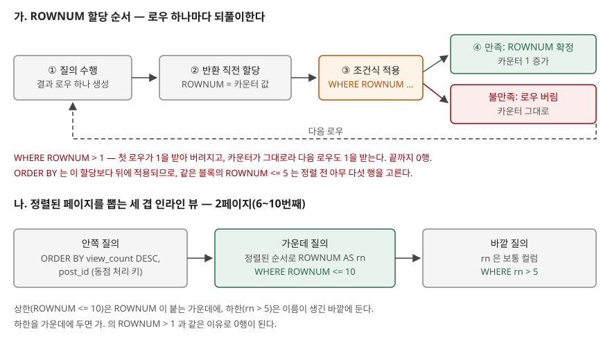

<!-- related:start -->
> **같은 기능을 다른 환경에서 다룬 글** (`row-limiting`)
> - [LIMIT과 OFFSET — 결과를 잘라내는 문법](../../sql-basics/2026-09-22-limit-offset-pagination/index.md) — SQLite 3.49.1, Python 3.13.5
> - [커서 기반 페이지네이션이 OFFSET을 이기는 지점 — SQLite 3.49.1로 잰 깊이별 비용](../../sqlite/2026-09-29-keyset-vs-offset-crossover/index.md) — SQLite 3.49.1, Python 3.13.5, Windows 11
<!-- related:end -->

> **실행 검증 없음.** 이 글은 **Tibero 7.2.6 공개 매뉴얼**의 설명과 매뉴얼에 실린 예제만 근거로 정리했다.
> 글을 쓴 시점에 검증용 Tibero 인스턴스에 접속할 수 없었다(`TBR-2131`).
> 출력이나 에러 메시지는 싣지 않았다. 돌려 볼 스크립트는 [`code/`](code/)에 두었다.

## 들어가며

게시판 목록 화면을 만들면서 "조회수 많은 순으로 다섯 개"를 뽑으려고 `WHERE ROWNUM <= 5 ORDER BY view_count DESC`를
쓴다. 개발 DB에서는 그럴듯한 다섯 행이 나와서 넘어가는데, 운영에서 "1위 글이 목록에 없다"는 문의가 온다.
그래서 2페이지를 만들 때 `WHERE ROWNUM BETWEEN 6 AND 10`을 써 보면 이번에는 한 행도 안 나온다. 원인을 모르면
인라인 뷰를 한 겹씩 덧대며 결과가 맞을 때까지 고치게 되고, 페이지 크기·정렬 키·검색 조건이 바뀔 때마다 같은
시행착오를 되풀이한다. 두 증상은 모두 **ROWNUM이 언제 붙는가** 하나로 설명된다.

## 개념

**ROWNUM**은 Tibero가 `SELECT` 결과 로우에 순서대로 번호를 붙이는 **의사 컬럼**(pseudo column)이다.
표에 저장된 값이 아니라 질의를 수행하는 동안 만들어진다. 첫 로우가 1, 두 번째가 2다.

Tibero 7.2.6에는 결과 수를 자르는 방법이 셋 있다.

| 방법 | 형태 | 매뉴얼 위치 |
|---|---|---|
| ROWNUM | `WHERE ROWNUM <= n` | SQL 요소 — 의사 컬럼 |
| row_limiting_clause | `OFFSET m ROWS FETCH NEXT n ROWS ONLY`, `LIMIT [offset,] limitnum` | SQL 질의 — SELECT |
| ROW_NUMBER | `ROW_NUMBER() OVER (ORDER BY …)`를 인라인 뷰에서 계산해 바깥에서 거른다 | 함수 — ROW_NUMBER |

ROWNUM은 오래된 방식이지만 기존 코드에 가장 많이 남아 있고, 나머지 둘의 동작을 이해하는 기준이 된다.

## 구조



> **출처**: [Tibero 7.2.6 SQL 참조 안내서 — 의사 컬럼: ROWNUM](https://docs.tibero.com/tibero-manuals/7.2.6.manuals/sql-reference-guide/sql-elements/pseudo-columns.md)의
> ROWNUM 할당 순서(4단계)와 `ROWNUM > 1` 설명. 나.의 세 겹 구성은 같은 절의 "ORDER BY를 먼저 수행하도록 부질의를 사용" 예제에
> 하한 조건을 더한 것이다.

## 동작 원리

매뉴얼은 ROWNUM 할당 순서를 **4단계**로 적는다.

1. 질의를 수행한다.
2. 질의 결과 로우가 생성된다.
3. 로우를 반환하기 **직전에** ROWNUM을 할당한다.
4. 할당된 ROWNUM에 대해 조건식을 적용한다.

조건식을 만족하면 그 ROWNUM이 확정되고 내부 카운터가 1 증가한다. 만족하지 않으면 로우를 버리고
**카운터는 증가하지 않는다.** 이 두 문장에서 세 가지가 따라 나온다.

**정렬보다 먼저 자른다.** 매뉴얼은 ROWNUM이 질의 처리의 거의 마지막 단계에서 할당되므로 같은 문장이라도
내부 처리 방식에 따라 결과가 달라질 수 있다고 적고, `WHERE ROWNUM <= 10 ORDER BY EMPNO`를 실행할 때마다 다른
결과를 줄 수 있는 예로 든다. 같은 블록의 `ORDER BY`는 이미 고른 열 행을 정렬할 뿐이다. 정렬된 상위 열 행이
필요하면 정렬을 인라인 뷰 안으로 넣고 바깥에서 `ROWNUM <= 10`을 건다. 매뉴얼이 제시하는 형태가 이것이다.

**`ROWNUM > 1`은 0행이다.** 첫 로우는 1을 받고 조건을 못 넘어 버려진다. 카운터가 그대로이므로 다음 로우도
1을 받는다. 끝까지 같다. `ROWNUM = 2`, `ROWNUM BETWEEN 6 AND 10`도 같은 이유로 0행이 된다. `ROWNUM = 1`과
`ROWNUM <= n`처럼 **1을 통과시키는 조건만** 뜻이 있다.

**그래서 페이징은 세 겹이다.** 하한을 걸려면 ROWNUM을 한 번 **확정된 값**으로 만든 뒤 그 위에서 걸러야 한다.

```sql
SELECT rn, post_id, view_count
FROM (
    SELECT ROWNUM AS rn, sorted.*
    FROM (SELECT post_id, view_count FROM pg_post
          ORDER BY view_count DESC, post_id) sorted
    WHERE ROWNUM <= 10
)
WHERE rn > 5;
```

안쪽이 정렬하고, 가운데가 정렬된 순서로 ROWNUM을 붙여 열 번째까지만 남기고, 바깥이 `rn > 5`로 앞 다섯 행을
버린다. 바깥에서 `rn`은 가운데 질의 결과의 보통 컬럼이므로 4단계 규칙의 적용을 받지 않는다. 상한을 가운데에
두는 이유는 ROWNUM 조건이 거기서만 뜻을 갖기 때문이고, 하한을 바깥에 두는 이유는 가운데에 두면 `ROWNUM > 5`가
되어 0행이기 때문이다.

### 7.2.6의 row_limiting_clause

7.2.6 `SELECT` 문법에는 `order_by_clause` 뒤에 `row_limiting_clause`가 있다. 구성은 세 갈래다.

| 구성요소 | 매뉴얼의 설명 |
|---|---|
| `OFFSET offset ROW \| ROWS` | 건너뛸 행 수. 생략하면 0으로 보고 첫 행부터 전달 |
| `FETCH FIRST \| NEXT rowcount ROW \| ROWS ONLY` | 전달할 행 수. 생략하면 offset + 1 행부터 전부. 남은 행보다 크면 남은 행 전부 |
| `LIMIT [offset ,] limitnum` | 첫 행의 offset은 0. offset을 포함해 limitnum 행. offset 생략 시 0 |

`ROW`와 `ROWS`, `FIRST`와 `NEXT`는 뜻이 같고 읽기 편한 쪽을 고르면 된다고 적혀 있다. 같은 2페이지는 이렇게 된다.

```sql
SELECT post_id, view_count FROM pg_post
ORDER BY view_count DESC, post_id
OFFSET 5 ROWS FETCH NEXT 5 ROWS ONLY;

SELECT post_id, view_count FROM pg_post
ORDER BY view_count DESC, post_id
LIMIT 5, 5;
```

이 절은 문법상 `ORDER BY` **뒤**에 오므로 ROWNUM처럼 정렬 전에 자르는 함정이 없다. 7.2.6 문법 도식의
`FETCH` 갈래 끝에는 `ONLY`만 있다. 동점 행까지 함께 가져오는 `WITH TIES`나 비율로 자르는 `PERCENT` 같은
갈래는 도식에 없다.

### ROW_NUMBER

매뉴얼은 `ROW_NUMBER`가 `order_by_clause` 순서대로 1부터 **유일한** 번호를 붙이는 분석 함수이고 top-N·
bottom-N·inner-N 보고에 쓸 수 있다고 적는다. 번호가 정렬 기준으로 붙으므로 인라인 뷰 한 겹이면 된다.

```sql
SELECT rn, post_id, view_count
FROM (SELECT ROW_NUMBER() OVER (ORDER BY view_count DESC, post_id) AS rn,
             post_id, view_count
      FROM pg_post)
WHERE rn BETWEEN 6 AND 10;
```

`PARTITION BY`를 더하면 "분류별 상위 n개"처럼 그룹마다 따로 자를 수 있다. ROWNUM과 row_limiting_clause로는
한 문장에서 할 수 없는 일이다.

## 실습 예제

전체 스크립트: [`code/rownum_paging.sql`](code/rownum_paging.sql). **아직 실행하지 않았다.**

게시글 12행에 조회수 동점을 일부러 넣었다. 120이 3행이고 내림차순으로 4~6번째라 **1페이지와 2페이지의 경계에
걸친다.** 스크립트는 정렬 전에 자르는 질의(2-A), 인라인 뷰로 고친 질의(2-B), `ROWNUM > 1`·`= 2`·`= 1`(3번),
세 겹 페이징(4번), 동점 처리 키를 뺀 페이징(5-A), 같은 페이지를 `OFFSET … FETCH`·`LIMIT`·`ROW_NUMBER`로
뽑는 질의(6~8번), 두 방식의 `AUTOTRACE` 계획(9번)을 차례로 돌린다. 마지막에 표를 지우고 `user_objects`가
0개인지 찍는다. 확인할 항목은 [`code/README.md`](code/README.md)에 적었다.

## 어느 상황에 무엇을 쓰는가

| 상황 | 쓸 것 | 이유 |
|---|---|---|
| 정렬 없이 아무 n행만 보면 된다 (표본 확인, 존재 여부) | `WHERE ROWNUM <= n` | 가장 짧고, 정렬이 없으면 순서 함정도 없다 |
| 7.2.6에서 새로 짜는 목록 화면 | `OFFSET … FETCH` 또는 `LIMIT` | `ORDER BY` 뒤에 붙어 순서 함정이 없다 |
| 그룹마다 상위 n개 | `ROW_NUMBER() OVER (PARTITION BY …)` | 파티션별 번호가 필요하다 |
| 기존 ROWNUM 페이징 코드를 고친다 | 세 겹 구조 유지, 동점 키만 보강 | 동작을 바꾸지 않고 경계 문제만 막는다 |

## 다른 환경에서는

같은 `row-limiting` 키로 SQLite 글 두 편이 있다:
[LIMIT과 OFFSET](../../sql-basics/2026-09-22-limit-offset-pagination/index.md),
[커서 기반 페이지네이션이 OFFSET을 이기는 지점](../../sqlite/2026-09-29-keyset-vs-offset-crossover/index.md).

| | Tibero 7.2.6 (매뉴얼) | SQLite 3.49.1 (실행 확인) |
|---|---|---|
| 행 번호 의사 컬럼 | `ROWNUM` | 없다 (`no such column: ROWNUM`) |
| `OFFSET … FETCH` | 있다 | 없다 (`near "OFFSET": syntax error`) |
| `LIMIT` 쉼표 형태 | `LIMIT offset, limitnum` | `LIMIT 10, 5`가 11~15번째 — 쉼표 앞이 offset |
| `LIMIT n OFFSET m` | 7.2.6 도식에 없다 | 있다 |
| `ROW_NUMBER` | 있다 | 있다 (3.25.0부터) |

SQLite 열의 에러 문구와 `LIMIT 10, 5` 결과는 SQLite 3.49.1에서 직접 돌려 본 것이다. 두 제품 모두 쉼표 형태에서
**앞이 offset**이라 숫자 순서를 헷갈리기 쉽다. SQLite는 행 번호 의사 컬럼 없이 `LIMIT` 하나로 자르고,
Tibero는 ROWNUM·`OFFSET … FETCH`·`LIMIT` 세 가지를 함께 받는다. 기존 ROWNUM 코드를 그대로 두면서 새 코드는
`ORDER BY` 뒤에 붙는 형태로 쓸 수 있다는 뜻이다. 건너뛸 행도 정렬된 결과로 만들어야 하는 것은 두 제품이
같고, 커서 기반 페이지네이션 글이 그 비용을 SQLite에서 쟀다.

## 실무에서 주의할 점

- **`WHERE ROWNUM <= n ORDER BY …`는 상위 n개가 아니다.** 매뉴얼이 직접 예로 드는 함정이다. 코드 리뷰에서
  같은 블록에 ROWNUM 조건과 `ORDER BY`가 함께 있으면 의심한다.
- **정렬 키에 동점 처리 키를 붙인다.** 조회수처럼 겹치는 값으로만 정렬하면 경계에 걸친 동점 행이 어느 페이지로
  갈지 정해지지 않는다. 같은 행이 1·2페이지에 다 나오거나 어느 쪽에도 안 나올 수 있다. 매뉴얼도 `ROW_NUMBER`에
  일관된 결과를 원하면 결정된 정렬 순서를 보장하라고 적는다. 기본 키를 마지막 정렬 키로 둔다.
- **하한은 바깥 질의에서 확정된 이름으로 건다.** `ROWNUM > n`, `ROWNUM BETWEEN …`, `ROWNUM = n`(n≠1)은 0행이다.
  오류가 아니라 빈 결과라서 테스트 데이터가 적으면 놓친다.
- **`LIMIT a, b`에서 a가 offset이다.** 2페이지를 `LIMIT 5, 10`으로 쓰면 6번째부터 열 행이다.
  `OFFSET … FETCH`로 쓰면 이름이 붙어 있어 이런 착각이 줄어든다.
- **깊은 페이지는 어느 방식이든 앞 행을 만든다.** ROWNUM 세 겹은 1,000페이지를 보려고 가운데에서 `ROWNUM <= 10000`까지
  만든 뒤 바깥에서 9,990행을 버린다(한 페이지 10행 기준). 뒤쪽 페이지가 자주 열리면 마지막으로 본 키 다음부터 읽는 방식을 검토한다.

## 정리

- ROWNUM은 로우를 반환하기 직전에 붙고, 조건을 못 넘은 로우는 번호를 가져가지 않는다(4단계).
- 그래서 같은 블록의 `ORDER BY`보다 먼저 자르고, `ROWNUM > 1`은 0행이다.
- ROWNUM 페이징은 정렬 → 상한(ROWNUM) → 하한(별칭)의 세 겹이다.
- 7.2.6에서는 `ORDER BY` 뒤에 붙는 `OFFSET … FETCH`·`LIMIT`이 있고, 그룹별 상위 n개는 `ROW_NUMBER`로 한다.
- 어느 방식이든 정렬 키 끝에 기본 키를 붙여야 페이지 경계가 흔들리지 않는다.

## 참고 자료

- [Tibero 7.2.6 SQL 참조 안내서 — 의사 컬럼](https://docs.tibero.com/tibero-manuals/7.2.6.manuals/sql-reference-guide/sql-elements/pseudo-columns.md) — ROWNUM 할당 순서 4단계, `ROWNUM > 1`, 부질의로 먼저 정렬하는 예제
- [Tibero 7.2.6 SQL 참조 안내서 — SELECT](https://docs.tibero.com/tibero-manuals/7.2.6.manuals/sql-reference-guide/sql-queries/select.md) — `row_limiting_clause`의 구성요소(OFFSET·FETCH·LIMIT)와 문법 도식
- [Tibero 7.2.6 SQL 참조 안내서 — ROW_NUMBER](https://docs.tibero.com/tibero-manuals/7.2.6.manuals/sql-reference-guide/functions/row_number.md) — 유일 번호, top-N 보고, 결정된 정렬 순서
- [SQLite — SELECT: The LIMIT clause](https://www.sqlite.org/lang_select.html#the_limit_clause) — 쉼표 형태에서 앞이 offset
