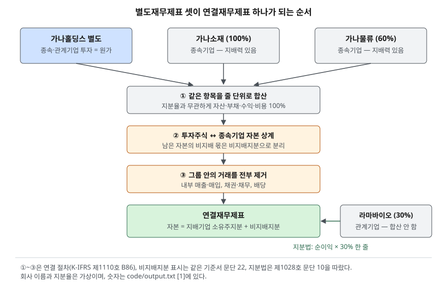

> 예제의 `가나홀딩스`·`가나소재`·`가나물류`·`라마바이오`와 그 숫자는 계산을 보이려고 만든 가상 자료다. 취득은 장부가로 해서 영업권이 없고, 법인세는 없다고 두었다.

## 들어가며

지주회사 하나를 골라 증권사 앱의 재무 탭을 열면 순이익이 150억원으로 나오는데, 같은 날 기사에는 그 회사가 312억원을 벌었다고 적혀 있다. 앱 화면 구석의 "연결/별도" 토글을 바꾸면 매출도 1,000억원과 2,100억원 사이를 오가고, 부채비율은 67%에서 163%로 뛴다. 대부분은 이때 처음 보이는 숫자 하나를 그대로 받아 들고 다른 회사와 비교한다. 그런데 비교 대상 회사는 다른 쪽 기준으로 찍혀 있을 수 있어서, 숫자 두 개를 맞대는 것만으로 두 배 넘는 차이가 기준 차이인지 실적 차이인지 가를 수 없다.

## 개념

### 무엇을 합치는가 — 지배력

연결재무제표는 지배기업과 종속기업을 하나의 경제실체로 보고 만든 재무제표다. 지배기업은 연결재무제표를 표시해야 한다(K-IFRS 제1110호 문단 4). 종속기업인지는 지분율이 아니라 **지배력**으로 정한다. 지배력은 세 가지를 모두 갖출 때 있다(문단 7).

1. 피투자자에 대한 힘이 있다
2. 피투자자에 관여해 변동이익에 노출되거나 그에 대한 권리가 있다
3. 그 힘을 써서 자신의 이익금액에 영향을 미칠 수 있다

지배력까지는 없지만 의결권의 20% 이상을 가지면 유의적인 영향력이 있는 것으로 보고(제1028호 문단 5), 이 회사는 관계기업이 된다. 관계기업은 합산하지 않고 지분법으로 한 줄만 반영한다. 투자를 원가로 잡은 뒤 피투자자 순손익 중 투자자 몫만큼 장부금액을 늘리거나 줄이고, 받은 배당은 장부금액에서 뺀다(문단 3·10).

### 별도재무제표 — 투자를 투자로만 본다

별도재무제표는 종속·관계기업 투자를 원가법, 제1109호에 따른 방법, 지분법 가운데 하나로 표시한 지배기업 자신의 재무제표다(제1027호 문단 4·10). 원가법을 쓰면 자회사가 얼마를 벌었든 투자주식 금액은 그대로이고, 자회사에서 받는 배당만 배당받을 권리가 확정될 때 당기손익으로 들어온다(문단 12).

| 피투자자 | 판단 기준 | 연결재무제표 | 별도재무제표(원가법) |
|---|---|---|---|
| 종속기업 | 지배력 3요소 | 줄 단위 100% 합산, 비지배지분 분리 | 투자주식 원가, 배당만 수익 |
| 관계기업 | 의결권 20% 이상 추정 | 지분법 한 줄 | 투자주식 원가, 배당만 수익 |

## 구조



> **출처**: [IFRS Foundation, IFRS 10 Consolidated Financial Statements — Appendix B86 Consolidation procedures, 문단 22 Non-controlling interests](https://www.ifrs.org/issued-standards/list-of-standards/ifrs-10-consolidated-financial-statements/) · [K-IFRS 제1110호 연결재무제표 — 문단 4·7·22](https://accountingwiki.co.kr/standards/1110) (제3자 전재) · [K-IFRS 제1028호 관계기업과 공동기업에 대한 투자 — 문단 3·5·10](https://accountingwiki.co.kr/standards/1028) (제3자 전재). 숫자는 이 글의 [`code/output.txt`](code/output.txt) `[1]`에 있다.

## 동작 원리

연결 절차는 세 단계다(제1110호 B86). 먼저 지배기업과 종속기업의 같은 항목을 줄 단위로 더한다. 가나물류의 지분이 60%여도 자산·부채·매출·비용은 100% 더한다. 다음으로 지배기업의 종속기업 투자주식과 그에 대응하는 종속기업 자본을 서로 지운다. 지우고 남은 종속기업 자본 가운데 지배기업 몫이 아닌 부분은 비지배지분으로 떼어 자본 안에 따로 표시한다(문단 22). 끝으로 그룹 안에서 오간 거래를 전부 지운다. 지주가 자회사에 판 매출, 그 거래에서 생긴 채권·채무, 자회사가 지주에 준 배당이 여기에 해당한다.

이 순서 때문에 두 재무제표의 숫자가 갈리는 이유는 세 가지로 정리된다.

- **매출**: 별도는 지주 자신의 매출만, 연결은 종속기업 매출까지 더한 뒤 내부 매출을 뺀 값이다.
- **순이익**: 별도는 자회사가 **배당한 만큼**, 연결은 자회사가 **번 만큼** 들어온다. 연결에서는 그 배당이 그룹 안의 돈 이동이라 지워진다.
- **부채**: 별도에는 자회사의 부채가 없다. 연결에는 지분율과 상관없이 자회사 부채가 전부 들어온다.

## 실습 예제

가나홀딩스는 가나소재 100%, 가나물류 60%, 라마바이오 30%를 가진다. 가나소재에 300억원어치를 팔았고 그중 100억원은 연말에 아직 받지 못했다. 가나소재는 120억원을 벌어 50억원을 배당했고, 가나물류는 80억원을 벌고 배당하지 않았다. 전체 소스: [`code/`](code/)

```text
[1] 같은 가나홀딩스, 두 재무제표 (억원)
  항목                     별도       연결
  매출                  1,000    2,100
  영업이익                  100      300
  배당금수익                  50        0
  지분법이익                   0       12
  당기순이익                 150      312
    지배기업 소유주 몫          150      280
    비지배지분 몫               0       32
  자산총계                2,000    4,192
  부채총계                  800    2,600
  자본총계                1,200    1,592
    지배기업 소유주지분        1,200    1,360
    비지배지분                 0      232

[2] 비율이 갈리는 자리
  부채비율(부채÷자본)      별도   66.7%   연결  163.3%
  ROE(지배 순이익÷지배 자본) 별도   12.5%   연결   20.6%
```

매출 2,100은 1,000 + 800 + 600에서 내부 매출 300을 뺀 값이다. 연결 순이익 312 가운데 32는 가나물류 이익 80의 40%로, 가나홀딩스 주주의 몫이 아니다. 부채비율이 두 배 넘게 뛴 것은 가나물류의 부채 1,600이 연결에 들어왔기 때문인데, 가나홀딩스의 지분은 60%뿐이어도 부채는 전액 더해진다. 검산으로 연결 지배지분 1,360이 별도 자본 1,200에 취득 후 늘어난 자본의 지배 몫(100 + 48 + 12)을 더한 값과 같은지 확인했다(`output.txt` `[3]`).

## 어느 쪽을 봐야 하는가

규정과 지표가 이미 답을 정해 둔 자리가 많다.

| 쓰임 | 기준 | 근거 |
|---|---|---|
| 주당이익(EPS)·PER | 연결 순이익 중 **지배기업 소유주 몫** | K-IFRS 제1033호(IAS 33 문단 9) |
| 거래소 수시공시의 비율 기준(자기자본·매출액 대비 %) | 지배회사면 연결 | 코스닥 공시 해설서 Ⅱ.1(2) |
| 횡령·배임, 매출채권 외 손상차손 공시 | 지배회사도 별도 | 같은 곳 |
| 유가증권시장 자본잠식 판정 | 연결, 자본은 비지배지분 제외 | 2026.2 정기결산 유의사항 |
| KIND 배당성향 | 연결 순이익(연결이 없으면 개별) | KIND 배당정보 |

정리하면 회사가 그룹 전체로 얼마를 벌고 얼마를 빚졌는지는 연결로 보고, 주주 한 사람에게 돌아오는 몫은 연결 숫자 가운데 지배기업 소유주 몫으로 본다. 별도는 지주가 실제로 손에 쥔 현금 흐름, 즉 자회사에서 배당을 얼마나 끌어올리고 있는지를 볼 때 쓴다.

## 실무에서 주의할 점

- **연결 순이익을 그대로 PER에 넣지 않는다.** 비지배지분 몫이 섞여 있다. 예제에서는 312와 280으로 10% 넘게 차이가 나고, 비지배지분이 큰 그룹일수록 벌어진다.
- **별도 부채비율이 낮다고 그룹 부채가 적은 것이 아니다.** 빚이 자회사에 몰려 있으면 별도에는 보이지 않는다. 지주회사를 볼 때는 두 부채비율을 나란히 놓는다.
- **별도 순이익은 배당 결정에 따라 움직인다.** 자회사가 한 해 배당을 건너뛰면 실적이 같아도 별도 이익이 줄고, 몰아서 배당하면 늘어난다. 별도 이익의 증감을 영업 실적 변화로 읽지 않는다.
- **지분율 50%가 연결 여부를 가르는 선이 아니다.** 지배력은 세 요소로 판단하므로, 과반이 안 돼도 연결하는 경우와 과반이어도 연결하지 않는 경우가 있다. 연결 범위는 주석의 종속기업 현황에서 확인한다.
- **비교할 때 기준을 맞춘다.** 종속기업이 없는 회사의 개별재무제표와 지주회사의 별도재무제표를 나란히 놓으면 둘 다 "연결 아님"이지만 뜻이 다르다. 지주회사 사이 비교는 연결끼리, 사업회사와 지주회사 비교도 연결끼리 한다.

## 정리

- 연결은 지배력이 있는 종속기업을 줄 단위로 100% 합산하고, 투자-자본 상계와 내부거래 제거를 거친 뒤 비지배지분을 떼어 낸다.
- 별도는 투자주식을 원가로 두고 받은 배당만 수익으로 잡으므로, 자회사의 이익과 부채가 배당을 통하지 않고는 드러나지 않는다.
- 관계기업은 두 재무제표 모두 합산하지 않으며, 연결에서는 지분법으로 순이익 × 지분율이 한 줄로 들어온다.
- 그룹의 규모와 부채는 연결로, 주주 몫은 연결의 지배기업 소유주 몫으로, 지주가 끌어올리는 현금은 별도로 본다.

## 참고 자료

- [한국회계기준원 — 시행 중인 K-IFRS 기준서 목록](https://www.kasb.or.kr/front/board/ingAccountingList.do) — 기준서 원문 발행처. 아래 전재 사이트는 문단을 바로 열기 위한 편의 링크다
- [IFRS Foundation — IFRS 10 Consolidated Financial Statements](https://www.ifrs.org/issued-standards/list-of-standards/ifrs-10-consolidated-financial-statements/) — 문단 7 지배력, 22 비지배지분, B86 연결 절차
- [IFRS Foundation — IAS 33 Earnings per Share](https://www.ifrs.org/issued-standards/list-of-standards/ias-33-earnings-per-share/) — 문단 9 기본주당이익은 지배기업 보통주주 귀속 손익으로 계산
- [K-IFRS 제1110호 연결재무제표 — 문단 4·7·22](https://accountingwiki.co.kr/standards/1110) (제3자 전재)
- [K-IFRS 제1027호 별도재무제표 — 문단 4 정의, 10 투자 회계처리 선택, 12 배당금](https://accountingwiki.co.kr/standards/1027) (제3자 전재)
- [K-IFRS 제1028호 관계기업과 공동기업에 대한 투자 — 문단 3 지분법, 5 유의적인 영향력, 10 지분법 회계처리](https://accountingwiki.co.kr/standards/1028) (제3자 전재)
- [한국거래소, 코스닥시장 공시·상장관리 해설(2025.9)](https://kind.krx.co.kr/external/dst/notice/11498/%28%EA%B3%B5%EC%A7%80%2925%EB%85%84%EC%BD%94%EC%8A%A4%EB%8B%A5%EC%8B%9C%EC%9E%A5%EA%B3%B5%EC%8B%9C%EC%83%81%EC%9E%A5%EA%B4%80%EB%A6%AC%ED%95%B4%EC%84%A4%EC%84%9C.pdf) — 제1장 Ⅱ.1(2) 재무 항목 적용 기준(지배회사는 연결, 횡령·배임 등은 별도), 부록 Ⅱ 주요 시장조치 재무제표 적용 기준
- [한국거래소, 유가증권시장 12월 결산법인 정기결산 관련 유의사항(2026.2)](https://kind.krx.co.kr/external/notice/dst/20260202/kospi_1.pdf) — 공시기준 재무제표 표(자본잠식은 연결·비지배지분 제외), 감사보고서 제출 시 연결·별도 모두 공시
- [한국거래소 KIND — 배당정보](https://kind.krx.co.kr/disclosureinfo/dividendinfo.do?method=searchDividendInfoMain) — 배당성향 = 배당금총액 ÷ 연결 당기순이익(연결이 없으면 개별)
