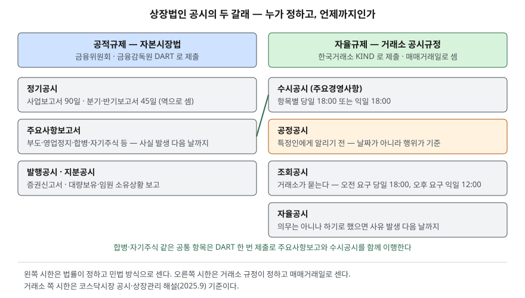

> 예제의 `가나전자`(12월 결산)와 `다라물산`(3월 결산)은 시한 계산을 보이려고 만든 가상 회사다. 공휴일은 예제 날짜에 걸리는 것만 넣었다.

## 들어가며

주식을 사 두고 나면 증권사 앱에 "공시" 알림이 하루에도 몇 건씩 뜬다. 단일판매·공급계약 체결, 조회공시 요구, 영업(잠정)실적, 분기보고서. 처음에는 전부 같은 무게로 읽다가, 곧 알림이 너무 많아 아예 꺼 버린다. 그런데 이 공시들은 누가 정한 규칙에 따라 나오는지, 언제까지 내야 하는지가 서로 다르다. 그 차이를 모르면 "실적이 나올 때가 됐는데 왜 아직 안 나오지", "어제 그 소문에 회사가 왜 답을 안 하지" 같은 질문에 답할 수 없고, 같은 회사의 공시 수십 건을 하나하나 열어 보는 수밖에 없다.

## 개념

### 공시는 두 갈래의 규칙에서 나온다

거래소의 공시 해설서는 기업공시의 법적 근거를 둘로 나눈다. 자본시장법 제159조~제161조와 금융위원회 규정이 정하는 **공적규제**, 그리고 한국거래소 공시규정이 정하는 **자율규제**다.

| 갈래 | 정하는 곳 | 제출 시스템 | 무엇 |
|---|---|---|---|
| 공적규제 | 자본시장법, 금융위원회 | 금융감독원 DART | 정기공시, 주요사항보고서, 발행공시, 지분공시 |
| 자율규제 | 한국거래소 공시규정 | 거래소 KIND | 수시공시, 공정공시, 조회공시, 자율공시 |

정기공시는 날짜가 정해진 보고서다. 사업보고서는 사업연도 경과 후 90일 이내(자본시장법 제159조 제1항), 반기·분기보고서는 그 기간 경과 후 45일 이내(제160조)에 낸다. 주요사항보고서는 부도, 영업정지, 회생절차 신청, 합병·영업양수도, 자기주식 취득·처분 결의처럼 법에 열거된 일이 생겼을 때 그 사실이 발생한 날의 다음 날까지 낸다(제161조 제1항).

거래소 공시는 더 넓고 더 빠르다. 수시공시는 거래소 공시규정이 정한 주요경영사항이 생기면 항목에 따라 당일 또는 익일까지 낸다. 공정공시는 아직 공시하지 않은 중요정보를 애널리스트·기관투자자·언론 같은 특정인에게 먼저 주려 할 때, 주기 **전에** 시장 전체에 공개하게 하는 제도다. 조회공시는 회사가 아니라 거래소가 먼저 움직인다. 풍문·보도가 있거나 주가·거래량이 급변하면 거래소가 회사에 사실 여부를 묻고 답을 공시하게 한다.

### 공정공시 대상정보 — 4가지

공정공시 대상은 4가지 범주다. 장래 사업계획·경영계획, 향후 3년 이내의 매출액·영업손익 등에 대한 전망 또는 예측, 정기보고서 제출 전의 잠정 영업실적, 그리고 수시공시 사항으로서 신고 시한이 아직 지나지 않은 것이다. 실적 발표 시즌에 "영업(잠정)실적(공정공시)"라는 이름의 공시가 쏟아지는 것은 회사가 기업설명회 전에 잠정실적을 이 제도에 따라 먼저 내기 때문이다.

## 구조



> **출처**: [한국거래소, 코스닥시장 공시·상장관리 해설(2025.9) — 제1장 Ⅰ.4 기업공시제도의 법적 근거 및 유형, Ⅰ.6 공시 처리 체계, Ⅱ.1(3) 수시공시 시한](https://kind.krx.co.kr/external/dst/notice/11498/%28%EA%B3%B5%EC%A7%80%2925%EB%85%84%EC%BD%94%EC%8A%A4%EB%8B%A5%EC%8B%9C%EC%9E%A5%EA%B3%B5%EC%8B%9C%EC%83%81%EC%9E%A5%EA%B4%80%EB%A6%AC%ED%95%B4%EC%84%A4%EC%84%9C.pdf) · [자본시장법 제159조·제160조·제161조](https://casenote.kr/%EB%B2%95%EB%A0%B9/%EC%9E%90%EB%B3%B8%EC%8B%9C%EC%9E%A5%EA%B3%BC_%EA%B8%88%EC%9C%B5%ED%88%AC%EC%9E%90%EC%97%85%EC%97%90_%EA%B4%80%ED%95%9C_%EB%B2%95%EB%A5%A0/%EC%A0%9C159%EC%A1%B0) (제3자 전재)

두 갈래는 따로 놀지 않는다. 합병·자기주식 취득처럼 주요사항보고서와 거래소 수시공시에 같이 걸리는 항목은 서식과 제출처가 DART로 하나로 합쳐져 있어서, 한 번 제출하면 금융감독원이 거래소 KIND로 바로 넘긴다. 앱에서 같은 제목의 공시가 DART와 KIND에 동시에 보이는 이유다.

## 동작 원리

### 정기공시는 달력으로 센다

"90일 이내"를 어떻게 세는지는 자본시장법에 따로 없으므로 민법의 기간 계산을 따른다. 기간을 일로 정하면 첫날은 넣지 않지만, 기간이 오전 0시부터 시작하면 첫날을 넣는다(민법 제157조). 사업연도는 12월 31일 24시에 끝나므로 1월 1일 0시에 기간이 시작되고, 1월 1일이 1일째가 된다. 기간의 말일이 토요일이나 공휴일이면 그다음 날 만료한다(제161조).

이 규칙대로 세면 12월 결산법인의 사업보고서 시한은 평년에 3월 31일이지만, 다음 해가 윤년이면 2월이 29일까지 있어 3월 30일이 된다. 거래소가 2026년 2월에 낸 정기결산 안내도 FY2025 사업보고서 시한을 2026년 3월 31일로 적었다.

### 거래소 공시는 매매거래일로 센다

거래소 해설서는 공시 관련 기간을 일로 정하면 매매거래일로 센다고 적는다. 주말과 휴장일은 건너뛴다. 시한도 날짜만이 아니라 시각까지 정해져 있다.

| 구분 | 시한 |
|---|---|
| 수시공시(당일) | 사유 발생 당일 18:00 (불가피하면 다음 날 07:50) |
| 수시공시(익일) | 사유 발생 다음 매매거래일 18:00 |
| 조회공시 — 풍문·보도 | 오전 요구는 당일 18:00, 오후 요구는 다음 날 12:00 |
| 조회공시 — 시황급변 | 다음 날 18:00 |
| 공정공시 | 해당 정보를 외부에 제공하기 전 |

공정공시만 날짜가 아니라 **행위**가 기준이다. 기업설명회나 기자간담회에서 잠정실적을 말할 예정이면 행사 시작 전에 공시해야 하고, 행사 중에 계획에 없던 정보를 말했으면 끝난 직후에 공시해야 한다.

## 실습 예제

두 가상 회사의 정기보고서 시한을 민법 방식으로, 가나전자의 거래소 공시 시한을 매매거래일 방식으로 계산했다. 전체 소스: [`code/`](code/)

```text
[1] 가나전자 — 12월 결산, 정기보고서 법정 시한
  FY2024   1분기보고서     2024-03-31(일)      45  2024-05-15(수)   2024-05-16(목)   2024-05-15(수)부터 1일 쉼(부처님오신날) → 다음 날
  FY2025   사업보고서      2025-12-31(수)      90  2026-03-31(화)   2026-03-31(화)
[1] 다라물산 — 3월 결산, 정기보고서 법정 시한
  FY2026   3분기보고서     2025-12-31(수)      45  2026-02-14(토)   2026-02-19(목)   2026-02-14(토)부터 5일 쉼(주말·설날 연휴·설날) → 다음 날
  FY2026   사업보고서      2026-03-31(화)      90  2026-06-29(월)   2026-06-29(월)
[2] 같은 '90일'이 윤년에는 하루 당겨진다 (12월 결산 사업보고서)
  FY2027 → 2028년 2월 29일  산술상 말일 2028-03-30(목)  제출 시한 2028-03-30(목)
```

세 가지가 보인다. 첫째, 2024년 1분기보고서는 45일째인 5월 15일이 부처님오신날이라 하루 밀린다. 둘째, 3월 결산인 다라물산은 사업보고서 시한이 6월 29일로, 12월 결산법인과 전혀 다른 철에 나온다. 3분기보고서는 45일째가 토요일이고 이어서 일요일과 설 연휴가 붙어 5일이 밀린다. 셋째, 같은 12월 결산이라도 FY2027 사업보고서는 3월 30일이 시한이다.

```text
[3] 가나전자 거래소 공시 — 매매거래일로 센다
  수시공시(익일)       사유 발생    2026-10-08(목) 11:00    2026-10-12(월) 18:00
  조회공시 풍문·보도     오전 요구    2026-10-16(금) 10:00    2026-10-16(금) 18:00
  조회공시 풍문·보도     오후 요구    2026-10-16(금) 14:00    2026-10-19(월) 12:00
  * 10-08(목) 다음 날을 달력으로 세면 2026-10-09(금) 한글날, 매매거래일로 세면 2026-10-12(월)
```

같은 금요일에 조회공시를 요구받아도 오전에 받으면 그날 저녁까지, 오후에 받으면 월요일 낮까지 답한다. 목요일에 생긴 익일 공시 사항은 금요일이 한글날이라 월요일이 시한이 된다. 이 결과는 [`code/output.txt`](code/output.txt)에서 옮겼다.

## 실무에서 주의할 점

- **시한까지 공시가 없다고 일이 없었다는 뜻이 아니다.** 수시공시 사유가 목요일 오후에 생겼으면 익일 공시 항목은 다음 매매거래일 저녁까지 나오지 않아도 규정 위반이 아니다. 그 사이 풍문이 돌면 조회공시가 먼저 나올 수 있다.
- **사업보고서 시한은 연장될 수 있다.** 거래소 안내에 따르면 연장신고서를 내면 5영업일 이내에서 늘어난다. 유가증권시장에서는 법정 기한까지 내지 않으면 다음 날 관리종목으로 지정되고, 기한부터 10일 이내에도 내지 않으면 상장폐지 절차가 진행된다(2026.2 정기결산 유의사항 기준).
- **반기·분기보고서 시한이 60일인 회사가 있다.** 연결재무제표 기준으로 작성하는 최초 사업연도와 그다음 사업연도에는 45일이 아니라 60일이다(제160조 단서). 시한이 지났는데 보고서가 없다고 바로 미제출로 보지 않는다.
- **공정공시 실적은 감사 전 숫자다.** 잠정실적은 외부감사 전에 내는 것이라 사업보고서의 확정치와 다를 수 있다. 3년 이내 전망치는 예측이라는 사실과 근거를 밝히면 실제 실적과 달라도 불성실공시로 지정되지 않을 수 있다는 면책 규정이 있다. 전망치를 확정치처럼 읽지 않는다.
- **시장마다 규정이 따로 있다.** 이 글의 거래소 공시 시한은 코스닥시장 해설서(2025.9)를 기준으로 했다. 유가증권시장은 별도 공시규정을 따르므로 조문 번호와 일부 기준이 다르다. 실제 적용은 한국거래소 법규서비스의 현행 규정으로 확인한다.

## 정리

- 공시는 자본시장법이 정하는 공적규제(정기공시·주요사항보고서, DART)와 거래소 공시규정이 정하는 자율규제(수시·공정·조회·자율공시, KIND) 두 갈래다.
- 정기공시 시한은 민법 방식의 달력으로 세며, 결산일 다음 날이 1일째이고 말일이 토·공휴일이면 다음 날로 밀린다. 그래서 윤년에는 사업보고서 시한이 3월 30일이 된다.
- 거래소 공시 시한은 매매거래일과 시각으로 센다. 조회공시는 요구가 오전인지 오후인지에 따라 답할 시각이 달라진다.
- 공정공시는 날짜가 아니라 특정인에게 정보를 주는 행위 전이 시한이고, 대상정보는 사업계획·전망·잠정실적·시한 전 수시공시 사항 4가지다.

## 참고 자료

- [국가법령정보센터 — 자본시장과 금융투자업에 관한 법률](https://www.law.go.kr/%EB%B2%95%EB%A0%B9/%EC%9E%90%EB%B3%B8%EC%8B%9C%EC%9E%A5%EA%B3%BC%EA%B8%88%EC%9C%B5%ED%88%AC%EC%9E%90%EC%97%85%EC%97%90%EA%B4%80%ED%95%9C%EB%B2%95%EB%A5%A0) — 제159조(2018-03-30 시행), 제160조·제161조(2025-07-22 시행) 원문 발행처
- [자본시장법 제159조 사업보고서 등의 제출](https://casenote.kr/%EB%B2%95%EB%A0%B9/%EC%9E%90%EB%B3%B8%EC%8B%9C%EC%9E%A5%EA%B3%BC_%EA%B8%88%EC%9C%B5%ED%88%AC%EC%9E%90%EC%97%85%EC%97%90_%EA%B4%80%ED%95%9C_%EB%B2%95%EB%A5%A0/%EC%A0%9C159%EC%A1%B0) (제3자 전재)
- [자본시장법 제160조 반기·분기보고서의 제출](https://casenote.kr/%EB%B2%95%EB%A0%B9/%EC%9E%90%EB%B3%B8%EC%8B%9C%EC%9E%A5%EA%B3%BC_%EA%B8%88%EC%9C%B5%ED%88%AC%EC%9E%90%EC%97%85%EC%97%90_%EA%B4%80%ED%95%9C_%EB%B2%95%EB%A5%A0/%EC%A0%9C160%EC%A1%B0) (제3자 전재)
- [자본시장법 제161조 주요사항보고서의 제출](https://casenote.kr/%EB%B2%95%EB%A0%B9/%EC%9E%90%EB%B3%B8%EC%8B%9C%EC%9E%A5%EA%B3%BC_%EA%B8%88%EC%9C%B5%ED%88%AC%EC%9E%90%EC%97%85%EC%97%90_%EA%B4%80%ED%95%9C_%EB%B2%95%EB%A5%A0/%EC%A0%9C161%EC%A1%B0) (제3자 전재)
- [국가법령정보센터 — 민법](https://www.law.go.kr/%EB%B2%95%EB%A0%B9/%EB%AF%BC%EB%B2%95) — 제157조 기간의 기산점, 제161조 공휴일 등과 기간의 만료점(2008-03-22 시행) 원문 발행처
- [민법 제157조](https://casenote.kr/%EB%B2%95%EB%A0%B9/%EB%AF%BC%EB%B2%95/%EC%A0%9C157%EC%A1%B0) · [민법 제161조](https://casenote.kr/%EB%B2%95%EB%A0%B9/%EB%AF%BC%EB%B2%95/%EC%A0%9C161%EC%A1%B0) (제3자 전재)
- [한국거래소, 코스닥시장 공시·상장관리 해설(2025.9)](https://kind.krx.co.kr/external/dst/notice/11498/%28%EA%B3%B5%EC%A7%80%2925%EB%85%84%EC%BD%94%EC%8A%A4%EB%8B%A5%EC%8B%9C%EC%9E%A5%EA%B3%B5%EC%8B%9C%EC%83%81%EC%9E%A5%EA%B4%80%EB%A6%AC%ED%95%B4%EC%84%A4%EC%84%9C.pdf) — 공시 분류와 법적 근거, 수시·조회·공정공시 시한, 공시 기간 계산법, 공정공시 대상정보와 예측정보 면책
- [한국거래소, 유가증권시장 12월 결산법인 정기결산 관련 유의사항(2026.2)](https://kind.krx.co.kr/external/notice/dst/20260202/kospi_1.pdf) — FY2025 사업보고서 시한 2026.03.31, 연장신고, 미제출 시 관리종목·상장폐지 절차
