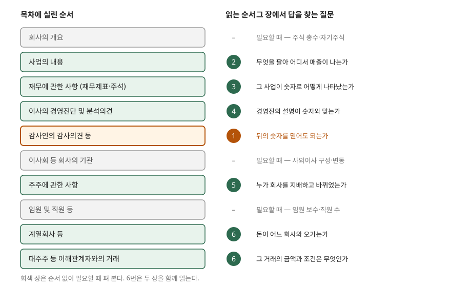

> **실행 검증 없음.** 계산이 없는 공시 제도 글이라 자본시장법과 금융감독원 공시 안내의 기재사항을 정리했다. 예제의 회사 `사아화학`과 그 보고서 문구는 설명을 위해 만든 가상 자료다.

## 들어가며

관심 가는 회사가 생기면 DART에서 사업보고서를 내려받는다. 열어 보면 수백 쪽이고, 첫 장부터 회사의 연혁, 본점 주소, 자본금 변동 내역이 이어진다. 성실하게 앞에서부터 읽으면 재무제표에 닿기 전에 지치고, 재무제표부터 펴면 숫자는 보이는데 그 숫자를 믿어도 되는지, 무엇을 팔아서 나온 숫자인지를 모른 채 읽게 된다. 목차는 법이 정한 기재 순서이지 읽는 순서가 아니다. 어떤 질문을 먼저 풀어야 다음 장이 읽히는지를 알면 같은 보고서를 훨씬 적은 쪽수로 읽을 수 있다.

## 개념

### 사업보고서 — 법이 정한 연차 보고서

사업보고서는 상장법인 등이 사업연도가 끝난 뒤 90일 안에 금융위원회와 거래소에 내는 연차 보고서다(자본시장법 제159조 제1항). 시한을 세는 법은 [공시 체계와 시한](../2026-10-07-disclosure-deadlines/index.md)에서 다뤘다. 같은 조 제2항이 적을 것을 정하는데, 회사의 목적·상호·사업 내용, 임원 보수, 재무에 관한 사항, 그리고 대통령령으로 정하는 사항이다. 금융감독원 DART의 기업공시 길라잡이는 이 기재사항의 근거를 법 제159조 제2항, 시행령 제168조, 증권의 발행 및 공시 등에 관한 규정 제4-3조로 묶어 안내한다. 서식과 쓰는 법은 금융감독원의 기업공시서식 작성기준이 정하고, 현행판은 2026년 9월 30일 시행본이다.

### 장의 구성 — 10개 장

DART 길라잡이가 드는 순서대로 묶으면 사업보고서 본문은 10개 장이다.

| 장 | 무엇이 실리는가 (DART 길라잡이·OpenDART 기준) |
|---|---|
| 회사의 개요 | 주식의 총수, 자기주식 취득·처분 |
| 사업의 내용 | 주요 사업 분야, 제품·서비스, 시장 현황, 경쟁 상황 |
| 재무에 관한 사항 | 요약재무정보, 재무제표, 배당, 증자·채무증권 발행, 공모·사모자금 사용내역 |
| 이사의 경영진단 및 분석의견 | 경영진이 설명하는 성과, 재무 상황 변화, 위험 요인, 전망 |
| 감사인의 감사의견 등 | 회계감사인의 명칭과 감사의견, 비감사용역 계약 |
| 이사회 등 회사의 기관 | 이사회, 사외이사와 그 변동 |
| 주주에 관한 사항 | 최대주주와 그 변동, 소액주주 |
| 임원 및 직원 등 | 임원·직원 현황, 보수 |
| 계열회사 등 | 계열회사, 타법인 출자 |
| 이해관계자와의 거래 | 최대주주·계열회사와의 거래 내용, 금액, 조건 |

여기에 회계감사인의 감사보고서, 감사의 감사보고서, 영업보고서, 정관, 내부회계관리제도 운영보고서 같은 서류가 첨부된다. 반기·분기보고서도 시행령 제170조가 제168조를 준용해 같은 틀을 쓴다. 다만 길라잡이에 따르면 반기·분기보고서는 감사의견 대신 검토의견을 싣거나 생략할 수 있고, 경영진단 장과 부속명세도 생략할 수 있다. 감사와 경영진의 설명이 온전히 갖춰진 것은 사업보고서뿐이다.

## 구조

> **출처**: [금융감독원 DART — 기업공시 길라잡이, 정기보고서 (사업보고서 기재사항·첨부서류)](https://dart.fss.or.kr/info/main.do?menu=210) · [금융감독원 OpenDART — 사업보고서 주요정보 (장별 제공 항목)](https://opendart.fss.or.kr/disclosureinfo/biz/main.do) · [자본시장법 제159조 사업보고서 등의 제출](https://casenote.kr/%EB%B2%95%EB%A0%B9/%EC%9E%90%EB%B3%B8%EC%8B%9C%EC%9E%A5%EA%B3%BC_%EA%B8%88%EC%9C%B5%ED%88%AC%EC%9E%90%EC%97%85%EC%97%90_%EA%B4%80%ED%95%9C_%EB%B2%95%EB%A5%A0/%EC%A0%9C159%EC%A1%B0) (제3자 전재). 읽는 순서 번호는 이 글이 붙인 것이다.

왼쪽 열은 법이 정한 기재 순서이고, 오른쪽 번호는 앞 장의 답이 다음 장을 읽는 전제가 되도록 고른 순서다. 감사의견은 목차의 다섯 번째 장이지만 1번으로 끌어올렸다.

## 동작 원리

### 1. 감사의견 — 뒤의 숫자를 믿어도 되는가

재무에 관한 사항의 숫자는 외부감사인이 감사한 숫자다. 감사의견이 적정이 아니면 그 숫자를 근거로 비율을 계산하는 일 자체가 의미를 잃는다. 그래서 가장 먼저 감사의견 장에서 의견의 종류를 확인한다. 한정·부적정·의견거절이 어떻게 갈리고 상장에 무엇을 일으키는지는 [주석과 감사보고서](../../statements/2026-10-01-notes-and-audit-opinion/index.md)에서 다뤘다.

같은 장의 비감사용역 계약도 눈여겨본다. 감사인이 같은 회사에 자문 같은 다른 용역을 함께 제공하면 그 계약이 여기에 적힌다.

### 2. 사업의 내용 — 숫자를 읽을 틀을 먼저 만든다

매출이 20% 늘었다는 숫자는 회사가 무엇을 파는지 알아야 해석된다. 사업의 내용 장은 주요 사업 분야와 제품, 시장과 경쟁 상황을 적는다. 여기서 사업 부문이 몇 개이고 각 부문이 매출에서 차지하는 비중이 얼마인지를 먼저 잡아 두면, 재무제표를 펼쳤을 때 어느 숫자가 어느 사업에서 나왔는지를 연결할 수 있다.

### 3. 재무에 관한 사항 — 요약에서 본문, 본문에서 주석으로

이 장은 요약재무정보로 시작해 재무제표와 주석으로 이어진다. 종속회사가 있으면 연결재무제표를 기준으로 쓰고 별도재무제표를 함께 싣는다. 두 재무제표의 차이는 [연결재무제표와 별도재무제표](../2026-10-07-consolidated-vs-separate/index.md)에서 다뤘다. 요약재무정보로 몇 년치 흐름을 보고, 눈에 띄게 움직인 계정이 있으면 본문 재무제표에서 금액을, 주석에서 그 이유를 찾는다.

같은 장에 배당과 자금조달이 함께 있다는 점도 쓸모가 있다. 증자나 채무증권 발행으로 모은 돈을 어디에 썼는지가 공모·사모자금 사용내역으로 실린다.

### 4. 이사의 경영진단 및 분석의견 — 숫자를 본 뒤에 읽는다

경영진이 성과와 재무 상황 변화, 위험 요인, 전망을 직접 설명하는 장이다. 이 장을 재무 장보다 먼저 읽으면 경영진의 설명이 숫자를 보는 눈을 정해 버린다. 숫자를 먼저 보고 나서 읽으면 반대로 쓸 수 있다. 내가 숫자에서 찾은 변화를 경영진이 설명했는지, 설명하지 않고 넘어간 변화가 있는지를 대조하는 것이다.

### 5. 주주에 관한 사항 — 누가 회사를 지배하는가

최대주주와 그 특수관계인의 지분, 그 변동이 실린다. 최대주주가 바뀌었거나 지분이 크게 줄었다면, 앞에서 읽은 사업 계획과 경영진 설명이 그대로 이어질지를 다시 생각해야 한다.

### 6. 계열회사와 이해관계자 거래 — 돈이 어디로 오가는가

계열회사 장은 회사가 어떤 회사들과 지배·출자 관계로 묶여 있는지를, 이해관계자와의 거래 장은 최대주주·계열회사와 주고받은 거래의 내용과 금액, 조건을 적는다. 두 장을 함께 읽어야 매출 가운데 얼마가 같은 그룹 안에서 나왔는지, 최대주주에게 돈을 빌려주거나 담보를 제공했는지가 보인다. 재무제표 주석의 특수관계자 거래와 겹치는 내용이지만, 사업보고서는 이것을 독립된 장으로 따로 세운다.

### 필요할 때 펴는 장

회사의 개요는 주식 총수와 자기주식 현황을 찾을 때, 이사회 장은 사외이사 구성을 볼 때, 임원 및 직원 장은 보수나 직원 수를 볼 때 편다. 자본시장법 제159조 제2항은 보수가 대통령령으로 정하는 금액(5억원 이내에서 정함) 이상인 임원의 개인별 보수와 산정 기준을 적게 한다.

## 실습 예제

가상 회사 사아화학의 사업보고서를 이 순서로 읽는다고 하자. 보고서 문구는 모두 만든 것이고, 계산이 없으므로 실행 기록은 없다.

| 순서 | 장 | 사아화학 보고서에 적힌 것 (가상) | 다음 장으로 넘기는 질문 |
|---|---|---|---|
| 1 | 감사의견 | 연결·별도 모두 적정의견 | 숫자를 믿고 읽는다. 무엇을 팔아 나온 숫자인가 |
| 2 | 사업의 내용 | 전자소재 부문 매출 비중 70%, 생활화학 30%. 전자소재 고객은 소수 대형 업체 | 전자소재 매출이 늘었다면 고객 몇 곳에서 늘었는가 |
| 3 | 재무 | 매출 20% 증가, 영업활동현금흐름은 감소. 주석에서 매출채권이 크게 늘었다 | 매출은 늘었는데 왜 현금이 덜 들어왔는가 |
| 4 | 경영진단 | "고객사 증설로 전자소재 매출 증가"라고 설명. 매출채권 증가 이유는 적지 않음 | 늘어난 매출채권의 상대방이 누구인가 |
| 5 | 주주 | 최대주주 지분 변동 없음 | 지배 구조는 그대로다. 그룹 안 거래는 어떤가 |
| 6 | 계열회사·이해관계자 거래 | 전자소재 매출 일부가 최대주주 계열회사 대상. 그 매출채권 결제 조건이 다른 고객보다 김 | — |

4번에서 경영진이 설명하지 않은 매출채권 증가가 6번에서 계열회사와의 거래 조건으로 연결된다. 3번에서 잡은 질문이 없었다면 4번의 설명을 그대로 받아들이고 넘어갔을 것이다. 이익과 현금이 갈리는 구조는 [현금흐름표 — 이익이 나는데 돈이 없는 이유](../../statements/2026-09-30-cash-flow-profit-without-cash/index.md)에서 계산했다.

이 표의 결론은 사아화학이 좋다 나쁘다가 아니다. 앞 장에서 생긴 질문을 들고 다음 장을 펴면, 목차 순서로 읽을 때는 서로 멀리 떨어진 두 문장이 이어진다는 것이다.

## 실무에서 주의할 점

- **목차 순서와 읽는 순서를 섞지 않는다.** 목차는 법과 작성기준이 정한 기재 순서다. 첫 장부터 읽으면 회사의 연혁과 자본금 변동 내역에서 시간을 쓰고, 정작 감사의견은 다섯 번째 장에 가서야 만난다.
- **경영진단은 경영진이 쓴 글이다.** 감사 대상인 재무제표와 달리 경영진의 설명과 전망이 담긴다. 숫자와 대조하는 용도로 읽고, 전망은 확정된 사실로 읽지 않는다.
- **분기·반기보고서로 같은 깊이를 기대하지 않는다.** 감사의견 대신 검토의견이 실리거나 생략되고, 경영진단 장도 생략될 수 있다. 연간 흐름은 사업보고서로 보고, 분기 보고서는 그 사이의 변화를 확인하는 데 쓴다.
- **서식 기준은 바뀐다.** 기업공시서식 작성기준은 해마다 고쳐진다. 이 글은 2026년 9월 30일 시행판 시점의 DART 안내를 기준으로 했고, 몇 년 전 보고서와 장 안의 세부 항목이 다를 수 있다.
- **첨부서류도 보고서의 일부다.** 감사보고서와 내부회계관리제도 운영보고서는 본문 뒤 첨부로 붙는다. 감사인의 의견 문단과 강조사항 전문은 첨부된 감사보고서에서 읽는다.

## 정리

- 사업보고서는 자본시장법 제159조가 정한 연차 보고서이고, DART 길라잡이 기준으로 본문은 10개 장, 여기에 감사보고서 등이 첨부된다.
- 목차는 기재 순서일 뿐이다. 읽는 순서는 감사의견 → 사업의 내용 → 재무 → 경영진단 → 주주 → 계열회사·이해관계자 거래의 6단계로 잡는다.
- 감사의견이 숫자를 믿을지를, 사업의 내용이 숫자를 읽을 틀을 정한다. 경영진단은 숫자를 본 뒤 대조하는 데 쓴다.
- 앞 장에서 생긴 질문을 들고 다음 장을 펴면, 목차에서 멀리 떨어진 문장끼리 이어진다.

## 참고 자료

- [금융감독원 DART — 기업공시 길라잡이, 정기 보고서](https://dart.fss.or.kr/info/main.do?menu=210) — 사업보고서 기재사항의 근거(법 제159조 제2항, 시행령 제168조, 규정 제4-3조), 장별 기재 내용, 첨부서류, 반기·분기보고서 생략 가능 항목
- [금융감독원 OpenDART — 사업보고서 주요정보](https://opendart.fss.or.kr/disclosureinfo/biz/main.do) — 장별로 제공하는 항목(주식 총수, 배당, 자금 사용내역, 감사의견, 최대주주, 임원 보수, 타법인 출자)
- [금융감독원 DART — 기업공시제도 일반](https://dart.fss.or.kr/info/searchGuide.do) — 기업공시서식 작성기준(2026.9.30. 시행) 게시
- [국가법령정보센터](https://www.law.go.kr/) — 자본시장법 제159조(2018-03-30 시행), 시행령 제168조·제170조 원문 발행처
- [자본시장법 제159조 사업보고서 등의 제출](https://casenote.kr/%EB%B2%95%EB%A0%B9/%EC%9E%90%EB%B3%B8%EC%8B%9C%EC%9E%A5%EA%B3%BC_%EA%B8%88%EC%9C%B5%ED%88%AC%EC%9E%90%EC%97%85%EC%97%90_%EA%B4%80%ED%95%9C_%EB%B2%95%EB%A5%A0/%EC%A0%9C159%EC%A1%B0) (제3자 전재)
