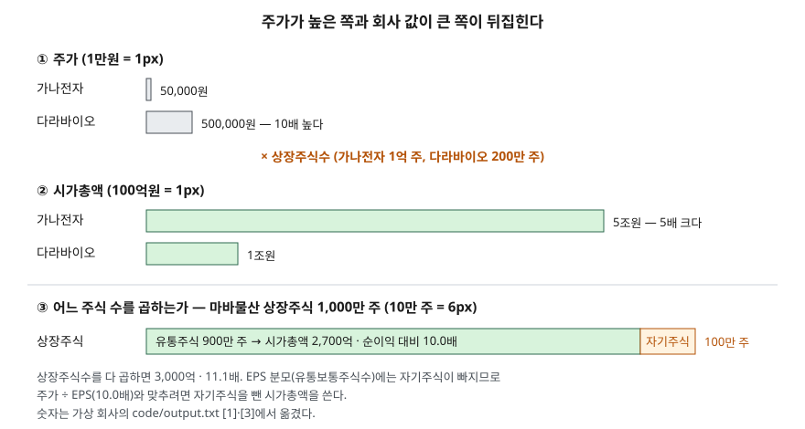

> 예제의 회사 `가나전자`·`다라바이오`·`마바물산`과 그 숫자는 계산 원리를 보이려고 만든 가상 값이다. 실제 기업과 관계가 없다.

## 들어가며

증권 계좌를 처음 열고 종목을 둘러보면 한 주에 50만원이 넘는 종목과 5만원대 종목이 나란히 보인다. 50만원짜리는 한 주 사기도 부담스러우니 "비싼 회사", 5만원짜리는 "싼 회사"로 묶어 기억하기 쉽다. 그런데 회사에 매겨진 값을 주가 하나로 비교하면 주식을 몇 주로 나눴는지가 빠진다. 1억 주로 나눈 회사와 200만 주로 나눈 회사는 주가가 10배 차이 나도 회사 값은 반대로 5배 차이 날 수 있다. 이 글의 예제가 바로 그 경우다.

## 개념

**시가총액**은 상장된 주식 전부를 지금 주가로 평가한 금액이다. 금융위원회가 한국거래소 자료로 공표하는 e-나라지표의 정의는 "증권시장에 상장되어 있는 모든 주식의 시가를 전부 더한 금액"이다. 종목 하나로 좁히면 주가에 상장주식수를 곱한 값이 된다.

| 값 | 무엇을 잰다 | 주식 수가 바뀌면 |
|---|---|---|
| 주가 | 지분 한 조각의 값 | 따라 바뀐다 |
| 시가총액 | 지분 전체에 시장이 매긴 값 | 이론상 그대로다 |

주가는 회사가 주식을 몇 조각으로 나눴는지에 따라 얼마든지 커지고 작아진다. 상법 제329조는 액면주식 1주의 금액을 100원 이상으로만 정하고, 몇 주를 발행할지는 정관과 회사가 정한다. 그래서 주가의 절대 크기는 회사의 크기나 비싸고 싼 정도를 말해 주지 않는다. 회사끼리 크기를 비교할 때는 시가총액을 쓰고, 이익에 견줘 비싼지를 볼 때는 PER처럼 이익과 나란히 놓은 비율을 쓴다. PER은 [PER — 지난 이익과 예상 이익](../../valuation/2026-10-02-per-trailing-vs-forward/index.md)에서 다뤘다.

PER은 주당으로 계산해도, 회사 전체로 계산해도 같은 값이 나온다. 주가 ÷ EPS의 분자와 분모에 같은 주식 수를 곱하면 시가총액 ÷ 당기순이익이 되기 때문이다. 다만 이것은 **두 쪽이 같은 주식 수를 쓸 때**만 성립한다.

## 구조



> **출처**: [e-나라지표 상장회사수 및 시가총액 — 시가총액 정의](https://www.index.go.kr/unity/potal/main/EachDtlPageDetail.do?idx_cd=1079) · [한국회계기준원 기업회계기준서 제1033호 주당이익 — 문단 19~20 보통주식수](https://www.kasb.or.kr/front/board/ingAccountingList.do). 금액은 이 글의 [`code/output.txt`](code/output.txt) `[1]`·`[3]`에서 옮겼다.

위 두 줄은 같은 두 회사를 주가로 줄 세운 것과 시가총액으로 줄 세운 것이다. 가운데의 상장주식수를 곱하는 순간 순서가 뒤집힌다. 아래 줄은 한 회사 안에서 "상장주식수"가 곧 "시장에 돌고 있는 주식 수"는 아니라는 것을 보인다.

## 동작 원리

### 주가 순서와 시가총액 순서가 다르다

가나전자는 주가 50,000원에 1억 주가 상장돼 시가총액이 5조원이다. 다라바이오는 주가 500,000원에 200만 주가 상장돼 1조원이다. 주가는 다라바이오가 10배 높고, 회사 값은 가나전자가 5배 크다. 한 주를 사는 데 드는 돈과 회사 전체를 사는 데 드는 돈은 다른 질문이다.

어느 쪽이 이익에 비해 비싼지는 또 다른 질문이다. 가나전자는 순이익 4,000억원으로 EPS가 4,000원, PER 12.5배다. 다라바이오는 순이익 500억원으로 EPS가 25,000원, PER 20.0배다. 이익 1원에 시장이 매긴 값은 다라바이오가 더 높다. 이 결론은 주가 50만원이라는 숫자에서 온 것이 아니라 이익과 나란히 놓았을 때 나온 것이다.

### 주식 수를 바꿔도 PER은 그대로다

가나전자의 시가총액 5조원과 순이익 4,000억원을 고정하고 주식 수만 1,000만, 1억, 10억 주로 바꿔 보면 주가는 500,000원, 50,000원, 5,000원이 된다. EPS도 40,000원, 4,000원, 400원으로 같은 비율로 움직인다. 분자와 분모가 함께 움직이니 PER은 세 경우 모두 12.5배다. 주가가 5,000원이라고 해서 이익에 비해 싸지는 것이 아니다. 실제로 주식 수가 이렇게 바뀌는 일이 액면분할과 무상증자이고, [액면분할과 무상증자 — 주식 수가 늘 때](../2026-10-04-stock-split-and-bonus-issue/index.md)에서 다룬다.

### 자기주식이 끼면 두 PER이 어긋난다

마바물산은 1,000만 주가 상장돼 있고 그중 100만 주를 회사가 자기주식으로 갖고 있다. 기업회계기준서 제1033호의 보통주식수 항목(문단 19~20)은 기본주당이익의 분모를 그 기간에 **유통된** 보통주식수의 가중평균으로 두고, 회사가 사들여 가진 자기주식은 유통주식에서 뺀다. 그래서 EPS는 순이익 270억원을 900만 주로 나눈 3,000원이고, 주가 30,000원을 나누면 10.0배다.

그런데 시가총액을 상장주식수 1,000만 주로 곱하면 3,000억원이 되고, 순이익으로 나누면 11.1배다. 회사가 자기 자신에게 진 몫까지 "회사 값"에 넣었기 때문이다. 자기주식을 뺀 900만 주로 곱하면 2,700억원, 10.0배로 주당 계산과 맞는다. 한국거래소 정보데이터시스템은 상장주식수 기준 시가총액과 별도로 자기주식을 제외한 시가총액도 제공한다. 같은 회사의 PER이 화면마다 다르게 나오면 분자와 분모가 같은 주식 수를 썼는지부터 본다.

## 실습 예제

단위는 표 머리에 적었다. 마바물산의 자기주식 수는 한 해 동안 변하지 않았다고 두어 가중평균이 기말 수와 같다.

전체 소스: [`code/`](code/) · 수행 기록: [`code/output.txt`](code/output.txt)

```text
[1] 주가와 시가총액 (주가는 원, 시가총액·순이익은 억원)
                   주가         상장주식수      시가총액     순이익      EPS    주가÷EPS      시총÷순이익
  가나전자         50,000   100,000,000    50,000   4,000    4,000     12.5배       12.5배
  다라바이오       500,000     2,000,000    10,000     500   25,000     20.0배       20.0배

[2] 같은 회사를 주식 수만 달리 나눴다면 (가나전자, 시가총액 5조원 고정)
           상장주식수        주가      EPS     PER
      10,000,000   500,000   40,000   12.5배
     100,000,000    50,000    4,000   12.5배
   1,000,000,000     5,000      400   12.5배

[3] 마바물산 — 자기주식 10% 를 가진 회사 (주가 30,000원, 순이익 270억원)
  상장주식수 10,000,000 · 자기주식 1,000,000 · 유통주식수 9,000,000
  EPS = 순이익 ÷ 유통주식수 = 3,000원 → 주가 ÷ EPS = 10.0배
  기준                         시가총액(억)      시총÷순이익
  상장주식수 기준                     3,000       11.1배
  자기주식 제외 기준                   2,700       10.0배
```

`[0]` 산식과 각 절 끝의 설명 줄은 [`code/output.txt`](code/output.txt)에 있다.

`[1]`은 주가 열과 시가총액 열의 크기 순서가 반대이고, 마지막 두 열은 자기주식이 없으면 PER을 어느 쪽으로 계산해도 같다는 것을 보인다. `[2]`는 주가와 EPS 열이 함께 10배씩 움직이고 PER 열만 그대로다. `[3]`은 같은 주가, 같은 순이익인데 곱한 주식 수에 따라 마지막 열이 10.0배와 11.1배로 갈린다.

## 실무에서 주의할 점

- **주가의 높고 낮음으로 회사를 비교하지 않는다.** 주가는 발행주식수에 따라 바뀌는 값이다. 크기는 시가총액으로, 이익 대비 수준은 PER·PBR 같은 비율로 본다.
- **시가총액이 어느 주식 수로 계산됐는지 확인한다.** 상장주식수 기준인지, 자기주식 제외 기준인지에 따라 값이 다르다. 자기주식 비중이 큰 회사일수록 차이가 커진다.
- **우선주가 따로 상장된 회사는 보통주 시가총액만으로 회사 값이 되지 않는다.** 시가총액은 종목별로 계산되므로, 회사 전체 지분 값을 보려면 보통주와 우선주 종목의 시가총액을 더한다.
- **시가총액은 회사 전체를 사는 데 드는 값이 아니다.** 빚을 함께 떠안는 값까지 보려면 순차입금을 더한 EV를 쓴다. EV는 [EV/EBITDA — 빚까지 포함한 회사 값](../../valuation/2026-10-03-ev-ebitda-debt-included/index.md)에서 다뤘다.
- **시가총액은 주가가 움직일 때마다 바뀐다.** 하루 종가로 계산한 값이므로, 비교할 때는 같은 날짜의 값끼리 놓는다.

## 정리

- 시가총액은 주가 × 상장주식수로, 시장이 회사 지분 전체에 매긴 값이다.
- 주가는 주식을 몇 주로 나눴는지에 따라 바뀌므로, 주가가 높다고 회사가 크거나 비싼 것이 아니다.
- PER은 주가 ÷ EPS로 보든 시가총액 ÷ 순이익으로 보든 같은 주식 수를 쓰면 같은 값이다.
- 자기주식이 있으면 상장주식수 기준 시가총액과 유통주식수 기준 EPS가 어긋나므로, 분자와 분모의 주식 수를 맞춘다.

## 참고 자료

- [e-나라지표 — 상장회사수 및 시가총액](https://www.index.go.kr/unity/potal/main/EachDtlPageDetail.do?idx_cd=1079) — 시가총액 정의. 작성: 금융위원회 자본시장과, 자료: 한국거래소
- [한국거래소 KRX 정보데이터시스템](https://data.krx.co.kr/contents/MDC/MAIN/main/index.cmd) — 종목별 시가총액, 자기주식 제외 시가총액
- [한국회계기준원 — 기업회계기준서 제1033호 주당이익](https://www.kasb.or.kr/front/board/ingAccountingList.do) — 문단 19~20 보통주식수(가중평균유통보통주식수, 자기주식 차감)
- [IFRS Foundation — IAS 33 Earnings per Share](https://www.ifrs.org/issued-standards/list-of-standards/ias-33-earnings-per-share/) — K-IFRS 제1033호의 원문
- [국가법령정보센터 — 상법](https://www.law.go.kr/법령/상법) — 제329조 자본금의 구성(액면주식 1주 100원 이상, 2012-04-15 시행)
