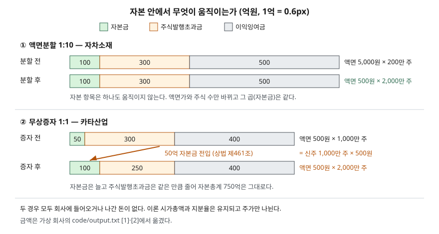

> 예제의 회사 `자차소재`·`카타산업`과 그 숫자는 계산 원리를 보이려고 만든 가상 값이다. 실제 기업과 관계가 없다.

## 들어가며

보유한 종목에서 무상증자 공시가 나오면 "주식을 공짜로 준다"는 말에 기분이 좋아지고, 권리락 날 아침 계좌를 열면 주가가 절반으로 떨어져 있어 놀란다. 액면분할도 비슷하다. 주가가 50만원에서 5만원이 되니 "싸졌다"는 말이 돈다. 어느 쪽이든 이날 계좌의 평가액은 주식 수가 두 배 또는 열 배가 된 만큼 주가가 나뉘어 이론상 변하지 않는다. 그런데 손익 화면의 EPS가 갑자기 절반이 되고, 1주 미만으로 떨어진 몫이 현금으로 들어오는 것까지 겹치면 무엇이 그대로이고 무엇이 바뀌었는지 가리기 어려워진다.

## 개념

두 사건은 **회사에 돈이 들어오거나 나가지 않고 주식 수만 늘린다**는 점이 같다. 다른 것은 자본 안에서 무엇을 건드리느냐다.

| | 액면분할 | 무상증자 |
|---|---|---|
| 하는 일 | 1주를 여러 주로 쪼갠다 | 준비금을 자본금으로 옮기고 그만큼 새 주식을 나눠 준다 |
| 근거 조문 | 상법 제329조의2 | 상법 제461조 |
| 결의 기관 | 주주총회 특별결의(제434조) | 이사회. 정관으로 정하면 주주총회 |
| 액면가 | 쪼갠 비율만큼 낮아진다. 1주 100원 미만은 안 된다 | 그대로다 |
| 자본금 | 그대로다 | 새 주식의 액면총액만큼 늘어난다 |
| 준비금 | 그대로다 | 자본금으로 옮긴 만큼 줄어든다 |
| 자본총계 | 그대로다 | 그대로다 |

액면주식의 자본금은 발행주식의 액면총액이다. 액면분할은 액면가를 10분의 1로, 주식 수를 10배로 바꾸니 곱한 값이 같다. 무상증자는 액면가는 두고 주식 수를 늘리니 자본금이 늘어야 하고, 그 돈을 자본준비금(주식발행초과금 등)이나 이익준비금에서 가져온다. 상법 제461조가 말하는 "준비금의 자본금 전입"이 이 이동이다. 자본 안에서 칸을 옮긴 것이라 자본총계는 변하지 않는다.

## 구조



> **출처**: [상법 제329조의2 주식의 분할](https://casenote.kr/%EB%B2%95%EB%A0%B9/%EC%83%81%EB%B2%95/%EC%A0%9C329%EC%A1%B0%EC%9D%982) (제3자 전재) · [상법 제461조 준비금의 자본금 전입](https://casenote.kr/%EB%B2%95%EB%A0%B9/%EC%83%81%EB%B2%95/%EC%A0%9C461%EC%A1%B0) (제3자 전재) · 원문 발행처 [국가법령정보센터 — 상법](https://www.law.go.kr/법령/상법). 금액은 이 글의 [`code/output.txt`](code/output.txt) `[1]`·`[2]`에서 옮겼다.

위 두 줄은 액면분할 전후로 세 칸이 한 치도 움직이지 않는 것을, 아래 두 줄은 무상증자로 주식발행초과금 칸에서 자본금 칸으로 50억이 넘어가는 것을 보인다. 막대의 전체 길이, 곧 자본총계는 네 줄 모두 전후가 같다.

## 동작 원리

### 액면분할 — 칸은 그대로, 조각만 잘게

자차소재는 액면 5,000원짜리 주식 200만 주로 자본금이 100억원이다. 1주를 10주로 쪼개면 액면 500원짜리 2,000만 주가 되고, 곱한 자본금은 여전히 100억원이다. 주식발행초과금 300억원과 이익잉여금 500억원도 그대로다. 주가 500,000원이었다면 이론상 50,000원이 되고, 시가총액은 1조원으로 같다. 주식 2만 주로 1.00%를 가진 주주는 20만 주로 여전히 1.00%다.

액면분할은 주식 1주의 금액을 바꾸는 일이라 정관의 기재 사항이 바뀌고, 그래서 정관 변경과 같은 특별결의를 거친다. 분할 후 액면이 상법 제329조의 하한인 100원 아래로 내려갈 수 없다는 제약도 여기서 나온다.

### 무상증자 — 준비금이 자본금으로 넘어간다

카타산업은 액면 500원짜리 1,000만 주, 자본금 50억원, 주식발행초과금 300억원, 이익잉여금 400억원이다. 1주당 1주를 무상으로 배정하면 새 주식 1,000만 주의 액면총액 50억원만큼 주식발행초과금이 자본금으로 옮겨진다. 결과는 자본금 100억, 주식발행초과금 250억, 이익잉여금 400억이고 자본총계 750억원은 같다.

주주가 받은 새 주식은 그 대가를 내지 않았으므로 회사 값을 늘리지 않는다. 시가총액 2,000억원이 2,000만 주로 나뉘어 이론 주가는 20,000원에서 10,000원이 된다. 한국거래소는 새 주식을 받을 권리가 없어지는 날(권리락일)에 이렇게 조정한 기준가격을 정하고, 그 근거가 유가증권시장 업무규정 시행세칙의 기준가격 조항(제30조)이다. 실제 기준가격은 호가 단위에 맞춰 정해지므로 이론값과 끝자리가 다를 수 있다.

### 단주 — 지분율이 미세하게 흔들리는 자리

배정 비율이 1주당 0.3주처럼 정수가 아니면 1주 미만의 몫이 생긴다. 333주를 가진 주주는 99.9주를 배정받아야 하지만 주식은 1주 단위로만 나눠 줄 수 있다. 상법 제461조는 제443조를 준용해 이런 단주를 모아 팔고 그 대금을 주주에게 나눠 주게 한다. 이 주주는 99주를 받고 0.9주는 현금으로 받는다. 이론 주가로 환산하면 13,846원이다.

현금으로 바뀐 몫만큼 지분율이 줄어든다. 예제에서는 0.00333%에서 0.00332%로 움직인다. 10의 배수만큼 가진 주주는 단주가 없어 지분율이 그대로다. 값은 작지만, "지분율이 유지된다"는 말은 단주를 현금으로 받은 몫까지 합쳐야 맞는다는 점을 보여 준다.

### 비교표시 EPS를 소급해 고치는 이유

카타산업의 순이익이 전기 100억원, 당기 110억원이라면 이익은 10% 늘었다. 그런데 1:1 무상증자로 주식 수가 1,000만 주에서 2,000만 주가 됐다. 전기 EPS를 증자 전 주식 수로 두면 1,000원, 당기 EPS는 550원이라 45% 줄어든 것처럼 보인다. 기업회계기준서 제1033호의 소급수정 항목(문단 64)은 자본금전입, 무상증자, 주식분할로 유통보통주식수가 늘면 비교표시하는 모든 기간의 주당이익을 늘어난 주식 수로 다시 계산하게 한다. 전기 EPS를 2,000만 주로 고치면 500원이 되고, 당기 550원과 견주면 10% 증가로 이익의 실제 변화와 맞는다.

## 실습 예제

단위는 각 절 머리에 적었다. `[3]`의 지분율 후 분모는 단주를 버리기 전 13,000,000주로 두어, 단주가 지분율을 움직이는 크기만 보이게 했다.

전체 소스: [`code/`](code/) · 수행 기록: [`code/output.txt`](code/output.txt)

```text
[1] 자차소재 — 1주를 10주로 액면분할 (액면가·주가는 원, 자본 항목은 억원)
               액면가         발행주식수     자본금   주식발행초과금     이익잉여금     자본총계
  분할 전       5,000     2,000,000     100       300       500      900
  분할 후         500    20,000,000     100       300       500      900
  이론 주가 500,000 → 50,000원 · 시가총액 10,000 → 10,000억원
  주주 갑 20,000주(1.00%) → 200,000주(1.00%)

[2] 카타산업 — 1주당 1주 무상증자, 주식발행초과금을 자본금으로 전입 (단위 같음)
               액면가         발행주식수     자본금   주식발행초과금     이익잉여금     자본총계
  증자 전         500    10,000,000      50       300       400      750
  증자 후         500    20,000,000     100       250       400      750
  자본금으로 옮긴 금액 50억원 = 신주 10,000,000주 × 액면 500원
  이론 주가 20,000 → 10,000원 · 시가총액 2,000 → 2,000억원

[3] 카타산업이 1주당 0.3주를 배정했다면 — 단주가 생길 때 (발행주식 10,000,000주)
  주주            보유       배정 계산     받은 신주    단주     단주 현금(원)      지분율 전      지분율 후
  갑            333        99.9        99   0.9       13,846   0.00333%   0.00332%
  을             10         3.0         3   0.0            0   0.00010%   0.00010%
  병      1,000,000   300,000.0   300,000   0.0            0  10.00000%  10.00000%

[4] 카타산업 — 1:1 무상증자 뒤 비교표시 EPS (순이익 억원, EPS 원)
                       순이익           주식수     EPS     당기 대비
  전기(고치기 전)            100    10,000,000   1,000    -45.0%
  전기(소급 수정)            100    20,000,000     500     10.0%
  당기                   110    20,000,000     550
```

각 절 끝의 설명 줄은 [`code/output.txt`](code/output.txt)에 있다.

`[1]`은 자본 항목 다섯 칸이 전후로 같고 액면가와 주식 수 칸만 바뀐다. `[2]`는 자본금과 주식발행초과금 칸이 50씩 반대로 움직이고 자본총계는 같다. `[3]`은 단주가 생긴 갑만 지분율 끝자리가 바뀐다. `[4]`는 같은 순이익을 어느 주식 수로 나누느냐에 따라 당기 대비 증감이 −45.0%와 +10.0%로 정반대가 된다.

## 실무에서 주의할 점

- **권리락일의 주가 하락은 손실이 아니다.** 주식 수가 늘어난 만큼 주가가 나뉜 것이다. 등락률을 볼 때는 권리락 전일 종가가 아니라 거래소가 정한 기준가격과 견준다.
- **과거 주가 차트와 EPS 추이는 수정 여부를 확인한다.** 액면분할·무상증자 이전의 주가와 EPS를 그대로 두면 그날 주가가 절반으로 떨어진 것처럼 보인다. 회사가 공시하는 재무제표의 비교표시 EPS는 소급 수정되지만, 화면이나 직접 만든 표는 그렇지 않을 수 있다.
- **무상증자는 배당이 아니다.** 회사 밖으로 나간 자원이 없고 주주가 회사에 대해 가진 몫의 비율도 그대로다. 받은 주식 수가 늘었다고 받은 가치가 늘어난 것이 아니다.
- **무상증자는 이익준비금 적립 기준도 옮긴다.** 상법 제458조는 이익준비금을 자본금의 2분의 1까지 쌓게 하므로, 자본금이 늘면 그 상한도 올라간다. 이미 상한에 닿아 있던 회사도 무상증자 뒤에는 배당할 때마다 다시 적립해야 할 수 있다. 배당가능이익과 이익준비금은 [배당수익률과 배당성향](../../valuation/2026-10-03-dividend-yield-vs-payout/index.md)에서 다뤘다.
- **이론값과 실제 거래 가격은 다르다.** 기준가격은 이론상 회사 값이 그대로라는 계산이고, 권리락 뒤 시장에서 거래되는 가격은 그날 수요와 공급으로 정해진다.

## 정리

- 액면분할과 무상증자는 회사에 돈이 들고 나지 않고 주식 수만 늘린다. 자본총계와 이론 시가총액은 그대로다.
- 액면분할은 액면가를 낮춰 자본금이 그대로이고, 무상증자는 준비금을 자본금으로 옮겨 자본금이 늘고 준비금이 같은 만큼 준다.
- 주주 지분율은 유지되지만, 단주가 생기면 그 몫은 현금으로 받아 지분율이 미세하게 줄어든다.
- 주식 수가 바뀐 뒤 비교표시 EPS는 늘어난 주식 수로 소급 수정해야 이익의 실제 증감이 보인다.

## 참고 자료

- [국가법령정보센터 — 상법](https://www.law.go.kr/법령/상법) — 제329조 자본금의 구성(2012-04-15 시행), 제329조의2 주식의 분할(2014-05-20 시행), 제461조 준비금의 자본금 전입(2020-12-29 개정), 제443조 단주의 처리 원문 발행처
- [상법 제329조의2 주식의 분할](https://casenote.kr/%EB%B2%95%EB%A0%B9/%EC%83%81%EB%B2%95/%EC%A0%9C329%EC%A1%B0%EC%9D%982) (제3자 전재)
- [상법 제461조 준비금의 자본금 전입](https://casenote.kr/%EB%B2%95%EB%A0%B9/%EC%83%81%EB%B2%95/%EC%A0%9C461%EC%A1%B0) (제3자 전재)
- [한국회계기준원 — 기업회계기준서 제1033호 주당이익](https://www.kasb.or.kr/front/board/ingAccountingList.do) — 문단 64 소급수정
- [IFRS Foundation — IAS 33 Earnings per Share](https://www.ifrs.org/issued-standards/list-of-standards/ias-33-earnings-per-share/) — K-IFRS 제1033호의 원문
- [한국거래소 KRX 법무포털](https://rule.krx.co.kr/) — 유가증권시장 업무규정 시행세칙 제30조 기준가격
- [한국거래소 KIND — 권리락 기준가격 안내 공시 예](https://kind.krx.co.kr/external/2022/06/21/000317/20220621000948/99301.htm) — 근거 규정이 시행세칙 제30조임을 적은 공시 서식
