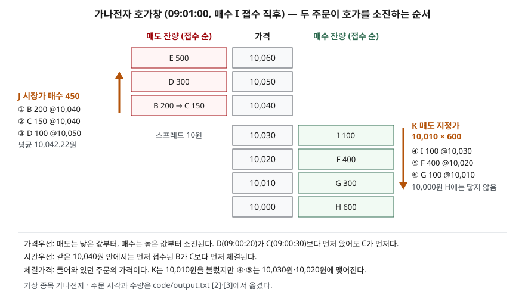

> 예제의 종목 `가나전자`와 호가창의 주문은 체결 규칙을 보이려고 만든 가상 값이다. 실제 종목·시세와 관계가 없다. 예제는 정규장 접속매매만 흉내 내며 거래소 시스템을 재현한 것이 아니다.

## 들어가며

증권사 앱에서 주식을 처음 살 때 대부분은 현재가를 보고 그 가격에 지정가 주문을 넣는다. 그런데 주문이 체결되지 않고 한참 대기하다 주가가 달아나기도 하고, 급한 마음에 시장가로 바꿔 넣으면 화면에 보이던 가격보다 비싸게 체결되기도 한다. 반대로 10,010원에 팔겠다고 넣었는데 10,030원에 팔린 내역이 찍히기도 한다. 호가창의 숫자가 어떤 순서로 소진되는지 모르면, 이 세 가지가 모두 우연처럼 보인다. 실제로는 정해진 규칙 세 개가 만든 결과다.

## 개념

**호가**는 매도 또는 매수의 의사표시다. 증권사 주문이 거래소에 들어가면 호가가 되고, 호가창은 아직 체결되지 않고 대기 중인 호가를 가격별로 쌓아 보여 준다. 주문은 가격을 어떻게 정하느냐로 갈린다.

| 주문 | 무엇을 정하나 | 체결되는 범위 |
|---|---|---|
| 지정가 | 종목·수량·가격 | 매수는 지정가 이하, 매도는 지정가 이상 |
| 시장가 | 종목·수량 | 수량이 모두 찰 때까지 반대편 호가를 차례로 소진 |
| 최유리지정가 | 종목·수량 | 접수 순간 반대편 최우선 호가의 가격으로 지정한 것으로 본다 |
| 최우선지정가 | 종목·수량 | 접수 순간 자기 쪽 최우선 호가의 가격으로 지정한 것으로 본다 |

정규장 중 체결은 **접속매매**로 이뤄진다. 규정의 말로는 복수가격에 의한 개별경쟁매매다. 매수 호가와 매도 호가가 만나는 순간마다 바로 체결하고, 그때그때 가격이 다르다. 장 시작과 끝에는 일정 시간 주문을 모았다가 한 가격으로 일괄 체결하는 단일가매매를 쓴다. 이 글은 접속매매만 다룬다.

규칙은 셋이다.

1. **가격우선**: 낮은 매도 호가가 높은 매도 호가보다, 높은 매수 호가가 낮은 매수 호가보다 먼저다. 시장가 호가는 지정가 호가보다 가격으로 앞선다
2. **시간우선**: 같은 가격이면 먼저 접수된 호가가 먼저다
3. **체결가격**: 매수 호가가 매도 호가 이상이 되면, **먼저 접수돼 있던 호가의 가격**으로 체결한다

1·2는 유가증권시장 업무규정의 호가 우선순위 조항(제22조)이 정한다. 3은 증권사 거래설명서가 접속매매를 "먼저 접수된 주문의 가격으로" 성립시키는 방식으로 설명한다.

## 구조



> **출처**: [법제처 찾기쉬운 생활법령 — 매매거래일·거래시간 및 거래 원칙 등](https://easylaw.go.kr/CSP/CnpClsMainBtr.laf?ccfNo=2&cciNo=1&cnpClsNo=2&csmSeq=1701) (유가증권시장 업무규정 제22조 호가 우선순위 인용) · [신한투자증권 국내 주식거래 설명서(복수시장)](https://file.shinhansec.com/filedoc/clause/k_104.pdf) 7. 사. 매매체결 방법. 주문과 체결 결과는 이 글의 [`code/output.txt`](code/output.txt) `[2]`·`[3]`에서 옮겼다.

그림은 매수 I가 10,030원에 들어온 직후의 호가창이다. 매도는 아래쪽이 싼 값이고 매수는 위쪽이 비싼 값이라, 두 줄이 맞닿는 가운데가 가장 먼저 체결될 자리다.

## 동작 원리

### 체결되지 않는 지정가 — 호가창에 쌓인다

09:01:00에 I가 10,030원에 100주를 사겠다고 한다. 가장 싼 매도 호가가 10,040원이라 맞는 상대가 없다. I는 호가창 매수 쪽 맨 위에 올라가고, 최우선 매수가 10,020원에서 10,030원이 되면서 스프레드가 20원에서 10원으로 좁아진다. 지정가 주문은 가격을 정한 대신 체결을 보장받지 못한다.

### 시장가 매수 — 위로 올라가며 소진한다

09:01:05에 J가 시장가로 450주를 산다. 시장가는 가격을 정하지 않으므로, 매도 쪽을 가격우선 순서로 소진한다. 가장 싼 10,040원에는 B 200주와 C 150주가 있다. D는 09:00:20에 들어와 C(09:00:30)보다 먼저 접수됐지만 가격이 10,050원이라 뒤로 밀린다. **가격우선이 시간우선보다 앞선다.** 10,040원 안에서는 09:00:10의 B가 C보다 먼저 체결된다. 남은 100주는 다음 가격 10,050원의 D에서 채운다.

J는 화면의 현재가 10,040원을 보고 주문했지만 평균 체결가는 10,042.22원이다. 최우선 매도 호가의 잔량 350주보다 많이 샀기 때문이다. 시장가 주문은 체결을 보장받는 대신 가격을 보장받지 못한다.

### 상대 호가를 넘는 지정가 — 상대 가격에 맺어진다

09:01:10에 K가 10,010원에 600주를 팔겠다고 한다. 매수 쪽 최우선이 10,030원이라 K의 지정가보다 높다. 체결가격은 먼저 들어와 있던 I의 가격 10,030원이다. 이어 10,020원 F의 400주, 10,010원 G의 100주와 체결되고 600주가 다 찬다. K의 평균 체결가는 10,020원으로 지정한 10,010원보다 높다. 지정가는 "이 값 아래로는 팔지 않는다"는 한도이지 체결가격이 아니다.

### 일부만 체결되는 지정가 — 잔량이 호가로 남는다

09:01:15에 L이 10,050원에 300주를 사겠다고 한다. 10,050원에 남은 매도는 D의 200주뿐이다. 200주가 체결되고 남은 100주는 10,050원 매수 호가로 호가창에 남는다. 이제 최우선 매수가 10,050원, 최우선 매도가 10,060원이다.

### 호가 단위에 맞지 않는 가격

09:01:20에 M이 10,035원을 부른다. 5,000원 이상 20,000원 미만 구간의 호가가격단위는 10원이라 10,035원은 낼 수 있는 가격이 아니다. 예제는 이 주문을 받지 않는다. 호가가격단위는 가격대에 따라 1원에서 1,000원까지 일곱 구간으로 나뉘고, 경계에서 단위가 바뀐다. 19,990원 다음 매도 호가는 20,000원이고, 그다음은 20,010원이 아니라 20,050원이다.

## 실습 예제

전체 소스: [`code/`](code/) · 수행 기록: [`code/output.txt`](code/output.txt)

```text
[2] 가나전자 호가창 — 체결 전
       매도 잔량        가격     매수 잔량   대기 주문(접수 순)
         500    10,060             E 500
         300    10,050             D 300
         350    10,040             B 200, C 150
                10,020       400   F 400
                10,010       300   G 300
                10,000       600   H 600

[3] 주문 다섯 건을 차례로 넣는다
  09:01:00 I 매수 지정가 10,030 × 100
    잔량 100주가 10,030원에 호가로 남는다
  09:01:05 J 매수 시장가 × 450
    체결   200주 @ 10,040  상대 B(09:00:10)
    체결   150주 @ 10,040  상대 C(09:00:30)
    체결   100주 @ 10,050  상대 D(09:00:20)
    평균 체결가 10,042.22원 · 450주
  09:01:10 K 매도 지정가 10,010 × 600
    체결   100주 @ 10,030  상대 I(09:01:00)
    체결   400주 @ 10,020  상대 F(09:00:15)
    체결   100주 @ 10,010  상대 G(09:00:05)
    평균 체결가 10,020.00원 · 600주
  09:01:15 L 매수 지정가 10,050 × 300
    체결   200주 @ 10,050  상대 D(09:00:20)
    평균 체결가 10,050.00원 · 200주
    잔량 100주가 10,050원에 호가로 남는다
  09:01:20 M 매수 지정가 10,035 × 100
    거부 — 10,035원은 호가 단위 10원에 맞지 않는다

[4] 가나전자 호가창 — 체결 후
       매도 잔량        가격     매수 잔량   대기 주문(접수 순)
         500    10,060             E 500
                10,050       100   L 100
                10,010       200   G 200
                10,000       600   H 600
```

호가가격단위 표 `[1]`과 최우선 호가·스프레드 줄은 [`code/output.txt`](code/output.txt)에 있다.

`[3]`의 체결 줄마다 가격은 상대 주문의 가격이다. K 줄 세 개가 10,030 → 10,020 → 10,010으로 내려가고, J 줄이 10,040 → 10,050으로 올라가는 것이 "호가를 소진한다"는 말의 모양이다. `[4]`에서 H는 한 번도 체결되지 않았다. 가장 먼저 접수된 주문(09:00:01)이지만 가격이 가장 낮아 순서가 오지 않았다.

## 실무에서 주의할 점

- **시장가 주문은 잔량이 얇은 종목에서 비싸다.** 최우선 호가 잔량보다 많이 사면 다음 가격대로 넘어간다. 주문 전에 호가창의 잔량을 몇 칸 아래까지 합쳐 보면 평균 체결가를 미리 가늠할 수 있다.
- **지정가를 정정하면 시간 순서를 잃는다.** 거래설명서는 가격을 정정하면 시간상 우선순위가 정정 시점으로 바뀐다고 적는다. 일부 취소는 남은 수량의 접수 시간을 바꾸지 않는다. 같은 가격에 오래 걸어 둔 주문을 손대면 줄 맨 뒤로 간다.
- **먼저 냈다고 먼저 체결되지 않는다.** 예제의 H처럼 시간은 같은 가격 안에서만 순서를 정한다. 빨리 체결되고 싶으면 시간보다 가격이 먼저다.
- **체결 내역의 가격이 주문 가격과 다를 수 있다.** 상대 호가를 넘는 지정가는 상대 가격에 맺어지므로, 매도는 지정가보다 높게, 매수는 낮게 체결될 수 있다. 오류가 아니다.
- **주문 종류마다 낼 수 있는 시간이 다르다.** 거래설명서의 표에 따르면 최유리·최우선지정가는 시가·종가 단일가 시간에 낼 수 없다. 같은 설명서가 한국거래소와 대체거래소(넥스트레이드)의 주문 가능 표를 따로 싣는 것처럼 시장마다 가능한 주문과 시간이 다르므로 증권사 설명서를 확인한다.

## 정리

- 정규장 체결은 접속매매다. 호가가 만나는 순간마다 바로 체결한다.
- 순서는 가격우선이 먼저, 같은 가격 안에서 시간우선이다.
- 체결가격은 먼저 들어와 있던 호가의 가격이라, 상대 호가를 넘는 지정가는 지정가보다 유리하게 맺어진다.
- 시장가는 체결을, 지정가는 가격을 보장한다. 시장가 주문의 평균 체결가는 소진한 가격대의 수량 가중평균이다.
- 주문 가격은 가격대별 호가가격단위의 배수여야 한다.

## 참고 자료

- [법제처 찾기쉬운 생활법령 — 주식거래 방법 이해하기: 매매거래일·거래시간 및 거래 원칙 등](https://easylaw.go.kr/CSP/CnpClsMainBtr.laf?ccfNo=2&cciNo=1&cnpClsNo=2&csmSeq=1701) — 유가증권시장 업무규정 제21조·제22조와 시행세칙의 호가가격단위·우선순위 인용
- [한국거래소 KRX 법무포털](https://rule.krx.co.kr/) — 유가증권시장 업무규정과 시행세칙 원문 발행처
- [신한투자증권 국내 주식거래 설명서(복수시장)](https://file.shinhansec.com/filedoc/clause/k_104.pdf) — 주문유형별 특징, 주문유형별 가능 시간, 호가 정정·취소와 시간 우선순위, 매매체결 방법(2차 자료)
