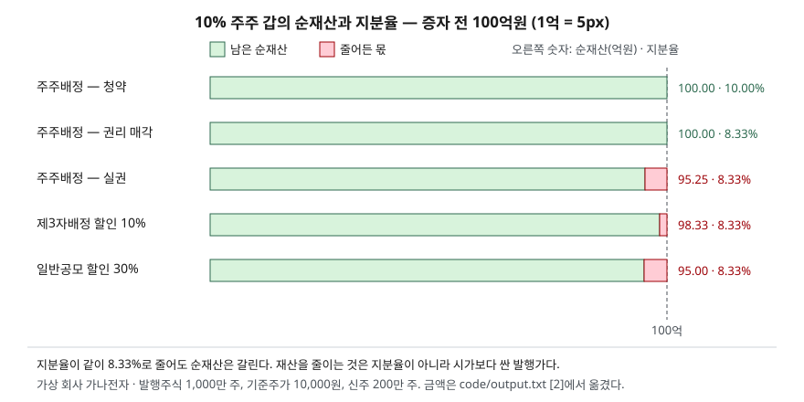

> 예제의 회사 `가나전자`와 그 숫자는 계산 원리를 보이려고 만든 가상 값이다. 실제 기업과 관계가 없다.

## 들어가며

보유한 종목에서 유상증자 공시가 나오면 다음 날 주가가 떨어지고, 게시판에는 "지분 희석"이라는 말이 줄을 잇는다. 그런데 공시를 열어 보면 같은 유상증자라도 주주배정인 것과 제3자배정인 것이 있고, 할인율도 10%·25%·30%로 제각각이다. 지분율만 보면 신주가 20% 늘어날 때 어느 방식이든 10% 주주는 8.33%가 되니 세 경우가 같아 보인다. 하지만 이 주주의 재산이 줄어드는 크기는 방식에 따라 0원에서 5억원까지 갈린다. "희석"이라는 한 단어에 두 가지 다른 일이 섞여 있기 때문이다.

## 개념

유상증자는 회사가 새 주식을 발행하고 그 대금을 받아 자본을 늘리는 일이다. 대금이 들어오지 않는 무상증자와 달리 자본총계가 납입액만큼 늘어난다. 상장회사가 신주를 누구에게 배정하느냐는 자본시장법 제165조의6이 세 가지로 나눈다.

| 방식 | 누구에게 | 발행가 결정 |
|---|---|---|
| 주주배정 | 기존 주주에게 보유 주식 수에 비례해 | 할인율 자율. 실무는 이론권리락주가에 할인율을 거는 관행식을 쓴다 |
| 제3자배정 | 정관에 근거해 특정한 자에게 | 기준주가에서 10% 이내 할인 |
| 일반공모 | 불특정 다수에게 | 기준주가에서 30% 이내 할인 |

할인율 상한은 「증권의 발행 및 공시 등에 관한 규정」의 유상증자 발행가액 결정 조항(제5-18조)에 있고, 기준주가는 청약일 전 제3거래일부터 제5거래일까지의 가중산술평균주가다. 주주가 보유 주식 수에 따라 신주를 배정받을 권리는 상법 제418조 제1항이 정하고, 주주 외의 자에게 배정하려면 같은 조 제2항이 정관 근거와 경영상 목적을 요구한다.

이 글에서 **희석**은 두 가지로 나눠 쓴다.

- **지분율 희석**: 발행주식수가 늘어 내 주식의 비율이 줄어드는 것. 발행가와 무관하다
- **가치 희석**: 시가보다 싼 값에 신주가 나가 기존 1주의 이론 가치가 줄어드는 것. 발행가가 시가와 같으면 0이다

## 구조



> **출처**: [자본시장법 제165조의6 주식의 발행 및 배정 등에 관한 특례](https://casenote.kr/%EB%B2%95%EB%A0%B9/%EC%9E%90%EB%B3%B8%EC%8B%9C%EC%9E%A5%EA%B3%BC_%EA%B8%88%EC%9C%B5%ED%88%AC%EC%9E%90%EC%97%85%EC%97%90_%EA%B4%80%ED%95%9C_%EB%B2%95%EB%A5%A0/%EC%A0%9C165%EC%A1%B0%EC%9D%986) (제3자 전재) · 원문 발행처 [국가법령정보센터](https://www.law.go.kr/) · 할인율 상한은 「증권의 발행 및 공시 등에 관한 규정」 제5-18조를 인용한 [KIND 증권신고서 공시](https://kind.krx.co.kr/external/2022/06/27/000089/20220627000234/10601.htm). 금액은 이 글의 [`code/output.txt`](code/output.txt) `[2]`에서 옮겼다.

다섯 막대 중 네 개는 지분율이 똑같이 8.33%인데 길이가 셋으로 갈린다. 지분율이 줄었다는 사실만으로는 재산이 얼마나 줄었는지 알 수 없다는 뜻이다.

## 동작 원리

### 이론권리락주가 — 증자 뒤 1주의 값

신주가 발행되면 회사 값은 증자 전 시가총액에 납입금을 더한 것이 되고, 그것을 늘어난 주식 수로 나눈 값이 이론상 증자 뒤 주가다. 이것을 이론권리락주가라 부른다.

> 이론권리락주가 = (기준주가 × 증자 전 주식수 + 발행가 × 신주 수) / (증자 전 주식수 + 신주 수)

가나전자는 1,000만 주, 기준주가 10,000원이다. 제3자배정으로 10% 할인한 9,000원에 200만 주를 발행하면 이론권리락주가는 9,833.33원, 일반공모로 30% 할인한 7,000원이면 9,500원이 된다. 발행가가 기준주가와 같다면 이론권리락주가도 10,000원 그대로다. 기존 1주의 값을 끌어내리는 것은 주식 수가 아니라 시가와 발행가의 차이다.

### 주주배정의 할인율은 권리락 뒤 가격에 건다

주주배정은 할인율이 자율이지만, 공시된 증권신고서들은 예전 규정의 산식을 준용해 **발행가 = 기준주가 × (1 − 할인율) / (1 + 증자비율 × 할인율)**로 계산한다. 이 식은 발행가가 기준주가가 아니라 이론권리락주가의 (1 − 할인율)이 되도록 거꾸로 푼 것이다. 할인율 25%, 증자비율 20%를 넣으면 7,142.86원이고, 호가 단위로 절상해 7,150원이다. 이론권리락주가는 9,525원이고 그 대비 할인율은 24.93%로 25%에 맞는다. 같은 25%를 기준주가에 그냥 걸었다면 7,500원이 되어 권리락 뒤 가격 대비 할인 폭이 공시한 숫자보다 작아진다.

### 주주배정은 지분율이 아니라 선택을 준다

주주배정에서 갑은 200,000주를 7,150원에 살 권리를 받는다. 이 권리 하나의 이론 가치는 이론권리락주가와 발행가의 차이인 2,375원이다. 갑의 선택은 셋이다.

- **청약**: 14.30억원을 내고 120만 주를 갖는다. 평가액 114.30억에서 낸 돈을 빼면 100억원이고 지분율도 10%다
- **권리 매각**: 신주인수권증서를 팔아 4.75억원을 받는다. 지분율은 8.33%로 줄지만 순재산은 100억원이다
- **실권**: 아무것도 하지 않으면 주식은 95.25억이 되고 받는 것이 없다. 4.75억원이 사라진다

자본시장법 제165조의6 제3항이 주권상장법인에 주주배정 시 신주인수권증서를 발행하게 한 이유가 여기서 보인다. 청약할 돈이 없는 주주도 권리를 팔아 가치 희석을 피할 수 있게 하는 것이다.

### 제3자배정과 일반공모 — 할인 몫이 밖으로 나간다

제3자배정에서는 갑이 신주를 받을 기회가 없다. 9,000원짜리 신주가 9,833.33원짜리 주식이 되므로, 인수자는 200만 주에 걸쳐 16.67억원의 차익을 얻고 그만큼을 기존 주주가 지분 비율대로 나눠 낸다. 갑의 몫이 1.67억원이다. 일반공모는 할인율이 더 커서 갑이 5억원을 잃는다. 규정이 정한 상한까지 할인하면 같은 증자비율 20%에서 기존 1주의 가치는 제3자배정이 1.67%, 일반공모가 5.00% 줄어든다.

### 할인율과 증자비율이 함께 정한다

발행가를 기준주가 × (1 − 할인율)로 두면, 신주를 받지 않는 기존 주주의 1주 가치 감소율은 **증자비율 × 할인율 / (1 + 증자비율)**이 된다. 할인율이 0이면 증자를 아무리 크게 해도 0이다. 할인율 30%로 주식 수를 두 배로 늘리면 15%가 된다. 반면 지분율은 할인율과 무관하게 1 / (1 + 증자비율)로 줄어든다.

### 비교표시 EPS를 고치는 계수

주주배정 신주는 시가보다 싸게 나가므로, 그 안에 공짜로 나눠 준 주식이 섞여 있는 셈이다. 기업회계기준서 제1033호는 이 무상 요소만큼 이전 기간의 주식 수를 늘려 주당이익을 다시 계산하게 하고, 부록 A2가 그 조정계수를 **권리행사 직전 주당 공정가치 / 이론적 권리락 주당 공정가치**로 정한다. 예제에서는 기준주가를 권리행사 직전 공정가치로 두었다. 계수는 1.04987이고 전기 EPS 1,000원이 952.50원으로 고쳐진다. 이 조정의 대상은 기존 주주 전체에게 보유 비율대로 주는 주주우선배정이다.

## 실습 예제

전체 소스: [`code/`](code/) · 수행 기록: [`code/output.txt`](code/output.txt)

```text
[1] 가나전자 — 발행주식 10,000,000주, 기준주가 10,000원, 신주 2,000,000주(증자비율 20%)
  방식(할인율)            발행가       이론권리락주가      권리락가 대비 할인     조달액(억원)
  주주배정(25%)        7,150      9,525.00          24.93%       143.0
  제3자배정(10%)       9,000      9,833.33           8.47%       180.0
  일반공모(30%)        7,000      9,500.00          26.32%       140.0

[2] 주주 갑(1,000,000주, 지분율 10.00%)의 재산 — 증자 전 100.00억원
  경우                           보유 후     지분율 후     주식 평가     낸 돈    받은 돈      순재산      증감
  주주배정 — 청약               1,200,000    10.00%    114.30   14.30    0.00   100.00   +0.00
  주주배정 — 권리 매각            1,000,000     8.33%     95.25    0.00    4.75   100.00   +0.00
  주주배정 — 실권               1,000,000     8.33%     95.25    0.00    0.00    95.25   -4.75
  제3자배정 — 배정 없음           1,000,000     8.33%     98.33    0.00    0.00    98.33   -1.67
  일반공모 — 배정 없음            1,000,000     8.33%     95.00    0.00    0.00    95.00   -5.00

[3] 기존 주주가 신주를 받지 않을 때 1주의 이론 가치 감소율 (발행가 = 기준주가 × (1 − 할인율))
  할인율          증자 10%     증자 20%     증자 50%    증자 100%
      0%        0.00%      0.00%      0.00%      0.00%
     10%        0.91%      1.67%      3.33%      5.00%
     20%        1.82%      3.33%      6.67%     10.00%
     30%        2.73%      5.00%     10.00%     15.00%
  남는 지분       90.91%     83.33%     66.67%     50.00%   ← 참여하지 않은 주주의 지분율이 원래의 몇 %로 줄어드는가

[4] 주주배정 뒤 비교표시 EPS — 기업회계기준서 제1033호 부록 A2의 조정계수
  조정계수 = 10,000 / 9,525.00 = 1.04987
  전기 EPS(고치기 전) = 100억원 / 10,000,000주 = 1,000.00원
  전기 EPS(소급 수정) = 100억원 / (10,000,000주 × 1.04987) = 952.50원
```

각 절의 설명 줄과 무상 요소 주식 수는 [`code/output.txt`](code/output.txt)에 있다.

`[1]`에서 조달액이 가장 큰 것은 할인율이 가장 작은 제3자배정이다. `[2]`는 지분율 열과 순재산 열이 따로 움직이는 것을 보인다. `[3]`의 첫 줄이 모두 0%인 것이 "시가 발행이면 가치 희석은 없다"는 말의 숫자다.

## 실무에서 주의할 점

- **지분율 하락과 재산 감소를 같은 것으로 보지 않는다.** 지분율은 발행 규모만으로 정해지고, 재산 감소는 할인율이 있어야 생긴다. 공시를 읽을 때 증자비율과 할인율을 따로 본다.
- **주주배정의 공시 할인율은 기준주가 대비가 아니다.** 관행식은 이론권리락주가 대비 할인율이라 기준주가와 발행가만 나눠 보면 할인 폭이 더 크게 계산된다. 예제에서 기준주가 대비는 28.5%, 권리락가 대비는 24.93%다.
- **실권은 손실이다.** 청약하지 않을 생각이면 신주인수권증서 거래 기간 안에 권리를 판다. 권리 매각 대금이 이론값에 못 미치면 그 차이만큼은 줄어든다.
- **조달한 돈의 쓰임은 이 계산에 없다.** 이 글의 이론값은 납입금이 장부상 현금으로만 더해진다고 본다. 그 돈으로 무엇을 하느냐에 따라 실제 주가는 이론권리락주가와 다르게 움직인다.
- **발행가는 확정 전에 바뀐다.** 주주배정은 1차·2차 발행가 중 낮은 쪽으로 확정하는 절차를 적은 공시가 있어, 결정 공시의 예정 발행가와 최종 발행가가 다를 수 있다.

## 정리

- 유상증자의 희석은 지분율 희석과 가치 희석 둘로 나뉜다. 앞의 것은 증자비율이, 뒤의 것은 할인율과 증자비율이 함께 정한다.
- 이론권리락주가는 증자 전 시가총액과 납입금의 합을 늘어난 주식 수로 나눈 값이고, 기존 1주의 가치 감소는 이것과 기준주가의 차이다.
- 주주배정은 청약하거나 권리를 팔면 재산이 유지되고, 실권하면 권리 가치만큼 잃는다.
- 제3자배정과 일반공모에서는 할인 몫이 신주 인수자에게 옮겨가며, 할인율 상한은 각각 10%·30%다.
- 주주배정 뒤 비교표시 EPS는 권리락 전후 가격 비율로 소급 수정한다.

## 참고 자료

- [국가법령정보센터](https://www.law.go.kr/) — 상법 제418조 신주인수권의 내용 및 배정일의 지정·공고(2012-04-15 시행), 자본시장법 제165조의6 주식의 발행 및 배정 등에 관한 특례(2013-08-29 시행) 원문 발행처
- [상법 제418조](https://casenote.kr/%EB%B2%95%EB%A0%B9/%EC%83%81%EB%B2%95/%EC%A0%9C418%EC%A1%B0) (제3자 전재)
- [자본시장법 제165조의6](https://casenote.kr/%EB%B2%95%EB%A0%B9/%EC%9E%90%EB%B3%B8%EC%8B%9C%EC%9E%A5%EA%B3%BC_%EA%B8%88%EC%9C%B5%ED%88%AC%EC%9E%90%EC%97%85%EC%97%90_%EA%B4%80%ED%95%9C_%EB%B2%95%EB%A5%A0/%EC%A0%9C165%EC%A1%B0%EC%9D%986) (제3자 전재)
- [KIND — 증권신고서 모집 또는 매출에 관한 일반사항(일반공모 예)](https://kind.krx.co.kr/external/2022/06/27/000089/20220627000234/10601.htm) — 「증권의 발행 및 공시 등에 관한 규정」 제5-18조의 할인율 상한과 기준주가 산정 문구
- [KIND — 증권신고서 모집 또는 매출에 관한 일반사항(주주배정 예)](https://kind.krx.co.kr/external/2025/05/30/000297/20250530000496/10601.htm) — 주주배정 관행식 발행가 산식과 신주인수권증서 상장 기간
- [한국회계기준원 — 기업회계기준서 제1033호 주당이익](https://www.kasb.or.kr/front/board/ingAccountingList.do) — 부록 A2 주주우선배정 신주발행의 조정계수
- [IFRS Foundation — IAS 33 Earnings per Share](https://www.ifrs.org/issued-standards/list-of-standards/ias-33-earnings-per-share/) — K-IFRS 제1033호의 원문
