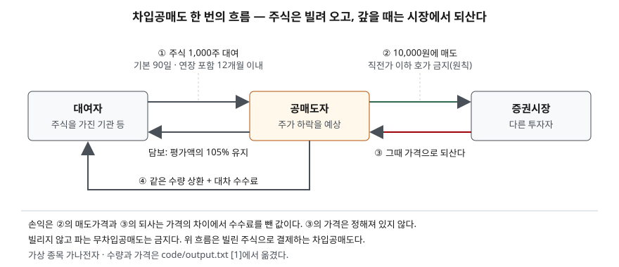
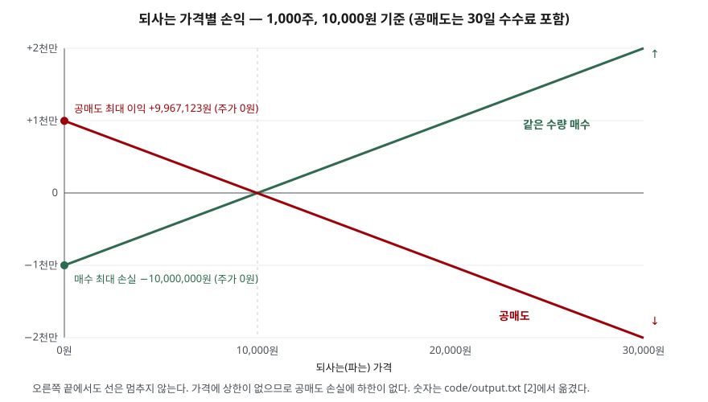

> 예제의 종목 `가나전자`와 가격은 계산을 보이려고 만든 가상 값이다. 대차 수수료율 연 4%도 계산을 위한 가정값이며 실제 수수료율은 종목·시기·증권사마다 다르다. 거래 수수료와 세금은 계산에서 뺐다.

## 들어가며

주가가 떨어질 때 뉴스에 공매도가 자주 같이 나온다. 처음 들으면 "가지고 있지 않은 주식을 어떻게 파는가"부터 막힌다. 주식을 사서 오르기를 기다리는 방식에 익숙하면, 떨어질수록 돈을 버는 거래가 있다는 것도, 그 거래의 손실이 산 사람의 손실과 모양이 다르다는 것도 직관에 잘 들어오지 않는다. 매수한 1,000만 원은 최악이어도 1,000만 원을 잃고 끝난다. 같은 1,000만 원어치를 공매도하면 최악의 경우가 정해져 있지 않다. 이 차이는 계산 한 줄로 드러난다.

## 개념

**공매도**는 가지고 있지 않은 증권을 파는 것이다. 자본시장법 공매도 제한 조항(제180조)은 두 가지를 공매도로 본다. 하나는 소유하지 않은 상장증권을 파는 것이고, 다른 하나는 빌린 상장증권으로 결제하려고 파는 것이다. 앞의 것을 **무차입공매도**, 뒤의 것을 **차입공매도**라 부른다. 무차입공매도는 금지다. 차입공매도는 정해진 방법에 따를 때만 할 수 있다.

같은 조항은 공매도로 보지 않는 경우도 정한다. 이미 매수가 체결된 주식을 결제일 전에 파는 것, 전환사채·유상증자·주식배당 등으로 받을 주식을 결제일까지 상장되는 조건에서 파는 것이 그렇다. 결제를 못 할 염려가 없기 때문이다.

| | 매수 후 매도 | 차입공매도 |
|---|---|---|
| 순서 | 사고 → 판다 | 빌리고 → 팔고 → 되사고 → 갚는다 |
| 이익이 나는 방향 | 주가 상승 | 주가 하락 |
| 최대 이익 | 상한 없음 | 매도대금 − 비용 |
| 최대 손실 | 매수대금 | 하한 없음 |
| 보유 비용 | 없음 | 대차 수수료, 담보 유지 |
| 기한 | 없음 | 상환기간 기본 90일, 연장 포함 12개월 이내 |

## 구조



> **출처**: [국가법령정보센터 — 자본시장과 금융투자업에 관한 법률 제180조 공매도의 제한](https://www.law.go.kr/LSW//lsLawLinkInfo.do?lsJoLnkSeq=1001162088&chrClsCd=010202) · [금융위원회 보도자료 — 공매도 제도개선 후속 자본시장법 시행령 개정 (2025-02-18)](https://www.fsc.go.kr/no010101/84025) · [금융위원회 보도참고 — 3월 31일부터 공매도를 전면 재개합니다 (2025-03-21)](https://www.fsc.go.kr/no010101/84216) · [금융위원회 보도자료 — 시장조성자제도 개선 및 불법공매도 적발 강화 (2020-12-21)](https://www.fsc.go.kr/no010101/74979). 수량과 가격은 이 글의 [`code/output.txt`](code/output.txt) `[1]`에서 옮겼다.

그림에서 주식은 대여자 → 공매도자 → 시장으로 나갔다가, 시장 → 공매도자 → 대여자로 돌아온다. 공매도자가 결국 돌려줘야 하는 것은 **돈이 아니라 주식 1,000주**다. 그래서 그 1,000주를 그때 얼마에 되사느냐가 손익을 정한다.

## 동작 원리

### 손익은 매수와 부호만 반대다

1,000주를 10,000원에 팔면 매도대금은 1,000만 원이다. 30일 뒤 8,000원에 되사면 800만 원이 들고 200만 원이 남는다. 여기서 연 4% 가정의 30일치 대차 수수료 32,877원을 빼면 1,967,123원이다. 같은 날 같은 가격에 1,000주를 산 사람은 8,000원에서 200만 원을 잃는다. 주가 차이에서 생기는 손익은 크기가 같고 부호가 반대다.

### 이익에는 상한이 있고, 손실에는 하한이 없다

주가는 0원 아래로 내려가지 않는다. 공매도자가 가장 크게 버는 경우는 0원에 되사는 것이고, 이때 이익은 매도대금 1,000만 원에서 수수료를 뺀 9,967,123원이다. 이것이 상한이다. 반대로 주가에는 위쪽 끝이 없다. 20,000원에 되사면 약 1,003만 원, 50,000원이면 약 4,003만 원을 잃는다. 매도대금보다 큰 돈을 잃을 수 있다는 점이 매수와 결정적으로 다르다. 하루 가격제한폭은 하루 변동만 묶을 뿐, 며칠에 걸친 상승까지 묶지 않는다.



> **출처**: 이 글의 [`code/output.txt`](code/output.txt) `[2]` 계산값을 그렸다. 손익 구조의 근거는 [자본시장법 제180조](https://www.law.go.kr/LSW//lsLawLinkInfo.do?lsJoLnkSeq=1001162088&chrClsCd=010202)의 차입공매도 정의(빌린 증권으로 결제하는 매도)다.

### 주가가 오르면 담보도 늘어난다

빌린 주식은 매일 그날 가격으로 평가된다. 2025년 3월 31일 공매도 재개와 함께 개인 대상 대주서비스의 담보비율도 대차거래와 같은 105%로 맞춰졌다. 현금 기준이며, 증권으로 담보를 내면 담보가치를 할인해 평가한다. 주가가 10,000원이면 1,050만 원, 20,000원이면 2,100만 원을 담보로 유지해야 한다. 손실이 커지는 바로 그 방향으로 묶어 둬야 할 돈도 함께 커진다. 담보를 채우지 못하면 원하지 않는 시점에 되사야 할 수 있다.

### 시간이 지날수록 비용이 쌓인다

매수는 들고 있는 동안 비용이 들지 않는다. 공매도는 빌린 기간만큼 수수료를 낸다. 예제의 가정에서 주가가 그대로여도 90일이면 98,630원, 12개월이면 40만 원을 잃는다. 같은 제도 개선으로 상환기간은 90일 이내에서 정하고, 연장하더라도 총 12개월을 넘을 수 없게 됐다. 주가가 언젠가 내린다는 예상이 맞아도, 그 "언젠가"가 기한 뒤라면 손익에 반영되지 않는다.

### 직전가 이하로는 팔 수 없다

차입공매도에는 가격 제한이 붙는다. 원칙적으로 직전 체결가 이하의 가격으로 공매도 호가를 낼 수 없다. 금융위원회는 직전가 49,000원이면 49,050원 이상에서만 공매도 주문을 낼 수 있다는 예를 든다. 공매도 호가가 가격을 직접 끌어내리지 못하게 하려는 규칙이다. 예외(지수차익거래, 유동성공급호가 등)가 따로 있다.

## 실습 예제

전체 소스: [`code/`](code/) · 수행 기록: [`code/output.txt`](code/output.txt)

```text
[2] 되사는 가격별 손익 — 1,000주, 10,000원 기준, 거래비용·세금 제외
      되사는 가격          공매도 손익       같은 수량 매수 손익
             0        +9,967,123           -10,000,000
         5,000        +4,967,123            -5,000,000
         8,000        +1,967,123            -2,000,000
        10,000           -32,877                    +0
        12,000        -2,032,877            +2,000,000
        20,000       -10,032,877           +10,000,000
        30,000       -20,032,877           +20,000,000
        50,000       -40,032,877           +40,000,000
  공매도 최대 이익: 주가가 0원일 때 +9,967,123원 — 매도대금에서 수수료를 뺀 값이 상한
  공매도 손실: 되사는 가격에 상한이 없으므로 손실에도 하한이 없다

[4] 상환기간이 길어지면 쌓이는 수수료 — 기본 90일, 연장해도 총 12개월 이내
    30일  수수료    32,877원  주가 그대로일 때 손익    -32,877원
    90일  수수료    98,630원  주가 그대로일 때 손익    -98,630원
   180일  수수료   197,260원  주가 그대로일 때 손익   -197,260원
   365일  수수료   400,000원  주가 그대로일 때 손익   -400,000원

[5] 가격 제한 — 직전 체결가 이하로는 공매도 호가를 낼 수 없다(원칙)
  직전 체결가   9,990원 · 호가 단위  10원 → 공매도 호가는 10,000원 이상
  직전 체결가  10,000원 · 호가 단위  10원 → 공매도 호가는 10,010원 이상
  직전 체결가  19,990원 · 호가 단위  10원 → 공매도 호가는 20,000원 이상
  직전 체결가  49,000원 · 호가 단위  50원 → 공매도 호가는 49,050원 이상
```

흐름 `[1]`과 담보 계산 `[3]`은 [`code/output.txt`](code/output.txt)에 있다.

`[2]`의 10,000원 줄을 본다. 주가가 판 가격 그대로면 매수자는 0원이지만 공매도자는 수수료만큼 잃는다. 공매도는 주가가 내리기만 해서는 부족하고, **수수료보다 많이, 기한 안에** 내려야 이익이 난다. `[5]`의 호가 단위는 [호가와 체결](../2026-10-06-order-book-matching/index.md)에서 쓴 호가가격단위를 그대로 썼다.

## 실무에서 주의할 점

- **손실 한도를 매도대금으로 생각하지 않는다.** 공매도 손실은 되사는 가격에 비례해 늘어나며 매도대금을 넘을 수 있다. 예제에서 주가가 세 배가 되면 매도대금의 두 배를 잃는다.
- **수수료율과 기한을 손익 계산에 넣는다.** 주가가 판 가격 근처에서 오래 머물면 수수료만 쌓인다. 상환기간은 연장해도 12개월을 넘지 못하므로 기한 안에 되사야 한다.
- **담보는 주가를 따라 움직인다.** 평가액의 105%를 유지해야 하므로 주가가 오르면 추가로 묶이는 돈이 생긴다. 손실과 담보 부담이 같은 방향으로 커진다.
- **빌리지 않고 파는 주문은 금지다.** 무차입공매도는 자본시장법 위반이다. 2025년 시행령 개정으로 공매도하는 법인과 주문을 받는 증권사에 무차입공매도를 막는 전산·내부통제 조치가 의무화됐다.
- **공매도 수치 하나로 주가 방향을 판단하지 않는다.** 공매도는 하락을 예상한 매도일 수도, 다른 매수 포지션의 위험을 줄이려는 매도일 수도 있다. 같은 숫자에 이유가 여럿이다.

## 정리

- 공매도는 없는 주식을 파는 것이고, 국내에서는 빌린 주식으로 결제하는 차입공매도만 허용된다.
- 흐름은 빌린다 → 판다 → 되산다 → 갚는다. 갚는 것은 돈이 아니라 같은 수량의 주식이다.
- 이익의 상한은 매도대금에서 비용을 뺀 값이고, 주가에 상한이 없으므로 손실에는 하한이 없다.
- 담보(평가액의 105%)는 주가를 따라 늘고, 수수료는 기간을 따라 쌓인다. 상환기간은 기본 90일, 연장 포함 12개월 이내다.
- 원칙적으로 직전 체결가 이하로는 공매도 호가를 낼 수 없다.

## 참고 자료

- [국가법령정보센터 — 자본시장과 금융투자업에 관한 법률 제180조 공매도의 제한](https://www.law.go.kr/LSW//lsLawLinkInfo.do?lsJoLnkSeq=1001162088&chrClsCd=010202) — 공매도 정의와 공매도로 보지 않는 경우 (2026-10-02 시행본)
- [금융위원회 보도자료 — 공매도 제도개선 후속 자본시장법 시행령 개정 (2025-02-18)](https://www.fsc.go.kr/no010101/84025) — 상환기간 90일·최대 12개월, 무차입공매도 방지 조치 의무화, 2025-03-31 시행
- [금융위원회 보도자료 — 시장조성자제도 개선 및 불법공매도 적발 강화 (2020-12-21)](https://www.fsc.go.kr/no010101/74979) — 직전가 이하 공매도 호가 금지(업틱룰) 설명과 예시
- [금융위원회 보도참고 — 3월 31일부터 공매도를 전면 재개합니다 (2025-03-21)](https://www.fsc.go.kr/no010101/84216) — 개인 대주 담보비율 105%(현금 기준)로 대차거래와 같게, 상환기간 제한 대주에도 적용
