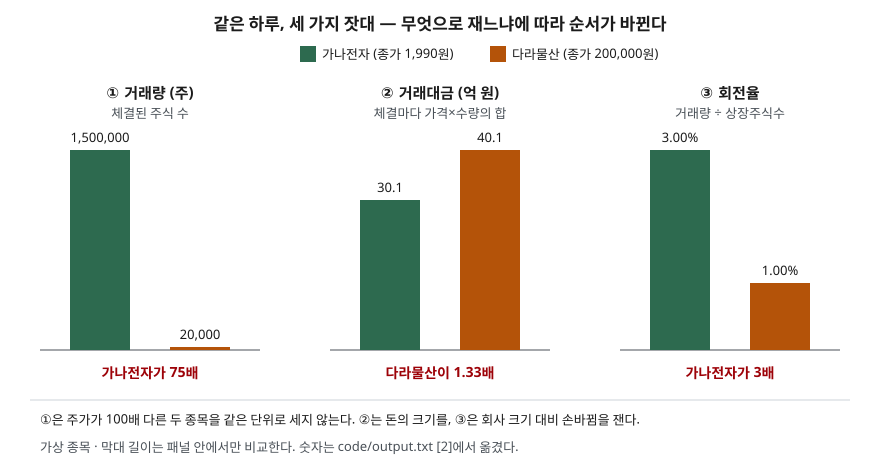

> 예제의 종목 `가나전자`·`다라물산`·`마바산업`과 체결 내역은 계산을 보이려고 만든 가상 값이다. 실제 종목·시세와 관계가 없다.

## 들어가며

증권사 앱의 순위 화면을 열면 "거래량 상위"와 "거래대금 상위"가 따로 있다. 처음에는 둘이 같은 말이라 여기고 거래량 순위만 보는 경우가 많다. 그러다 거래량 1위 종목이 거래대금 순위에서는 한참 아래에 있고, 거래량 순위에 없던 종목이 거래대금 1위에 올라 있는 것을 보게 된다. 주가가 2천 원인 종목과 20만 원인 종목은 같은 돈이 오가도 거래량이 100배 차이 난다. 거래량으로 두 종목을 견주면 이 100배를 그대로 "관심의 차이"로 읽게 된다.

## 개념

**거래량**은 정해진 기간에 체결된 주식의 수다. 단위는 주(株)다. **거래대금**은 같은 기간의 체결마다 체결가격에 체결수량을 곱해 더한 금액이다. 단위는 원이다. 하나는 수량을, 하나는 돈을 센다. 순위 화면이 둘을 따로 두는 이유다.

| 지표 | 무엇을 세나 | 계산 | 주가 수준의 영향 |
|---|---|---|---|
| 거래량 | 손바뀜한 주식 수 | 체결수량의 합 | 받는다. 싼 주식일수록 크게 나온다 |
| 거래대금 | 손바뀜한 돈 | 체결마다 가격×수량의 합 | 받지 않는다. 금액이라 종목끼리 바로 비교된다 |
| 회전율 | 회사 크기 대비 손바뀜 | 거래량 ÷ 상장주식수 | 받지 않는다. 같은 주식 수끼리 나눈다 |

거래량은 **한 종목을 날짜별로** 볼 때 쓸모가 있다. 같은 종목이면 주식 한 주의 크기가 같으니 어제보다 거래량이 세 배라는 말이 그대로 뜻을 가진다. **종목끼리** 비교할 때는 주식 한 주의 값이 다르므로 거래대금이나 회전율로 옮겨 재야 한다.

## 구조



> **출처**: [공공데이터포털 — 금융위원회_주식시세정보](https://www.data.go.kr/data/15094808/openapi.do) (한국거래소 시세의 거래량 등 시세 항목) · 막대의 숫자는 이 글의 [`code/output.txt`](code/output.txt) `[2]`에서 옮겼다.

세 잣대가 서로 다른 순서를 낸다. 거래량은 가나전자가 75배 많다. 돈으로 재면 다라물산이 더 많이 오갔다. 회사 크기 대비로 재면 다시 가나전자가 세 배 활발하다. 어느 것이 맞다기보다, **무엇을 묻느냐에 따라 골라 쓰는 잣대**다.

## 동작 원리

### 거래대금은 종가×거래량이 아니다

하루 동안 체결가격은 계속 바뀐다. 거래대금은 체결 하나하나의 가격×수량을 더한 값이라, 종가 하나에 거래량을 곱한 값과 다르다. 가나전자는 오전에 2,035원까지 올랐다가 1,990원에 끝났다. 비싼 가격에 많이 체결된 오전 몫이 거래대금에 들어가므로, 거래대금이 종가×거래량보다 2,475만 원 많다.

거래대금을 거래량으로 나누면 그날 체결의 평균 가격이 나온다. 수량으로 가중한 평균이라 **거래량가중평균가격(VWAP)**이라 부른다. 가나전자는 2,006.50원으로 종가 1,990원보다 높다. 그날 산 사람들의 평균 매수 단가가 종가보다 높았다는 뜻이다.

### 주가가 다르면 거래량은 같은 단위가 아니다

가나전자 1주는 약 2천 원, 다라물산 1주는 약 20만 원이다. 주식 한 주에 담긴 돈이 100배 차이 나므로, 같은 금액이 오가도 가나전자의 거래량이 100배로 찍힌다. 예제에서 거래량은 75배 차이지만 거래대금은 다라물산이 1.33배 많다. 거래량 순위는 결국 **싼 주식이 위로 올라가는 순위**다.

### 회사 크기로 나누면 또 다른 순서가 나온다

거래대금도 완전한 잣대는 아니다. 시가총액 4,000억 원 회사에서 40억 원이 오가는 것과 995억 원 회사에서 30억 원이 오가는 것은 무게가 다르다. 회전율은 하루 거래량을 상장주식수로 나눠, 회사 전체 주식 중 몇 퍼센트가 손을 바꿨는지 잰다. 가나전자 3.00%, 다라물산 1.00%다. 주가 변동이 작은 날이면 거래대금÷시가총액과 거의 같은 값이 된다(3.02%·1.00%). 둘 다 주식 수끼리, 또는 금액끼리 나눈 비율이라 주가 수준이 지워진다.

### 액면분할은 거래량만 튀게 만든다

다라물산이 1주를 10주로 나누면 주가가 약 10분의 1이 되고, 같은 돈이 오가도 거래량은 10배로 찍힌다. 예제에서 분할 전 사흘은 하루 2만 주 안팎, 분할 뒤는 20만 주 안팎이다. 거래대금은 그동안 38억~42억 원 사이에서 움직였다. 거래량 그래프만 보면 분할일에 관심이 열 배 뛴 것처럼 보인다. 분할의 구조는 [액면분할과 무상증자](../2026-10-04-stock-split-and-bonus-issue/index.md)에서 다뤘다.

### 상장규정은 거래량을 유동주식수로 나눠 본다

유가증권시장 상장규정은 반기 월평균거래량이 **유동주식수의 1%에 못 미치면** 관리종목으로 지정하고(제47조), 2반기 연속이면 상장폐지 사유로 삼는다(제48조). 유동주식수는 최대주주 등이 묶어 둔 물량을 빼고 시장에서 실제로 돌 수 있는 주식 수다. 기준이 "몇 주"가 아니라 "유동주식수의 몇 %"라서, 주가가 2천 원이든 20만 원이든 같은 잣대가 적용된다.

예제의 마바산업은 유동주식수가 800만 주라 기준선이 월 8만 주다. 여섯 달 평균이 71,667주, 0.896%라 1%에 못 미친다. 이 회사가 1:10 분할을 해도 거래량과 유동주식수가 함께 10배가 되므로 비율은 0.896% 그대로다. 비율로 정해 둔 기준은 분할에 흔들리지 않는다.

## 실습 예제

전체 소스: [`code/`](code/) · 수행 기록: [`code/output.txt`](code/output.txt)

```text
[1] 하루 체결 내역 — 체결마다 가격×수량을 더한다
  가나전자
    시각        체결가        수량         가격×수량
    09:00        2,010     300,000       603,000,000
    10:30        2,035     400,000       814,000,000
    12:10        2,000     250,000       500,000,000
    14:00        1,985     350,000       694,750,000
    15:30        1,990     200,000       398,000,000
    합계                 1,500,000     3,009,750,000
    거래량가중평균가(거래대금÷거래량) 2,006.50원 · 종가 1,990원
    종가×거래량 2,985,000,000원 — 거래대금과 -24,750,000원 차이

[2] 두 종목 나란히 — 거래량과 거래대금이 다른 순서를 낸다
  항목                                가나전자        다라물산
  상장주식수(주)                    50,000,000       2,000,000
  종가(원)                               1,990         200,000
  시가총액(억 원)                          995           4,000
  거래량(주)                         1,500,000          20,000
  거래대금(억 원)                         30.1            40.1
  회전율(거래량÷상장주식수)              3.00%           1.00%
  거래대금÷시가총액                      3.02%           1.00%
  거래량 배수   가나전자÷다라물산 = 75.0배
  거래대금 배수 가나전자÷다라물산 = 0.75배

[3] 다라물산 1:10 액면분할 전후 6거래일
  일차        종가      거래량   거래대금(억 원)  비고
  1        200,000      20,000              40.0
  3        199,000      21,000              41.8
  4         20,100     205,000              41.2  1:10 액면분할 후 첫 거래일
  6         20,000     210,000              42.0
  (일별 거래대금은 체결 내역 대신 종가×거래량으로 근사했다)
```

`[3]`은 지면을 줄이려고 2일차·5일차 줄을 뺐다. 다라물산 체결 내역, 마바산업 계산 `[4]`는 [`code/output.txt`](code/output.txt)에 있다.

`[2]`의 마지막 두 줄이 이 글의 요점이다. 같은 두 종목을 두고 거래량 배수는 75배, 거래대금 배수는 0.75배가 나온다. 어느 쪽을 분자로 두느냐가 아니라 **무엇을 세느냐**가 순서를 바꿨다.

## 실무에서 주의할 점

- **종목끼리 비교할 때 거래량을 쓰지 않는다.** 주가가 다르면 거래량은 같은 단위가 아니다. 거래 활발함을 견줄 때는 거래대금을, 회사 크기까지 감안하려면 회전율을 쓴다.
- **같은 종목도 액면분할·병합 전후는 거래량을 이어 붙이지 않는다.** 분할 비율만큼 거래량이 계단처럼 바뀐다. 기간을 길게 보는 차트라면 분할 비율로 과거 거래량을 보정했는지 확인한다.
- **회전율의 분모가 무엇인지 확인한다.** 상장주식수로 나누는지 유동주식수로 나누는지에 따라 값이 크게 다르다. 최대주주 지분이 큰 회사는 유동주식수가 작아, 유동주식수 기준 회전율이 훨씬 높게 나온다. 상장규정의 거래량 요건은 유동주식수를 쓴다.
- **거래대금 하나로 결론짓지 않는다.** 거래대금이 큰 날은 주가가 크게 오른 날일 수도, 크게 내린 날일 수도 있다. 거래대금은 손바뀜한 돈의 크기를 알려 줄 뿐 방향을 알려 주지 않는다.
- **상장규정 수치는 개정될 수 있다.** 이 글의 1% 기준은 법제처 생활법령 기준일 2026-09-15의 설명을 따랐다. 2026년 7월 시행 개정에서 반기 마지막 거래일의 거래량 산정 방법이 정비됐으므로, 실제 적용은 한국거래소 규정 원문을 본다.

## 정리

- 거래량은 주식 수, 거래대금은 돈이다. 거래대금은 체결마다 가격×수량을 더한 값이라 종가×거래량과 다르다.
- 주가가 다른 종목끼리 거래량을 비교하면 싼 주식이 언제나 위로 올라간다. 종목 간 비교는 거래대금으로 한다.
- 회전율은 거래량을 주식 수로 나눠 회사 크기와 주가 수준을 함께 지운다.
- 액면분할은 거래대금은 그대로 두고 거래량만 분할 비율만큼 바꾼다.
- 상장규정의 거래량 요건이 유동주식수 대비 비율인 것도 같은 이유다.

## 참고 자료

- [공공데이터포털 — 금융위원회_주식시세정보](https://www.data.go.kr/data/15094808/openapi.do) — 한국거래소 상장 주식의 시가·종가·고가·저가·거래량 등 시세 항목 제공
- [법제처 찾기쉬운 생활법령 — 관리종목 지정 및 상장폐지](https://easylaw.go.kr/CSP/CnpClsMain.laf?popMenu=ov&csmSeq=1701&ccfNo=1&cciNo=2&cnpClsNo=2) — 유가증권시장 상장규정 제47조·제48조의 거래량 미달 요건 인용 (기준일 2026-09-15)
- [한국거래소 KRX 법무포털](https://rule.krx.co.kr/) — 유가증권시장 상장규정 원문 발행처
- [자본시장연구원 제도동향 — 3. 한국거래소 규정 (2026년 8월)](https://www.kcmi.re.kr/common/downloadw?fid=29090&fgu=002001&fty=004003) — 2026-07-01 시행 상장규정 개정에 따른 거래량 미달 사유 산정 방법 정비(2차 자료)
