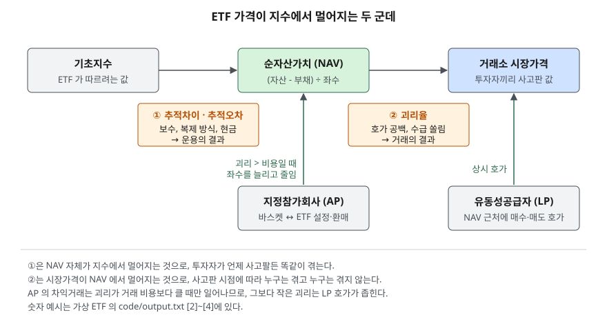

> 예제의 `가나200 ETF`·`가 ETF`·`나 ETF`와 그 지수, 숫자는 계산 원리를 보이려고 만든 가상 값이다. 실제 상품과 관계가 없다.

## 들어가며

지수를 따라가는 ETF를 장이 열리자마자 시장가로 1,000만원어치 샀는데, 그날 저녁 운용사 홈페이지에 공시된 기준가격을 보니 내가 산 값보다 2% 넘게 낮다. 지수는 거의 움직이지 않았는데 계좌는 첫날부터 24만원 남짓 빠져 있다. 이때 흔히 "ETF는 주식처럼 거래되니 주가가 원래 그렇게 움직인다"고 넘긴다. 그런데 ETF에는 거래소에서 매겨진 값과 별도로, 펀드가 실제로 가진 자산으로 계산되는 값이 하루에도 수없이 공표된다. 두 값을 비교하지 않고 사면 펀드가 가진 것보다 비싼 값을 치르고도 알아채지 못한다.

## 개념

**ETF(상장지수펀드)** 는 지수를 따라 운용되는 펀드의 지분을 거래소에 상장해 주식처럼 사고팔게 만든 상품이다. 자본시장법 제234조 제1항은 상장지수집합투자기구의 요건을 셋으로 정한다. 다수 종목의 가격수준을 종합한 지수의 변화에 연동해 운용하는 것을 목표로 할 것, 환매가 허용될 것, 설정일부터 30일 이내에 증권시장에 상장될 것이다.

그래서 ETF 한 좌에는 값이 둘 붙는다.

| 값 | 무엇으로 정해지나 | 누가 공표하나 |
|---|---|---|
| 순자산가치(NAV) | 펀드가 가진 자산 − 부채를 좌수로 나눈 값 | 운용사(장중에는 실시간 추정치 iNAV) |
| 시장가격 | 거래소에서 투자자끼리 체결된 값 | 거래소 시세 |

일반 펀드는 NAV로만 사고판다. ETF는 거래소에서 시장가격으로 사고팔기 때문에, 두 값이 같다는 보장이 없다. 둘이 벌어진 정도를 **괴리율**이라 한다. 한국거래소 공시시스템(KIND)의 ETF 괴리율 초과 공시는 괴리율을 ETF 가격과 정규시장 종료 시점의 실시간 순자산가치의 차이를 실시간 순자산가치로 나눈 값으로 적는다.

NAV 자체도 지수와 같지 않다. 보수가 빠지고, 지수 구성 종목을 다 담지 못하거나 현금을 남겨 두기 때문이다. ESMA의 ETF 가이드라인은 이 거리를 두 가지로 나눠 정의한다. **추적차이(tracking difference)** 는 일정 기간 펀드 수익률과 지수 수익률의 차이이고, **추적오차(tracking error)** 는 펀드와 지수 수익률 차이의 변동성이다.

## 구조



> **출처**: [국가법령정보센터 자본시장과 금융투자업에 관한 법률 — 제234조 상장지수집합투자기구](https://www.law.go.kr/법령/자본시장과금융투자업에관한법률/제234조) · [ESMA Guidelines on ETFs and other UCITS issues (ESMA/2014/937) — 용어 정의(tracking error, tracking difference)](https://www.esma.europa.eu/sites/default/files/library/2015/11/esma-2014-0011-01-00_en_0.pdf) · [SEC Release No. 33-10695 Exchange-Traded Funds — 설정단위와 지정참가회사, 차익거래 구조](https://www.sec.gov/files/rules/final/2019/33-10695.pdf) · [한국거래소 KIND ETF 투자유의 안내 — 괴리율, 유동성공급자](https://kind.krx.co.kr/external/2022/03/03/000229/20220303000588/68615.htm)

윗줄의 두 간극은 성격이 다르다. ①은 NAV 자체가 지수에서 멀어지는 것이라 언제 사고팔든 모든 투자자가 같이 겪는다. ②는 시장가격이 NAV에서 멀어지는 것이라 사고판 시점에 따라 겪는 사람과 안 겪는 사람이 갈린다. 아랫줄의 두 주체가 ②를 좁힌다.

## 동작 원리

### NAV는 자산에서 부채를 빼 좌수로 나눈 값이다

가나200 ETF는 주식 995.0억원과 현금 6.2억원을 가졌고, 매일 쌓이지만 아직 내지 않은 운용보수 0.4억원과 결제 전 매수대금 0.8억원이 부채로 잡혀 있다. 순자산은 1,000.0억원이고, 1,000만 좌로 나누면 1좌당 NAV는 10,000원이다. 보수는 투자자에게 따로 청구되지 않고 이렇게 순자산에서 매일 빠진다. 그래서 보수는 투자자 눈에 비용으로 보이지 않고 NAV가 조금 덜 오르는 모습으로만 드러난다.

### 괴리율은 산 시점에 따라 누구에게만 생긴다

같은 NAV 10,000원에서 1,000만원어치를 사도, LP 호가가 촘촘한 시간에 10,010원(+0.10%)에 사면 NAV로 환산한 차이가 −9,990원이고, 호가가 비어 있는 시간에 10,250원(+2.50%)에 사면 −243,750원이다. 들어가며의 장면이 뒤쪽이다. 반대로 매도가 몰려 9,900원(−1.00%)에 샀다면 NAV보다 101,000원 싸게 산 셈이다. 괴리는 지수가 움직여서 생긴 것이 아니므로, 시장가격이 NAV로 돌아오면 그 차이만큼이 손익으로 남는다.

### 지정참가회사의 차익거래는 비용보다 큰 괴리만 메운다

SEC의 ETF 규칙(Rule 6c-11) 채택 문서는 이 구조를 이렇게 설명한다. 운용사와 계약한 지정참가회사(AP)는 설정단위(creation unit)라는 큰 묶음으로만 ETF를 새로 만들거나 없앨 수 있다. 만들 때는 그날 정해진 바스켓(구성 종목 묶음)을 펀드에 넣고 그 가치만큼의 좌수를 받는다. 시장가격이 NAV보다 높으면 바스켓을 사서 ETF로 바꿔 시장에 팔고, 낮으면 시장에서 ETF를 사서 환매해 바스켓으로 돌려받아 판다. 이 매매가 좌수를 늘리고 줄여 시장가격을 NAV 쪽으로 끌어당긴다. 국내 ETF도 자본시장법 제234조가 환매 허용을 요건으로 두고 있어 같은 경로가 열려 있다.

예제는 설정단위를 10만 좌, 바스켓 매수와 ETF 매도에 드는 비용을 0.15%로 두었다. 괴리율 +0.05%와 +0.10%에서는 손익이 마이너스라 AP가 움직일 이유가 없고, +0.15%에서 겨우 본전 근처(−1,125원)가 되며, +0.30%부터 이익이 난다. **차익거래는 괴리를 0으로 만드는 장치가 아니라, 거래 비용 바깥으로 벌어진 괴리를 비용 안쪽으로 되돌리는 장치다.** 그 안쪽의 작은 괴리와 순간적인 호가 공백은 거래소와 계약한 유동성공급자(LP)가 NAV 근처에 호가를 내 좁힌다.

### 추적차이와 추적오차는 다른 것을 잰다

같은 지수를 따르는 두 ETF를 가상 지수 경로 다섯 개에 돌렸다. 가 ETF는 지수를 그대로 담는 완전복제에 연 보수 0.50%, 나 ETF는 일부 종목만 담는 표본추출에 현금 1%, 연 보수 0.05%다.

가 ETF는 매일 같은 크기로 보수만 빠지므로 일간 수익률 차이가 일정하고, 그 변동성인 추적오차는 0.00%다. 대신 추적차이는 다섯 경로 모두 −0.40%~−0.53%로 보수 근처에 모인다. 나 ETF는 보수가 10분의 1이지만 매일 지수와 조금씩 다르게 움직여 추적오차가 0.91%~1.01%이고, 추적차이는 −0.54%부터 +1.00%까지 흩어진다. 지수가 19.28% 내린 경로 1에서 +1.00%가 나온 데에는 지수를 따라 내리지 않은 현금 1%의 몫도 들어 있다.

추적오차가 작다고 지수에 가깝게 따라간 것이 아니고, 추적차이가 플러스라고 운용을 잘한 것도 아니다. 하나는 얼마나 뒤처졌는가, 하나는 얼마나 들쭉날쭉했는가를 잰다.

## 실습 예제

지수 경로는 시드를 고정한 난수라 다시 돌려도 같다. 보수는 거래일마다 연 보수 ÷ 252씩 뺐다.

전체 소스: [`code/`](code/) · 수행 기록: [`code/output.txt`](code/output.txt)

```text
[2] 같은 NAV, 다른 시장가격 — 1,000만원어치를 살 때
  상황                           시장가격      괴리율     산 좌수     NAV 로 환산         차이
  LP 호가가 촘촘한 시간              10,010   +0.10%      999    9,990,000     -9,990
  LP 호가가 비어 있는 시간            10,250   +2.50%      975    9,750,000   -243,750
  매도 물량이 몰린 시간                9,900   -1.00%    1,010   10,100,000   +101,000

[3] 지정참가회사(AP)의 차익거래 — 1 설정단위 10만좌, 바스켓 매수·ETF 매도 비용 0.15% 가정
       괴리율       ETF 매도 금액         바스켓 매수 금액          비용            손익
    +0.05%   1,000,500,000     1,000,000,000   1,500,375    -1,000,375
    +0.10%   1,001,000,000     1,000,000,000   1,500,750      -500,750
    +0.15%   1,001,500,000     1,000,000,000   1,501,125        -1,125
    +0.30%   1,003,000,000     1,000,000,000   1,502,250    +1,497,750
    +1.00%   1,010,000,000     1,000,000,000   1,507,500    +8,492,500

[4] 같은 지수를 따르는 두 ETF — 가상 지수 경로 5개(각 252 거래일)
    경로       지수      가 추적차이      가 추적오차      나 추적차이      나 추적오차
     1  -19.28%      -0.40%       0.00%      +1.00%       0.99%
     2   -6.17%      -0.47%       0.00%      -0.21%       1.01%
     3   -1.22%      -0.49%       0.00%      -0.54%       0.97%
     4   +6.66%      -0.53%       0.00%      +0.41%       0.91%
     5   -1.29%      -0.49%       0.00%      +0.72%       1.00%

[5] 보수만 다를 때 — 같은 지수 경로를 따른 10년 뒤, 지수 대비 남는 비율
      연 보수       1년       5년      10년
     0.05%   99.95%   99.75%   99.50%
     0.50%   99.50%   97.52%   95.11%
     1.00%   99.00%   95.10%   90.44%
```

`[0]` 산식, `[1]` NAV 계산, `[5]`의 0.15% 줄과 각 절 끝의 설명 줄은 [`code/output.txt`](code/output.txt)에 있다.

`[2]`의 마지막 열은 괴리율 × 매수 금액과 거의 같다. 산 좌수가 정수로 끊겨 조금 다를 뿐이다. `[3]`은 비용 열이 괴리율과 상관없이 150만원 근처에 머무는 동안 매도 금액만 늘어나 손익이 0.15%를 지나며 플러스로 돌아서는 것을 보인다. `[4]`의 가 ETF 추적차이가 정확히 −0.50%가 아닌 것은 보수가 그날그날의 순자산 비율로 빠지기 때문이다. 지수가 내린 해에는 줄어든 순자산에서 빠지니 덜 빠지고, 오른 해에는 더 빠진다. `[5]`는 그 효과를 빼고 보수를 해마다 순자산의 그 비율만큼 뗀다고 단순화한 값이다. 보수 차이는 한 해에는 1% 안쪽이지만 10년이면 0.05%와 1.00% 사이에서 9%포인트 넘게 벌어진다.

## 실무에서 주의할 점

- **시장가로 사기 전에 iNAV와 괴리율을 본다.** 한국거래소의 ETF 투자유의 안내도 거래 때 장중 순자산가치를 참고하라고 적는다. LP 호가가 비어 있는 시간에는 시장가 주문이 NAV에서 먼 호가까지 체결될 수 있다. 지정가로 NAV 근처에 주문을 내면 이 위험이 줄어든다.
- **해외 지수를 따르는 ETF는 괴리가 구조적으로 생길 수 있다.** 국내 장중에 해외 시장이 닫혀 있으면 iNAV는 전날 해외 종가와 환율로 추정한 값이라 정확한 기준이 없다. 해외 기초자산 ETF의 괴리율 초과 공시는 기준을 2%로 적고 있어, 국내 기초자산과 같은 잣대로 보지 않는다.
- **추적오차와 추적차이를 섞어 읽지 않는다.** 보유 비용을 알고 싶으면 여러 해의 추적차이를, 지수를 얼마나 고르게 따라가는지 알고 싶으면 추적오차를 본다. 한 해의 추적차이 하나로는 보수 효과와 그해의 우연을 가를 수 없다.
- **보수가 낮다고 추적차이가 작은 것은 아니다.** 예제의 나 ETF는 보수가 가 ETF의 10분의 1이지만 경로 3에서는 추적차이가 더 컸다. 추적차이에는 보수 말고도 복제 방식과 현금 비중이 함께 섞여 나온다. 같은 지수를 따르는 ETF끼리는 공시된 보수와 함께 여러 해의 추적차이를 나란히 놓는다.
- **괴리는 NAV로 돌아올 때 손익이 된다.** 할인(−)에 산 ETF는 괴리가 닫힐 때 그만큼 이익이 나는 것처럼 보이지만, 이는 지수 성과가 아니라 산 시점의 가격 차이다. 성과를 평가할 때는 시장가격 수익률과 NAV 수익률을 나눠 본다.

## 정리

- ETF 한 좌에는 펀드 자산으로 계산되는 NAV와 거래소에서 체결된 시장가격, 두 값이 붙는다.
- 시장가격과 NAV의 거리가 괴리율이고, 지정참가회사의 설정·환매 차익거래는 거래 비용보다 큰 괴리만 메운다. 작은 괴리는 LP 호가가 좁힌다.
- NAV와 지수의 거리는 추적차이(얼마나 뒤처졌나)와 추적오차(얼마나 들쭉날쭉했나)로 따로 잰다.
- 보수는 청구서 없이 순자산에서 매일 빠지고, 그 차이는 기간이 길수록 커진다.

## 참고 자료

- [국가법령정보센터 — 자본시장과 금융투자업에 관한 법률 제234조(상장지수집합투자기구)](https://www.law.go.kr/법령/자본시장과금융투자업에관한법률/제234조) — 지수 연동, 환매 허용, 30일 이내 상장의 세 요건
- [ESMA — Guidelines on ETFs and other UCITS issues (ESMA/2014/937, 2014-08-01)](https://www.esma.europa.eu/sites/default/files/library/2015/11/esma-2014-0011-01-00_en_0.pdf) — tracking error, tracking difference의 정의
- [SEC — Release No. 33-10695 Exchange-Traded Funds (Rule 6c-11, 2019-09-25 채택, 2019-12-23 시행)](https://www.sec.gov/files/rules/final/2019/33-10695.pdf) — 지정참가회사, 설정단위, 바스켓, 시장가격을 NAV 근처에 두는 차익거래 구조. 미국 규칙이다
- [한국거래소 KIND — ETF 투자유의 안내](https://kind.krx.co.kr/external/2022/03/03/000229/20220303000588/68615.htm) — 괴리율을 시장가격과 장중 순자산가치(iNAV)의 차이 비율로 정의, 유동성공급자
- [한국거래소 KIND — ETF 괴리율 초과 발생 공시(2026-02-03)](https://kind.krx.co.kr/external/2026/02/03/000180/20260203000214/68648.htm) — 괴리율 산식과 해외 ETF 기준 2%
- [주가지수는 어떻게 계산되는가 — 주가 가중과 시가총액 가중](../2026-10-07-index-weighting-methods/index.md) — ETF가 따르는 지수의 계산 방식
