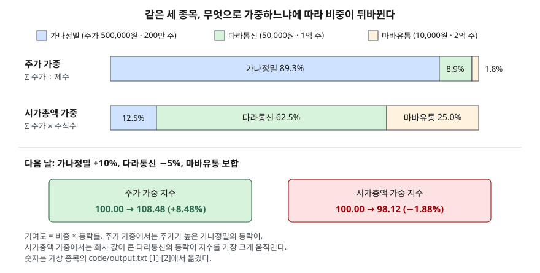

> 예제의 종목 `가나정밀`·`다라통신`·`마바유통`과 그 숫자는 계산 원리를 보이려고 만든 가상 값이다. 실제 기업과 관계가 없다.

## 들어가며

저녁 뉴스에서 "오늘 코스피는 1.9% 내렸다"는 말을 듣고 내 계좌를 열어 보면, 들고 있는 종목은 올랐는데 지수만 빠져 있는 날이 있다. 이때 흔히 "시장 전체가 내렸다"는 문장을 "대부분의 종목이 내렸다"로 읽는다. 그런데 지수는 종목 수를 세는 값이 아니라 종목마다 다른 무게를 곱해 더한 값이다. 세 종목짜리 시장에서도 어떤 무게를 쓰느냐에 따라 같은 날 지수가 +8.48%가 되기도 하고 −1.88%가 되기도 한다. 이 글의 예제가 그 경우다.

## 개념

**주가지수**는 기준이 되는 날의 값을 정해 두고, 지금 종목들의 값이 그때와 견줘 얼마인지를 하나의 숫자로 나타낸 것이다. 무엇을 "종목들의 값"으로 쓰느냐에 따라 두 갈래로 나뉜다.

| 방식 | 더하는 값 | 비중이 큰 종목 | 대표 지수 |
|---|---|---|---|
| 주가 가중 | 주가 | 한 주 값이 비싼 종목 | Nikkei 225, 다우존스 산업평균 |
| 시가총액 가중 | 주가 × 주식수 | 회사 값이 큰 종목 | 코스피, 코스피200, S&P 500 |

코스피는 e-나라지표의 정의대로 유가증권시장에 상장된 보통주로 산출하는 시가총액식 지수이고, 1980년 1월 4일의 시가총액을 100으로 둔다. 산식은 비교시점 시가총액 ÷ 기준시점 시가총액 × 100이다. Nikkei 225는 산출 기관인 Nikkei Inc.의 가이드북이 정하는 대로 주가에 가격조정계수를 곱한 값을 더해 제수(divisor)로 나눈다.

**제수**는 지수의 분모다. 처음에는 기준일 지수가 100이 되도록 정한 숫자일 뿐이지만, 종목이 바뀌거나 주식이 쪼개질 때 지수가 시장과 무관하게 튀지 않도록 고쳐 나가는 값이 된다. 두 방식의 차이는 결국 **무엇이 바뀔 때 제수를 고쳐야 하는가**에서 드러난다.

## 구조



> **출처**: [Nikkei Inc. Nikkei 225 Index Guidebook — 3: Calculation method](https://indexes.nikkei.co.jp/en/nkave/archives/file/nikkei_stock_average_guidebook_en.pdf) · [S&P Dow Jones Indices Index Mathematics Methodology — Capitalization Weighted Indices](https://www.spglobal.com/spdji/en/documents/methodologies/methodology-index-math.pdf) · [e-나라지표 주가지수 — 코스피 산출식](https://www.index.go.kr/unity/potal/main/EachDtlPageDetail.do?idx_cd=1080). 숫자는 이 글의 [`code/output.txt`](code/output.txt) `[1]`·`[2]`에서 옮겼다.

위 막대 두 줄은 같은 세 종목을 두 가지 무게로 나눈 것이다. 주가 가중에서는 주가 50만원인 가나정밀이 89.3%를 차지하고, 시가총액 가중에서는 회사 값 5조원인 다라통신이 62.5%를 차지한다. 아래 두 상자는 그 차이가 하루 등락에서 어떻게 드러나는지를 보인다.

## 동작 원리

### 기여도는 비중 × 등락률이다

지수의 하루 변화율은 종목별 "기준 비중 × 그 종목의 등락률"을 더한 값과 같다. 가나정밀이 10% 오르고 다라통신이 5% 내린 날, 주가 가중 지수에서 가나정밀의 기여는 89.3% × 10% = +8.93%이고 다라통신은 8.9% × (−5%) = −0.45%다. 합이 +8.48%다.

시가총액 가중 지수에서는 같은 등락이 12.5% × 10% = +1.25%와 62.5% × (−5%) = −3.12%가 되어 합이 −1.88%다. 종목도 등락도 같은데 방향이 갈렸다. 주가 가중 지수는 "한 주씩 들고 있는 바구니"의 값 변화를, 시가총액 가중 지수는 "시장 전체 지분"의 값 변화를 잰다. 어느 바구니를 재느냐가 다를 뿐이다.

### 액면분할은 주가 가중 지수에만 손을 댄다

가나정밀이 1주를 10주로 쪼개면 주가가 500,000원에서 50,000원이 되고 주식 수는 10배가 된다. 회사 값은 그대로다.

시가총액 가중 지수에서는 주가 × 주식수가 그대로이므로 할 일이 없다. S&P DJI의 산식 문서도 기업 행동별 제수 조정 표에서 주식분할을 "주식 수와 주가 변화가 상쇄되므로 제수 조정이 필요 없다"고 분류한다.

주가 가중 지수에서는 분자인 주가 합이 560,000원에서 110,000원으로 줄어든다. 제수를 그대로 두면 아무도 손해 보지 않았는데 지수가 100에서 19.64로 떨어진다. 그래서 Nikkei 225 가이드북의 제수 절(3장 (4) Divisor)은 분할이 일어나면 "다음 날 기준가격 합 ÷ 오늘 종가 합"을 기존 제수에 곱해 새 제수를 만든다. 예제에서는 5,600 × 110,000 ÷ 560,000 = 1,100이 되고 지수는 100으로 돌아온다.

지수 값은 지켰지만 **비중은 지켜지지 않는다.** 분할 뒤 가나정밀의 주가 비중은 89.3%에서 45.5%로 내려가고, 같은 10% 상승이 지수를 +8.93%가 아니라 +4.55%만 움직인다. 회사는 그대로인데 주식을 쪼갠 결정 하나로 지수 안에서의 무게가 절반이 된 것이다. Nikkei 225가 대규모 분할 때 가격조정계수까지 함께 고칠 수 있게 둔 것은 이 문제를 피하려는 장치다.

### 유동비율은 사고팔 수 있는 몫만 센다

시가총액 가중 지수도 상장주식수를 다 곱하면 대주주가 내놓지 않는 지분까지 비중에 들어간다. 그래서 S&P DJI의 시가총액 가중 지수는 주식 수에 IWF(Investable Weight Factor, 투자 가능 비율)를 곱하고, 기획재정부 시사경제용어사전은 코스피200이 유동비율을 적용한다고 적는다. 대주주가 70%를 가진 마바유통은 상장 기준 비중 25.0%에서 유동 기준 10.5%로 내려가고, 유동비율 90%인 다라통신은 62.5%에서 78.9%로 올라간다.

## 실습 예제

세 종목은 기준일 주가와 상장주식수, 유동비율만 정해 둔 가상 값이다. 액면분할 계산은 다른 종목의 주가가 기준일 그대로라고 두고 했다.

전체 소스: [`code/`](code/) · 수행 기록: [`code/output.txt`](code/output.txt)

```text
[1] 기준일 — 같은 세 종목, 두 가지 비중 (시가총액은 억원)
                   주가         상장주식수      시가총액     주가 비중     시총 비중
  가나정밀        500,000     2,000,000    10,000     89.3%     12.5%
  다라통신         50,000   100,000,000    50,000      8.9%     62.5%
  마바유통         10,000   200,000,000    20,000      1.8%     25.0%
  주가 합 560,000원 → 제수 5,600 (지수 100 에 맞춘 값)

[2] 다음 날 — 가나정밀 +10%, 다라통신 -5%, 마바유통 보합
                 등락      새 주가      주가 가중 기여      시총 가중 기여
  가나정밀         +10%   550,000        +8.93%        +1.25%
  다라통신          -5%    47,500        -0.45%        -3.12%
  마바유통          +0%    10,000        +0.00%        +0.00%
  주가 가중 지수     100.00 → 108.48 (+8.48%)
  시가총액 가중 지수 100.00 → 98.12 (-1.88%)

[3] 가나정밀 1주 → 10주 액면분할 (분할 직전 주가 그대로 두고 계산)
  주가 합 560,000 → 110,000
  제수를 그대로 두면 지수 100.00 → 19.64  (회사 값은 그대로인데 지수가 떨어진다)
  새 제수 = 5,600 × 110,000 ÷ 560,000 = 1,100.00 → 지수 100.00
  분할 뒤 가나정밀의 주가 비중 89.3% → 45.5%
  분할 뒤 가나정밀이 10% 오르면 주가 가중 지수는 +4.55% 움직인다 (분할 전에는 +8.93%)

[4] 유동비율을 곱하면 — 시가총액 가중 지수의 비중 (시가총액은 억원)
                 유동비율       유동시가총액     상장 기준     유동 기준
  가나정밀            60%        6,000     12.5%     10.5%
  다라통신            90%       45,000     62.5%     78.9%
  마바유통            30%        6,000     25.0%     10.5%
```

`[0]` 산식과 각 절 끝의 설명 줄은 [`code/output.txt`](code/output.txt)에 있다.

`[2]`는 기여도 두 열을 위에서 아래로 더하면 각 지수의 변화율이 된다는 것을 보인다. 시가총액 가중 쪽 −3.12%는 −3.125%를 반올림한 값이라 합이 −1.88%로 맞는다. `[3]`은 제수를 고쳐 지수 값은 100으로 돌아왔지만 비중 열은 돌아오지 않은 것을, `[4]`는 유동비율이 낮은 마바유통과 높은 다라통신의 비중이 반대 방향으로 움직이는 것을 보인다.

## 실무에서 주의할 점

- **지수 등락을 "대부분의 종목이 올랐다·내렸다"로 읽지 않는다.** 시가총액 가중 지수는 상위 몇 종목의 등락으로 방향이 정해질 수 있다. 종목 수 기준의 분위기는 상승·하락 종목 수를 따로 본다.
- **주가 가중 지수에서 비중을 정하는 것은 회사 크기가 아니라 한 주 값이다.** 같은 회사라도 액면분할 한 번으로 지수 안의 무게가 바뀐다. 시가총액 가중 지수에서 주가가 높다는 것만으로는 비중이 커지지 않는다. 주가와 시가총액의 차이는 [시가총액과 주가 — 비싼 주식과 비싼 회사](../2026-10-04-market-cap-vs-share-price/index.md)에서 다뤘다.
- **같은 시가총액 가중이라도 유동비율 적용 여부를 확인한다.** 대주주 지분이 큰 종목이 많은 시장일수록 상장 기준과 유동 기준의 비중이 크게 갈린다. 어느 기준인지는 그 지수의 산출 방법론에 적혀 있다.
- **가격지수와 총수익지수를 섞어 비교하지 않는다.** 이 글의 지수는 주가만 따르는 가격지수다. S&P DJI 산식 문서는 배당을 다시 넣어 계산하는 총수익지수를 따로 둔다. 배당이 빠진 지수와 배당이 들어간 성과를 나란히 놓으면 배당만큼 차이가 난다.
- **지수 값의 크기로 시장끼리 비교하지 않는다.** 한 지수가 2,000대이고 다른 지수가 40,000대인 것은 기준일과 기준값, 제수가 달라서 생긴 차이다. 비교는 같은 기간의 변화율로 한다.

## 정리

- 주가지수는 기준일 값에 견준 지금 값이고, 무엇을 더하느냐에 따라 주가 가중과 시가총액 가중으로 나뉜다.
- 하루 변화율은 종목별 비중 × 등락률의 합이라, 같은 등락에도 두 방식의 지수가 반대 방향으로 움직일 수 있다.
- 액면분할은 시가총액 가중 지수에는 아무 영향이 없고, 주가 가중 지수에서는 제수를 고쳐야 하며 그래도 비중은 바뀐다.
- 유동비율을 곱하면 대주주가 내놓지 않는 지분이 빠져, 시장에서 거래 가능한 몫만큼 비중이 매겨진다.

## 참고 자료

- [e-나라지표 — 주가지수(코스피·코스닥 종합지수)](https://www.index.go.kr/unity/potal/main/EachDtlPageDetail.do?idx_cd=1080) — 코스피 정의, 산출식, 기준시점 1980-01-04 = 100. 작성: 금융위원회, 자료: 한국거래소
- [기획재정부 시사경제용어사전 — 코스피200](https://mofe.go.kr/sisa/dictionary/detail?idx=2566) — 시가총액 가중, 유동비율 적용, 기준시점 1990-01-03 = 100
- [Nikkei Inc. — Nikkei 225 Index Guidebook](https://indexes.nikkei.co.jp/en/nkave/archives/file/nikkei_stock_average_guidebook_en.pdf) — 3: Calculation method의 (2) Price Adjustment Factor, (4) Divisor. 2025-07-24판을 읽었다
- [S&P Dow Jones Indices — Index Mathematics Methodology](https://www.spglobal.com/spdji/en/documents/methodologies/methodology-index-math.pdf) — Capitalization Weighted Indices의 Adjustments to Share Counts(IWF), Necessary Divisor Adjustments(주식분할 시 제수 조정 없음). 최신판은 내려받기만 허용돼 열지 못했고, 같은 문서의 2014-11판 사본을 읽었다
- [시가총액과 주가 — 비싼 주식과 비싼 회사](../2026-10-04-market-cap-vs-share-price/index.md) · [액면분할과 무상증자 — 주식 수가 늘 때](../2026-10-04-stock-split-and-bonus-issue/index.md)
