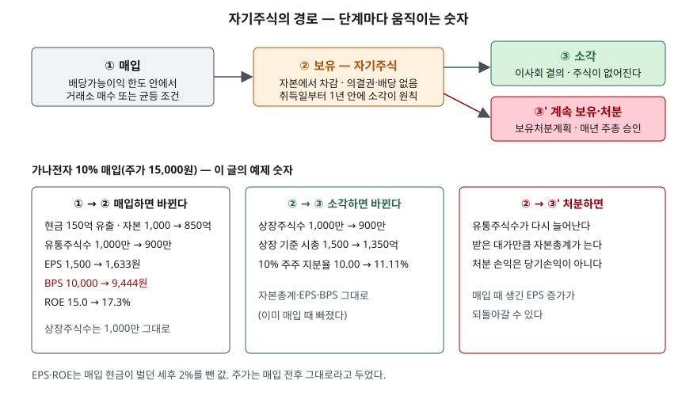

> 예제의 회사 `가나전자`·`다라물산`과 그 숫자는 계산 원리를 보이려고 만든 가상 값이다. 실제 기업과 관계가 없다. 매입에 쓴 현금이 벌던 세후 수익률 2%와 "매입 전후 주가가 그대로"라는 조건도 계산을 보이려고 정한 가정이다.

## 들어가며

자기주식 취득 결정 공시가 나오면 "주주환원", "EPS가 올라간다"는 설명이 따라붙는다. 그런데 몇 달 뒤 같은 회사가 소각 공시를 또 내면 사람들은 같은 일로 두 번 지표가 좋아지는 것처럼 받아들인다. 숫자를 따라가 보면 EPS가 움직이는 것은 매입 때 한 번뿐이고, 소각 때는 상장주식수만 바뀐다. 또 매입이 BPS를 올리는 회사가 있고 내리는 회사가 있어서 "자사주 매입이면 PBR이 낮아진다" 같은 말은 회사에 따라 틀린다. 어느 단계에서 어떤 숫자가 왜 움직이는지 알아야 공시 두 건을 한 번의 변화로 읽을 수 있다.

## 개념

**자기주식**은 회사가 발행한 자기 회사의 주식을 다시 사들여 가진 것이다. 회사가 자기 주식을 사면 그 대금은 주주에게 나가고, 산 주식은 회사 안에 들어오지만 주주로서의 권리가 없다.

| 단계 | 근거 | 무엇을 정하는가 |
|---|---|---|
| 매입 | 상법 제341조 | 거래소 매수 또는 주식 수에 따라 균등한 조건으로 취득. 취득가액 총액은 직전 결산기의 배당가능이익을 넘지 못한다 |
| 보유 | 상법 제369조 제2항, 개정 상법 제341조의3 | 의결권이 없다. 개정법은 신주인수권·배당받을 권리 등 주주로서의 권리 전반을 행사하지 못하게 했다 |
| 소각 | 상법 제343조 제1항, 개정 상법 제341조의4 | 회사가 보유한 자기주식은 취득 사유와 관계없이 이사회 결의로 소각할 수 있다. 개정법은 취득일부터 1년 안의 소각을 원칙으로 정했다 |
| 회계 | K-IFRS 제1032호 문단 33 | 자기주식은 자본에서 차감하고, 매입·처분·소각에서 손익을 인식하지 않는다 |
| 주당이익 | K-IFRS 제1033호 문단 20 | 기중에 취득한 자기주식은 유통기간 가중치를 고려해 유통보통주식수에서 뺀다 |

소각 의무는 2026년 3월 6일 시행된 개정 상법으로 생겼다. 금융위원회 설명으로는 새로 취득한 자기주식은 원칙적으로 1년 안에 소각해야 하고, 시행 전에 취득해 보유하던 자기주식은 시행일부터 1년 6개월 안에 소각해야 한다. 임직원 보상처럼 계속 보유하거나 처분할 필요가 있으면 자기주식 보유처분계획을 만들어 매년 주주총회 승인을 받아야 한다. 신설 조문 번호(제341조의3·제341조의4)는 개정법을 해설한 법무법인 자료(2차 자료)에서 확인했고, 법령 원문으로는 대조하지 못했다.

## 구조



> **출처**: [금융위원회 보도자료 「3차 상법 개정 취지에 맞추어 자기주식 보유·처분 공시 강화」(2026-03-31)](https://www.fsc.go.kr/no010101/86581) — 소각 기한과 예외 · [상법 제341조 자기주식의 취득](https://casenote.kr/법령/상법/제341조) (제3자 전재) · [K-IFRS 제1032호 금융상품: 표시 — 문단 33 자기주식](https://accountingwiki.co.kr/standards/1032) (제3자 전재) · 원문 발행처 [국가법령정보센터](https://www.law.go.kr/)·[한국회계기준원](https://www.kasb.or.kr/front/board/ingAccountingList.do). 숫자는 이 글의 [`code/output.txt`](code/output.txt) `[2]`·`[5]`에서 옮겼다.

아래 세 칸 중 가운데 칸이 이 글의 요점이다. 소각은 이미 매입 때 일어난 변화를 상장주식수에 반영하는 일이지, EPS나 BPS를 한 번 더 바꾸는 일이 아니다.

## 동작 원리

### 매입 한도 — 배당과 같은 주머니를 쓴다

상법 제341조 제1항 단서는 자기주식 취득가액의 총액이 직전 결산기 대차대조표상 순자산에서 제462조 제1항 각 호의 금액을 뺀 금액을 넘지 못하게 한다. 제462조 제1항은 이익배당의 한도를 정하는 조항이다. 순자산에서 자본금, 그때까지 적립된 자본준비금과 이익준비금, 그 결산기에 적립할 이익준비금, 미실현이익을 빼면 남는 금액이다.

가나전자는 자본총계 1,000억원에서 자본금 50억원, 주식발행초과금 200억원, 이익준비금 25억원을 빼 배당가능이익이 725억원이다. 150억원어치를 사면 한도의 20.7%를 쓴다. 배당과 자기주식 취득이 같은 한도에서 나가므로 둘 다 주주에게 회사 돈을 돌려주는 방법이라는 것이 법조문에서부터 드러난다.

### 매입하면 분모가 줄고 자본도 줄어든다

가나전자와 다라물산은 순이익 150억원, 자본총계 1,000억원, 발행주식 1,000만 주가 같다. 다른 것은 주가뿐이다. 가나전자는 15,000원(PBR 1.5배), 다라물산은 5,000원(PBR 0.5배)이다. 둘 다 100만 주를 시가로 사들인다.

자기주식은 자본에서 차감하므로 매입 대금만큼 자본총계가 줄고, 유통주식수는 900만 주가 된다. 순이익이 그대로라면 EPS는 1,500원에서 1,666.67원으로 11.1% 오른다. 주식 수가 10% 줄었으니 1주의 몫이 1/0.9배가 된 것이다. 실제로는 매입에 쓴 현금이 벌던 이자가 사라진다. 세후 2%를 가정하면 가나전자는 순이익이 3억원 줄어 EPS가 1,633.33원이다. 현금 수익률이 높을수록 EPS 상승 폭은 줄어든다.

매입한 해에는 그 상승이 일부만 보인다. 가나전자가 7월 1일에 샀다면 가중평균유통주식수는 1,000만 주가 181일, 900만 주가 184일 유통된 것으로 계산해 9,495,890주다. 그 해 EPS는 1,563.70원이고, 온전히 900만 주로 1년을 보낸 다음 해에 1,633.33원이 된다.

### BPS의 방향은 매입 가격과 BPS의 차이가 정한다

자본총계는 매입 대금만큼 줄고 주식 수는 매입 주식 수만큼 준다. 1주당 장부가 10,000원인 회사가 주식을 15,000원에 사면 1주가 빠져나갈 때 장부가 10,000원이 아니라 15,000원이 빠져나간다. 남은 주식의 BPS는 9,444.44원으로 내려간다. 같은 회사가 5,000원에 사면 장부가보다 적게 빠져나가 BPS가 10,555.56원으로 오른다.

| 매입 가격 / BPS | 매입 후 BPS 변화 |
|---|---|
| 0.5 | +5.56% |
| 1.0 | 0.00% |
| 1.5 | −5.56% |
| 2.0 | −11.11% |

(`code/output.txt` `[3]`, 10% 매입 기준)

그래서 PBR이 1배보다 높은 회사가 사면 BPS가 내려가고 PBR은 올라가며, 1배보다 낮은 회사가 사면 반대다. ROE는 두 회사 모두 오르지만 오르는 폭이 다르다. 가나전자는 자본이 150억원 줄어 15.00%에서 17.29%가 되고, 다라물산은 50억원만 줄어 15.68%가 된다. ROE 상승의 대부분은 이익이 늘어서가 아니라 분모인 자본이 줄어서 생긴다.

### 시가에 사면 이론 주가는 그대로다

회사 값에서 나간 현금만 빼고 남은 주식 수로 나누면, 가나전자는 (1,500억 − 150억) / 900만 주 = 15,000원으로 매입 전 주가와 같다. 시가로 사들이면 팔고 나간 주주도, 남은 주주도 1주당 가치가 바뀌지 않는다는 뜻이다. 이 계산에서는 EPS가 오르고 주가가 그대로이므로 PER이 10.00배에서 9.18배로 내려간다. PER이 내려간 것은 주가가 싸진 것이 아니라 분모만 바뀐 결과다. 실제 주가는 이 이론값과 다르게 움직이며, 이 글은 그 방향을 다루지 않는다.

### 소각 — 상장주식수만 따라 내려온다

가나전자가 사들인 100만 주를 소각하면 상장주식수가 1,000만 주에서 900만 주로 줄어든다. 자본총계, 유통주식수, EPS, BPS는 그대로다. 자기주식은 매입 때 이미 자본에서 차감됐고 EPS 분모에서도 빠졌기 때문이다. K-IFRS 제1032호 문단 33이 자기주식을 소각할 때 손익을 인식하지 않게 하므로 순이익도 바뀌지 않는다.

바뀌는 것은 상장주식수로 계산하는 숫자들이다. 상장주식수에 주가를 곱한 시가총액이 1,500억원에서 1,350억원으로 줄어 자기주식을 뺀 시가총액과 같아진다. 매도에 참여하지 않은 10% 주주의 지분율도 상장주식수 기준으로는 10.00%에서 11.11%가 된다. 다만 의결권 비율은 보유 중에도 이미 11.11%였다. 자기주식에는 의결권이 없어서 분모에서 빠지기 때문이다. 시가총액과 PER의 주식 수가 어긋나는 문제는 [시가총액과 주가](../2026-10-04-market-cap-vs-share-price/index.md)에서 다뤘다.

### 보유와 소각의 차이 — 다시 나올 수 있느냐

보유 중인 자기주식은 처분하면 다시 유통주식이 된다. 처분 대가만큼 자본이 늘고 유통주식수가 늘어 매입 때 오른 EPS가 되돌아갈 수 있다. 소각한 주식은 다시 나올 수 없다. 개정 상법이 1년 안 소각을 원칙으로 두고 계속 보유에 매년 주주총회 승인을 요구한 것은 이 차이 때문이다. 자기주식이 자본변동표에 어떻게 찍히는지는 [자본변동표](../../statements/2026-10-07-equity-changes-statement/index.md)에서 다뤘다.

## 실습 예제

전체 소스: [`code/`](code/) · 수행 기록: [`code/output.txt`](code/output.txt)

```text
[2] 순이익·자본·주식 수가 같고 주가만 다른 두 회사가 같은 10%를 사들이면 (매입한 다음 해 기준)
  가나전자 — 주가 15,000원, 매입 1,000,000주 = 150억원, 이론 주가 15,000원, 현금이 벌던 이익 3.0억원
                                 EPS        BPS     PER     PBR     ROE
    매입 전                    1,500.00  10,000.00   10.00   1.500  15.00%
    매입 후(수익 감소 무시)          1,666.67   9,444.44    9.00   1.588  17.65%
    매입 후(수익 감소 반영)          1,633.33   9,444.44    9.18   1.588  17.29%
  다라물산 — 주가 5,000원, 매입 1,000,000주 = 50억원, 이론 주가 5,000원, 현금이 벌던 이익 1.0억원
                                 EPS        BPS     PER     PBR     ROE
    매입 전                    1,500.00  10,000.00    3.33   0.500  15.00%
    매입 후(수익 감소 무시)          1,666.67  10,555.56    3.00   0.474  15.79%
    매입 후(수익 감소 반영)          1,655.56  10,555.56    3.02   0.474  15.68%

[5] 가나전자 — 사들인 주식을 보유하고 있을 때와 소각한 뒤 (주가 15,000원)
                 상장주식수       자기주식       유통주식수     자본총계(억)       EPS        BPS     시총-상장(억)     시총-유통(억)     갑 지분율
  보유 중      10,000,000  1,000,000   9,000,000         850  1,633.33   9,444.44        1,500        1,350    10.00%
  소각 후       9,000,000          0   9,000,000         850  1,633.33   9,444.44        1,350        1,350    11.11%
  갑의 의결권 비율은 두 경우 모두 1,000,000 / 9,000,000 = 11.11% — 자기주식은 의결권이 없다
```

배당가능이익 계산(`[1]`), 매입 가격별 BPS(`[3]`), 매입한 해의 가중평균(`[4]`)은 [`code/output.txt`](code/output.txt)에 있다.

`[2]`에서 두 회사의 EPS 열은 거의 같이 움직이는데 BPS 열은 반대 방향이다. `[5]`의 두 줄은 앞쪽 열 중 상장주식수와 자기주식만 다르고, EPS·BPS·자본총계는 같은 값이다.

## 실무에서 주의할 점

- **매입 공시와 소각 공시를 두 번의 변화로 세지 않는다.** EPS와 BPS는 매입 때 바뀐다. 소각 공시로 바뀌는 것은 상장주식수와 그것으로 계산한 시가총액이다.
- **매입이 BPS를 올리는지는 PBR을 보고 판단한다.** 주가가 BPS보다 높은 회사의 매입은 BPS를 낮춘다. "자사주 매입으로 자본 효율이 좋아졌다"는 설명에서 ROE 상승의 많은 부분은 자본 감소에서 온다.
- **매입 현금의 기회비용이 EPS 상승을 깎는다.** 예제는 세후 2%를 가정했다. 차입해서 사들이면 이자비용이 붙어 순이익이 더 줄고 부채비율도 오른다.
- **보유 중인 자기주식은 다시 나올 수 있다.** 개정 상법 시행 뒤에도 보유처분계획을 승인받으면 계속 보유하거나 처분할 수 있다. 공시에서 소각 예정인지 보유처분계획에 들어 있는지를 확인한다.
- **지분율은 분모를 밝혀 쓴다.** 상장주식수 기준인지, 의결권 있는 주식 기준인지에 따라 같은 주주의 지분율이 다르게 나온다.

## 정리

- 자기주식 매입은 배당가능이익 한도 안에서만 할 수 있고, 배당과 같은 한도를 나눠 쓴다.
- 매입하면 자본과 유통주식수가 함께 줄어 EPS와 ROE가 오르며, BPS는 매입 가격이 BPS보다 높으면 내려가고 낮으면 올라간다.
- 시가로 사면 이론상 1주의 가치는 그대로이고, PER과 PBR의 변화는 분모가 바뀐 결과다.
- 소각은 이미 차감된 자기주식을 없애는 일이라 EPS·BPS·자본총계를 바꾸지 않고 상장주식수와 상장 기준 시가총액을 줄인다.
- 2026년 3월 6일 시행 개정 상법은 자기주식을 취득일부터 1년 안에 소각하는 것을 원칙으로 정했다.

## 참고 자료

- [국가법령정보센터](https://www.law.go.kr/) — 상법 원문 발행처
- [상법 제341조 자기주식의 취득](https://casenote.kr/법령/상법/제341조) · [제369조 의결권](https://casenote.kr/법령/상법/제369조) · [제462조 이익의 배당](https://casenote.kr/법령/상법/제462조) (제3자 전재, 법률 제10600호, 2012-04-15 시행)
- [상법 제343조 주식의 소각](https://casenote.kr/법령/상법/제343조) (제3자 전재, 2026-03-06 시행) — 보유 자기주식은 취득 사유와 관계없이 이사회 결의로 소각
- [금융위원회 보도자료 — 3차 상법 개정 취지에 맞추어 자기주식 보유·처분 공시 강화 (2026-03-31)](https://www.fsc.go.kr/no010101/86581) — 개정 상법 2026-03-06 시행, 1년 내 소각 원칙, 기존 자기주식 1년 6개월, 보유처분계획 주주총회 승인
- [법률신문 — 자사주 소각 의무화에 관한 상법 개정안 국회 본회의 통과 (율촌, 2026-02-26)](https://www.lawtimes.co.kr/news/articleView.html?idxno=216873) — 2차 자료. 소각 예외 사유, 경과규정, 과태료
- [법률신문 — 2026년 개정 상법의 자기주식 의무 소각 제도와 기업 지배구조의 변화 (대륙아주, 2026)](https://www.lawtimes.co.kr/news/articleView.html?idxno=217118) — 2차 자료. 신설 조문 번호 제341조의3(주주권 제한)·제341조의4(1년 내 소각)
- [한국회계기준원 — 기업회계기준서 제1032호·제1033호](https://www.kasb.or.kr/front/board/ingAccountingList.do) — 원문 발행처
- [K-IFRS 제1032호 금융상품: 표시 — 문단 33 자기주식](https://accountingwiki.co.kr/standards/1032) · [K-IFRS 제1033호 주당이익 — 문단 20 가중평균유통보통주식수](https://accountingwiki.co.kr/standards/1033) (제3자 전재)
