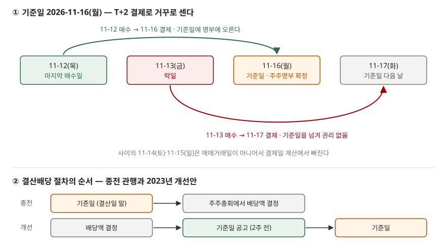

> 예제의 회사 `마바식품`과 그 숫자는 계산 원리를 보이려고 만든 가상 값이다. 실제 기업과 관계가 없다. 날짜 계산에 넣은 휴장일은 예제 날짜에 걸리는 것뿐이다.

## 들어가며

배당을 받으려고 연말에 주식을 사려다가 "배당기준일이 12월 31일이니 그날 사면 되겠지" 하고 달력만 보는 경우가 있다. 그런데 그 주에 증권사 앱을 열면 아직 기준일이 오지도 않았는데 종목 옆에 "배당락"이 붙고 주가가 배당금만큼 빠져 있다. 기준일 당일에 산 주식으로는 배당을 못 받는다는 것도 그때 알게 된다. 날짜 하나를 잘못 세면 배당은 못 받고 주가 하락만 떠안거나, 반대로 하루 일찍 사서 배당을 받고도 주가가 그만큼 내려가 남는 것이 없다. 어느 날까지 사야 하고, 그 다음 날 가격이 왜 내려가는지는 결제 주기와 기준일 규칙 두 가지로 계산된다.

## 개념

**기준일**은 회사가 배당이나 신주를 받을 주주를 정하는 날이다. 상법 제354조는 회사가 일정한 날에 주주명부에 적힌 주주를 권리를 행사할 주주로 볼 수 있게 하고, 그날을 정했으면 2주 전에 공고하게 한다. 정관으로 날을 정해 둔 경우는 공고하지 않아도 된다.

**결제일**은 산 주식이 실제로 내 이름으로 넘어오는 날이다. 한국거래소 주식시장은 매매한 날을 T라 할 때 T+2에 대금과 주식을 주고받는다. 주말과 거래소 휴장일은 이 셈에서 빠진다.

주주명부에는 결제가 끝난 주식만 오른다. 그래서 기준일에 주주이려면 **기준일까지 결제가 끝나는 날에 사야** 한다. 그 마지막 날의 다음 매매거래일부터 산 주식에는 권리가 붙지 않는다. 이날을 권리가 떨어져 나갔다는 뜻으로 **락일**이라 부르고, 무엇이 떨어졌느냐에 따라 이름이 갈린다.

| 이름 | 떨어지는 권리 | 락일 이론 가격 |
|---|---|---|
| 배당락(현금배당) | 현금배당을 받을 권리 | 전일 종가 − 주당배당금 |
| 배당락(주식배당) | 주식배당을 받을 권리 | 전일 종가 / (1 + 배당비율) |
| 권리락(무상증자) | 무상신주를 받을 권리 | 전일 종가 / (1 + 증자비율) |
| 권리락(주주배정 유상증자) | 신주를 발행가에 살 권리 | (전일 종가 + 발행가 × 증자비율) / (1 + 증자비율) |

기획재정부 시사경제용어사전은 권리락을 신주배정 기준일 다음 날 이후에 결제되는 주권에는 신주인수권이 없어지는 것으로 설명한다. 정의가 날짜가 아니라 **결제**를 기준으로 쓰여 있다는 점이 이 글의 출발점이다.

## 구조



> **출처**: [KRX — General Procedures of Trading (결제 T+2, 매매거래일과 휴장일)](https://global.krx.co.kr/contents/GLB/06/0602/0602010201/GLB0602010201T1.jsp) · [상법 제354조 주주명부의 폐쇄, 기준일](https://casenote.kr/%EB%B2%95%EB%A0%B9/%EC%83%81%EB%B2%95/%EC%A0%9C354%EC%A1%B0) (제3자 전재) · 원문 발행처 [국가법령정보센터](https://www.law.go.kr/) · [금융위원회 보도자료 — 배당절차 개선방안(2023-01-31)](https://www.fsc.go.kr/po010105/79358). 날짜는 이 글의 [`code/output.txt`](code/output.txt) `[1]`에서 옮겼다.

위 그림에서 락일은 기준일의 하루 전 매매거래일이다. 금요일에 산 주식은 결제까지 이틀이 필요한데 토요일과 일요일은 결제를 하지 않으니 화요일에 결제된다. 기준일인 월요일에는 아직 남의 주식이다.

## 동작 원리

### 락일은 기준일에서 거꾸로 센다

규칙은 한 줄이다. 기준일 당일이나 그 이전에 결제가 끝나는 가장 늦은 매매일이 마지막 매수일이고, 그 다음 매매거래일이 락일이다. 기준일이 평일이고 주변에 휴장일이 없으면 T+2에서 락일은 늘 기준일의 직전 매매거래일이 된다.

공시에서도 이 관계가 그대로 보인다. 한 주주배정 유상증자 증권신고서의 일정표는 권리락일을 2023년 11월 6일(월), 신주배정기준일을 11월 7일(화)로 적었다. 이 계산에서 하루라도 어긋나면 일정표가 틀린 것이다.

기준일이 휴장일이면 셈이 달라진다. 거래소는 12월 31일에 매매와 결제를 하지 않는다. 2026년 12월 31일(목)을 기준일로 두면 그 주에 결제가 일어나는 마지막 날은 30일(수)이고, 30일에 결제되려면 28일(월)에 사야 한다. 29일(화)에 산 주식은 31일과 1월 1일을 건너 1월 4일에 결제된다. 그래서 연말 기준일의 락일은 기준일보다 이틀 앞선 29일이 된다.

### 현금배당락 — 회사 밖으로 나간 돈만큼

현금배당을 하면 회사가 가진 현금이 주주에게 나간다. 배당 직전의 주식 1주는 "회사 몫 + 곧 받을 배당금"이고, 락일의 주식 1주는 "회사 몫"뿐이다. 그래서 락일 이론 가격은 전일 종가에서 주당배당금을 뺀 값이다. 마바식품의 종가가 50,000원일 때 주당배당금이 500원이면 49,500원, 2,500원이면 47,500원이다. 하락률이 배당수익률과 같다.

거래소는 매일 가격제한폭의 기준이 되는 기준가격을 두는데, 보통은 전일 종가다. 한국거래소 영문 안내가 기준가격을 조정하는 사유로 드는 것은 주주배정 증자, 무상증자, 주식배당, 액면분할, 병합이고 현금배당은 이 목록에 없다. 이 목록대로라면 현금배당락일의 등락률은 전일 종가 대비로 계산되므로, 배당금만큼 내린 가격이 화면에 그대로 하락률로 찍힌다.

### 주식배당락 — 주식 수가 늘어난 만큼 나뉜다

주식배당은 현금 대신 새 주식을 준다. 회사 밖으로 나간 것이 없으니 회사 값은 그대로이고, 주식 수만 늘어난다. 1주당 0.05주를 주면 50,000원짜리 1주의 값이 1.05주로 나뉘어 이론 가격은 47,619.05원이다. 100주를 가진 주주는 105주가 되고 평가액은 5,000,000원 그대로다. 이 경우는 거래소가 기준가격을 이론 가격으로 조정한다. 실제 기준가격은 호가 단위에 맞춰 끝자리가 정해진다.

### 권리락 — 무상과 유상이 다르게 계산된다

무상증자 권리락은 주식배당과 같은 모양이다. 자본잉여금이 자본금으로 옮겨 갈 뿐 회사 밖으로 나가거나 들어온 돈이 없으므로 전일 종가를 늘어난 주식 수로 나눈다. 계산과 회계 처리는 [액면분할과 무상증자](../2026-10-04-stock-split-and-bonus-issue/index.md)에서 다뤘다.

주주배정 유상증자는 발행가만큼의 돈이 회사로 들어온다. 그래서 분자에 납입금이 더해진다. 종가 10,000원, 증자비율 20%, 발행가 7,150원이면 이론 권리락 가격은 9,525원이고, 신주 1주를 7,150원에 살 권리의 이론값은 그 차이인 2,375원이다. 이 권리가 락일에 주식에서 떨어져 나가 신주인수권증서로 따로 거래된다. 제3자배정과 일반공모는 기존 주주에게 권리가 없으므로 거래소가 기준가격을 조정하는 사유에서도 빠져 있다. 할인 발행이 기존 주주에게 미치는 영향은 [유상증자와 지분 희석](../2026-10-06-rights-issue-dilution/index.md)에서 계산했다.

### 배당액을 보고 사는 순서로 바뀌었다

금융위원회는 2023년 1월 31일 배당절차 개선방안을 냈다. 그전에는 12월 말을 기준일로 주주를 먼저 정하고 이듬해 3월 주주총회에서 배당액을 정했다. 락일에 배당을 받을지 말지 정해야 하는 투자자가 얼마를 받는지 모르는 채로 사고팔았다는 뜻이다. 개선안은 의결권 기준일과 배당 기준일을 나눠 주주총회 뒤로 배당 기준일을 둘 수 있다는 상법 유권해석을 내고, 정관을 고친 회사는 2024년부터 이 순서를 쓸 수 있게 했다. 분기배당은 자본시장법 제165조의12를 고쳐 이사회 결의로 기준일을 정하게 했고, 이 개정은 2025년 1월 21일 공포·시행됐다.

이 순서에서도 락일 계산은 같다. 달라지는 것은 락일 전에 주당배당금을 이미 안다는 점이다. 예제의 2027년 4월 15일 기준일은 이렇게 배당액 결정 뒤로 잡힌 기준일을 가정한 것이다.

## 실습 예제

전체 소스: [`code/`](code/) · 수행 기록: [`code/output.txt`](code/output.txt)

```text
[1] 기준일에서 거꾸로 센다 — T+2 결제, 주말·휴장일은 매매거래일에서 뺀다
  기준일               마지막 매수일           그 결제일             락일                락일에 산 주식의 결제일
  2026-11-16(월)       2026-11-12(목)       2026-11-16(월)       2026-11-13(금)       2026-11-17(화)
  2026-12-31(목)       2026-12-28(월)       2026-12-30(수)       2026-12-29(화)       2027-01-04(월)
  2027-04-15(목)       2027-04-13(화)       2027-04-15(목)       2027-04-14(수)       2027-04-16(금)

[2] 마바식품 현금배당 — 락일 전 매매거래일 종가 50,000원
     주당배당금     배당수익률      이론 락일 가격      전일 종가 대비
         500       1.00%          49,500         -1.00%
       1,500       3.00%          48,500         -3.00%
       2,500       5.00%          47,500         -5.00%

  마지막 매수일에 50,000원에 1주를 사서 락일 이론 가격 47,500원에 판 경우 (수수료·거래세 제외)
    매매 차손 -2,500원 · 배당 2,500원 → 세전 +0원
    배당소득 원천징수 15.4% = 385원 → 세후 -385원

[3] 마바식품 주식배당 — 1주당 0.05주, 락일 전 종가 50,000원
  이론 기준가격 = 50,000 / (1 + 0.05) = 47,619.05원
  주주 100주 → 105주 · 평가액 5,000,000원 → 5,000,000원

[4] 주주배정 유상증자 권리락 — 락일 전 종가 10,000원, 증자비율 20%, 발행가 7,150원
  이론 권리락 가격 = (10,000 + 7,150 × 0.2) / (1 + 0.2) = 9,525.00원
  전일 종가 대비 -4.75% · 신주 1주를 받을 권리의 이론값 2,375.00원
```

`[1]` 셋째 줄의 2027-04-15(목)는 평일 기준일이라 첫째 줄과 같은 모양이다. 둘째 줄만 휴장일 때문에 락일이 이틀 앞당겨진다. `[1]` 아래의 설명 두 줄은 [`code/output.txt`](code/output.txt)에 있다.

`[2]`의 아래쪽은 "배당 직전에 사서 락일에 팔면 배당만 챙긴다"는 생각을 계산해 본 것이다. 주가가 이론대로 움직이면 세전으로는 0이고, 배당소득에는 소득세 14%와 그 10%인 지방소득세가 원천징수되므로 세후로는 385원 손해다. 매매 수수료와 거래세까지 넣으면 더 커진다. 실제 락일 가격은 이론값과 다르게 체결될 수 있으니 이 숫자는 이론값 기준이다.

## 실무에서 주의할 점

- **기준일에 사면 늦다.** T+2 결제에서는 기준일의 직전 매매거래일이 이미 락일이다. 기준일 앞에 주말이나 휴장일이 끼면 더 앞당겨진다. 증권사 화면의 "배당락일" 표시를 믿기 전에 기준일과 휴장일로 직접 세어 본다.
- **현금배당락의 하락률을 손실로 읽지 않는다.** 락일 하락률이 배당수익률과 같다면 주주의 재산은 주가와 받을 배당금을 합쳐 그대로다. 다만 배당금은 상법 제464조의2에 따라 결의일부터 1개월 안에 들어오므로, 락일과 지급일 사이에 현금이 늦게 들어온다.
- **배당만 노린 단기 매매는 세후로 손해다.** 이론 가격대로라면 배당금만큼 주가가 빠지고 배당에서 15.4%가 원천징수된다. 이 글의 세율은 일반 원천징수 기준이고 세율 특례는 넣지 않았다.
- **기준일을 결산일로 가정하지 않는다.** 2024년부터는 정관을 고친 회사가 주주총회 뒤로 배당 기준일을 잡을 수 있어, 12월 결산법인도 배당 기준일이 2월이나 3월일 수 있다. 배당 결정 공시의 기준일 항목을 본다.
- **결제 주기가 바뀌면 락일 계산도 바뀐다.** 이 글은 2026년 10월 기준 T+2로 셌다. T+1 전환은 2026년 9월 기사 기준으로 논의 단계다. 전환되면 평일 기준일의 락일이 기준일 당일로 옮겨 간다.

## 정리

- 주주명부에는 결제가 끝난 주식만 오르므로, 기준일까지 결제되는 마지막 매매일이 마지막 매수일이고 그 다음 매매거래일이 락일이다. T+2에서는 보통 기준일의 직전 매매거래일이다.
- 현금배당락의 이론 가격은 전일 종가에서 주당배당금을 뺀 값이고, 거래소 안내의 기준가격 조정 사유에는 현금배당이 없다.
- 주식배당과 무상증자는 주식 수가 늘어난 만큼 나누고, 주주배정 유상증자는 납입금을 더해 나눈다. 이 셋은 거래소가 기준가격을 조정한다.
- 2023년 개선안 이후에는 배당액을 정한 뒤 기준일을 정하는 회사가 있어, 락일 전에 주당배당금을 알 수 있다.

## 참고 자료

- [KRX — General Procedures of Trading](https://global.krx.co.kr/contents/GLB/06/0602/0602010201/GLB0602010201T1.jsp) — 결제 T+2, 매매거래일과 휴장일(12월 31일 포함)
- [KRX — Base Price](https://global.krx.co.kr/contents/GLB/06/0602/0602010201/GLB0602010201T6.jsp) — 기준가격은 보통 전일 종가이고, 주주배정 증자·무상증자·주식배당·액면분할·병합 때 이론 가격으로 조정
- [국가법령정보센터](https://www.law.go.kr/) — 상법 제354조 주주명부의 폐쇄, 기준일(1984-09-01 시행), 제464조의2 이익배당의 지급시기(2012-04-15 시행), 소득세법 제129조 원천징수세율(2026-07-01 시행) 원문 발행처
- [상법 제354조](https://casenote.kr/%EB%B2%95%EB%A0%B9/%EC%83%81%EB%B2%95/%EC%A0%9C354%EC%A1%B0) · [상법 제464조의2](https://casenote.kr/%EB%B2%95%EB%A0%B9/%EC%83%81%EB%B2%95/%EC%A0%9C464%EC%A1%B0%EC%9D%982) · [소득세법 제129조](https://casenote.kr/%EB%B2%95%EB%A0%B9/%EC%86%8C%EB%93%9D%EC%84%B8%EB%B2%95/%EC%A0%9C129%EC%A1%B0) (제3자 전재)
- [금융위원회 보도자료 — 배당액을 보고 투자할 수 있도록 배당절차를 개선하겠습니다(2023-01-31)](https://www.fsc.go.kr/po010105/79358) — 배당기준일과 의결권기준일 분리, 2024년부터 적용
- [법무법인 세종 뉴스레터 — 분기배당 절차 개선 자본시장법 개정](https://www.shinkim.com/kor/media/newsletter/2758) — 제165조의12 개정, 2025-01-21 공포·시행 (2차 자료)
- [기획재정부 시사경제용어사전 — 권리락](https://mofe.go.kr/sisa/dictionary/detail?idx=602)
- [KIND — 주주배정 유상증자 증권신고서 일정 예](https://kind.krx.co.kr/external/2023/12/06/000086/20231206000215/10601.htm) — 권리락일 2023-11-06, 신주배정기준일 2023-11-07
- [The Financial News — T+1 결제 전환 논의(2026-09-02)](https://en.fnnews.com/news/202609021654563463) — 전환 일정 미정 (2차 자료)
