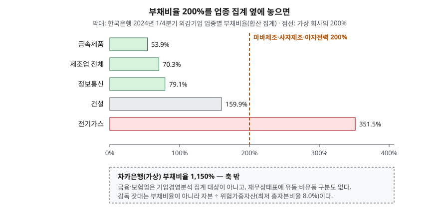

> 예제의 회사 `마바제조`·`사자제조`·`아자전력`·`차카은행`과 그 숫자는 계산 원리를 보이려고 만든 가상 값이다. 실제 기업과 관계가 없다. 업종 집계값만 한국은행 공표 자료에서 옮겼다.

## 들어가며

주식 앱에서 종목 정보를 열면 부채비율이 한 줄로 나온다. 처음 보는 사람은 대개 그 숫자 하나를 놓고 높다·낮다를 정하고, 어디선가 들은 "200%를 넘으면 위험하다"를 기준으로 삼는다. 그런데 200%라는 같은 숫자가 금속제품 업종 집계의 3.7배이기도 하고 전기가스 업종 집계의 0.57배이기도 하다. 은행이라면 200%는 오히려 보기 드물게 낮은 숫자다. 기준선 하나로 읽으면 이 세 경우를 같은 판정으로 묶게 된다.

## 개념

안정성 비율은 재무상태표 항목끼리 나눈 비율이다. 한 시점의 잔액끼리 나누므로 기말 잔액을 그대로 쓴다. 한국은행 기업경영분석은 이 묶음을 "자산·자본의 관계비율"로 부르고, 대표 지표로 둘을 든다.

| 지표 | 산식 | 무엇을 보는가 |
|---|---|---|
| 부채비율 | (유동부채 + 비유동부채) ÷ 자기자본 × 100 | 자본 대비 남의 돈의 크기. 장기 지급능력 |
| 유동비율 | 유동자산 ÷ 유동부채 × 100 | 1년 안에 갚을 것 대비 1년 안에 현금이 될 것. 단기 지급능력 |

한국은행 해설은 부채비율이 낮을수록 재무구조가 건전하다고 판단할 수 있다고 적으면서, 경영자 입장에서는 투자수익률이 이자율을 넘는 한 타인자본을 계속 쓰는 편이 유리하다는 점도 함께 적는다. 유동비율도 높을수록 단기지급능력이 좋다고 보되, 유동자산을 과하게 들고 있으면 수익성을 해칠 수 있다고 덧붙인다. 두 비율 모두 "높을수록 좋다"로 끝나지 않는다는 것이 공식 해설의 입장이다.

부채비율과 자기자본비율(자기자본 ÷ 총자산)은 같은 정보를 다르게 쓴 것이다. 자기자본비율 = 1 ÷ (1 + 부채비율)이 성립한다. 부채비율 200%는 자산의 3분의 1이 자기 돈이라는 뜻이다.

## 구조



> **출처**: [한국은행, 「2024년 1/4분기 기업경영분석 결과」(2024.6.20 발표) — 3. 안정성, 주요 안정성지표 표](https://www.bok.or.kr/portal/bbs/B0000501/view.do?menuNo=201263&nttId=10084718) · [K-IFRS 제1001호 재무제표 표시 — 문단 60·63 유동성 순서에 따른 표시](https://accountingwiki.co.kr/standards/1001) (제3자 전재)

막대는 외부감사 대상 비금융 법인의 업종별 부채비율이다. 개별 기업을 합산해 낸 값이라 업종의 대표 기업 몇 곳에 크게 좌우된다. 같은 점선 200%가 왼쪽 세 막대보다는 훨씬 오른쪽에, 전기가스 막대보다는 왼쪽에 있다. 은행은 이 축에 아예 올라오지 않는다.

## 동작 원리

### 분자에는 이자를 내지 않는 부채도 들어간다

부채비율의 분자는 부채 총계다. 차입금과 회사채뿐 아니라 매입채무, 미지급금, 고객에게 미리 받은 선수금까지 들어간다. 매입채무는 거래처에 줄 대금이고 선수금은 앞으로 물건을 넘겨서 갚는 부채라 이자가 붙지 않는다. 그래서 부채비율이 같아도 이자를 내는 부채가 얼마인지는 별도 지표인 **차입금의존도**((차입금 + 회사채) ÷ 총자산)로 봐야 한다.

### 업종마다 자산이 돈을 버는 방식이 다르다

설비에 돈을 크게 묶는 업종은 그 설비를 자기자본만으로 사기 어렵다. 한국은행 해설도 비유동장기적합률 항목에서, 거액의 설비투자가 필요한 산업은 자기자본만으로 충당하기 어려우므로 상환기간이 긴 장기부채로 조달하면 안정성을 유지할 수 있다고 본다. 전기가스 업종 집계가 351.5%로 제조업 전체(70.3%)의 다섯 배인 것은 그 구조가 숫자로 드러난 것이다. 같은 200%라도 업종 집계에서 얼마나 떨어져 있느냐가 읽는 출발점이 된다.

### 은행에는 같은 잣대가 맞지 않는다

은행의 부채는 대부분 예금이다. 예금을 받아 대출하는 것이 영업 자체이므로 부채가 원재료 역할을 한다. 기준서도 금융회사처럼 식별 가능한 영업주기가 없는 기업은 유동·비유동 구분 대신 유동성 순서로 재무상태표를 표시하는 편이 더 목적적합하다고 정한다(K-IFRS 제1001호 문단 63). 유동자산과 유동부채라는 칸이 없으니 유동비율도 계산되지 않는다.

은행의 안정성은 자본을 위험가중자산으로 나눈 BIS 기준 자기자본비율로 감독한다. 국채처럼 떼일 위험이 낮은 자산은 가중치를 낮게, 기업대출은 높게 매겨 자산의 위험만큼 자본을 갖추게 하는 방식이다. e-나라지표가 밝힌 규제 최저비율은 보통주자본 4.5%, 기본자본 6.0%, 총자본 8.0%다.

## 실습 예제

부채비율이 똑같이 200%(자산 900, 부채 600, 자본 300)인 세 회사를 두고 부채 구성만 다르게 짰다. 은행은 은행에 흔한 모양으로 따로 만들었다. 단위는 억원이다.

전체 소스: [`code/`](code/) · 수행 기록: [`code/output.txt`](code/output.txt)

```text
[1] 부채비율이 200%로 같은 세 회사 (단위: 억원)
                  업종    자산    부채    자본     부채비율   자기자본비율   차입금의존도
  마바제조           제조업   900   600   300   200.0%       33.3%       50.0%
  사자제조           제조업   900   600   300   200.0%       33.3%       11.1%
  아자전력          전기가스   900   600   300   200.0%       33.3%       53.3%

  마바제조 부채 구성: 매입채무 100, 선수금 50, 단기차입금 100, 장기차입금 350
  사자제조 부채 구성: 매입채무 300, 선수금 200, 장기차입금 100

[2] 부채비율은 같아도 이자를 내는 부채가 다르다 (차입금 이자율 5% 가정)
  마바제조  차입금 450 → 연 이자비용 22.5
  사자제조  차입금 100 → 연 이자비용 5.0

[3] 같은 200%를 업종 집계와 나란히 놓으면 (한국은행 2024.1/4 외감기업, 부채비율 %)
  제조업 전체       70.3%   200% ÷ 집계 = 2.84배
  전기가스        351.5%   200% ÷ 집계 = 0.57배

[5] 유동비율·당좌비율 (기말 잔액)
  마바제조  유동비율 120.0%  당좌비율  72.0%  유동부채비율(유동부채÷자기자본)  83.3%
  사자제조  유동비율  80.0%  당좌비율  50.0%  유동부채비율(유동부채÷자기자본) 166.7%

[6] 가상 은행 차카은행 — 같은 잣대를 대면
  자산 1000, 부채 920, 자본 80
  부채비율 1150.0%  자기자본비율 8.0%
  유동비율: 산출 불가 — 재무상태표를 유동성 순서로 표시해 유동·비유동 구분이 없다
  위험가중자산 440.0, 자본 ÷ 위험가중자산 = 18.2%  (자본 전액을 규제자본으로 본다는 가정)
```

`[4]` 부채비율별 자본 완충 표와 은행 자산별 위험가중치, 생략한 줄은 [`code/output.txt`](code/output.txt)에 있다.

`[1]`의 두 제조사는 부채비율·자기자본비율이 같은데 차입금의존도가 50.0%와 11.1%로 갈린다. 사자제조의 부채 600 중 500은 매입채무와 선수금이다. `[2]`에서 이 차이가 연 이자비용 22.5와 5.0으로 나타난다. 부채비율만 보면 두 회사는 같은 위험을 지고 있는 것처럼 읽힌다.

`[5]`는 반대 방향의 차이를 보인다. 사자제조는 이자 부담이 적은데 유동비율이 80.0%로 마바제조(120.0%)보다 낮다. 유동부채 500이 전부 매입채무와 선수금이기 때문이다. 선수금 200은 현금이 아니라 물건으로 갚는 부채라서, 유동비율 80%가 곧 현금이 모자란다는 뜻은 아니다. 한국은행 해설은 유동부채비율이 100%를 넘으면 자본구성과 재무유동성이 불안정하다고 보는데, 사자제조는 166.7%로 이 선을 넘는다. 공식 기준선 하나에 걸리더라도 그 부채가 무엇인지 열어 봐야 하는 경우다.

`[6]`의 차카은행은 부채비율이 1,150%다. 제조사에 대면 비교가 안 되는 숫자지만, 자본을 위험가중자산으로 나누면 18.2%로 규제 최저 총자본비율 8.0%의 두 배를 넘는다. 자산 1,000 중 300을 가중치 0%인 현금과 국공채로 두었기 때문이다. 가중치와 "자본 전액이 규제자본"이라는 조건은 설명용 가정이다.

## 실무에서 주의할 점

- **"부채비율 200% 이하가 건전하다" 같은 단일 기준선을 쓰지 않는다.** 이 글이 확인한 한국은행 해설에도 그런 숫자는 없다. 같은 업종 집계와 같은 회사의 연도별 추이를 기준으로 삼는다.
- **업종 집계는 합산값이다.** 한국은행 기업경영분석은 개별 기업 재무제표를 더해서 지표를 내므로 대기업 몇 곳에 좌우된다. 한국은행이 분위수 통계를 따로 내는 것도 이 한계를 보완하려는 것이다. 중소형사를 비교할 때는 중앙값 쪽이 더 가깝다.
- **부채비율과 차입금의존도를 함께 본다.** 예제의 두 제조사처럼 부채비율이 같아도 이자 부담은 4배 넘게 차이 날 수 있다. 반대로 선수금이 많은 회사는 부채비율이 높게 나와도 현금 유출 압박이 그만큼 크지 않다.
- **유동비율은 시점에 민감하다.** 장기차입금 만기가 1년 안으로 들어오면 거래가 없어도 유동비율이 떨어진다. 이 효과는 [유동과 비유동을 왜 나누는가](../../statements/2026-09-29-current-vs-noncurrent/index.md)에서 다뤘다.
- **금융회사에는 다른 지표를 쓴다.** 은행 재무상태표에는 유동·비유동 칸이 없고, 감독 지표는 위험가중자산 대비 자본비율이다. 부채비율을 제조사와 같은 표에 놓고 비교하지 않는다.

## 정리

- 부채비율은 부채 ÷ 자기자본, 유동비율은 유동자산 ÷ 유동부채다. 부채비율 200%는 자기자본비율 33.3%와 같은 말이다.
- 부채비율의 분자에는 이자가 붙지 않는 매입채무·선수금도 들어가므로, 이자 부담은 차입금의존도로 따로 본다.
- 같은 200%가 제조업 집계(70.3%)의 2.84배이고 전기가스 집계(351.5%)의 0.57배다. 업종이 자산을 조달하는 방식이 다르기 때문이다.
- 은행은 유동성 순서로 재무상태표를 표시해 유동비율이 없고, 안정성은 자본 ÷ 위험가중자산으로 감독한다.

## 참고 자료

- [한국은행, 「2024년 1/4분기 기업경영분석 결과」(2024.6.20 발표, 공보 2024-06-24)](https://www.bok.or.kr/portal/bbs/B0000501/view.do?menuNo=201263&nttId=10084718) — 업종별 부채비율·차입금의존도 표, 분위수 통계 설명
- [한국은행, 『기업경영분석』 통계정보보고서(2019.12) — 분석지표 해설 701 자기자본비율, 702 유동비율, 703 당좌비율, 706 비유동장기적합률, 707 부채비율, 708 유동부채비율, 710 차입금의존도](https://mods.go.kr/boardDownload.es?bid=12030&list_no=379918&seq=1) — 통계청 정기통계품질진단 자료
- [e-나라지표 — 은행 BIS 기준자기자본비율](https://www.index.go.kr/unity/potal/main/EachDtlPageDetail.do?idx_cd=1087) — 산식, 규제 최저비율, 근거 규정(은행업감독업무시행세칙 제17조·별표 3)
- [한국회계기준원 — 시행 중인 K-IFRS 기준서 목록](https://www.kasb.or.kr/front/board/ingAccountingList.do) — 기준서 원문 발행처
- [K-IFRS 제1001호 재무제표 표시 — 문단 60·63 유동성 순서에 따른 표시](https://accountingwiki.co.kr/standards/1001) (제3자 전재)
- [IFRS Foundation — IAS 1 Presentation of Financial Statements](https://www.ifrs.org/issued-standards/list-of-standards/ias-1-presentation-of-financial-statements/)
