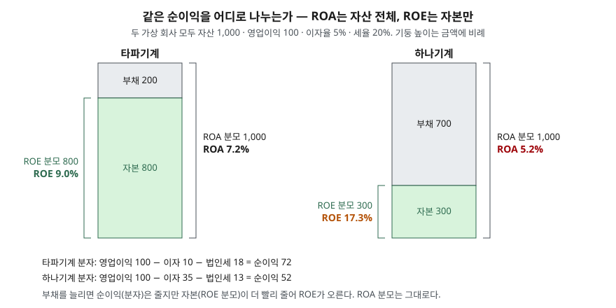

> 예제의 회사 `타파기계`·`하나기계`·`가하상사`와 모든 숫자는 계산 원리를 보이려고 만든 가상 값이다. 실제 기업과 관계가 없다. 이자율 5%와 세율 20%도 설명용 가정이다.

## 들어가며

종목 비교 화면에서 가장 먼저 눈에 들어오는 수익성 지표는 대개 ROE다. 두 회사를 나란히 놓고 ROE가 9%와 17%로 나오면, 대부분은 17%인 쪽이 돈을 두 배 가까이 잘 번다고 읽는다. 그런데 두 회사가 같은 공장, 같은 매출, 같은 영업이익을 내고 있고 차이는 빚을 얼마나 졌느냐뿐일 수 있다. 이 경우 17%는 영업을 더 잘해서 나온 숫자가 아니고, 같은 이익을 더 작은 자본으로 나눠서 나온 숫자다. 이것을 가려내려면 분모가 다른 비율 하나를 옆에 놓아야 한다.

## 개념

한국은행 기업경영분석은 두 지표를 이렇게 정의한다.

| 지표 | 산식 | 한국은행 해설의 요지 |
|---|---|---|
| ROA (총자산순이익률) | 당기순이익 ÷ 총자산 평균 × 100 | 경영활동 평가와 경영전략 수립에 많이 쓰인다 |
| ROE (자기자본순이익률) | 당기순이익 ÷ 자기자본 평균 × 100 | 자본조달 특성에 따라 같은 자산구성에서도 결과가 달라지므로 자본구성을 함께 봐야 한다 |

분자는 둘 다 당기순이익이다. 다른 것은 분모다. 재무상태표에서 자산 = 부채 + 자본이므로, ROA는 회사가 굴린 돈 전체에 대한 이익이고 ROE는 그중 주주가 낸 몫에 대한 이익이다. 손익계산서의 이익과 재무상태표의 잔액을 섞는 비율이라, 한국은행은 재무상태표 쪽을 기초와 기말의 평균으로 맞춘다. 이 글의 예제는 계산을 단순하게 하려고 기초와 기말 잔액이 같다고 둔다.

ROE를 두고 한국은행 해설이 자본구성을 함께 보라고 적은 이유가 이 글의 주제다. 자산이 같아도 부채를 늘려 자본을 줄이면 ROE는 오른다.

## 구조



> **출처**: [한국은행, 『기업경영분석』 통계정보보고서(2019.12) — 분석지표 해설 602 총자산순이익률, 604 기업순이익률, 606 자기자본순이익률](https://mods.go.kr/boardDownload.es?bid=12030&list_no=379918&seq=1)

두 기둥은 높이가 같다. 자산이 1,000으로 같기 때문이다. 오른쪽 괄호(ROA의 분모)도 두 회사에서 같다. 왼쪽 괄호(ROE의 분모)만 800과 300으로 다르다. 부채가 늘어나면 이자 때문에 분자인 순이익이 72에서 52로 줄지만, ROE의 분모는 그보다 훨씬 큰 폭으로 줄어든다.

## 동작 원리

### 부채가 ROE를 올리는 조건

빌린 돈으로 산 자산이 이자율보다 많이 벌면, 그 차액이 주주 몫으로 남는다. 자산이 버는 비율을 r(영업이익 ÷ 자산), 이자율을 i, 세율을 t라 하면 다음 식이 성립한다.

ROE = [r + (r − i) × 부채/자본] × (1 − t)

r이 i보다 크면 (r − i)가 양수이므로 부채/자본이 클수록 ROE가 커진다. r이 i와 같으면 부채는 ROE에 영향이 없고, r이 i보다 작으면 부채가 많을수록 ROE가 더 낮아진다. 같은 부채가 좋은 해에는 ROE를 키우고 나쁜 해에는 깎는다.

### ROA는 이자만큼 내려간다

ROA의 분모는 부채를 늘려도 변하지 않는다. 바뀌는 것은 분자뿐이고, 이자를 낸 만큼 순이익이 줄어 ROA는 내려간다. 그래서 ROE가 오르는데 ROA가 떨어지면, 그 상승분은 자산을 더 잘 굴려서가 아니라 자본구성을 바꿔서 생겼다는 뜻이 된다.

### 이자를 되돌려 더하면 자본구성의 영향이 대부분 걷힌다

ROA도 분자에서 이자가 빠져 있으므로 자본구성의 영향을 완전히 피하지는 못한다. 한국은행 기업경영분석은 이 점을 보완하는 **기업순이익률**((당기순이익 + 이자비용) ÷ 총자산)을 따로 둔다. 해설은 이 지표를 기업에 투입된 총자본의 종합적인 최종 성과로 설명한다. 이자를 다시 더하면 채권자 몫과 주주 몫을 합친 이익이 되므로, 자금을 어디서 조달했는지와 상관없이 자산이 낸 성과에 가까워진다.

## 실습 예제

전체 소스: [`code/`](code/) · 수행 기록: [`code/output.txt`](code/output.txt)

```text
[1] 자산·영업이익이 같고 부채만 다른 두 회사 (영업이익 100)
              부채    자본    이자    세전    순이익     ROA     ROE
  타파기계       200   800  10.0  90.0   72.0    7.2%    9.0%
  하나기계       700   300  35.0  65.0   52.0    5.2%   17.3%

[2] 한 회사가 차입금으로 자사주를 사들여 자본을 줄여 갈 때 (자산 1000, 영업이익 100 고정)
      부채    자본     부채비율     순이익     ROA     ROE    이자보상배율
       0  1000       0%    80.0    8.0%    8.0%           -
     200   800      25%    72.0    7.2%    9.0%       10.0배
     400   600      67%    64.0    6.4%   10.7%        5.0배
     700   300     233%    52.0    5.2%   17.3%        2.9배
     900   100     900%    44.0    4.4%   44.0%        2.2배

[3] 영업이익이 줄면 — 자산수익률(영업이익÷자산)이 이자율 5% 아래로 내려갈 때
      영업이익     영업이익÷자산    타파 ROE    하나 ROE    타파 ROA    하나 ROA
       150         15.0%      14.0%     30.7%     11.2%      9.2%
       100         10.0%       9.0%     17.3%      7.2%      5.2%
        50          5.0%       4.0%      4.0%      3.2%      1.2%
        30          3.0%       2.0%     -1.7%      1.6%     -0.5%

[5] 이자를 되돌려 더한 ROA — 한국은행 기업순이익률 (당기순이익 + 이자비용) ÷ 총자산
  타파기계  ROA 7.2%  기업순이익률 8.2%  (이자비용 때문에 줄어든 법인세 = 10 × 20% = 2.0)
  하나기계  ROA 5.2%  기업순이익률 8.7%  (이자비용 때문에 줄어든 법인세 = 35 × 20% = 7.0)
```

`[2]`의 부채 600·800 줄, 레버리지 식 검산 `[4]`, 자본잠식 예 `[6]`은 [`code/output.txt`](code/output.txt)에 있다. `[4]`에서 위 식과 직접 계산한 ROE가 두 회사 모두 소수점 넷째 자리까지 같다.

`[1]`에서 ROE는 하나기계가 거의 두 배인데 ROA는 하나기계가 2%p 낮다. 영업이익은 100으로 같으니 영업 실력에는 차이가 없다. ROE 차이는 분모 차이(800 대 300)에서 왔고, ROA 차이는 이자 차이(10 대 35)에서 왔다.

`[2]`는 한 회사가 돈을 빌려 자사주를 사들이는 과정을 단계별로 본 것이다. 빌린 현금이 자사주 매입으로 나가므로 자산은 1,000으로 그대로이고, 부채가 늘어난 만큼 자본이 준다. 부채 0에서 900으로 가는 동안 ROE는 8.0%에서 44.0%로 다섯 배 넘게 뛰는데 ROA는 8.0%에서 4.4%로 거의 반이 된다. 같은 기간 영업이익으로 이자를 몇 번 갚을 수 있는지를 보는 이자보상배율은 10.0배에서 2.2배로 떨어진다. ROE만 보면 개선, 나머지 둘을 보면 위험이 커지는 경로다.

`[3]`은 그 위험이 드러나는 장면이다. 자산수익률이 15%일 때 하나기계 ROE는 30.7%로 타파기계의 두 배가 넘는다. 자산수익률이 이자율과 같은 5%가 되면 두 회사 ROE가 4.0%로 같아진다. 3%로 내려가면 타파기계는 ROE 2.0%로 이익을 내지만 하나기계는 순손실로 돌아서 ROE가 −1.7%다. 하나기계의 ROE는 영업이익이 같은 폭으로 움직일 때 훨씬 크게 흔들린다.

`[5]`에서 이자를 다시 더하면 두 회사의 차이는 ROA 2.0%p에서 0.5%p로 줄어든다. 남은 0.5%p는 이자비용이 줄여 준 법인세의 차이(7.0 − 2.0 = 5.0, 자산 1,000 대비 0.5%)다.

## 실무에서 주의할 점

- **ROE는 ROA·부채비율과 같이 본다.** ROE가 오른 해에 ROA가 그대로이거나 떨어졌으면, 상승분은 자본구성 변화에서 왔을 가능성이 크다. 부채비율 읽는 법은 [안정성 비율 — 부채비율과 유동비율](../2026-10-01-leverage-and-current-ratio/index.md)에서 다뤘다.
- **자본이 줄어든 이유를 확인한다.** 자사주 매입, 배당, 누적 손실 모두 자본을 줄여 ROE를 끌어올린다. 특히 손실로 자본이 줄어든 회사는 이익이 조금만 나도 ROE가 높게 찍힌다. `[6]`처럼 자본이 음수가 되면 손실인데 ROE가 +40.0%로 나오므로, 분모가 음수인 ROE는 해석하지 않는다.
- **산식을 맞춰 비교한다.** 분자에 당기순이익을 쓰느냐 세전순이익을 쓰느냐, 분모에 평균잔액을 쓰느냐 기말잔액을 쓰느냐에 따라 같은 회사의 ROE가 달라진다. 한국은행 기업경영분석은 평균잔액을 쓰고 세전·세후 지표를 따로 낸다. 다른 자료의 숫자와 나란히 놓을 때는 어느 산식인지부터 확인한다.
- **ROE의 적정 수준을 숫자 하나로 정하지 않는다.** 자산을 많이 쓰는 업종과 적게 쓰는 업종은 ROA부터 다르고, 업종마다 부채 구조도 다르다. 이 글은 ROE가 몇 % 이상이면 좋다는 기준선을 제시하지 않는다. 비교는 같은 회사의 연도별 추이나 같은 업종 안에서 한다.

## 정리

- ROA = 당기순이익 ÷ 총자산, ROE = 당기순이익 ÷ 자기자본이다. 분자는 같고 분모만 다르다.
- 자산수익률이 이자율보다 높으면 부채를 늘릴수록 ROE가 오르고, 낮으면 부채를 늘릴수록 ROE가 더 떨어진다.
- 부채를 늘리면 이자만큼 순이익이 줄어 ROA는 내려간다. ROE가 오르는데 ROA가 떨어지면 그 상승은 자본구성에서 온 것이다.
- 이자를 되돌려 더한 기업순이익률은 자본구성의 영향을 대부분 걷어내고, 남는 차이는 이자비용의 절세 효과다.

## 참고 자료

- [한국은행, 『기업경영분석』 통계정보보고서(2019.12) — 분석지표 해설 601~606 이익률 지표](https://mods.go.kr/boardDownload.es?bid=12030&list_no=379918&seq=1) — 통계청 정기통계품질진단 자료. ROA·ROE·기업순이익률 산식과 평균잔액 사용 원칙
- [한국은행, 「2024년 1/4분기 기업경영분석 결과」(2024.6.20 발표)](https://www.bok.or.kr/portal/bbs/B0000501/view.do?menuNo=201263&nttId=10084718) — 손익항목과 자산·부채 관계비율에 기초·기말 평균을 쓴다는 이용상 유의사항
- [한국회계기준원 — 시행 중인 K-IFRS 기준서 목록](https://www.kasb.or.kr/front/board/ingAccountingList.do) — 재무상태표·손익계산서 표시 기준(제1001호) 원문 발행처
