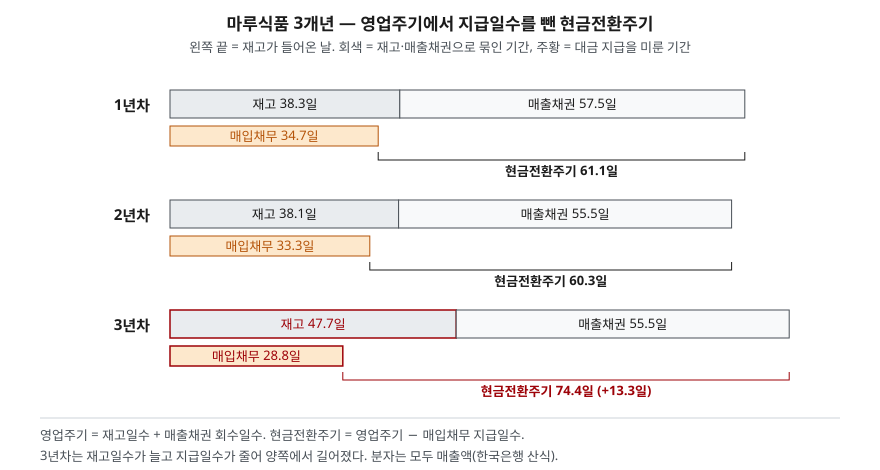

> 예제의 회사 `마루식품`과 모든 숫자는 계산 원리를 보이려고 만든 가상 값이다. 실제 기업과 관계가 없다.

## 들어가며

한 회사의 3년치 재무제표를 펼쳐 놓고 총자산회전율을 계산하면 1.20회, 1.17회, 1.14회가 나온다. 3년 동안 5.8% 내려갔으니 대부분은 "조금 둔해졌지만 큰 변화는 없다"고 읽고 넘어간다. 그런데 같은 기간 유형자산회전율은 17.4%, 재고자산회전율은 19.7% 떨어졌고, 현금이 줄어든 효과가 그 하락의 상당 부분을 가렸을 수 있다. 총자산회전율 하나는 여러 항목의 움직임을 더한 결과라서, 서로 반대로 움직인 항목이 있으면 서로 상쇄된다. 항목별 회전율을 연도별로 나란히 놓아야 무엇이 둔해졌는지가 보인다.

## 개념

한국은행 기업경영분석은 회전율을 기업에 투하된 자본이 기간 중 얼마나 활발하게 운용되었는지를 나타내는 비율로 설명하고, **활동성 분석**이라고도 부른다. 기업이 자본을 회전시킨 성과는 매출액으로 대표되므로 회전율의 분자는 모두 매출액이고, 분모는 각 자산·부채 항목의 기초·기말 평균잔액이다.

| 번호 | 지표 | 산식 | 한국은행 해설의 요지 |
|---|---|---|---|
| 801 | 총자산회전율 | 매출액 ÷ 총자산 평균 | 총자산의 운용효율을 총괄적으로 표시한다 |
| 806 | 유형자산회전율 | 매출액 ÷ 유형자산 평균 | 설비자산의 적정성 판단에 쓴다. 설비투자가 부진해도 높게 나올 수 있다 |
| 807 | 재고자산회전율 | 매출액 ÷ 재고자산 평균 | 높을수록 재고관리가 효율적이나, 재고를 적정 수준 아래로 유지해도 높게 나온다 |
| 809 | 매출채권회전율 | 매출액 ÷ 매출채권 평균 | 높을수록 현금화가 빠르다. 판매조건을 완화하면 낮게 나올 수 있다 |
| 810 | 매입채무회전율 | 매출액 ÷ 매입채무 평균 | 높을수록 결제가 빠르다. 신용도가 떨어져 외상 기간이 짧아져도 높게 나온다 |

회전율의 역수에 365를 곱하면 회전일수가 된다. CFA Institute 커리큘럼은 재고일수와 매출채권 회수일수, 매입채무 지급일수를 묶어 **현금전환주기**를 만든다. 재고를 들여와 판매 대금을 회수하기까지의 기간(영업주기)에서, 매입 대금을 늦게 낸 기간을 뺀 것이다. 커리큘럼은 이것을 단순한 비율이 아닌 유동성 척도로 분류한다. 영업주기라는 말 자체는 K-IFRS 제1001호가 영업활동에 쓸 자산을 취득한 시점부터 현금으로 실현되는 시점까지의 기간으로 정의한다(문단 68).

## 구조



> **출처**: [한국은행, 『기업경영분석』 통계정보보고서(2019.12) — 분석지표 해설 807 재고자산회전율, 809 매출채권회전율, 810 매입채무회전율](https://mods.go.kr/boardDownload.es?bid=12030&list_no=379918&seq=1) · [CFA Institute, Financial Analysis Techniques (2026 Curriculum, Level I) — Activity Ratios, Cash Conversion Cycle](https://www.cfainstitute.org/insights/professional-learning/refresher-readings/2026/financial-analysis-techniques) · [K-IFRS 제1001호 재무제표 표시 — 문단 68 영업주기](https://accountingwiki.co.kr/standards/1001) (제3자 전재)

막대 한 줄이 한 해의 평균적인 현금 한 바퀴다. 위쪽 회색 막대는 재고를 들여온 날부터 팔려서 매출채권이 되고, 그 매출채권이 회수될 때까지의 기간이다. 아래 주황 막대는 같은 재고를 들여올 때 생긴 매입채무를 갚을 때까지의 기간이다. 주황 막대가 끝나는 날 현금이 나가고, 회색 막대가 끝나는 날 현금이 들어오므로, 둘 사이가 회사가 자기 돈으로 메워야 하는 기간이다.

## 동작 원리

### 총자산회전율은 항목별 몫의 합으로 풀린다

총자산회전율의 역수인 총자산 ÷ 매출액은 매출 1원을 내는 데 필요한 자산이다. 총자산은 현금·매출채권·재고자산·유형자산 등의 합이므로, 이 값도 항목별 "매출 1원당 자산"의 합이 된다. 곱으로 이어진 [듀폰 분석](../2026-10-02-dupont-roe-three-factors/index.md)과 달리 여기서는 합이라서, 총자산회전율의 변화를 항목별로 남김없이 나눌 수 있다. 어떤 항목의 몫이 늘고 다른 항목의 몫이 줄면 합계는 조금만 움직인다. 총자산회전율이 거의 그대로인데 항목별로 큰 변화가 숨어 있을 수 있는 이유다.

### 설비 증설은 회전율을 먼저 떨어뜨린다

공장을 지으면 유형자산은 그해에 늘지만 매출은 가동이 시작된 뒤에 따라온다. 그 사이 유형자산회전율은 내려간다. 반대로 한국은행 해설이 짚듯이 설비투자를 미루면 유형자산회전율이 올라간다. 유형자산회전율만으로 효율이 좋아졌는지 투자를 안 했는지 구별할 수 없으므로, 현금흐름표의 유형자산 취득액과 같이 본다.

### 현금전환주기는 운전자본 금액과 같은 정보다

세 회전율의 분자가 모두 매출액이면 현금전환주기 × 하루 매출액은 (매출채권 + 재고자산 − 매입채무)의 평균잔액과 정확히 같다. 현금전환주기가 늘었다는 것은 매출 규모에 비해 영업에 묶인 돈이 늘었다는 뜻이고, 그 차액은 현금 감소나 차입으로 메워진다.

## 실습 예제

마루식품은 2년차에 공장을 증설해 유형자산이 420에서 650으로 늘었고, 3년차에 재고가 110에서 210으로 쌓였으며 공급처의 결제 조건이 짧아졌다. 매출액은 1,000에서 1,300으로 늘었다. 금액 단위는 억원이다.

전체 소스: [`code/`](code/) · 수행 기록: [`code/output.txt`](code/output.txt)

```text
[2] 회전율 (회)
                1년차      2년차      3년차     1→3년차
  총자산           1.20      1.17      1.14      -5.8%
  유형자산          2.44      2.15      2.02     -17.4%
  재고자산          9.52      9.58      7.65     -19.7%
  매출채권          6.35      6.57      6.58      +3.7%
  매입채무         10.53     10.95     12.68     +20.5%

[3] 회전일수와 현금전환주기 (일)
                        1년차      2년차      3년차
  재고일수 (A)              38.3      38.1      47.7
  매출채권 회수일수 (B)         57.5      55.5      55.5
  매입채무 지급일수 (C)         34.7      33.3      28.8
  영업주기 A+B              95.8      93.6     103.2
  현금전환주기 A+B−C          61.1      60.3      74.4

[4] 매출 1원당 평균자산 — 총자산회전율의 역수를 항목별로 나눈 것
                1년차      2년차      3년차    1→3년차 증감
  현금           0.105     0.083     0.058      -0.047
  매출채권         0.158     0.152     0.152      -0.006
  재고자산         0.105     0.104     0.131      +0.026
  유형자산         0.410     0.465     0.496      +0.086
  기타자산         0.052     0.048     0.044      -0.008
  합계           0.830     0.852     0.881      +0.051

[5] 영업에 묶인 운전자본 = 매출채권 + 재고자산 − 매입채무 (평균잔액)
  1년차  운전자본  167.5  (현금전환주기 × 하루 매출 =  167.5)
  2년차  운전자본  190.0  (현금전환주기 × 하루 매출 =  190.0)
  3년차  운전자본  265.0  (현금전환주기 × 하루 매출 =  265.0)
```

4개 시점의 재무상태표 `[1]`은 [`code/output.txt`](code/output.txt)에 있다.

`[2]`에서 총자산회전율은 5.8% 내려갔지만 유형자산회전율은 17.4%, 재고자산회전율은 19.7% 내려갔다. 매출채권회전율은 오히려 3.7% 올랐다. 유형자산회전율은 증설한 2년차에 2.44회에서 2.15회로 먼저 꺾였고, 재고자산회전율은 2년차까지 그대로였다가 3년차에 9.58회에서 7.65회로 떨어졌다. 두 하락은 시점도 원인도 다르다.

`[4]`가 총자산회전율 하락이 작게 보인 이유다. 매출 1원당 자산은 0.830에서 0.881로 0.051 늘었는데, 유형자산 몫이 0.086, 재고자산 몫이 0.026 늘었고 현금 몫이 0.047 줄었다. 유형자산과 재고가 늘어난 몫(0.112)의 40% 남짓을 현금이 줄어든 몫이 상쇄했다. 현금을 써서 설비와 재고를 산 것이므로 효율이 나아진 것은 아니다.

`[3]`에서 매입채무회전율 상승은 지급일수가 34.7일에서 28.8일로 줄었다는 뜻이다. 재고일수가 38.3일에서 47.7일로 늘어난 것과 겹쳐 현금전환주기가 3년차에 74.4일로 길어졌다. `[5]`에서 영업에 묶인 운전자본은 167.5에서 265.0으로 늘었고, 세 해 모두 현금전환주기 × 하루 매출과 소수점 첫째 자리까지 같다. 매출은 30% 늘었는데 묶인 돈은 58% 늘었다.

## 실무에서 주의할 점

- **분자를 확인한다.** 한국은행 기업경영분석은 다섯 회전율 모두 매출액을 분자로 쓴다. CFA Institute 커리큘럼은 재고 쪽에 매출원가, 매입채무 쪽에 매입액을 쓰는 형태를 다룬다. 같은 회사라도 분자에 따라 재고일수와 지급일수가 크게 달라지므로, 다른 자료의 수치와 비교할 때는 산식부터 맞춘다. 매출원가로 계산한 차이는 [매출채권과 재고자산](../../statements/2026-10-01-receivables-inventory-turnover/index.md)에서 봤다.
- **회전율이 높은 것이 언제나 좋은 신호는 아니다.** 한국은행 해설이 세 군데에서 같은 경고를 한다. 재고를 적정 수준 아래로 줄여도, 설비투자를 미뤄도 회전율은 오르고, 매입채무회전율은 신용도가 떨어져 외상 기간이 짧아져도 오른다. 마루식품의 매입채무회전율 상승도 효율이 아니라 결제 조건 악화에서 나왔다.
- **총자산회전율 하나로 추세를 판단하지 않는다.** 현금처럼 매출과 무관하게 움직이는 항목이 섞여 있어, 서로 다른 방향의 변화가 합계에서 상쇄된다. 항목별 회전율이나 매출 1원당 자산을 같이 본다.
- **업종이 다르면 비교하지 않는다.** 설비를 많이 쓰는 업종과 적게 쓰는 업종은 유형자산회전율의 크기 자체가 다르다. 이 글은 회전율이 몇 회 이상이면 적정하다는 기준선을 제시하지 않는다. 비교는 같은 회사의 연도별 추이나 같은 업종 안에서 한다.

## 정리

- 활동성 비율은 매출액 ÷ 각 항목의 평균잔액이고, 역수에 365를 곱하면 회전일수가 된다.
- 총자산회전율의 역수는 항목별 매출 1원당 자산의 합이라, 항목끼리 상쇄되면 큰 변화가 작게 보인다.
- 현금전환주기 = 재고일수 + 매출채권 회수일수 − 매입채무 지급일수이고, 하루 매출을 곱하면 영업에 묶인 운전자본과 같다.
- 회전율이 오른 원인이 효율 개선인지, 투자 지연·재고 부족·신용 악화인지는 회전율만으로 가려지지 않는다.

## 참고 자료

- [한국은행, 『기업경영분석』 통계정보보고서(2019.12) — 분석지표 해설 801~810 자산·자본의 회전율](https://mods.go.kr/boardDownload.es?bid=12030&list_no=379918&seq=1) — 통계청 정기통계품질진단 자료. 회전율 산식과 해석상 유의점, 평균잔액 사용 원칙
- [CFA Institute, Financial Analysis Techniques (2026 Curriculum, Level I)](https://www.cfainstitute.org/insights/professional-learning/refresher-readings/2026/financial-analysis-techniques) — 활동성 비율 목록과 현금전환주기
- [한국회계기준원 — 시행 중인 K-IFRS 기준서 목록](https://www.kasb.or.kr/front/board/ingAccountingList.do) — 기준서 원문(PDF·HWP) 발행처. 아래 전재 사이트는 문단을 바로 열기 위한 편의 링크다
- [K-IFRS 제1001호 재무제표 표시 — 문단 68 영업주기](https://accountingwiki.co.kr/standards/1001) (제3자 전재)
