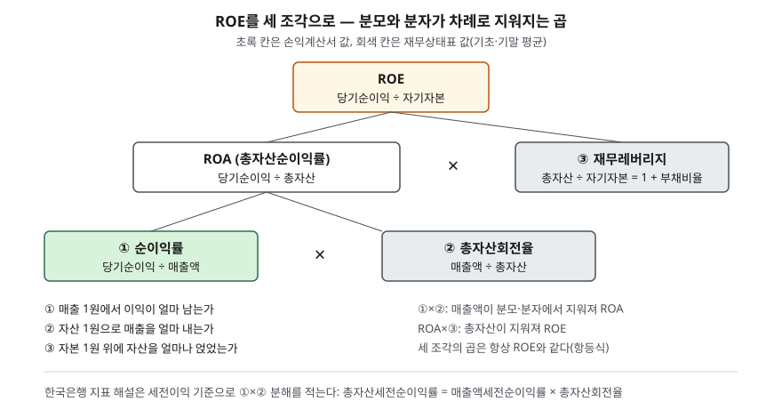

> 예제의 회사 `가람유통`·`나래제약`·`다온건설`·`라온전자`와 모든 숫자는 계산 원리를 보이려고 만든 가상 값이다. 실제 기업과 관계가 없다. 법인세율 25%와 이자율 4%도 설명용 가정이다.

## 들어가며

종목 비교 화면에 ROE가 똑같이 15%로 찍힌 회사 셋이 있으면, 수익성은 비슷하다고 보고 다음 지표로 넘어가기 쉽다. 그런데 한 곳은 마진 2.5%짜리 물건을 쉼 없이 팔아서, 한 곳은 마진 15%짜리 제품을 천천히 팔아서, 나머지 한 곳은 자본의 다섯 배 자산을 빚으로 굴려서 15%를 만들었을 수 있다. 셋은 영업이익이 똑같이 20% 줄었을 때 ROE가 떨어지는 폭부터 다르다. 지난 글 [ROE와 ROA](../2026-10-01-roe-vs-roa/index.md)에서 ROE 하나에 자본구성이 섞여 든다는 것을 봤다. 이번에는 ROE를 곱셈 세 조각으로 나눠, 숫자 하나에 섞인 세 가지 원인을 따로 꺼낸다.

## 개념

ROE는 당기순이익 ÷ 자기자본이다. 여기에 매출액과 총자산을 분모·분자에 한 번씩 곱하고 나누면 값은 그대로이면서 식이 세 조각으로 갈라진다.

| 조각 | 산식 | 무엇을 묻는가 |
|---|---|---|
| ① 순이익률 | 당기순이익 ÷ 매출액 | 매출 1원에서 이익이 얼마 남는가 |
| ② 총자산회전율 | 매출액 ÷ 총자산 | 자산 1원으로 매출을 얼마 내는가 |
| ③ 재무레버리지 | 총자산 ÷ 자기자본 | 자본 1원 위에 자산을 얼마나 얹었는가 |

①과 ②를 곱하면 매출액이 지워져 ROA가 되고, 여기에 ③을 곱하면 총자산이 지워져 ROE가 된다. 대수적으로 항상 성립하는 항등식이다. 이 분해를 흔히 듀폰 분석이라 부르고, CFA Institute 커리큘럼은 이것을 ROE의 시점 간 변화와 회사 간 차이의 이유를 찾는 기법으로 소개한다.

한국은행 기업경영분석 지표 해설도 앞 두 조각의 분해를 적는다. 총자산세전순이익률을 매출액세전순이익률과 총자산회전율의 곱으로 나눠 보면, 예를 들어 이익률은 높아졌는데 회전율이 낮아졌을 때 판매마진은 개선되고 판매활동은 부진했다고 읽을 수 있다는 설명이다. ③은 같은 자료의 부채비율(부채 ÷ 자기자본)로 바꿔 쓸 수 있다. 자산 = 부채 + 자본이므로 총자산 ÷ 자기자본 = 1 + 부채비율이다.

## 구조



> **출처**: [한국은행, 『기업경영분석』 통계정보보고서(2019.12) — 분석지표 해설 601 총자산세전순이익률, 602 총자산순이익률, 606 자기자본순이익률, 801 총자산회전율](https://mods.go.kr/boardDownload.es?bid=12030&list_no=379918&seq=1) · [CFA Institute, Financial Analysis Techniques (2026 Curriculum, Level I)](https://www.cfainstitute.org/insights/professional-learning/refresher-readings/2026/financial-analysis-techniques)

세 조각은 서로 다른 재무제표에서 온다. 순이익률은 손익계산서 안에서 끝나고, 재무레버리지는 재무상태표 안에서 끝난다. 총자산회전율만 두 장을 잇는다. 손익계산서는 1년 동안 쌓인 값이고 재무상태표는 한 시점의 값이라, 한국은행은 두 장을 섞는 비율에서 재무상태표 쪽을 기초와 기말 잔액의 평균으로 쓴다. 이 글의 예제는 잔액이 처음부터 평균잔액으로 주어졌다고 둔다.

## 동작 원리

### 같은 ROE, 다른 곱

곱은 순서와 조합이 달라도 같은 값이 나온다. 2.5% × 3.0 × 2.0과 15% × 0.5 × 2.0과 5% × 0.6 × 5.0은 모두 15%다. ROE만 보면 이 세 조합이 구별되지 않는다. 분해하면 각 회사가 어느 조각에 기대고 있는지가 드러나고, 그 조각에 따라 위험의 종류가 달라진다. 순이익률에 기댄 회사는 판매 가격이 흔들릴 때, 회전율에 기댄 회사는 판매량이 줄 때, 레버리지에 기댄 회사는 이익이 줄거나 금리가 오를 때 ROE가 크게 움직인다.

### 레버리지는 분자에도 숨어 있다

3요인에서 레버리지는 ③ 한 칸에만 있는 것처럼 보이지만, 빚에는 이자가 붙으므로 ①의 순이익률도 깎는다. 이를 따로 떼어 내려고 순이익률을 세 조각으로 더 쪼갠 것이 5요인 분해다. CFA Institute 커리큘럼은 ROE를 세부담·이자부담·영업이익률·회전율·레버리지의 함수로 적는다.

순이익률 = (순이익 ÷ 세전이익) × (세전이익 ÷ 영업이익) × (영업이익 ÷ 매출액)

가운데 이자부담이 1에 가까울수록 영업이익 중 이자로 나가는 몫이 작다. 부채가 많은 회사는 이 값이 작고, 영업이익이 줄 때 이자는 그대로 남으므로 세전이익이 영업이익보다 더 큰 비율로 줄어든다.

### 변화를 요인별로 나누기

ROE가 13%에서 18%로 올랐다면 그 상승이 어느 조각에서 왔는지를 물을 수 있다. 세 조각이 곱으로 묶여 있으므로 로그를 취하면 합이 된다. ln(ROE 비율) = ln(순이익률 비율) + ln(회전율 비율) + ln(레버리지 비율)이므로, 각 항을 전체로 나누면 요인별 몫이 남김없이 나온다.

## 실습 예제

전체 소스: [`code/`](code/) · 수행 기록: [`code/output.txt`](code/output.txt)

```text
[2] 3요인 분해 — ROE = 순이익률 × 총자산회전율 × 재무레버리지
               순이익률    총자산회전율    재무레버리지       곱   직접 ROE
  가람유통         2.5%     3.00회     2.00배   15.0%    15.0%
  나래제약        15.0%     0.50회     2.00배   15.0%    15.0%
  다온건설         5.0%     0.60회     5.00배   15.0%    15.0%

[3] 5요인 분해 — 순이익률 = 세부담 × 이자부담 × 영업이익률
              세부담    이자부담    영업이익률    회전율    레버리지       곱
  가람유통      0.750   0.833     4.0%   3.00    2.00   15.0%
  나래제약      0.750   0.833    24.0%   0.50    2.00   15.0%
  다온건설      0.750   0.556    12.0%   0.60    5.00   15.0%

[4] 영업이익이 세 회사 모두 20% 줄면
              영업이익     순이익   ROE 전   ROE 후   ROE 감소율
  가람유통        96.0    57.0   15.0%   11.4%    -24.0%
  나래제약        96.0    57.0   15.0%   11.4%    -24.0%
  다온건설        57.6    19.2   15.0%    9.6%    -36.0%

[5] 라온전자 3개년 — ROE가 오른 이유
    연도    매출액    순이익    총자산    자본     순이익률     회전율    레버리지     ROE
     1   1200   78.0   1000   600     6.5%   1.20회   1.67배   13.0%
     2   1210   78.0   1100   500     6.4%   1.10회   2.20배   15.6%
     3   1200   72.0   1200   400     6.0%   1.00회   3.00배   18.0%

[6] 1년차 → 3년차 ROE 변화(로그 기준 +0.3254)를 세 요인으로 나누면
  순이익률       -0.0800  몫   -24.6%
  총자산회전율     -0.1823  몫   -56.0%
  재무레버리지     +0.5878  몫  +180.6%
  합계         +0.3254  몫  +100.0%
```

세 회사의 매출액·영업이익·이자·부채 잔액 `[1]`은 [`code/output.txt`](code/output.txt)에 있다. 금액 단위는 억원이다.

`[2]`에서 세 조각을 곱한 값과 순이익 ÷ 자본으로 직접 구한 ROE가 세 회사 모두 15.0%로 같다. 가람유통은 회전율 3.00회, 나래제약은 순이익률 15.0%, 다온건설은 레버리지 5.00배가 각자의 15%를 떠받친다. 가람유통과 나래제약은 레버리지가 2.00배로 같으므로 둘의 차이는 순이익률과 회전율의 조합뿐이다.

`[3]`은 다온건설의 레버리지가 분자 쪽에도 흔적을 남긴 것을 보여 준다. 세부담은 세 회사가 0.750으로 같은데, 이자부담은 다온건설만 0.556이다. 영업이익 72 중 32가 이자로 나가기 때문이다.

`[4]`가 그 결과다. 영업이익이 똑같이 20% 줄었을 때 가람유통과 나래제약의 ROE는 24.0% 줄고, 다온건설은 36.0% 준다. 이자 32는 영업이익이 줄어도 그대로 나가므로 세전이익이 40에서 25.6으로 36% 줄어든다. 영업이익의 감소율보다 ROE 감소율이 큰 정도가 이자부담에서 결정된다.

`[5]`의 라온전자는 ROE가 13.0%에서 18.0%로 3년 연속 올랐다. 분해하면 순이익률은 6.5%에서 6.0%로, 회전율은 1.20회에서 1.00회로 둘 다 내려갔고 레버리지만 1.67배에서 3.00배로 올랐다. `[6]`에서 레버리지의 몫이 +180.6%인 것은 ROE를 끌어올린 힘이 전부 레버리지에서 왔고, 나머지 두 조각이 그중 80.6%만큼을 도로 깎았다는 뜻이다. 영업 쪽 두 조각은 오히려 나빠졌는데 ROE는 좋아진 것으로 찍힌 사례다.

## 실무에서 주의할 점

- **세 조각의 분모·분자 기준을 맞춘다.** 순이익률을 당기순이익 기준으로 구했으면 ROE도 당기순이익 기준이어야 곱이 맞는다. 재무상태표 항목을 평균잔액으로 썼으면 세 조각 모두 평균잔액이어야 한다. 한 조각만 기말잔액을 쓰면 곱과 직접 계산한 ROE가 어긋난다.
- **업종이 다르면 조각의 크기를 직접 비교하지 않는다.** 유통업처럼 회전율이 높고 마진이 얇은 업종과, 설비가 많아 회전율이 낮은 업종은 조합 자체가 다르다. 이 글은 회전율이나 레버리지가 몇 이상이면 좋다는 기준선을 제시하지 않는다. 비교는 같은 회사의 연도별 추이나 같은 업종 안에서 한다.
- **로그 분해의 몫은 합이 100%가 되도록 만든 회계 장치다.** 세 조각이 서로 독립이라는 뜻은 아니다. 라온전자처럼 빚을 늘려 자산을 산 해에는 레버리지가 오르는 동시에 회전율이 떨어지는 경우가 많다. 몫은 어디를 더 들여다볼지 정하는 데 쓰고, 원인은 재무제표 본문과 주석에서 확인한다.
- **자본이 음수거나 0에 가까우면 분해가 뜻을 잃는다.** 레버리지가 음수나 아주 큰 값이 되어 ROE도 같이 왜곡된다. 이때는 ROE 대신 ROA나 [안정성 비율](../2026-10-01-leverage-and-current-ratio/index.md)을 본다.

## 정리

- ROE = 순이익률 × 총자산회전율 × 재무레버리지이고, 이 곱은 항상 ROE와 같다.
- 같은 ROE라도 어느 조각에 기대느냐에 따라 위험의 종류가 다르다.
- 순이익률을 세부담 × 이자부담 × 영업이익률로 더 쪼개면 레버리지가 이자를 통해 분자에 남긴 흔적이 보인다. 이자부담이 작을수록 영업이익 변동이 ROE에서 커진다.
- ROE가 올랐을 때 로그로 나눈 요인별 몫을 보면, 상승이 영업에서 왔는지 자본구성에서 왔는지 가려낼 수 있다.

## 참고 자료

- [한국은행, 『기업경영분석』 통계정보보고서(2019.12) — 분석지표 해설 601~611 손익의 관계비율, 801 총자산회전율](https://mods.go.kr/boardDownload.es?bid=12030&list_no=379918&seq=1) — 통계청 정기통계품질진단 자료. 총자산세전순이익률을 매출액세전순이익률 × 총자산회전율로 분해하는 해설과 평균잔액 사용 원칙
- [CFA Institute, Financial Analysis Techniques (2026 Curriculum, Level I)](https://www.cfainstitute.org/insights/professional-learning/refresher-readings/2026/financial-analysis-techniques) — DuPont 분석의 목적과 5요인 분해 구성
- [한국회계기준원 — 시행 중인 K-IFRS 기준서 목록](https://www.kasb.or.kr/front/board/ingAccountingList.do) — 재무상태표·손익계산서 표시 기준(제1001호) 원문 발행처
