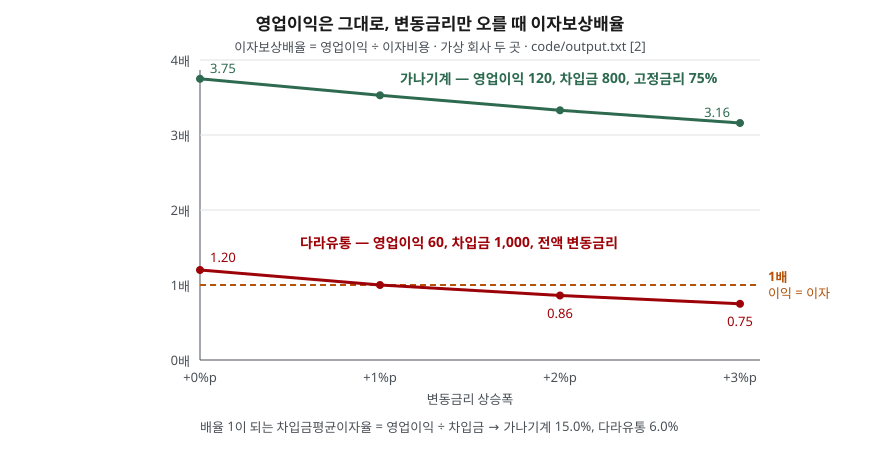

> 예제의 회사 `가나기계`·`다라유통`·`마사건설`·`바아전자`와 그 숫자는 계산 원리를 보이려고 만든 가상 값이다. 실제 기업과 관계가 없다. 전체 기업 집계값만 한국은행 공표 자료에서 옮겼다.

## 들어가며

금리가 오른다는 뉴스 뒤에는 "영업이익으로 이자도 못 내는 기업이 늘었다"는 기사가 따라 나온다. 종목 정보 화면에서 이자보상배율을 찾아보면 1.2배, 3.8배 같은 숫자 하나가 나온다. 대개는 그 숫자가 1보다 크면 안심하고 넘어가는데, 1.2배와 3.8배는 같은 "1 이상"이 아니다. 아래 예제의 다라유통은 변동금리가 1%p만 올라도 배율이 정확히 1.00배가 되고, 가나기계는 3%p가 올라도 3배 아래로 내려가지 않는다. 숫자 하나만 보고는 이 차이가 보이지 않는다.

## 개념

이자보상배율은 한 해 동안 영업으로 번 돈이 그해 내야 할 이자의 몇 배인지를 나타낸다. 한국은행 기업경영분석은 같은 지표를 백분율로 써서 **이자보상비율**이라 부르고, 이자지급에 필요한 수익의 창출능력을 재 이자부담능력을 판단하는 지표로 설명한다.

| 지표 | 산식 | 무엇을 보는가 |
|---|---|---|
| 이자보상비율 | 영업이익 ÷ 이자비용 × 100 | 영업이익으로 이자를 감당하는 정도 |
| 순이자보상비율 | 영업이익 ÷ (이자비용 − 이자수익) × 100 | 받는 이자를 뺀 순이자 부담 대비 영업이익 |
| 차입금평균이자율 | 이자비용 ÷ (회사채 + 장단기차입금) 평균 × 100 | 이자를 내는 부채에 붙는 평균 금리 |

배율 1은 영업이익과 이자비용이 같다는 뜻이다. 1 아래면 영업에서 번 돈으로 이자를 다 내지 못하고, 모자란 만큼을 쌓아 둔 현금이나 새 차입으로 메워야 한다. 한국은행은 이자보상배율이 3년 이상 연속 1 미만인 기업을 **한계기업**으로 분류한다.

앞서 다룬 [부채비율](../2026-10-01-leverage-and-current-ratio/index.md)은 재무상태표 잔액끼리 나눈 비율이라 "빚이 얼마나 많은가"를 본다. 이자보상배율은 손익계산서의 한 해 흐름끼리 나눈 비율이라 "그 빚의 비용을 올해 이익으로 낼 수 있는가"를 본다. 부채가 많아도 이익이 크면 배율은 높고, 부채가 적어도 이익이 없으면 배율은 낮다.

## 구조



> **출처**: [한국은행, 『기업경영분석』 통계정보보고서(2019.12) — 분석지표 해설 625 차입금평균이자율, 629 이자보상비율](https://mods.go.kr/boardDownload.es?bid=12030&list_no=379918&seq=1) — 산식. 선의 값은 이 글의 [`code/output.txt`](code/output.txt) `[2]`에서 옮겼다.

두 선의 기울기가 다른 이유는 분모에 있다. 이자비용은 차입금 × 평균이자율이므로, 금리가 오를 때 이자비용이 얼마나 늘어나는지는 변동금리로 빌린 비중이 정한다. 가나기계는 차입의 75%가 고정금리라 선이 완만하고, 다라유통은 전부 변동금리라 같은 상승폭에 더 크게 내려간다. 출발점이 1.20배로 낮으니 1%p 상승만으로 점선에 닿는다.

## 동작 원리

### 배율이 1이 되는 금리를 거꾸로 구할 수 있다

이자비용 = 차입금 × 차입금평균이자율이므로, 배율 = 영업이익 ÷ (차입금 × 평균이자율)이다. 배율이 1이 되는 평균이자율은 **영업이익 ÷ 차입금**으로 바로 나온다. 다라유통은 60 ÷ 1,000 = 6.0%, 가나기계는 120 ÷ 800 = 15.0%다. 지금 평균이자율이 5%인 다라유통에게 남은 여유는 1%p이고, 4%인 가나기계에게는 11%p다. 배율 하나보다 이 거리가 금리 변화에 대한 내성을 더 직접 보여 준다.

한국은행 해설은 금융비용이 매출 수준과 관계없는 고정비 성격이라고 적는다. 매출이 줄어 영업이익이 내려가도 이자비용은 그대로 남으므로, 배율은 분자 쪽에서도 흔들린다. 금리 상승과 이익 감소가 겹치면 양쪽에서 동시에 눌린다.

### 1배 미만이 이어지면 분모가 스스로 커진다

배율이 1 미만인 해에는 모자란 이자를 어딘가에서 마련해야 한다. 현금이 없으면 새로 빌리고, 새로 빌린 돈에는 다음 해 이자가 붙는다. 예제의 마사건설은 영업이익이 40 → 30 → 20으로 줄어드는 동안 부족분을 차입으로 메웠다. 원금 상환이나 투자를 하나도 넣지 않았는데도 차입금이 1,000에서 1,062.0으로 늘고, 이자비용이 50.0 → 50.5 → 51.5로 따라 오른다. 이익이 그대로여도 배율이 떨어지는 구조다. "3년 연속"이라는 한계기업 기준은 일시적인 적자와 이 순환에 들어선 상태를 가르려는 장치로 읽을 수 있다.

### 이자수익이 크면 두 지표가 갈린다

이자보상비율의 분모는 이자비용 총액이다. 현금을 많이 쌓아 두고 예금이자를 받는 회사는 이 지표에서 실제보다 불리하게 나온다. 한국은행이 이자수익을 뺀 **순이자보상비율**을 따로 두는 이유다. 예제의 바아전자는 이자보상배율이 0.80배로 1 아래지만, 이자수익 30을 빼면 순이자보상배율은 2.00배다.

## 실습 예제

가상 회사 넷을 두고 상황마다 하나씩 바꿨다. 단위는 억원이다.

전체 소스: [`code/`](code/) · 수행 기록: [`code/output.txt`](code/output.txt)

```text
[1] 기준 상태 (단위: 억원)
                영업이익     차입금     고정금리 비중    이자비용    이자보상배율
  가나기계           120     800           75%      32.0        3.75배
  다라유통            60    1000            0%      50.0        1.20배

[2] 영업이익은 그대로, 변동금리만 오를 때
  변동금리 상승폭            +0%p      +1%p      +2%p      +3%p
  가나기계               3.75배     3.53배     3.33배     3.16배
  다라유통               1.20배     1.00배     0.86배     0.75배
  가나기계  배율 1이 되는 차입금평균이자율 = 120 ÷ 800 = 15.0%
  다라유통  배율 1이 되는 차입금평균이자율 = 60 ÷ 1000 = 6.0%

[3] 마사건설 — 배율 1 미만이 3년 이어질 때 (부족분을 새 차입으로 메운다고 가정)
  연도        기초 차입금    이자비용    영업이익      배율     부족분    기말 차입금
  1년차      1000.0      50.0        40     0.80배     10.0      1010.0
  2년차      1010.0      50.5        30     0.59배     20.5      1030.5
  3년차      1030.5      51.5        20     0.39배     31.5      1062.0

[4] 바아전자 — 현금이 많아 이자수익이 큰 회사
  영업이익 40, 이자비용 50, 현금 1000 × 예금금리 3% = 이자수익 30
  이자보상배율   40 ÷ 50 = 0.80배
  순이자보상배율 40 ÷ (50 − 30) = 2.00배
```

`[0]` 산식 줄과 `[5]` 영업적자 사례는 [`code/output.txt`](code/output.txt)에 있다.

`[2]`에서 금리가 3%p 오르는 동안 가나기계의 배율은 0.59 내려가고 다라유통은 0.45 내려간다. 내려간 폭만 보면 가나기계 쪽이 더 크다. 그런데 가나기계는 출발점이 높아 1까지 거리가 멀고, 다라유통은 처음부터 1에 붙어 있었다. 배율의 변화폭이 아니라 **1까지 남은 거리**를 봐야 하는 이유다.

`[3]`의 마사건설은 3년 내내 1 미만이므로 한국은행 기준의 한계기업에 해당한다. 영업이익 감소분만큼 배율이 떨어진 것이 아니라, 늘어난 차입금이 분모를 키워 더 떨어졌다. 3년차 배율 0.39배는 영업이익 20을 1년차 이자비용 50으로 나눈 0.40배보다 낮다.

## 실무에서 주의할 점

- **분자는 영업이익이다.** 영업이익에는 현금이 나가지 않는 감가상각비가 이미 빠져 있다. 설비가 큰 회사는 영업이익이 작아도 실제로 이자에 쓸 현금은 더 있을 수 있다. 한국은행 기업경영분석이 EBITDA 대 매출액을 따로 내는 것도 이 차이를 보려는 것이다. 다만 한국은행의 이자보상비율과 한계기업 기준은 영업이익을 쓴다.
- **분모가 갚아야 할 원금을 담지 않는다.** 이자보상배율이 높아도 다음 해에 만기가 몰린 차입금이 크면 차환이 막힐 때 문제가 된다. 만기 구조는 [유동성 비율](../2026-10-01-leverage-and-current-ratio/index.md)과 차입금 주석에서 따로 본다.
- **영업적자면 음수 배율이 나온다.** `[5]`에서 영업이익 −20이면 −0.40배다. 음수 배율끼리 크기를 비교하는 것은 뜻이 약하다. 적자 여부를 먼저 가르고 흑자 회사끼리 배율을 비교한다.
- **집계 비중과 개별 회사를 섞지 않는다.** 한국은행 2024년 연간 기업경영분석(2025.10.29 발표)에서 이자보상비율 100% 미만 기업의 비중은 42.8%로 전년(42.3%)보다 올랐다. 이 숫자는 법인세를 신고한 비금융 영리법인 전체의 기업 수 비중이다. 중소 법인이 대부분을 차지하므로 상장사 한 곳의 배율을 이 비중에 대어 판단하지 않는다.
- **한계기업 기준은 기간을 함께 본다.** 한 해 1 미만은 경기나 일회성 비용 때문일 수 있다. 한국은행 이슈해설(2025.10.15)은 2024년 외부감사 대상 기업 중 한계기업 비중을 17.1%로 적고, 지난해 실적이 나아졌는데도 이 비중이 늘었다는 점을 들어 경기적 요인뿐 아니라 구조적 요인이 작용했다고 본다. 배율은 3년 이상의 추이로 읽는다.

## 정리

- 이자보상배율은 영업이익 ÷ 이자비용이다. 한국은행은 이것을 백분율로 써서 이자보상비율이라 부른다.
- 배율이 1이 되는 차입금평균이자율은 영업이익 ÷ 차입금이다. 지금 금리와 이 값의 거리가 금리 상승에 대한 내성이다.
- 같은 금리 상승에도 변동금리 차입 비중이 클수록 배율이 크게 움직인다.
- 1 미만이 이어지면 부족분을 빌려 메우는 동안 차입금이 늘어 배율이 더 떨어진다. 한국은행은 3년 이상 연속 1 미만인 기업을 한계기업으로 본다.
- 이자수익이 큰 회사는 순이자보상비율을 함께 본다.

## 참고 자료

- [한국은행, 『기업경영분석』 통계정보보고서(2019.12) — 분석지표 해설 625 차입금평균이자율, 627 금융비용 대 매출액, 629 이자보상비율, 630 순이자보상비율](https://mods.go.kr/boardDownload.es?bid=12030&list_no=379918&seq=1) — 통계청 정기통계품질진단 자료
- [한국은행, 「2024년 연간 기업경영분석 결과」(2025.10.29 발표)](https://www.bok.or.kr/portal/bbs/B0000501/view.do?menuNo=201264&nttId=10094231) — 이자보상비율 구간별 기업 비중
- [KDI 경제정보센터 — 「2024년 연간 기업경영분석 결과」 게재본](https://eiec.kdi.re.kr/policy/materialView.do?num=272763&pg=&pp=20&topic=C) — 위 발표의 요약 수치(100% 미만 42.3% → 42.8%)를 옮긴 곳
- [한국은행, BOK이슈해설 「한계기업이란? 이익으로 이자도 못내는 기업」(2025.10.15)](https://www.bok.or.kr/portal/bbs/B0000168/view.do?nttId=10094016&oldMenuNo=201151&menuNo=200058&programType=multiCont&depth=200058&relate=Y) — 한계기업 정의, 2024년 비중
- [한국은행, 「주요국의 이자보상비율 차이 배경과 시사점」(2016.1.29)](https://www.bok.or.kr/portal/bbs/P0000528/view.do?menuNo=20043&nttId=216001) — 국가 간 비교에 쓴 산식(영업이익 ÷ 이자비용)
