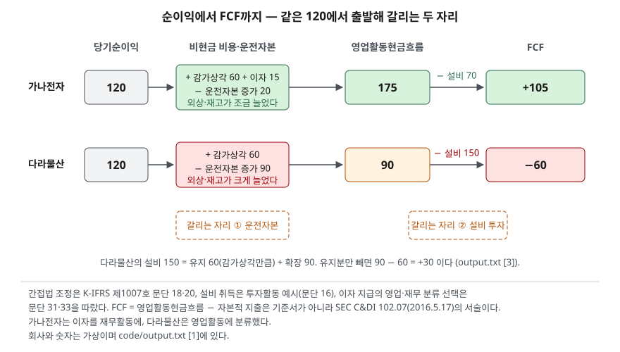

> 예제의 `가나전자`·`다라물산`과 그 숫자는 계산을 보이려고 만든 가상 자료다. 법인세의 현금 납부 시점 차이는 없다고 두었다.

## 들어가며

증권사 리포트나 회사 IR 자료에 "FCF 창출력이 개선됐다"는 문장이 나와서 그 숫자를 재무제표에서 찾아보면, 현금흐름표 어디에도 잉여현금흐름이라는 줄이 없다. 그래서 대부분은 포털 재무 탭이 보여 주는 FCF 값을 그대로 가져다 다른 회사의 값 옆에 놓는다. 그런데 그 값이 어느 항목을 더하고 뺀 것인지는 화면에 없고, 회사가 IR에서 발표한 FCF와 포털의 FCF가 수십 % 다른 일도 흔하다. 어느 숫자가 맞는지를 따지기 전에, 이 지표가 애초에 기준서 밖에서 각자 정의해 쓰는 숫자라는 것을 알아야 비교가 성립한다.

## 개념

### 기준서에는 없는 숫자

현금흐름표 기준서는 영업·투자·재무 세 활동의 합계까지만 정한다(K-IFRS 제1007호 문단 10). 잉여현금흐름은 이 기준서 어디에도 없다. 유럽 증권시장감독청(ESMA)은 2015년 10월 5일 낸 대체성과지표(APM) 가이드라인에서 APM을 "적용되는 재무보고체계가 정의하거나 명시한 재무 측정치가 아닌, 과거 또는 미래의 재무성과·재무상태·현금흐름의 재무 측정치"로 정의했고, 2016년 7월 3일 이후 공시되는 지표부터 적용했다. 기준서에 없는 현금흐름 측정치인 FCF는 이 정의에 그대로 들어간다.

미국 증권거래위원회(SEC)는 2016년 5월 17일 해석(C&DI 102.07)에서 FCF를 이름 그대로 다뤘다. 영업활동현금흐름에서 자본적 지출을 뺀 값을 FCF로 제시하는 것은 금지되지 않지만, 계산 방법을 명확히 설명하고 조정표를 붙여야 하며, 이 값이 재량적 지출에 쓸 수 있는 잔여 현금을 뜻한다고 부적절하게 암시해서는 안 된다는 내용이다. 두 감독기관이 같은 말을 한다. 써도 되지만 **정의를 밝히고 재무제표 숫자와 이어 보여라.**

### 가장 흔한 정의

```text
FCF = 영업활동현금흐름 − 유형·무형자산 취득 지출
```

영업활동현금흐름은 본업에서 들어오고 나간 현금의 순액이고, 운전자본 변동과 법인세 납부가 이미 반영돼 있다. 유형·무형자산 취득 지출은 투자활동 현금흐름의 첫 번째 예시 항목이다(문단 16). 그래서 FCF는 "본업에서 번 현금 가운데 설비를 사는 데 쓰고 남은 금액"이 된다. 남은 돈은 빚을 갚거나 배당·자기주식에 쓰거나 현금으로 쌓인다. 순이익이 발생주의로 계산된 값이라면 FCF는 그 이익이 실제로 손에 남은 현금으로 바뀌었는지를 묻는 값이다.

## 구조



> **출처**: [K-IFRS 제1007호 현금흐름표 — 문단 16 투자활동 예시, 18·20 간접법, 31·33 이자 분류](https://accountingwiki.co.kr/standards/1007) (제3자 전재) · [SEC, Non-GAAP Financial Measures C&DI — Question 102.07 (2016-05-17)](https://www.sec.gov/corpfin/non-gaap-financial-measures). 숫자는 이 글의 [`code/output.txt`](code/output.txt) `[1]`·`[3]`에 있다.

순이익 칸은 같은 120이고 FCF 칸은 +105와 −60이다. 그 사이에서 갈리는 자리는 둘뿐이다. 영업활동현금흐름을 만드는 운전자본 조정과, 거기서 빼는 설비 취득이다. 어느 쪽이 숫자를 끌었는지에 따라 같은 −60도 뜻이 달라진다.

## 동작 원리

### 갈리는 자리 ① 운전자본 — 번 돈이 외상과 재고에 묶인다

간접법은 당기순손익에서 출발해 재고자산과 영업 관련 채권·채무의 변동, 감가상각비 같은 비현금 항목을 조정해 영업활동 순현금흐름을 구한다(문단 20). 감가상각은 현금이 나가지 않은 비용이라 더하고, 매출채권과 재고의 증가는 팔았지만 못 받은 돈과 사 두고 못 판 물건이라 뺀다. 다라물산은 매출채권이 60, 재고가 30 늘어 순이익 120 가운데 90이 아직 현금이 아니다. 가나전자는 둘을 합쳐 20만 늘었다. 이 조정이 [이익은 나는데 돈이 없는](../../statements/2026-09-30-cash-flow-profit-without-cash/index.md) 구조를 숫자로 드러내는 자리다.

### 갈리는 자리 ② 설비 투자 — 유지인가 확장인가

영업활동현금흐름에서 빼는 설비 취득은 크기만으로는 읽히지 않는다. 다라물산의 150은 가나전자의 70보다 두 배 넘게 크지만, 그 150이 낡은 설비를 바꾼 것인지 새 공장을 지은 것인지에 따라 FCF −60의 뜻이 달라진다. 기준서는 영업능력의 증대를 나타내는 현금흐름과 영업능력의 유지에 필요한 현금흐름을 구분해 공시하면 이용자가 기업이 유지를 위해 적절히 투자하는지 판단하는 데 유용하다고 권고한다(문단 51). 의무가 아니라 권고라서 대부분 회사는 나누지 않는다. 밖에서 볼 때는 그해 감가상각비를 유지 투자의 근사치로 두는 방법이 있다. 닳은 만큼 다시 산다는 가정이다. [감가상각 글](../../statements/2026-09-30-depreciation-non-cash-expense/index.md)에서 본 대로 감가상각비는 과거 취득원가 기준이라 물가가 오르면 유지 투자를 작게 잡는 쪽으로 치우친다.

### 정의가 세 가지면 숫자도 셋

같은 회사라도 FCF 정의에 따라 값이 달라지는 자리가 두 곳 더 있다.

| 정의 | 식 | 달라지는 이유 |
|---|---|---|
| A | 영업CF − 설비 취득 | SEC 해석이 서술한 형태. 가장 흔하다 |
| B | 영업CF − (설비 취득 − 설비 처분 수입) | 투자활동을 순액으로 본다. 자산을 판 해에 FCF가 커진다 |
| C | (영업CF − 이자 지급) − 설비 취득 | 이자를 재무활동에 넣은 회사를 영업활동에 넣은 회사와 맞출 때 |

C가 필요한 이유는 기준서가 이자 지급의 분류를 회사에 맡기기 때문이다. 이자와 배당금의 수취·지급은 각각 별도로 공시하되 매 기간 일관성 있게 영업·투자·재무 중 하나로 분류하고(문단 31), 금융회사가 아닌 업종에서는 이자 지급의 분류에 합의가 없다(문단 33). 예제에서 가나전자는 이자 15를 재무활동에, 다라물산은 영업활동에 넣었다. 정의 A로 두 회사를 비교하면 가나전자의 영업활동현금흐름이 분류 차이만으로 15 높다. 2027년 1월 1일 이후 시작하는 회계연도부터 적용되는 K-IFRS 제1118호가 이자·배당 현금흐름의 분류 요건을 새로 정하므로, 기준 전환 연도를 끼고 비교할 때는 분류가 바뀌었는지 먼저 본다.

리스도 같은 자리다. 2019년 1월 1일 이후 시작 회계연도부터 적용된 리스 기준서는 리스부채의 원금 상환을 재무활동으로 분류하게 한다(K-IFRS 제1116호 문단 50). 그 전에는 운용리스료 전액이 영업활동에서 빠졌으므로, 리스가 많은 회사는 기준 도입 전후로 영업활동현금흐름이 거래 내용 변화 없이 올라갔다. 정의 A의 FCF도 같이 올라간다.

## 실습 예제

두 회사의 영업활동현금흐름을 간접법으로 쌓고 설비 취득을 뺐다. 금액 단위는 억원이다. 전체 소스: [`code/`](code/) · 수행 기록: [`code/output.txt`](code/output.txt)

```text
[1] 영업활동현금흐름(간접법)에서 FCF 까지
  항목                          가나전자      다라물산
  당기순이익                            120         120
  + 감가상각비                           60          60
  − 매출채권 증가                        -10         -60
  − 재고자산 증가                        -10         -30
  + 이자 지급(재무로 분류 시)                 15           0
  = 영업활동현금흐름                       175          90
  − 유형자산 취득                        -70        -150
  = FCF                            105         -60

  영업활동현금흐름 ÷ 순이익                  1.46        0.75
  FCF ÷ 순이익                       0.88       -0.50
```

영업활동현금흐름을 순이익으로 나눈 비율은 이익이 현금으로 얼마나 바뀌었는지를 한 숫자로 보여 준다. 감가상각 같은 비현금 비용이 있으면 1을 넘는 것이 보통이고, 다라물산처럼 1 아래로 내려가면 이익의 상당 부분이 외상과 재고에 묶여 있다는 뜻이다. 가나전자의 1.46에는 이자를 재무활동에 넣은 효과 15가 들어 있다. 영업활동에 넣었다면 160 ÷ 120 = 1.33이다.

```text
[2] 같은 가나전자, 세 가지 FCF 정의
  A  영업CF − 설비 취득                      175 − 70 = 105
  B  영업CF − (설비 취득 − 처분 수입)         175 − (70 − 20) = 125
  C  (영업CF − 이자 지급) − 설비 취득        (175 − 15) − 70 = 90
```

한 회사의 한 해 FCF가 90에서 125까지 움직인다. 가장 큰 값과 가장 작은 값의 차이가 39%다. 포털·리포트·회사 IR이 서로 다른 정의를 쓰면 이 폭 안에서 숫자가 어긋나는데, 어느 쪽도 틀린 계산이 아니다. 비교하려면 같은 정의로 다시 계산하는 수밖에 없다.

```text
[3] 설비 투자를 유지분과 확장분으로 나누면 (K-IFRS 제1007호 문단 51)
  회사          영업CF     유지 투자     확장 투자    유지 후 FCF    확장 후 FCF
  가나전자         175          60          10           115           105
  다라물산          90          60          90            30           -60
```

다라물산의 FCF −60은 유지 투자 60을 뺀 뒤에는 +30이다. 본업이 설비 유지비를 감당하고도 30이 남았고, 그 위에 확장 투자 90을 얹었기 때문에 음수가 됐다. 같은 −60이라도 영업활동현금흐름이 40이고 설비 취득이 100인 회사라면 유지 투자조차 못 대는 것이다. 겉으로 같은 FCF를 유지 투자 기준으로 한 번 더 나눠야 두 경우가 구분된다. 확장 투자가 몇 년 뒤 영업활동현금흐름을 키우는지는 [현금흐름 세 갈래 글](../../statements/2026-09-30-cash-flow-three-activities/index.md)에서 본 성장기 조합과 같은 방법으로 이후 연도를 따라가며 확인한다.

## 실무에서 주의할 점

- **출처가 다른 FCF를 한 표에 놓지 않는다.** 포털, 증권사 리포트, 회사 IR은 각자의 정의로 계산한다. 회사가 공시 자료에 FCF를 적었으면 정의와 조정표가 같이 있어야 하고(ESMA 가이드라인·SEC 해석), 없으면 현금흐름표에서 직접 다시 계산한다.
- **음수 FCF를 바로 나쁜 신호로 읽지 않는다.** 확장 투자 때문인지 영업활동현금흐름이 약해서인지를 유지 투자 기준으로 나눠 본다. 다만 확장 투자로 음수가 된 회사는 그 돈을 밖에서 끌어왔다는 뜻이므로, 재무활동 현금흐름과 부채 변화를 같이 본다.
- **영업활동현금흐름 ÷ 순이익이 1 아래로 여러 해 이어지면 이익의 질을 의심한다.** 한 해는 재고를 미리 쌓거나 대금 회수가 늦어져 그럴 수 있다. 3년 넘게 이어지면 매출채권과 재고의 회전일수가 길어지고 있는지 [앞 글](../../statements/2026-10-01-receivables-inventory-turnover/index.md)의 방법으로 확인한다.
- **이자·리스 분류를 확인한다.** 이자 지급을 재무활동에 넣은 회사와 영업활동에 넣은 회사를 정의 A로 비교하면 분류 차이가 그대로 FCF 차이로 보인다. 2019년 리스 기준서 도입, 2027년 제1118호 적용처럼 분류 규정이 바뀌는 연도를 끼고 추세를 볼 때는 전후 숫자가 같은 기준인지 먼저 본다.
- **FCF가 전부 주주 몫은 아니다.** SEC 해석이 경고하듯 FCF는 재량적으로 쓸 수 있는 잔여 현금이 아니다. 만기가 돌아오는 차입금 상환은 재무활동에 있어 FCF 계산에서 빠져 있다. FCF가 양수여도 그해 갚을 빚이 더 크면 현금은 준다.

## 정리

- FCF는 회계기준서가 정의한 항목이 아니라 회사·기관이 각자 정의해 쓰는 대체성과지표다. ESMA와 SEC 모두 정의와 조정표를 요구한다.
- 가장 흔한 정의는 영업활동현금흐름에서 유형·무형자산 취득 지출을 뺀 값이고, 순이익이 같아도 운전자본과 설비 투자에서 갈린다.
- 설비 처분 수입을 상계하는지, 이자 지급을 어디에 분류하는지에 따라 같은 회사의 FCF가 수십 % 움직인다.
- 음수 FCF는 유지 투자 기준으로 한 번 더 나눠 확장 투자 때문인지 영업활동현금흐름이 약해서인지를 가른다.

## 참고 자료

- [한국회계기준원 — 시행 중인 K-IFRS 기준서 목록](https://www.kasb.or.kr/front/board/ingAccountingList.do) — 기준서 원문 발행처. 아래 전재 사이트는 문단을 바로 열기 위한 편의 링크다
- [IFRS Foundation — IAS 7 Statement of Cash Flows](https://www.ifrs.org/issued-standards/list-of-standards/ias-7-statement-of-cash-flows/) — 세 활동 정의, IFRS 18에 따른 이자·배당 분류 개정 안내
- [K-IFRS 제1007호 현금흐름표 — 문단 10 활동 구분, 16 투자활동 예시, 18·20 간접법, 31·33·34 이자·배당 분류, 51 영업능력 유지·증대 구분 공시](https://accountingwiki.co.kr/standards/1007) (제3자 전재)
- [K-IFRS 제1116호 리스 — 문단 50 리스이용자의 현금흐름 분류](https://accountingwiki.co.kr/standards/1116) (제3자 전재)
- [ESMA, Guidelines on Alternative Performance Measures (ESMA/2015/1415, 2015-10-05)](https://www.esma.europa.eu/document/esma-guidelines-alternative-performance-measures) — APM 정의, 2016-07-03 이후 적용. [보도자료](https://www.esma.europa.eu/press-news/esma-news/esma-publishes-final-guidelines-alternative-performance-measures)
- [SEC, Non-GAAP Financial Measures — Compliance and Disclosure Interpretations, Question 102.07 (2016-05-17)](https://www.sec.gov/corpfin/non-gaap-financial-measures) — 영업활동현금흐름에서 자본적 지출을 뺀 FCF 제시 허용, 계산 방법 설명과 조정표 요구
- [금융위원회 보도자료 — 27년부터 K-IFRS 손익계산서가 변경 (2025-12-18)](https://www.fsc.go.kr/no010101/85886) — 제1118호 적용 시기
