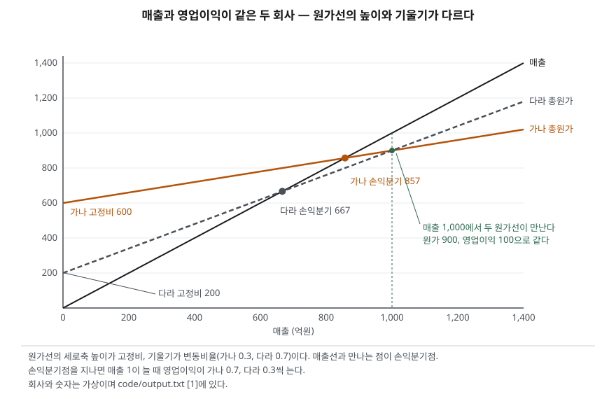

> 예제의 `가나전자`·`다라물산`과 그 숫자는 계산을 보이려고 만든 가상 자료다. 판매 단가와 단위당 변동비는 매출 규모와 무관하게 일정하다고 두었다.

## 들어가며

같은 업종의 두 회사가 작년에 매출도 영업이익도 거의 같았는데, 올해 매출이 둘 다 10%쯤 줄자 한 회사는 영업이익이 30% 줄고 다른 회사는 70% 줄어드는 경우가 있다. 이때 흔히 뒤쪽 회사가 그해 경영을 잘못했다고 읽거나, 일회성 비용이 있었는지 손익계산서를 한 줄씩 뒤진다. 그런데 두 회사의 비용이 매출에 따라 줄어드는 비용인지, 매출과 상관없이 나가는 비용인지만 달라도 이 차이는 그대로 나온다. 원가 구조를 알면 매출 10% 변화가 영업이익을 몇 % 흔들지 결산 전에 계산할 수 있다.

## 개념

### 변동비와 고정비, 그리고 공헌이익

변동비는 매출에 비례해 늘고 줄어드는 원가다. 원재료비, 판매수수료가 대표적이다. 고정비는 일정 범위 안에서 매출과 무관하게 나가는 원가다. 설비 감가상각비, 정규직 인건비, 임차료가 여기에 든다. 매출에서 변동비를 뺀 것을 공헌이익이라 한다. 공헌이익이 먼저 고정비를 메우고, 메우고 남은 부분이 영업이익이 된다.

### 손익분기점과 안전한계

손익분기 매출은 공헌이익이 고정비와 같아져 영업이익이 0이 되는 매출이다. 고정비를 공헌이익률(1 − 변동비율)로 나누면 나온다. 현재 매출에서 손익분기 매출을 뺀 것이 안전한계이고, 그것을 현재 매출로 나눈 비율이 안전한계율이다. 매출이 얼마나 줄어야 적자가 되는지를 나타낸다.

### 영업레버리지도(DOL)

영업레버리지도는 공헌이익을 영업이익으로 나눈 값이고, 매출 변화율에 이 값을 곱하면 영업이익 변화율이 나온다. OpenStax 관리회계 교재는 이 식을 그대로 쓰고, 같은 회사라도 매출 수준이 달라지면 DOL도 달라진다고 적는다. 고정비가 0이면 공헌이익과 영업이익이 같아 DOL은 1이다. 고정비가 클수록 영업이익이 공헌이익보다 많이 작아져 DOL이 커진다.

## 구조



> **출처**: [OpenStax, Principles of Accounting Volume 2: Managerial Accounting — 3.5 Calculate and Interpret a Company's Margin of Safety and Operating Leverage](https://openstax.org/books/principles-managerial-accounting/pages/3-5-calculate-and-interpret-a-companys-margin-of-safety-and-operating-leverage). 숫자는 이 글의 [`code/output.txt`](code/output.txt) `[1]`에 있다.

두 원가선은 매출 1,000에서 만난다. 그 점만 보면 두 회사는 구별되지 않는다. 차이는 그 점을 벗어날 때 드러난다. 가나전자의 원가선은 높은 곳에서 낮은 기울기로 출발해 매출이 늘어도 원가가 조금만 늘고, 매출이 줄어도 원가가 조금만 준다. 매출선과의 간격, 곧 영업이익이 빠르게 벌어지고 빠르게 좁혀진다.

## 동작 원리

### DOL과 안전한계율은 서로 역수다

공헌이익을 영업이익으로 나눈 값과 1을 안전한계율로 나눈 값은 대수적으로 같다. 영업이익은 공헌이익률에 안전한계를 곱한 값이고, 공헌이익은 공헌이익률에 매출을 곱한 값이기 때문이다. 그래서 손익분기점에 가까이 있는 회사일수록 DOL이 크다. 매출이 손익분기점 바로 위에 있으면 영업이익이 0에 가까워 DOL이 아주 커지고, 손익분기점에서 멀어질수록 1에 가까워진다.

### 손익계산서에서 고정비가 바로 보이지 않는다

K-IFRS 제1001호는 당기손익에 인식한 비용을 성격별 또는 기능별 가운데 더 목적적합한 방법으로 분석해 표시하게 한다(문단 99). 성격별은 원재료비·종업원급여·감가상각비처럼 무엇에 쓴 돈인지로, 기능별은 매출원가·판매비와관리비처럼 어느 활동에 쓴 돈인지로 나눈다. 어느 쪽이든 고정비·변동비 구분은 아니다. 매출원가 안에는 원재료비와 공장 감가상각비가 함께 들어 있다.

기능별로 분류한 회사는 감가상각비, 기타 상각비, 종업원급여비용을 포함한 비용의 성격 정보를 추가로 공시해야 한다(문단 104). 고정비 성격이 강한 항목의 금액을 주석에서 찾을 수 있는 근거가 이 문단이다. 2027년 1월 1일 이후 시작하는 회계연도부터 적용되는 IFRS 18(K-IFRS 제1118호)은 기능별로 표시한 기업에 감가상각비·상각비·종업원급여·손상차손·재고자산 평가손실의 총액을 한 주석에 모아 공시하게 한다(문단 83). 주석에서 찾을 수 있는 항목이 늘지만, 그것들이 고정비인지 변동비인지는 여전히 분석하는 사람이 판단해야 한다.

## 실습 예제

전체 소스: [`code/`](code/) · 수행 기록: [`code/output.txt`](code/output.txt)

```text
[1] 원가 구조 — 매출 1,000 에서
  회사           변동비     고정비     공헌이익     영업이익     손익분기 매출      안전한계     안전한계율    DOL
  가나전자           300       600        700        100          857.1       142.9       14.3%      7.0
  다라물산           700       200        300        100          666.7       333.3       33.3%      3.0
  DOL = 공헌이익 ÷ 영업이익,  안전한계율 = (매출 − 손익분기 매출) ÷ 매출
  가나전자: 1 ÷ 안전한계율 0.1429 = 7.00  (DOL 과 같다)
  다라물산: 1 ÷ 안전한계율 0.3333 = 3.00  (DOL 과 같다)
```

가나전자는 매출이 14.3%만 줄어도 적자가 되고, 다라물산은 33.3%까지 버틴다. 같은 영업이익 100이지만 그 100이 얼마나 쉽게 사라지는지가 다르다.

```text
[2] 매출이 ±10% 움직일 때 영업이익
  회사            매출      영업이익      변화율      DOL × 매출 변화율
  가나전자           900          30       -70%            -70%
  가나전자         1,100         170       +70%            +70%
  다라물산           900          70       -30%            -30%
  다라물산         1,100         130       +30%            +30%
```

(출력에서 매출 1,000 행은 뺐다.) 단위당 변동비가 일정하다는 가정 아래서는 DOL로 예측한 변화율과 실제 변화율이 정확히 맞는다. 늘 때도 줄 때도 같은 배율이 걸린다는 점이 중요하다. 가나전자는 매출이 늘면 이익이 크게 늘지만, 같은 크기로 줄면 그만큼 크게 준다.

```text
[3] 매출 수준별 DOL — 손익분기점에 가까울수록 커진다
  매출               700       900     1,000     1,200     1,500
  가나전자            적자       21.0        7.0        3.5        2.3
  다라물산           21.0        3.9        3.0        2.2        1.8
```

DOL은 회사에 붙은 고정된 숫자가 아니다. 가나전자가 매출 900일 때는 DOL이 21이어서 거기서 매출이 1%만 더 줄어도 영업이익이 21% 준다. 매출 1,500에서는 2.3까지 내려간다.

```text
[4] 가나전자 기능별 손익계산서 — 매출 1,000
  항목              금액   (안에 섞인 고정비    변동비)
  매출             1,000
  매출원가             620   (     400       220)
  판관비              280   (     200        80)
  영업이익             100
  표에는 왼쪽 금액만 나온다 — 괄호 안 구분은 회사 내부 원가 자료에만 있다
  매출원가율 62% 를 변동비율로 잘못 두면 DOL = 380 ÷ 100 = 3.8   (실제 7.0)
```

공시되는 손익계산서에는 왼쪽 금액만 있다. 매출원가를 전부 변동비로 보면 DOL은 실제의 절반 남짓으로 계산된다. 이 계산은 판관비 280을 고정비로 둔 셈인데, 매출원가 620 안의 고정비 400은 변동비로 들어가고 판관비 안의 변동비 80은 반대로 고정비로 들어간다. 고정비가 600이 아니라 280으로 잡히는 것이다.

```text
[5] 성격별 주석(문단 104)으로 고정비 어림하기
  주석 공시 감가상각비      260
  주석 공시 종업원급여      250
  어림 고정비 510 (실제 600, 임차료·보험료 90 이 빠짐)
  어림 DOL = (영업이익 100 + 고정비 510) ÷ 100 = 6.1   실제 DOL 7.0
```

주석의 감가상각비와 종업원급여를 고정비로 보면 실제에 꽤 가까워진다. 예제는 종업원급여를 전부 고정비로 두었지만, 성과급이나 시간제 인건비 비중이 큰 회사라면 그 일부는 변동비다. 어림 고정비는 실제보다 작게도, 크게도 나올 수 있다.

```text
[6] 두 해 숫자로 DOL 거꾸로 추정 — 가나전자, 매출 1,000 → 1,100
  고정비 그대로 600              영업이익 100 → 170  추정 DOL = +70% ÷ +10% = 7.0
  이듬해 설비 증설로 고정비 640       영업이익 100 → 130  추정 DOL = +30% ÷ +10% = 3.0
```

두 해의 영업이익 변화율을 매출 변화율로 나누는 방법도 쓰인다. 원가 구조가 그대로면 맞지만, 그 사이 설비를 늘려 고정비가 40 오르면 추정 DOL은 3.0으로 나와 원가 구조가 전혀 다른 다라물산처럼 보인다.

## 실무에서 주의할 점

- **같은 영업이익률을 같은 위험으로 읽지 않는다.** 두 회사의 영업이익률은 똑같이 10%였지만 적자까지 남은 거리는 14.3%와 33.3%였다. [이자보상배율 글](../../ratios/2026-10-02-interest-coverage-ratio/index.md)에서 본 영업이익 대비 이자 부담도, 영업이익 자체가 매출에 얼마나 민감한지와 함께 봐야 실제 여유를 알 수 있다.
- **DOL은 현재 매출 수준에서만 성립한다.** [3]처럼 손익분기점 근처에서 DOL은 급격히 커진다. 영업이익이 아주 작은 해에 계산한 DOL은 숫자가 크게 나와도 그 자체로 원가 구조가 바뀐 것이 아니다.
- **고정비는 장기적으로 고정이 아니다.** 일정 범위를 넘는 매출 증가는 설비 증설을 부르고 고정비 계단이 올라간다. [6]처럼 두 해 숫자로 거꾸로 추정한 DOL은 그 기간에 고정비가 바뀌지 않았다는 가정에 기대고 있다. 유형자산 취득과 감가상각비 증가는 [현금흐름표의 투자활동](../../statements/2026-09-30-cash-flow-three-activities/index.md)과 주석에서 확인한다.
- **매출원가율을 변동비율로 쓰지 않는다.** 기능별 분류의 매출원가에는 공장 감가상각비와 생산직 인건비 같은 고정비가 들어 있다. 제조업처럼 설비 비중이 큰 업종일수록 이렇게 계산한 DOL은 실제보다 작게 나온다.
- **영업레버리지와 재무레버리지는 다른 것이다.** 영업레버리지는 원가 구조에서, 재무레버리지는 이자 비용에서 온다. 둘이 겹치면 매출 변화가 순이익을 더 크게 흔든다. [듀퐁 분해 글](../../ratios/2026-10-02-dupont-roe-three-factors/index.md)의 레버리지는 재무레버리지 쪽이다.

## 정리

- 공헌이익(매출 − 변동비)이 고정비를 메우고 남은 부분이 영업이익이다. 공헌이익과 고정비가 같아지는 매출이 손익분기점이다.
- 영업레버리지도(DOL)는 공헌이익 ÷ 영업이익이고, 매출 변화율에 DOL을 곱하면 영업이익 변화율이 된다. DOL은 안전한계율의 역수와 같다.
- 고정비 비중이 크면 DOL이 커져 매출이 늘 때도 줄 때도 영업이익이 크게 움직인다. DOL은 매출 수준에 따라 달라진다.
- 손익계산서는 성격별·기능별로 나뉠 뿐 고정·변동으로 나뉘지 않는다. 주석의 성격별 정보(제1001호 문단 104)로 어림할 수 있지만 오차가 남는다.

## 참고 자료

- [OpenStax, Principles of Accounting Volume 2: Managerial Accounting — 3.5 Calculate and Interpret a Company's Margin of Safety and Operating Leverage](https://openstax.org/books/principles-managerial-accounting/pages/3-5-calculate-and-interpret-a-companys-margin-of-safety-and-operating-leverage) — 안전한계, 영업레버리지도 식과 매출 수준에 따라 DOL이 달라진다는 설명
- [한국회계기준원 — 시행 중인 K-IFRS 기준서 목록](https://www.kasb.or.kr/front/board/ingAccountingList.do) — 기업회계기준서 제1001호 재무제표 표시 원문 발행처. 아래 전재 사이트는 문단을 바로 열기 위한 편의 링크다
- [K-IFRS 제1001호 재무제표 표시 — 문단 99 비용의 분석 표시, 104 기능별 분류 시 성격 정보 공시](https://accountingwiki.co.kr/standards/1001) (제3자 전재)
- [IFRS Foundation — IFRS 18 Presentation and Disclosure in Financial Statements](https://www.ifrs.org/issued-standards/list-of-standards/ifrs-18-presentation-and-disclosure-in-financial-statements/) — 2027-01-01 이후 시작하는 회계연도부터 적용
- [BDO, More disclosure when presenting operating expenses by function under IFRS 18](https://www.bdo.com.au/en-au/blogs/corporate-reporting/more-disclosure-when-presenting-operating-expenses-by-function-under-ifrs-18) — IFRS 18 문단 83의 성격별 비용 공시 항목 정리
