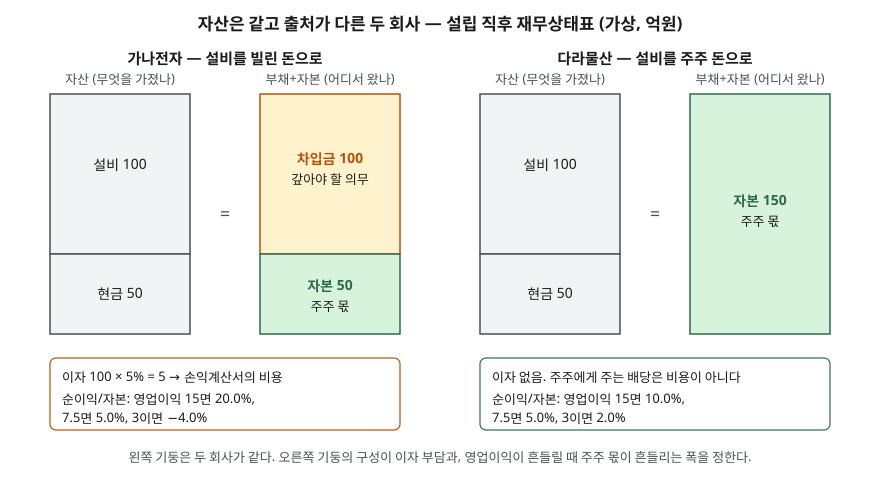

> 예제의 회사 `가나전자`·`다라물산`과 모든 숫자는 계산 원리를 보이려고 만든 가상 값이다. 실제 기업과 관계가 없다.

## 들어가며

회사 소개 자료에서 "총자산 1조 원"이라는 문장을 보면 큰 회사라는 인상이 먼저 든다. 그런데 같은 1조라도 그중 8천억이 은행에서 빌린 돈인 회사와, 전부 주주가 낸 돈과 벌어서 쌓은 돈인 회사는 사정이 전혀 다르다. 재무상태표 왼쪽의 자산 합계만 보고 두 회사를 같은 크기로 놓으면, 매년 나가야 하는 이자와 영업이 나빠졌을 때 주주 몫이 줄어드는 폭을 놓친다. 재무상태표는 오른쪽, 즉 그 자산이 어디서 왔는지를 같이 읽어야 한다.

## 개념

재무보고를 위한 개념체계(2018년 개정, 국내 2019년 4월 의결)는 재무상태표의 세 요소를 이렇게 정의한다.

| 요소 | 정의 (개념체계 문단) | 한 줄로 |
|---|---|---|
| 자산 | 과거사건의 결과로 기업이 통제하는 현재의 경제적자원 (4.3) | 무엇을 가졌나 |
| 부채 | 과거사건의 결과로 기업이 경제적자원을 이전해야 하는 현재의무 (4.26) | 누구에게 갚아야 하나 |
| 자본 | 기업의 자산에서 모든 부채를 차감한 후의 잔여지분 (4.63) | 갚고 남는 주주 몫 |

자본의 정의가 핵심이다. 자본은 따로 측정되는 금액이 아니라 **자산에서 부채를 뺀 나머지**로 정의된다. 그러니 `자산 = 부채 + 자본`은 관찰해서 알아낸 법칙이 아니라 정의에서 바로 나오는 항등식이다. 왼쪽은 회사가 가진 자원이고, 오른쪽은 그 자원에 대한 청구권을 채권자 몫과 주주 몫으로 나눈 것이다.

## 구조



> **출처**: [재무보고를 위한 개념체계 — 문단 4.3 자산, 4.26 부채, 4.63 자본의 정의](https://www.samili.com/acc/Kijun/Kijunjomun.asp?code=316-1) · [K-IFRS 제1032호 금융상품: 표시 — 문단 35 이자·배당의 회계처리](https://www.samili.com/acc/IfrsKijun.asp?bCode=1978-1032)

두 회사 모두 왼쪽 기둥은 설비 100과 현금 50으로 같다. 오른쪽 기둥에서 가나전자는 차입금 100과 자본 50, 다라물산은 자본 150이다. 막대 높이는 금액에 비례하게 그렸다.

## 동작 원리

### 거래가 양쪽을 같은 만큼 움직인다

복식부기에서 거래 하나는 계정 두 곳 이상을 같은 금액만큼 움직인다. 그 움직임은 네 가지 모양 중 하나다.

| 모양 | 예 | 왼쪽(자산) | 오른쪽(부채+자본) |
|---|---|---|---|
| 양쪽이 함께 는다 | 차입, 주주 출자 | + | + |
| 양쪽이 함께 준다 | 차입금 상환, 배당 지급 | − | − |
| 왼쪽 안에서 바뀐다 | 현금으로 설비 구입 | + 와 − | 변화 없음 |
| 오른쪽 안에서 바뀐다 | 차입금을 주식으로 바꾸는 출자전환 | 변화 없음 | + 와 − |

어느 모양이든 양쪽의 변동액이 같으므로, 0에서 시작한 장부는 거래를 몇 건 쌓아도 균형이 유지된다. 한쪽만 움직이는 거래는 기록 방식상 존재할 수 없다.

### 출처가 손익계산서에 남기는 흔적

부채와 자본은 재무상태표에서는 나란히 놓이지만 손익계산서에서는 다르게 처리된다. 금융상품 표시 기준의 이자·배당 조항(K-IFRS 제1032호 문단 35)은 금융부채에 관련된 이자를 당기손익으로 인식하고, 지분상품 보유자에게 하는 분배는 자본에서 직접 차감하도록 한다. 빌린 돈의 대가인 이자는 비용이 되어 순이익을 줄이고, 주주에게 주는 배당은 순이익을 계산한 뒤 이익잉여금에서 빠진다.

그래서 자산과 영업이익이 같아도 순이익은 부채가 많은 쪽이 작다. 반면 주주가 낸 돈 1원당 순이익, 즉 순이익을 자본으로 나눈 값은 부채가 많은 쪽이 더 크게 나올 수 있다. 어느 쪽이 되는지는 자산이 버는 수익률과 이자율 중 어느 쪽이 큰지로 갈린다.

## 실습 예제

두 회사를 설립하고, 거래마다 양쪽 변동액이 같은지 `assert`로 확인한 뒤 영업이익을 세 가지로 바꿔 한 해 결과를 계산했다. 이자율은 5%, 법인세는 계산을 단순하게 하려고 뺐다. 금액 단위는 억원이다.

전체 소스: [`code/`](code/) · 수행 기록: [`code/output.txt`](code/output.txt)

```text
[1] 설립 거래 — 거래마다 양쪽이 같은 만큼 움직인다
  가나 주주 출자       현금 +50, 자본금 +50                    자산 변동 +50 / 부채+자본 변동 +50
  가나 은행 차입       현금 +100, 차입금 +100                  자산 변동 +100 / 부채+자본 변동 +100
  가나 설비 구입       설비 +100, 현금 -100                   자산 변동 +0 / 부채+자본 변동 +0
  다라 주주 출자       현금 +150, 자본금 +150                  자산 변동 +150 / 부채+자본 변동 +150
  다라 설비 구입       설비 +100, 현금 -100                   자산 변동 +0 / 부채+자본 변동 +0

[2] 설립 직후 재무상태표 — 자산은 같고 오른쪽만 다르다
  가나전자   현금 50  설비 100  차입금 100  자본금 50           → 자산 150 = 부채 100 + 자본 50
  다라물산   현금 50  설비 100  자본금 150                   → 자산 150 = 부채 0 + 자본 150

[3] 한 해 영업 결과 — 이자율 5%, 영업이익만 바꿔 본다
  영업이익  회사      이자   순이익  영업이익/자산  순이익/자본  기말 자본
      15  가나전자         5      10        10.0%       20.0%        60
      15  다라물산         0      15        10.0%       10.0%       165
     7.5  가나전자         5     2.5         5.0%        5.0%      52.5
     7.5  다라물산         0     7.5         5.0%        5.0%     157.5
       3  가나전자         5      -2         2.0%       -4.0%        48
       3  다라물산         0       3         2.0%        2.0%       153

[4] 자산이 안 바뀌는 거래 — 차입금 30을 주식으로 바꾼다(출자전환)
  가나 출자전환        차입금 -30, 자본금 +30                   자산 변동 +0 / 부채+자본 변동 +0
  가나전자   현금 50  설비 100  차입금 70  자본금 80            → 자산 150 = 부채 70 + 자본 80
```

`[3]`에서 영업이익을 자산으로 나눈 값은 두 회사가 늘 같다. 같은 설비로 같은 영업을 했으니 당연하다. 갈리는 것은 순이익을 자본으로 나눈 값이다.

- 영업이익 15: 자산이 10.0%를 벌어 이자율 5%보다 높다. 가나전자는 빌린 100이 이자보다 더 벌어 온 차액이 주주 몫 50에 얹혀 20.0%가 된다
- 영업이익 7.5: 자산 수익률이 이자율과 같은 5.0%다. 두 회사가 똑같이 5.0%다
- 영업이익 3: 자산이 2.0%밖에 못 벌어 이자를 감당하지 못한다. 가나전자는 순손실 2로 자본이 50에서 48로 줄고, 다라물산은 자본이 153으로 는다

영업이익이 15에서 3으로 바뀔 때 다라물산의 순이익/자본은 10.0%에서 2.0%로 8.0%포인트 움직였고, 가나전자는 20.0%에서 −4.0%로 24.0%포인트 움직였다. 부채가 있으면 영업이익의 변동이 주주 몫 수익률에 더 큰 폭으로 옮겨진다.

`[4]`는 오른쪽 안에서만 바뀌는 거래다. 자산은 150 그대로인데 부채 70, 자본 80으로 구성이 바뀌었다. 자산 합계만 보면 이 변화는 드러나지 않는다.

## 실무에서 주의할 점

- **자산 합계로 회사 크기를 비교하지 않는다.** 예제의 두 회사는 자산이 150으로 같지만 매년 고정으로 나가는 이자가 5와 0으로 다르다. 오른쪽 기둥의 구성을 먼저 본다.
- **부채 비중의 "적정 수준"을 한 숫자로 정하지 않는다.** 설비가 많고 매출이 안정적인 업종과 재고·외상 거래가 많은 업종은 부채 구성이 다르다. 비교할 기준이 필요하면 한국은행 기업경영분석처럼 업종별로 공표된 집계를 쓴다. 이 비율은 뒤의 비율 분석 글에서 따로 다룬다.
- **자본은 시가가 아니다.** 자본은 장부상 자산에서 부채를 뺀 잔액이다. 시장에서 매겨지는 주식 가치(시가총액)와 같은 값이 아니고, 둘을 섞어 쓰면 계산이 틀어진다.
- **이자를 내는 부채만 부채가 아니다.** 부채의 정의는 경제적자원을 이전해야 하는 현재의무이므로 매입채무, 선수금, 충당부채처럼 이자가 붙지 않는 항목도 들어간다. 이자 부담을 볼 때는 차입금·사채처럼 이자가 붙는 부채를 따로 모아 본다.

## 정리

- 자본은 자산에서 부채를 뺀 잔여지분으로 정의되므로 `자산 = 부채 + 자본`은 항등식이다.
- 거래 하나는 양쪽을 같은 만큼 움직이거나 한쪽 안에서만 바꾸므로 균형이 깨지지 않는다.
- 부채의 이자는 비용으로 순이익을 줄이고, 주주에게 주는 배당은 자본에서 직접 빠진다.
- 자산이 버는 수익률이 이자율보다 높으면 부채가 주주 몫의 수익률을 키우고, 낮으면 반대로 더 크게 깎는다.

## 참고 자료

- [재무보고를 위한 개념체계 — 문단 4.3 자산, 4.26 부채, 4.63 자본의 정의](https://www.samili.com/acc/Kijun/Kijunjomun.asp?code=316-1) (기준 원문 게재)
- [K-IFRS 제1032호 금융상품: 표시 — 문단 35 이자·배당·손익의 회계처리](https://www.samili.com/acc/IfrsKijun.asp?bCode=1978-1032) (기준서 원문 게재)
- [IFRS Foundation — Conceptual Framework for Financial Reporting](https://www.ifrs.org/issued-standards/list-of-standards/conceptual-framework/)
- [IFRS Foundation — IAS 32 Financial Instruments: Presentation](https://www.ifrs.org/issued-standards/list-of-standards/ias-32-financial-instruments-presentation/)
