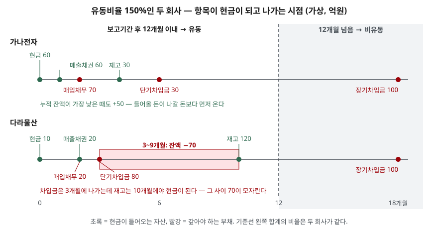

> 예제의 회사 `가나전자`·`다라물산`과 모든 숫자는 계산 원리를 보이려고 만든 가상 값이다. 실제 기업과 관계가 없다.

## 들어가며

재무상태표를 처음 펴 보면 자산과 부채가 각각 두 덩어리로 나뉘어 있다. 유동자산, 비유동자산, 유동부채, 비유동부채. 대부분은 이 구분을 건너뛰고 자산 총계와 부채 총계만 본다. 그런데 부채 100억이 전부 10년 뒤 만기인 회사와, 그중 80억을 석 달 안에 갚아야 하는 회사는 올해를 넘기는 문제부터 다르다. 총계만 보면 두 회사가 같아 보이고, 차이는 이 구분선에서만 드러난다.

## 개념

재무제표 표시 기준서(K-IFRS 제1001호)는 유동성 순서 배열이 더 목적적합한 경우가 아니면 재무상태표를 유동과 비유동으로 나눠 표시하도록 한다(문단 60). 판정 기준은 자산(문단 66)과 부채(문단 69)에 각각 네 가지씩 있다.

| | 유동으로 분류하는 경우 (하나라도 해당하면) |
|---|---|
| 자산 (문단 66) | ① 정상영업주기 내에 실현·판매·소비될 것으로 예상 ② 주로 단기매매 목적 보유 ③ 보고기간 후 12개월 이내 실현 예상 ④ 사용 제한 기간이 12개월 이상이 아닌 현금·현금성자산 |
| 부채 (문단 69) | ① 정상영업주기 내에 결제 예상 ② 주로 단기매매 목적 보유 ③ 보고기간 후 12개월 이내 결제 예정 ④ 기말 현재 12개월 넘게 결제를 미룰 권리가 없음 |

그 밖의 모든 자산과 부채는 비유동이다. 기준이 두 갈래라는 점을 봐 둔다. 하나는 **정상영업주기**로, 기준서는 영업에 쓸 자산을 사들인 때부터 그것이 현금으로 돌아올 때까지의 기간이라고 정의한다(문단 68). 다른 하나는 **보고기간 후 12개월**이라는 달력 기준이다. 영업주기가 뚜렷하지 않으면 12개월로 본다(문단 70).

왜 이렇게 나누는가. 재무상태표는 한 시점의 잔액표라서 언제 돈이 들어오고 나가는지가 드러나지 않는다. 유동·비유동 구분은 "앞으로 1년 안에 현금이 될 것"과 "1년 안에 갚아야 할 것"을 묶어서, 가장 단순한 형태로 시점 정보를 붙인다.

## 구조



> **출처**: [K-IFRS 제1001호 재무제표 표시 — 문단 60·66·68·69·70 유동과 비유동의 구분](https://accountingwiki.co.kr/standards/1001) (기준서 원문 게재)

가로축은 기말로부터 지난 개월 수다. 점선 왼쪽에 놓인 항목이 유동이다. 두 회사 모두 점선 왼쪽의 자산 합계는 150, 부채 합계는 100이다. 차이는 점선 안쪽에서 항목이 놓인 자리에 있다.

## 동작 원리

### 운전자본 항목은 달력보다 영업주기를 따른다

매입채무나 직원 급여 미지급비용처럼 영업 과정에서 계속 생기고 갚아지는 부채는, 결제일이 12개월 뒤에 오더라도 정상영업주기 안이면 유동으로 분류한다(문단 70). 같은 정상영업주기가 자산에도 적용되므로, 숙성에 2년이 걸리는 재고도 영업주기 안에서 팔 것이면 유동자산이다. 업종에 따라 유동자산 안에 1년 넘게 걸려 현금이 되는 항목이 섞일 수 있다는 뜻이다.

### 부채는 "미룰 권리"로 판정한다

부채의 네 번째 기준은 예상이 아니라 **권리**를 본다. 기말 현재 결제를 12개월 넘게 미룰 권리가 있으면 비유동, 없으면 유동이다. 여기서 시점이 중요하다. 만기가 12개월 안에 오는 금융부채는 기말 뒤 재무제표 발행승인 전에 장기 차환 약정을 맺었더라도 유동이다(문단 72). 기말 현재 그 권리가 없었기 때문이다. 기말 전에 장기차입 약정의 약정사항을 어겨 대여자가 즉시 상환을 요구할 수 있게 된 부채도 같은 이유로 유동이 된다(문단 74).

### 거래가 없어도 분류가 바뀐다

분류는 기말마다 새로 한다. 만기 18개월 차입금은 올해 기말에 비유동이지만, 아무 거래 없이 1년이 지나 만기가 6개월 남으면 유동으로 넘어온다. 회사가 한 일은 없는데 유동부채가 늘어 유동비율이 떨어진다.

## 실습 예제

두 회사의 항목마다 금액과 기말부터 현금화·결제까지 걸리는 개월 수를 두고, 위 기준대로 분류하는 함수를 짰다. 이어서 유동 항목만 놓고 달마다 남는 현금을 누적했다. 금액 단위는 억원이다.

전체 소스: [`code/`](code/) · 수행 기록: [`code/output.txt`](code/output.txt)

```text
[1] 기말 분류 — 두 회사 유동비율은 같다
  가나전자
    자산  현금          60     0개월  → 유동
    자산  매출채권        60     1개월  → 유동 (운전자본)
    자산  재고자산        30     4개월  → 유동 (운전자본)
    자산  설비         200       -  → 비유동
    부채  매입채무        70     2개월  → 유동 (운전자본)
    부채  단기차입금       30     6개월  → 유동
    부채  장기차입금      100    18개월  → 비유동
    유동자산 150 / 유동부채 100 = 유동비율 150%, 재고를 뺀 당좌비율 120%
  다라물산
    자산  현금          10     0개월  → 유동
    자산  매출채권        20     2개월  → 유동 (운전자본)
    자산  재고자산       120    10개월  → 유동 (운전자본)
    자산  설비         200       -  → 비유동
    부채  매입채무        20     2개월  → 유동 (운전자본)
    부채  단기차입금       80     3개월  → 유동
    부채  장기차입금      100    18개월  → 비유동
    유동자산 150 / 유동부채 100 = 유동비율 150%, 재고를 뺀 당좌비율 30%

[2] 유동 항목만 달별로 현금화·결제했을 때 남는 현금(누적)
  개월         0     1     2     3     4     5     6     7     8     9    10    11    12
  가나전자      60   120    50    50    80    80    50    50    50    50    50    50    50
          잔액이 가장 낮은 시점: 기말 후 2개월, 잔액 50
  다라물산      10    10    10   -70   -70   -70   -70   -70   -70   -70    50    50    50
          잔액이 가장 낮은 시점: 기말 후 3개월, 잔액 -70

[3] 거래 없이 1년이 지났다 — 장기차입금 만기가 18개월에서 6개월로
  가나전자 작년 기말: 장기차입금 18개월 → 비유동, 유동부채 100, 유동비율 150%
  가나전자 올해 기말: 장기차입금 6개월 → 유동, 유동부채 200, 유동비율 75%

[4] 만기 6개월 차입금 100의 분류 — 차환 약정을 언제 맺었나
  약정 없음                    → 유동
  기말 뒤·발행승인 전에 3년 차환 약정    → 유동
  기말 전에 3년 연장 권리 확보        → 비유동
```

`[1]`에서 두 회사의 유동비율은 150%로 같다. 그런데 다라물산의 유동자산 150 중 120이 재고라서, 재고를 뺀 당좌비율은 가나전자 120%, 다라물산 30%로 갈린다.

`[2]`가 그 차이를 시점으로 보여 준다. 가나전자는 매출채권이 1개월에 들어와서 2개월에 나갈 매입채무 70을 먼저 덮는다. 다라물산은 단기차입금 80이 3개월에 나가는데 재고 120은 10개월에야 현금이 된다. 3개월부터 9개월까지 70이 모자라고, 12개월 시점에는 두 회사 모두 50이 남는다. 12개월 합계로 보면 같은 회사가, 그 안의 순서 때문에 차환이나 추가 차입이 필요한 회사가 된다.

`[3]`은 거래가 하나도 없는데 유동비율이 150%에서 75%로 절반이 됐다. 장기차입금 100이 12개월 선을 넘어 들어왔을 뿐이다. `[4]`는 같은 만기 6개월짜리 차입금이라도 연장 권리를 기말 전에 확보했는지에 따라 분류가 갈리는 것을 보여 준다.

## 실무에서 주의할 점

- **유동비율 하나로 지급능력을 판단하지 않는다.** 예제의 두 회사는 유동비율이 같지만 한쪽은 석 달 뒤 70이 모자란다. 유동자산 안에서 재고 비중, 유동부채 안에서 차입금 비중을 따로 본다.
- **유동비율의 적정 수준을 한 숫자로 정하지 않는다.** 재고를 오래 들고 가는 업종과 현금 매출이 많은 업종은 유동 항목 구성부터 다르다. 비교가 필요하면 한국은행 기업경영분석처럼 업종별로 공표된 집계를 쓴다. 비율 자체는 뒤의 안정성 비율 글에서 따로 다룬다.
- **전년 대비 유동부채 증가가 곧 새 차입은 아니다.** 장기차입금이 만기 1년 안으로 들어오면 유동으로 넘어온다. 재무상태표에는 보통 `유동성장기부채` 같은 이름으로 따로 적히므로, 유동부채가 늘었으면 그 줄부터 확인한다.
- **12개월을 넘는 금액은 주석에 있다.** 유동으로 묶인 항목 안에 12개월 뒤 회수·결제될 금액이 섞여 있으면 그 금액을 공시하도록 되어 있다(문단 61). 운전자본 항목 때문에 유동이 달력 기준과 어긋나는 부분은 여기서 확인한다.

## 정리

- 유동·비유동은 정상영업주기와 보고기간 후 12개월, 두 기준으로 가른다. 자산·부채마다 판정 조건이 4가지씩이다.
- 운전자본 항목은 12개월을 넘겨도 영업주기 안이면 유동이고, 부채는 기말 현재 결제를 미룰 권리가 있는지로 판정한다.
- 분류는 기말마다 새로 하므로 거래가 없어도 만기가 다가오면 유동부채가 는다.
- 유동비율이 같아도 유동 항목이 현금이 되는 순서가 다르면 중간에 현금이 모자랄 수 있다.

## 참고 자료

- [K-IFRS 제1001호 재무제표 표시 — 문단 60~76 유동과 비유동의 구분](https://accountingwiki.co.kr/standards/1001) (기준서 원문 게재)
- [KIFRS.com — 제1001호 유동과 비유동의 구분](https://www.kifrs.com/s/1001/909fda)
- [IFRS Foundation — IAS 1 Presentation of Financial Statements](https://www.ifrs.org/issued-standards/list-of-standards/ias-1-presentation-of-financial-statements/)
