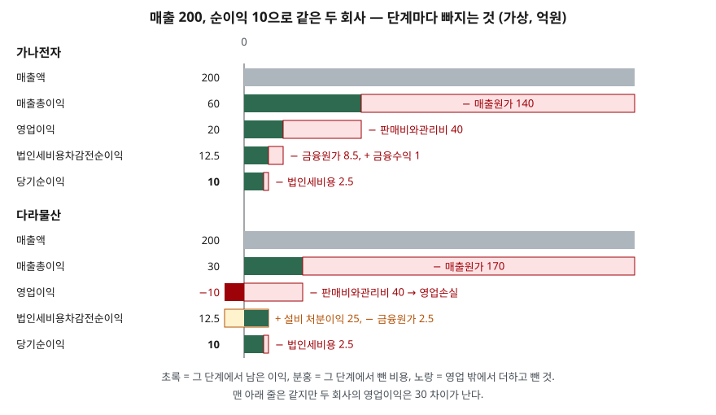

> 예제의 회사 `가나전자`·`다라물산`과 모든 숫자는 계산 원리를 보이려고 만든 가상 값이다. 실제 기업과 관계가 없다.

## 들어가며

실적 발표 기사는 대개 한 줄로 시작한다. "순이익 10억, 흑자 유지." 같은 해에 순이익 10억을 낸 회사가 둘 있으면 두 회사가 비슷하게 장사했다고 읽기 쉽다. 그런데 한 회사는 물건을 팔아서 20억을 벌고 이자로 일부를 냈고, 다른 회사는 물건을 팔아서 10억을 잃고 공장 부지를 팔아 메웠을 수 있다. 공장 부지는 내년에 또 팔 수 없다. 맨 아래 줄만 보면 이 차이는 사라지고, 손익계산서를 위에서부터 한 단계씩 내려와야 보인다.

## 개념

손익계산서는 한 기간 동안의 수익에서 비용을 차례로 빼 나가는 표다. 재무제표 표시 기준서(K-IFRS 제1001호)는 당기손익 부분에 수익, 금융원가, 법인세비용 등을 반드시 표시하도록 하고(문단 82), 비용은 성격별이나 기능별 중 더 목적적합한 방법으로 분류하게 한다(문단 99). 기능별 분류는 적어도 매출원가를 다른 비용과 떼어 적는다(문단 103).

국내에는 여기에 한국 추가 문단이 있다. 수익에서 매출원가와 판매비와관리비를 뺀 **영업이익**을 포괄손익계산서에 구분해 표시하도록 한다(문단 한138.2). 그래서 국내 손익계산서를 기능별로 읽으면 다음 다섯 단계가 된다.

| 단계 | 앞 단계에서 무엇을 뺐나 | 이 값으로 읽는 것 |
|---|---|---|
| 매출액 | — | 팔아서 받기로 한 금액 |
| 매출총이익 | 매출원가 (판 물건을 만들거나 사 온 원가) | 물건 하나에 남는 마진 |
| 영업이익 | 판매비와관리비 (영업·관리 조직을 굴리는 비용) | 본업이 돈을 버는가 |
| 법인세비용차감전순이익 | 기타수익·기타비용·금융수익·금융원가 | 본업 밖의 거래와 자금 조달까지 합친 결과 |
| 당기순이익 | 법인세비용 | 주주 몫으로 남은 이익 |

## 구조



> **출처**: [K-IFRS 제1001호 재무제표 표시 — 문단 82 당기손익 표시 항목, 103 기능별 분류, 한138.2 영업이익 구분 표시](https://accountingwiki.co.kr/standards/1001) (기준서 원문 게재)

위아래 두 회사 모두 매출액 200에서 시작해 당기순이익 10에서 끝난다. 막대 길이는 금액에 비례한다. 둘째 줄과 셋째 줄에서 두 회사의 막대가 크게 다르고, 넷째 줄에서 다시 같아진다.

## 동작 원리

### 매출총이익은 기능별 분류에서만 나온다

매출총이익은 매출원가를 따로 모아야 계산된다. 비용을 감가상각비·원재료·종업원급여처럼 성격별로 나누면 한 사람의 급여가 공장 일인지 영업 일인지 가르지 않으므로 매출원가가 만들어지지 않는다(문단 102). 기준서가 보여 주는 성격별 양식에는 매출총이익 줄이 없다. 반대로 기능별 분류는 비용을 매출원가와 판매·관리로 나누는 과정에 배분 판단이 들어간다고 기준서가 적어 두었다(문단 103). 같은 비용이 어느 줄로 가느냐에 따라 매출총이익이 달라질 수 있다는 뜻이다.

### 영업이익은 한국 기준이 따로 정한 선이다

국제회계기준 원문(IAS 1)에는 영업이익을 반드시 표시하라는 조항이 없다. 국내 기준은 이를 추가해 수익 − 매출원가 − 판매비와관리비로 정의했다. 이 정의에 따르면 설비를 팔아 생긴 차익이나 환율 변동 손익처럼 매출원가도 판관비도 아닌 항목은 영업이익 **밖**, 기타수익·기타비용에 들어간다. 기업이 그런 항목 일부를 영업성과로 보고 싶으면 주석에 `조정영업이익` 같은 이름으로 따로 공시할 수 있고, 이때는 회사가 자체 분류한 값이라는 사실을 함께 적어야 한다(문단 한138.4).

### 영업이익 아래는 본업 밖의 거래다

영업이익과 법인세비용차감전순이익 사이에는 두 종류가 들어간다. 하나는 기타수익·기타비용으로, 본업이 아닌 거래에서 생긴 손익이다. 다른 하나는 금융수익·금융원가로, 예금 이자와 차입금 이자 같은 자금 조달의 결과다. 앞 글에서 본 것처럼 부채가 많으면 이자가 이 구간에서 빠진다. 여기까지 내려오면 영업을 잘했는지와 돈을 어떻게 조달했는지가 한 숫자에 섞인다.

## 실습 예제

두 회사의 항목을 dict로 두고 다섯 단계를 차례로 계산했다. 법인세는 실제 세율과 무관하게 세전이익의 20%로 가정했고, 손실이 나도 같은 비율로 세금 효과를 잡았다. 금액 단위는 억원이다.

전체 소스: [`code/`](code/) · 수행 기록: [`code/output.txt`](code/output.txt)

```text
[2] 다섯 단계 — 남은 값과 매출액 대비 비율
  가나전자
    매출액                                200  (100.0%)
    매출총이익         − 매출원가                60  ( 30.0%)
    영업이익          − 판매비와관리비             20  ( 10.0%)
    법인세비용차감전순이익   ± 기타손익·금융손익         12.5  (  6.2%)
    당기순이익         − 법인세비용               10  (  5.0%)
  다라물산
    매출액                                200  (100.0%)
    매출총이익         − 매출원가                30  ( 15.0%)
    영업이익          − 판매비와관리비            -10  ( -5.0%)
    법인세비용차감전순이익   ± 기타손익·금융손익         12.5  (  6.2%)
    당기순이익         − 법인세비용               10  (  5.0%)

[3] 단계 사이 차이 — 두 회사가 어디서 갈렸나 (가나 − 다라)
  매출액                200     200   차이     +0
  매출총이익               60      30   차이    +30
  영업이익                20     -10   차이    +30
  법인세비용차감전순이익       12.5    12.5   차이     +0
  당기순이익               10      10   차이     +0

[4] 내년에 설비 처분이 없다면 — 다른 항목은 그대로 두고 기타수익만 0으로
  다라물산 영업이익               -10
  다라물산 법인세비용차감전순이익      -12.5
  다라물산 당기순이익              -10
```

항목 표(`[1]`)는 [`code/output.txt`](code/output.txt)에 있다. 두 회사 판매비와관리비는 40으로 같고, 다른 것은 매출원가(140과 170), 기타수익(0과 25), 금융원가(8.5와 2.5)다.

`[3]`이 요점이다. 차이 30은 매출총이익에서 생겨 영업이익까지 그대로 이어지고, 넷째 단계에서 사라진다. 가나전자는 매출원가율이 70%라 매출총이익률이 30.0%, 다라물산은 85%라 15.0%다. 판관비 40은 매출과 관계없이 나가는 비용이라 마진이 얇은 다라물산은 여기서 영업손실 10이 된다.

그 손실을 덮은 것은 설비 처분이익 25다. 가나전자는 차입금이 많아 금융원가 8.5를 냈고, 다라물산은 부채가 적어 2.5만 냈다. 두 경로가 우연히 같은 12.5에서 만난다.

`[4]`는 그 차이가 왜 중요한지 보여 준다. 설비 처분은 한 번 팔면 끝나는 거래다. 다른 조건을 그대로 두고 그 25만 빼면 다라물산의 당기순이익은 10에서 −10으로 바뀐다. 가나전자는 같은 가정에서 바뀌는 것이 없다. 순이익이 같은 두 회사가 어느 단계에서 이익을 냈는지에 따라 다음 해 숫자가 얼마나 흔들릴지가 다르다.

## 실무에서 주의할 점

- **당기순이익 하나로 영업 성과를 판단하지 않는다.** 예제의 두 회사는 순이익이 같지만 영업이익은 20과 −10이다. 기타수익에 한 번뿐인 처분이익이 섞였는지부터 본다.
- **회사끼리 매출총이익을 비교할 때는 분류 방법을 먼저 확인한다.** 성격별로 분류한 회사에는 매출총이익 줄이 없고, 기능별 회사끼리도 비용을 매출원가와 판관비로 나누는 판단이 다를 수 있다. 영업이익은 국내 기준이 정의를 정해 두어 비교가 상대적으로 쉽다.
- **`조정영업이익`은 회사가 정한 숫자다.** 기준서의 영업이익이 아니라 회사가 항목을 더해 만든 값이므로, 주석에 적힌 추가 항목과 금액을 확인하고 기준서 영업이익과 나란히 본다.
- **2027년부터 영업손익의 정의가 바뀐다.** K-IFRS 제1118호 `재무제표 표시와 공시`가 2027년 1월 1일 이후 시작하는 회계연도부터 제1001호를 대체한다. 새 기준은 손익을 영업·투자·재무 등의 범주로 나누고, 영업손익을 투자·재무 범주에 들지 않는 나머지로 잡는다. 그래서 현행 기준에서 영업이익 밖의 기타손익에 있던 항목 일부가 영업손익 안으로 들어올 수 있다. 금융위원회는 전환기 동안 현행 기준 영업손익도 주석에 따로 기재하게 했다. 2026년과 2027년 숫자를 이어 볼 때는 어느 기준의 영업이익인지부터 확인한다.

## 정리

- 기능별 손익계산서는 매출액 → 매출총이익 → 영업이익 → 법인세비용차감전순이익 → 당기순이익 다섯 단계로 내려온다.
- 각 단계는 매출원가, 판매비와관리비, 기타·금융손익, 법인세비용을 차례로 빼고 남은 값이다.
- 영업이익은 국내 기준이 수익 − 매출원가 − 판매비와관리비로 정의한 값이고, 그 아래는 본업 밖의 거래와 자금 조달의 결과다.
- 순이익이 같아도 이익이 어느 단계에서 났는지에 따라 반복될 이익과 한 번뿐인 이익이 갈린다.

## 참고 자료

- [한국회계기준원 — 시행 중인 K-IFRS 기준서 목록](https://www.kasb.or.kr/front/board/ingAccountingList.do) — 기준서 원문(PDF·HWP) 발행처. 아래 전재 사이트는 문단을 바로 열기 위한 편의 링크다
- [K-IFRS 제1001호 재무제표 표시 — 문단 82·99·102·103, 한138.2~한138.4](https://accountingwiki.co.kr/standards/1001) (제3자 전재)
- [금융위원회 보도자료 — K-IFRS 손익계산서 개편('27년 적용)](https://www.fsc.go.kr/no010101/85886)
- [IFRS Foundation — IAS 1 Presentation of Financial Statements](https://www.ifrs.org/issued-standards/list-of-standards/ias-1-presentation-of-financial-statements/)
- [IFRS Foundation — IFRS 18 Presentation and Disclosure in Financial Statements](https://www.ifrs.org/issued-standards/list-of-standards/ifrs-18-presentation-and-disclosure-in-financial-statements/)
