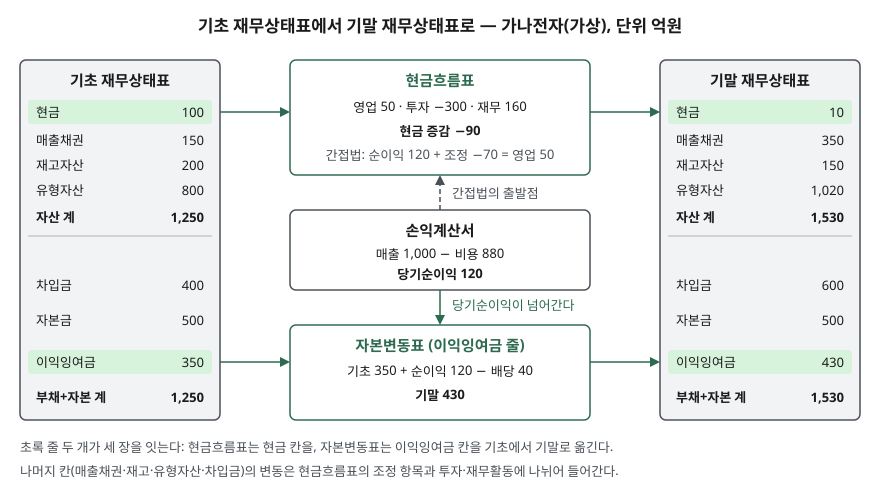

> 예제의 회사 `가나전자`와 모든 숫자는 계산 원리를 보이려고 만든 가상 값이다. 실제 기업과 관계가 없다.

## 들어가며

증권사 앱에서 관심 있는 회사를 눌러 재무 탭을 열면 표가 세 개 나온다. 대부분은 손익계산서의 당기순이익 한 줄을 보고 창을 닫는다. 그런데 순이익은 흑자인데 그해 현금 잔액은 줄어든 회사가 드물지 않다. 세 표를 따로 읽으면 이 차이를 설명하려고 수십 개 칸을 하나씩 대조하게 된다. 세 장이 같은 숫자를 공유하는 자리는 두 곳뿐이고, 그 두 곳을 알면 대조할 칸이 둘로 줄어든다.

## 개념

K-IFRS 제1001호 '재무제표 표시'의 전체 재무제표 조항(문단 10)은 재무제표를 다섯 가지로 정한다. 기말 재무상태표, 기간 손익과기타포괄손익계산서, 기간 자본변동표, 기간 현금흐름표, 주석이다. 흔히 말하는 "세 장"은 앞의 둘과 현금흐름표이고, 세 장을 잇는 계산이 드러나는 곳이 자본변동표다.

| 표 | 무엇을 보여 주는가 | 시점인가 기간인가 |
|---|---|---|
| 재무상태표 | 자산·부채·자본의 잔액 | 시점 (기말 하루) |
| 손익계산서 | 번 수익과 쓴 비용, 그 차이인 이익 | 기간 (한 해) |
| 자본변동표 | 자본의 구성요소별 기초→기말 변동 | 기간 |
| 현금흐름표 | 들어오고 나간 현금을 영업·투자·재무로 나눈 내역 | 기간 |

구분의 핵심은 마지막 열이다. 재무상태표만 시점의 잔액이고 나머지 셋은 두 시점 사이에 무엇이 바뀌었는지를 적는다. 그래서 기간 표들은 **기초 재무상태표의 어떤 칸이 기말까지 왜 바뀌었는지를 설명하는 표**로 읽을 수 있다.

## 구조



> **출처**: [K-IFRS 제1001호 재무제표 표시 — 문단 10 전체 재무제표, 문단 106 자본변동표](https://www.samili.com/acc/IfrsKijun.asp?bCode=1978-1001) · [K-IFRS 제1007호 현금흐름표 — 문단 10 활동 구분, 문단 45 현금및현금성자산 조정](https://www.samili.com/acc/IfrsKijun.asp?bCode=1978-1007)

기초와 기말 재무상태표 사이에 기간 표 셋이 놓인다. 현금흐름표는 현금 칸 하나를, 자본변동표는 이익잉여금을 포함한 자본 칸을 기초에서 기말로 옮긴다. 손익계산서는 재무상태표에 직접 닿지 않고, 당기순이익을 자본변동표와 현금흐름표(간접법)에 넘겨준다.

## 동작 원리

### 첫째 자리 — 당기순이익이 이익잉여금이 된다

매출·비용 같은 손익 계정은 한 해 동안만 쌓이는 임시 계정이다. 기말에 마감하면 수익에서 비용을 뺀 잔액이 이익잉여금으로 옮겨지고 손익 계정은 0으로 돌아간다. 자본변동표의 표시 항목 조항(문단 106)은 자본의 구성요소마다 기초와 기말 장부금액의 조정내역을 보이라고 요구하므로, 이 옮김이 이익잉여금 줄에 그대로 찍힌다.

```text
기말 이익잉여금 = 기초 이익잉여금 + 당기순이익 − 배당
```

배당은 비용이 아니다. 주주에게 이익을 나눠 준 자본거래라서 손익계산서를 거치지 않고 이익잉여금에서 바로 빠진다. 손익계산서만 보면 배당을 얼마 했는지 알 수 없는 이유다.

### 둘째 자리 — 현금 증감이 현금 잔액이 된다

현금흐름표는 한 해의 현금 유출입을 영업·투자·재무 세 활동으로 나눈다(제1007호 문단 10). 셋을 더한 현금 증감을 기초 현금에 더하면 기말 현금이 되고, 이 값은 기말 재무상태표의 현금및현금성자산과 같아야 한다. 두 금액이 다르면 조정내역을 공시하게 되어 있다(제1007호 문단 45).

### 순이익과 현금이 갈리는 이유 — 간접법

영업활동 현금흐름을 적는 방법은 둘이다(제1007호 문단 18). 직접법은 현금을 받은 거래와 준 거래를 항목별로 모은다. 간접법은 당기순이익에서 출발해 현금이 움직이지 않은 몫을 되돌린다. 되돌리는 것은 크게 두 가지다.

- **현금 없는 비용**: 감가상각비는 이익을 줄였지만 그해 현금은 나가지 않았다. 다시 더한다
- **운전자본 변동**: 외상으로 판 매출은 이익에 잡혔지만 현금은 아직 안 들어왔다. 매출채권이 늘어난 만큼 뺀다. 재고가 줄었으면 예전에 산 재고를 쓴 것이라 그만큼 더한다

간접법으로 구한 영업활동 금액은 직접법과 같아야 한다. 같은 거래를 다른 쪽에서 센 것이기 때문이다.

## 실습 예제

가나전자의 한 해 거래 11건을 분개장에 적고, 같은 분개장에서 네 표를 계산했다. 세 장을 손으로 따로 채우지 않았으므로 이어지는 자리가 맞는지가 곧 검산이 된다. 금액 단위는 억원이다.

전체 소스: [`code/`](code/) · 수행 기록: [`code/output.txt`](code/output.txt)

기초 재무상태표는 현금 100, 매출채권 150, 재고자산 200, 유형자산 800이고 차입금 400, 자본금 500, 이익잉여금 350이다. 거래는 현금 매출 800과 외상 매출 200, 원재료 현금 매입 550, 설비 취득 300, 은행 차입 200, 배당 40 등이다.

```text
[손익계산서]
  매출               1,000
  매출원가              -600
  판매관리비             -150
  감가상각비              -80
  이자비용               -20
  법인세비용              -30
  당기순이익              120

[현금흐름표(직접법)]
  영업활동                50
  투자활동              -300
  재무활동               160
  현금 증감              -90
  기초 현금              100
  기말 현금               10

[영업활동(간접법)]
  당기순이익              120
  감가상각비               80
  매출채권 변동           -200
  재고자산 변동             50
  영업활동 계              50

[이어지는 곳 검산]
  자본변동표→재무상태표: 이익잉여금          430 =    430  일치
  현금흐름→재무상태표: 기말 현금            10 =     10  일치
  간접법 = 직접법 영업활동               50 =     50  일치
  기말 자산 = 부채 + 자본           1,530 =  1,530  일치
```

기말 이익잉여금은 자본변동표 계산(350 + 120 − 40)과 마감분개로 따로 구했고, 두 값이 430으로 같다. 기말 현금 10도 현금흐름표와 재무상태표 양쪽에서 같다.

순이익은 120인데 현금은 90 줄었다. 차이 210은 다음으로 나뉜다.

| 항목 | 금액 | 왜 이익과 현금이 갈리는가 |
|---|---:|---|
| 매출채권 증가 | 200 | 매출로 잡혔지만 아직 받지 않았다 |
| 설비 취득 | 300 | 현금은 나갔지만 비용이 아니라 자산이 됐다 |
| 감가상각비 | −80 | 비용이지만 현금은 안 나갔다 |
| 재고자산 감소 | −50 | 예전에 사 둔 재고를 원가로 썼다 |
| 차입 − 배당 | −160 | 이익과 무관한 자금 조달·분배다 |
| 합계 | 210 | |

## 실무에서 주의할 점

- **순이익과 영업활동 현금흐름을 같은 줄에 놓고 본다.** 예제처럼 매출채권이 늘면 이익은 나도 현금은 들어오지 않는다. 둘의 차이가 어느 조정 항목에서 생겼는지는 간접법 표에 적혀 있다. 차이가 있다는 사실만으로 좋고 나쁨을 판단할 수는 없고, 어느 항목 때문인지를 봐야 한다.
- **이자·배당의 분류는 회사가 고른다.** 현행 제1007호는 이자 지급을 영업 또는 재무활동으로, 배당금 지급을 재무 또는 영업활동으로 분류할 수 있게 한다(문단 33·34). 예제는 이자를 영업, 배당을 재무에 넣었다. 두 회사의 영업활동 현금흐름을 비교하기 전에 주석의 분류 정책을 확인한다.
- **2027년부터 표의 모양이 바뀐다.** 제1001호를 대체하는 K-IFRS 제1118호 '재무제표 표시와 공시'가 2027년 1월 1일 이후 시작하는 회계연도부터 적용된다(2026년 조기적용 허용). 손익계산서에 영업·투자·재무 범주별 소계가 생기고, 같은 개정으로 현금흐름표 간접법의 출발점이 당기순이익에서 영업손익으로 바뀌며 이자·배당의 분류 선택지도 정리된다. 비교기간이 새 기준으로 재작성되므로 과거 숫자와 나란히 볼 때 어느 기준으로 작성된 표인지 확인한다.
- **현금 칸의 범위를 확인한다.** 현금흐름표가 다루는 것은 현금및현금성자산이고, 현금성자산은 통상 취득일로부터 만기가 3개월 이내인 것이다(제1007호 문단 7). 만기가 더 긴 예금은 재무상태표의 다른 칸(단기금융상품 등)에 있어 현금흐름표의 기말 현금에 들어가지 않는다.

## 정리

- 재무상태표만 시점의 잔액이고, 손익계산서·자본변동표·현금흐름표는 두 시점 사이의 변동을 적는다.
- 당기순이익은 마감을 거쳐 이익잉여금으로 옮겨지고, 배당은 손익계산서를 거치지 않고 이익잉여금에서 빠진다.
- 현금흐름표의 기말 현금은 재무상태표의 현금및현금성자산과 같아야 한다.
- 순이익과 현금 증감의 차이는 간접법의 조정 항목과 투자·재무활동에 나뉘어 드러난다.

## 참고 자료

- [K-IFRS 제1001호 재무제표 표시 — 문단 10 전체 재무제표, 문단 106 자본변동표](https://www.samili.com/acc/IfrsKijun.asp?bCode=1978-1001) (기준서 원문 게재)
- [K-IFRS 제1007호 현금흐름표 — 문단 7 현금성자산, 문단 10 활동 구분, 문단 18 직접법·간접법, 문단 33·34 이자·배당, 문단 45 조정](https://www.samili.com/acc/IfrsKijun.asp?bCode=1978-1007) (기준서 원문 게재)
- [IFRS Foundation — IAS 1 Presentation of Financial Statements](https://www.ifrs.org/issued-standards/list-of-standards/ias-1-presentation-of-financial-statements/)
- [IFRS Foundation — IAS 7 Statement of Cash Flows](https://www.ifrs.org/issued-standards/list-of-standards/ias-7-statement-of-cash-flows/)
- [금융위원회 보도자료 — 27년부터 K-IFRS 손익계산서가 변경 (2025-12-18)](https://www.fsc.go.kr/no010101/85886)
