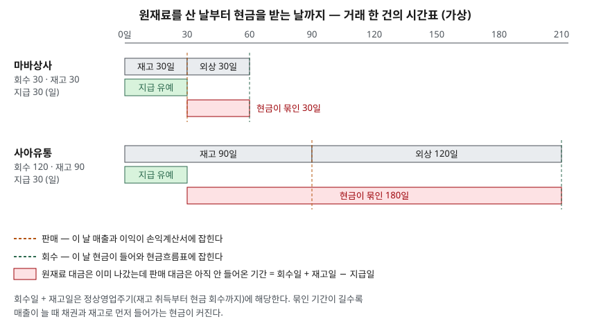

> 예제의 회사 `마바상사`·`사아유통`과 모든 숫자는 계산 원리를 보이려고 만든 가상 값이다. 실제 기업과 관계가 없다.

## 들어가며

작은 쇼핑몰이든 납품 사업이든 장사가 잘돼 주문이 밀려들 때 오히려 통장 잔액이 줄어드는 경험을 한 사람이 많다. 장부상 이익은 매달 늘어 있는데 원재료 대금 결제일마다 잔액이 모자라 단기 대출을 알아보게 된다. 이때 흔히 하는 일은 월별 손익표를 다시 뽑아 어디서 돈이 샜는지 비용 항목을 한 줄씩 대조하는 것이다. 그런데 비용을 수십 줄 뒤져도 새는 곳은 나오지 않는다. 돈은 비용으로 나간 것이 아니라 아직 받지 못한 외상과 창고에 쌓인 재고로 들어가 있고, 그 두 숫자는 손익표가 아니라 재무상태표와 현금흐름표에 있다.

## 개념

재무제표 표시 기준서는 현금흐름 정보를 뺀 나머지 재무제표를 발생기준으로 작성하도록 한다(K-IFRS 제1001호 문단 27). 발생기준은 현금이 오간 날이 아니라 거래가 일어난 날에 수익과 비용을 적는 방식이다. 수익 기준서에 따르면 매출은 고객에게 재화의 통제를 넘긴 시점에 인식한다(K-IFRS 제1115호 문단 31). 대금을 언제 받는지는 매출을 잡는 시점과 무관하다.

현금흐름표만 이 원칙의 예외다. 그해 실제로 들어오고 나간 현금을 영업·투자·재무 세 활동으로 나눠 적는다(제1007호 문단 10). 그래서 이익과 현금이 갈리는 곳은 결국 **이익에는 잡혔는데 현금은 아직 안 움직인 칸**, 또는 그 반대인 칸이다.

| 재무상태표의 칸 | 늘어나면 | 이익과 현금이 갈리는 이유 |
|---|---|---|
| 매출채권 | 현금 감소 방향 | 매출은 잡혔는데 대금을 아직 못 받았다 |
| 재고자산 | 현금 감소 방향 | 원재료는 샀는데 아직 팔지 않아 비용이 되지 않았다 |
| 매입채무 | 현금 증가 방향 | 원재료를 썼는데 대금은 아직 주지 않았다 |

앞 글 [재무제표 세 장의 연결](../2026-09-29-three-statements-linkage/index.md)에서 간접법이 당기순이익에서 출발해 현금이 움직이지 않은 몫을 되돌린다고 했다. 이 표의 세 칸이 되돌리는 항목의 대부분이다. 간접법 조항(제1007호 문단 20)은 되돌릴 항목으로 재고자산과 영업활동 채권·채무의 변동, 감가상각비 같은 비현금 항목을 든다.

## 구조



> **출처**: [K-IFRS 제1001호 재무제표 표시 — 문단 27 발생기준, 68 정상영업주기](https://accountingwiki.co.kr/standards/1001) · [K-IFRS 제1007호 현금흐름표 — 문단 20 간접법 조정 항목](https://www.samili.com/acc/IfrsKijun.asp?bCode=1978-1007) · [K-IFRS 제1115호 고객과의 계약에서 생기는 수익 — 문단 31 통제 이전 시 수익 인식](https://www.samili.com/acc/IfrsKijun.asp?bCode=1978-1115) (기준서 원문 게재)

거래 한 건을 날짜 축에 펼쳤다. 주황 점선이 판매일, 초록 점선이 회수일이다. 이익은 주황 선에서, 현금은 초록 선에서 잡힌다. 원재료 대금은 30일째에 이미 나가므로 그 뒤부터 회수일까지는 회사가 판매 대금을 대신 메우고 있는 기간이다. 재무제표 표시 기준서의 유동성 구분 조항(문단 68)은 재고를 취득해 현금으로 회수하기까지를 정상영업주기라고 부르는데, 그림의 회색 막대 두 개를 이은 길이가 그것이다.

## 동작 원리

### 매출이 늘면 채권과 재고도 비례해서 는다

회수일이 120일이면 연 매출의 120/365, 약 3분의 1이 늘 외상으로 남아 있다. 매출이 25% 늘면 이 잔액도 25% 는다. 그 증가분은 이미 매출과 이익에 잡혔지만 현금으로는 한 푼도 들어오지 않았다. 재고도 같다. 90일치를 쌓아 두는 회사는 매출이 늘면 더 많은 재고를 미리 사야 한다.

### 한 번 늘어난 잔액은 성장이 멈춰도 돌아오지 않는다

성장이 멈추면 잔액은 더 늘지 않는다. 그해 영업활동 현금흐름은 순이익 + 감가상각비로 돌아온다. 그러나 이미 늘어난 채권과 재고는 그대로 남는다. 매일 받는 만큼 새 외상이 생기고, 파는 만큼 재고를 다시 채우기 때문이다. 사업 규모를 줄이거나 거래 조건을 바꾸지 않는 한 그 현금은 운전자본에 계속 들어가 있다.

### 매입채무는 반대 방향으로 일한다

원재료 대금을 늦게 줄수록 그 기간만큼 공급자의 돈으로 영업을 하는 셈이 된다. 그래서 간접법에서 매입채무 증가는 더한다. 예제의 두 회사는 지급일이 30일로 같아서 이 줄은 차이가 없다.

## 실습 예제

두 회사의 매출은 800에서 시작해 1~3년차에 해마다 25%씩 늘고 4년차에 멈춘다. 매출원가율 70%, 순이익률 8%, 감가상각비 20은 둘이 같다. 다른 것은 거래 조건뿐이다. 영업활동 현금흐름은 간접법으로 구하고, 직접법(받은 현금 − 준 현금)으로 한 번 더 구해 검산했다. 금액 단위는 억원이다.

전체 소스: [`code/`](code/) · 수행 기록: [`code/output.txt`](code/output.txt)

```text
[1] 거래 조건 — 현금이 묶이는 날수
  마바상사  회수  30일 + 재고  30일 − 지급  30일 =  30일
  사아유통  회수 120일 + 재고  90일 − 지급  30일 = 180일

[2] 사아유통 — 간접법 영업활동 현금흐름
  연도      매출    순이익  +감가상각  −채권증가  −재고증가  +채무증가    영업CF
   1년   1,000.0     80.0        20      -65.8      -34.5       11.5      11.2
   2년   1,250.0    100.0        20      -82.2      -43.2       14.4       9.0
   3년   1,562.5    125.0        20     -102.7      -53.9       18.0       6.3
   4년   1,562.5    125.0        20        0.0        0.0        0.0     145.0

[3] 직접법으로 다시 구한 값과 같은가
  마바상사  83.6  99.5  119.3  145.0   → 일치
  사아유통  11.2  9.0  6.3  145.0   → 일치

[4] 1~3년차(성장기) 누계
  마바상사  순이익 305.0  영업CF 302.3  영업CF ÷ 순이익 = 0.99
  사아유통  순이익 305.0  영업CF 26.6  영업CF ÷ 순이익 = 0.09

[6] 3년차 말 운전자본 잔액 — 채권 + 재고 − 채무 (현금 대신 들고 있는 것)
  마바상사  128.4 + 89.9 − 89.9 = 128.4
  사아유통  513.7 + 269.7 − 89.9 = 693.5
```

마바상사의 연도별 표와 `[5]`는 [`code/output.txt`](code/output.txt)에 있다.

`[2]`에서 사아유통의 순이익은 80 → 100 → 125로 늘지만 영업활동 현금흐름은 11.2 → 9.0 → 6.3으로 오히려 준다. 매출이 늘수록 채권과 재고로 먼저 들어가는 현금이 이익보다 빨리 커지기 때문이다. 3년차에 채권 증가 102.7과 재고 증가 53.9를 합친 156.6이 순이익 125와 감가상각비 20을 합친 145보다 크고, 매입채무 증가 18이 그 차이를 겨우 메운다.

`[3]`은 간접법과 직접법이 네 해 모두 같은 값을 낸다는 검산이다. 같은 거래를 이익 쪽에서 되짚었느냐, 현금이 오간 쪽에서 셌느냐의 차이일 뿐이다.

`[4]`가 요점이다. 3년 동안 두 회사의 순이익 합계는 305.0으로 같은데 영업활동 현금흐름 합계는 302.3과 26.6이다. 마바상사는 이익의 99%가 현금으로 들어왔고 사아유통은 9%만 들어왔다. 둘의 차이 275.7은 사아유통이 채권과 재고에 더 넣은 현금이다. `[6]`의 3년차 말 잔액에서 사아유통이 693.5, 마바상사가 128.4를 운전자본으로 들고 있는 것이 그 결과다.

4년차에 성장이 멈추자 두 회사 모두 영업활동 현금흐름이 145.0으로 같아진다. 그러나 사아유통의 693.5는 돌아오지 않는다. 4년차에도 채권과 재고 잔액이 그대로 유지되기 때문이다.

## 실무에서 주의할 점

- **순이익과 영업활동 현금흐름을 여러 해 나란히 본다.** 한 해의 차이는 연말 대금 회수가 며칠 밀린 것만으로도 생긴다. 예제처럼 이익은 계속 늘고 영업활동 현금흐름은 계속 줄어드는 흐름이 몇 년 이어질 때 원인이 어느 칸에 있는지 간접법 표에서 찾는다.
- **성장 자체가 현금을 쓴다는 점을 구분한다.** 사아유통의 현금흐름이 약한 이유는 비용 구조가 아니라 거래 조건과 성장 속도다. 같은 거래 조건이라도 성장이 멈추면 현금흐름이 이익을 따라온다. 영업활동 현금흐름이 작다는 사실만으로 이익의 질을 판단하기 전에 매출 증가율을 함께 본다.
- **채권이 매출보다 빨리 늘면 따로 확인한다.** 예제는 회수일이 고정이라 채권이 매출과 같은 비율로 늘었다. 실제로 채권이 매출보다 빠르게 늘면 회수가 늦어지고 있거나 받기 어려운 채권이 쌓이는 중일 수 있다. 주석의 매출채권 연령 분석과 손실충당금 변동을 본다.
- **간접법의 출발점과 분류는 기준에 따라 다르다.** 현행 제1007호는 이자 지급과 배당 수취·지급을 영업 또는 다른 활동으로 분류할 선택지를 준다(문단 33·34). 2027년 1월 1일 이후 시작하는 회계연도부터는 K-IFRS 제1118호 도입과 함께 간접법의 출발점이 당기순이익에서 영업손익으로 바뀌고 이자·배당 분류 선택지도 정리된다. 두 회사의 영업활동 현금흐름을 비교하기 전에 어느 기준, 어느 분류 정책인지 확인한다.

## 정리

- 손익계산서는 발생기준으로 판매 시점에 매출을 잡고, 현금흐름표는 현금이 실제로 오간 시점에 적는다.
- 둘이 갈리는 곳은 주로 매출채권·재고자산·매입채무 세 칸이고, 간접법이 이 칸들의 변동을 되돌린다.
- 회수일 + 재고일 − 지급일이 길수록 매출이 늘 때 운전자본으로 먼저 들어가는 현금이 커진다.
- 성장이 멈추면 영업활동 현금흐름은 이익을 따라오지만, 이미 늘어난 운전자본은 돌아오지 않는다.

## 참고 자료

- [K-IFRS 제1001호 재무제표 표시 — 문단 27 발생기준, 68 정상영업주기](https://accountingwiki.co.kr/standards/1001) (기준서 원문 게재)
- [K-IFRS 제1007호 현금흐름표 — 문단 10 활동 구분, 20 간접법 조정 항목, 33·34 이자·배당 분류](https://www.samili.com/acc/IfrsKijun.asp?bCode=1978-1007) (기준서 원문 게재)
- [K-IFRS 제1115호 고객과의 계약에서 생기는 수익 — 문단 31 통제 이전 시 수익 인식](https://www.samili.com/acc/IfrsKijun.asp?bCode=1978-1115) (기준서 원문 게재)
- [금융위원회 보도자료 — 27년부터 K-IFRS 손익계산서가 변경 (2025-12-18)](https://www.fsc.go.kr/no010101/85886)
- [IFRS Foundation — IAS 7 Statement of Cash Flows](https://www.ifrs.org/issued-standards/list-of-standards/ias-7-statement-of-cash-flows/)
- [IFRS Foundation — IFRS 15 Revenue from Contracts with Customers](https://www.ifrs.org/issued-standards/list-of-standards/ifrs-15-revenue-from-contracts-with-customers/)
