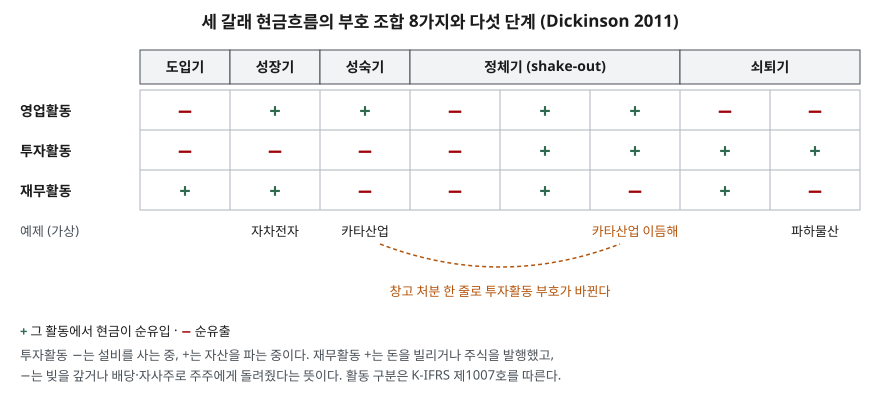

> 예제의 회사 `자차전자`·`카타산업`·`파하물산`과 모든 숫자는 계산 원리를 보이려고 만든 가상 값이다. 실제 기업과 관계가 없다.

## 들어가며

회사 사업보고서를 처음 열어 현금흐름표까지 내려가면 수십 줄의 항목이 나온다. 유형자산 취득, 단기금융상품 순증감, 리스부채 상환, 배당금 지급이 이어지고, 대부분은 이 줄들을 위에서부터 하나씩 읽으며 무엇이 중요한지 가려내려 한다. 그러다 보면 줄마다 뜻은 알겠는데 회사가 지금 무엇을 하고 있는지는 끝까지 보이지 않는다. 항목이 40줄이면 40번을 해석해야 하는 셈이다. 그런데 이 표는 기준서가 정한 세 칸으로 이미 나뉘어 있고, 세 칸 합계의 부호만 먼저 보면 회사가 돈을 벌고 있는지, 설비를 늘리는지, 누구에게 돈을 받거나 돌려주는지가 세 글자로 정리된다.

## 개념

현금흐름표 기준서는 한 해의 현금흐름을 영업·투자·재무 세 활동으로 나눠 보고하게 한다(K-IFRS 제1007호 문단 10). 세 활동의 정의는 같은 기준서의 용어 정의(문단 6)에 있다.

| 활동 | 기준서 정의 | 대표 항목 |
|---|---|---|
| 영업활동 | 기업의 주요 수익창출활동, 그리고 투자활동이나 재무활동이 아닌 기타의 활동 | 재화 판매 대금 수취, 원재료 대금·급여 지급, 법인세 납부 (문단 14) |
| 투자활동 | 장기성 자산 및 현금성자산에 속하지 않는 기타 투자자산의 취득과 처분 | 유형·무형자산 취득과 처분, 다른 회사 지분 취득, 대여금 (문단 16) |
| 재무활동 | 납입자본과 차입금의 크기 및 구성내용에 변동을 가져오는 활동 | 주식 발행, 차입과 상환, 자기주식 취득, 리스부채 상환 (문단 17) |

영업활동의 정의가 "나머지 전부"로 끝나는 점이 중요하다. 투자와 재무는 무엇인지를 좁게 정해 두고, 거기 들지 않는 것은 영업으로 간다. 그래서 영업활동 합계는 본업에서 현금이 들어오는지를 가장 직접 보여 주는 숫자가 된다.

세 합계에는 각각 +(순유입)나 −(순유출)가 붙으므로 조합은 2 × 2 × 2 = 8가지다. Dickinson(2011)은 Gort·Klepper(1982)의 산업 수명주기 연구를 바탕으로 이 여덟 조합을 다섯 단계(도입·성장·성숙·정체·쇠퇴)에 대응시켰다. 회계 기준이 아니라 연구자가 만든 분류이므로 "이 회사는 성숙기다"라는 판정이 아니라 **세 부호가 어떤 자금 흐름을 가리키는지 읽는 틀**로 쓴다.

## 구조



> **출처**: [Dickinson, V. (2011). Cash Flow Patterns as a Proxy for Firm Life Cycle. The Accounting Review 86(6), 1969–1994 — Table 1](https://publications.aaahq.org/accounting-review/article-abstract/86/6/1969/3380/Cash-Flow-Patterns-as-a-Proxy-for-Firm-Life-Cycle) (표는 [Castro 외, The Role of Life Cycle on Capital Structure — Table 1](http://www.aeca1.org/xvencuentroaeca/cd/34b.pdf)의 재수록본으로 대조) · [K-IFRS 제1007호 현금흐름표 — 문단 6 활동 정의](https://accountingwiki.co.kr/standards/1007) (제3자 전재)

다섯 단계 가운데 도입·성장·성숙은 조합이 하나씩이고, 정체기에 셋, 쇠퇴기에 둘이 몰려 있다. 앞의 세 단계는 부호 셋이 한 가지 자금 흐름으로 읽히지만, 정체기의 세 조합은 영업 부호부터 서로 다르다. 같은 단계 이름 아래 성격이 다른 흐름이 섞여 있다는 뜻이다. 투자활동 부호가 +인 조합이 모두 오른쪽에 있다는 점이 눈에 띈다. 설비를 사는 쪽보다 파는 쪽이 많은 해를 이 분류는 성숙기 이후로 본다.

## 동작 원리

### 세 부호는 각자 다른 질문에 답한다

- **영업활동 부호** — 본업에서 현금이 남는가. 순이익이 흑자라도 외상과 재고가 크게 늘면 −가 될 수 있다는 것은 [앞 글](../2026-09-30-cash-flow-profit-without-cash/index.md)에서 봤다.
- **투자활동 부호** — 자산을 늘리는 중인가, 줄이는 중인가. 설비를 사면 −, 팔면 +다. 설비 투자를 계속하는 회사는 대개 −다.
- **재무활동 부호** — 자금 공급자에게서 돈을 받았는가, 돌려줬는가. 차입·유상증자는 +, 상환·배당·자기주식 취득은 −다.

### 세 부호를 합쳐 읽으면 돈이 어디서 와서 어디로 갔는지가 나온다

현금 증감은 세 합계를 더한 값이다. 그래서 한 칸이 −면 다른 칸이 +로 메웠거나 현금 잔액이 줄었다. 성장기 조합(+ − +)은 "영업에서 벌지만 설비 투자가 그보다 커서 밖에서 돈을 더 끌어왔다"로 읽힌다. 성숙기 조합(+ − −)은 "영업에서 번 돈으로 설비도 유지하고 빚도 갚고 배당도 줬다"다. 쇠퇴기 조합 가운데 − + −는 "본업에서 현금이 새는데 자산을 팔아 그것과 빚 상환을 메웠다"다.

### 분류가 흔들리는 자리 — 합계는 한 줄에 끌려간다

부호는 합계의 부호다. 투자활동 안에서 설비 취득 −100과 창고 처분 +150이 만나면 합계는 +50이 되고, 설비 투자를 그대로 하고 있는데도 조합이 성숙기에서 정체기로 넘어간다. 기준서가 투자·재무활동을 총액으로 표시하게 하는 이유(문단 21)도 여기 있다. 합계만으로는 사는 것과 파는 것이 상쇄되어 보이지 않는다.

## 실습 예제

세 회사의 현금흐름표를 항목부터 쌓고, 활동별 합계의 부호를 Dickinson 분류표에 대 봤다. 영업활동은 간접법으로 두었다. 금액 단위는 억원이다.

전체 소스: [`code/`](code/) · 수행 기록: [`code/output.txt`](code/output.txt)

```text
[2] 항목에서 세 갈래 합계까지

  자차전자
    영업  당기순이익          60
    영업  감가상각비          40
    영업  운전자본 증가       -30
        영업활동 합계        70
    투자  설비 취득        -250
        투자활동 합계      -250
    재무  장기차입          150
    재무  유상증자           60
        재무활동 합계       210
        현금 증감           30

[3] 부호 조합과 단계
  회사        영업   투자   재무  부호     단계     영업CF ÷ 설비 취득
  자차전자     70   -250    210  +-+  성장기       0.28
  카타산업    205   -100   -100  +--  성숙기       2.05
  파하물산    -30     60    -40  -+-  쇠퇴기       해당 없음
```

카타산업·파하물산의 항목별 표와 `[1]`의 8가지 조합 전체는 [`code/output.txt`](code/output.txt)에 있다.

자차전자는 영업에서 70을 벌었지만 설비에 250을 썼다. 모자란 180과 현금 증가분 30을 합친 210을 차입 150과 유상증자 60으로 채웠다. 영업CF가 설비 취득의 0.28배라는 것은 설비 투자의 28%만 스스로 벌어서 댔다는 뜻이다. 이 투자가 몇 년 뒤 영업활동 현금흐름을 키우지 못하면 차입금 상환 부담이 남는다. 성장기 조합이 좋은지 나쁜지는 부호만으로 알 수 없고, 투자한 설비가 나중에 벌어들이는지를 이후 연도에서 확인해야 한다.

카타산업은 205를 벌어 설비 유지에 100, 차입금 상환과 배당에 100을 썼다. 영업CF가 설비 취득의 2.05배라 밖에서 돈을 끌어오지 않아도 된다. 감가상각비 90과 설비 취득 100이 비슷한 크기라는 점도 볼 만하다. 닳는 만큼 다시 사서 설비 규모를 유지하고 있다는 신호다.

파하물산은 순손실 90을 감가상각비 50과 운전자본 감소 10이 일부 메워 영업활동이 −30이다. 설비 처분 70이 그 구멍과 차입금 상환 40을 메웠고 현금은 10 줄었다. 운전자본이 줄어 현금이 들어온 것도 사업 규모가 줄어드는 쪽의 움직임이다.

```text
  카타산업 이듬해
    투자  설비 취득        -100
    투자  창고 처분         150
        투자활동 합계        50

  부호 ++- → 정체기  (영업활동 205, 재무활동 -100 — 둘 다 전년과 같다)
```

`[4]`는 카타산업이 다음 해 쓰지 않는 창고를 150에 판 경우다. 영업과 재무는 한 줄도 바뀌지 않았고 설비 투자도 그대로인데 투자활동 합계가 +50으로 돌아서 조합이 정체기로 옮겨 갔다. 한 해의 부호 조합만 보고 회사의 단계를 단정하면 이런 일회성 처분 한 줄에 판정이 끌려간다.

## 실무에서 주의할 점

- **부호보다 먼저 항목을 본다.** 투자활동에는 설비 취득뿐 아니라 다른 기업의 채무상품 취득·처분과 대여금이 함께 들어간다(문단 16). 여윳돈으로 채권을 샀다가 판 것만으로도 투자활동 부호가 바뀔 수 있다. 부호 조합이 이상하게 나오면 투자·재무활동의 총액 항목(문단 21)에서 어느 줄이 합계를 끌었는지 찾는다.
- **이자·배당의 분류 정책을 확인한다.** 현행 제1007호는 이자 지급을 영업 또는 재무활동으로, 배당금 지급을 재무 또는 영업활동으로 분류할 수 있게 한다(문단 33·34). 배당을 영업에 넣는 회사는 재무활동 부호가 다르게 나올 수 있다. 2027년 1월 1일 이후 시작하는 회계연도부터는 K-IFRS 제1118호 도입과 함께 이 선택지가 정리되므로, 기준 전환 연도를 끼고 비교할 때는 분류가 바뀌었는지 먼저 본다.
- **여러 해를 이어 본다.** Dickinson 분류는 한 해 단위로 부호를 떼어 내므로 예제처럼 일회성 거래에 흔들린다. 3~5년 부호 조합을 나란히 놓고, 한 해만 튀는지 계속 같은 방향인지를 본다.
- **단계 이름을 평가로 읽지 않는다.** 성장기 조합은 외부 자금에 기대고 있다는 뜻이기도 하고, 쇠퇴기 조합의 자산 처분은 사업 재편의 한 과정일 수도 있다. 부호 조합은 돈이 어디서 와서 어디로 갔는지를 요약할 뿐이고, 그 흐름이 회사에 유리한지는 금액의 크기와 이후 연도의 결과로 판단한다.

## 정리

- 현금흐름표는 영업·투자·재무 세 활동으로 나뉘고, 영업은 투자·재무가 아닌 나머지 전부다.
- 세 합계의 부호 조합은 8가지이고, Dickinson(2011)은 이를 도입·성장·성숙·정체·쇠퇴 다섯 단계로 묶었다.
- 성장기(+ − +)는 밖에서 돈을 끌어와 설비를 늘리는 중, 성숙기(+ − −)는 번 돈으로 투자와 상환·배당을 함께 하는 중이다.
- 부호는 합계의 부호라서 자산 처분 한 줄에도 바뀐다. 항목과 여러 해의 흐름을 함께 봐야 한다.

## 참고 자료

- [한국회계기준원 — 시행 중인 K-IFRS 기준서 목록](https://www.kasb.or.kr/front/board/ingAccountingList.do) — 기준서 원문(PDF·HWP) 발행처. 아래 전재 사이트는 문단을 바로 열기 위한 편의 링크다
- [K-IFRS 제1007호 현금흐름표 — 문단 6 활동 정의, 10 활동 구분, 14·16·17 활동별 예시, 21 총액 표시](https://accountingwiki.co.kr/standards/1007) (제3자 전재)
- [K-IFRS 제1007호 현금흐름표 — 문단 33·34 이자·배당 분류](https://www.samili.com/acc/IfrsKijun.asp?bCode=1978-1007) (제3자 전재)
- [IFRS Foundation — IAS 7 Statement of Cash Flows](https://www.ifrs.org/issued-standards/list-of-standards/ias-7-statement-of-cash-flows/)
- [Dickinson, V. (2011). Cash Flow Patterns as a Proxy for Firm Life Cycle. The Accounting Review 86(6), 1969–1994](https://publications.aaahq.org/accounting-review/article-abstract/86/6/1969/3380/Cash-Flow-Patterns-as-a-Proxy-for-Firm-Life-Cycle)
- [Castro, P. 외 — The Role of Life Cycle on Capital Structure, Table 1 (Dickinson 분류표 재수록)](http://www.aeca1.org/xvencuentroaeca/cd/34b.pdf)
- [금융위원회 보도자료 — 27년부터 K-IFRS 손익계산서가 변경 (2025-12-18)](https://www.fsc.go.kr/no010101/85886)
